# 【双语字幕+资料下载】MIT 6.042J ｜ 计算机科学的数学基础(2015·完整版) - P41：L2.2.3- Inverses mod n - ShowMeAI - BV1o64y1a7gT

所以现在我们来到算术的地方，模n或余数算术开始有点不同，这包括取反和取消。

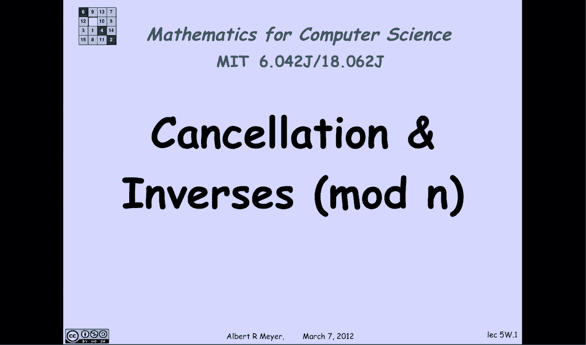

让我们看看那个，所以首先，我们已经观察到，我们有这些基本的同余规则，如果a和b同等，和c和b是等价的，那么a加c和b加d是等的，a乘以c和b乘以d是等的。

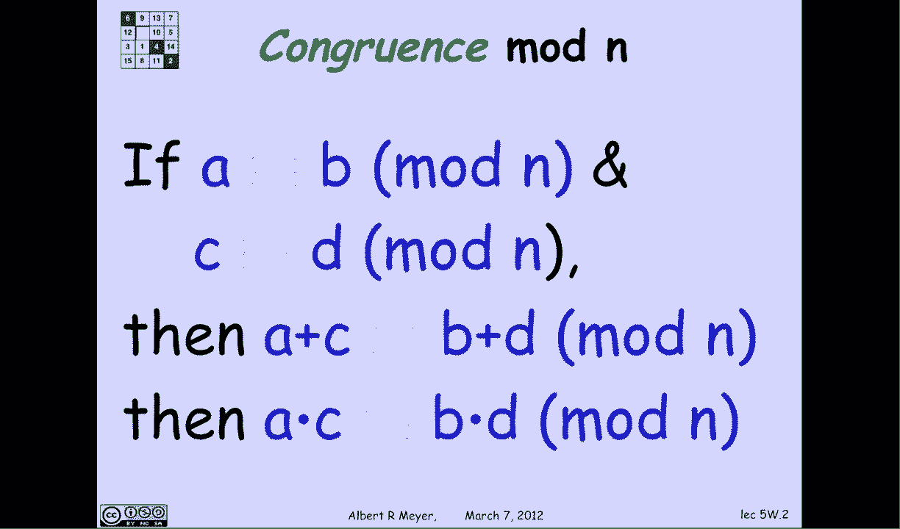

这就是算术mod n很像的意义，普通算术。

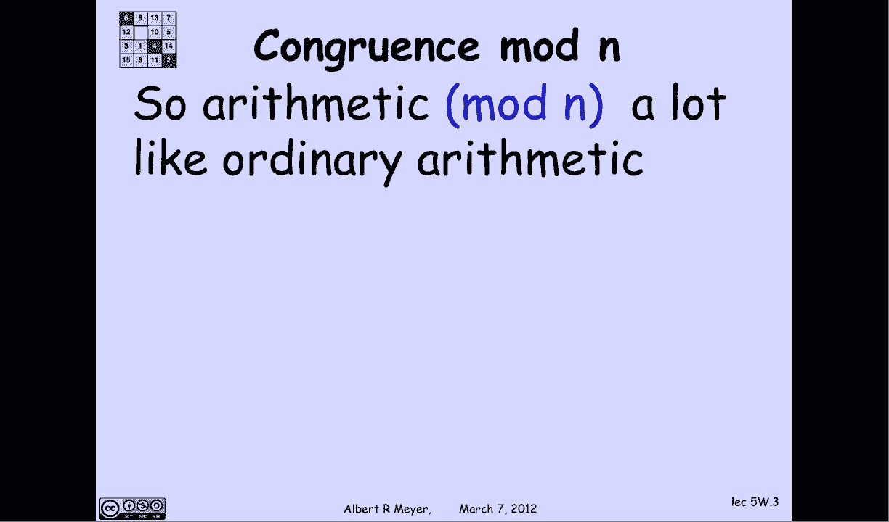

但主要的区别是，让我们看看这个，八乘二等于十六，这意味着它将达到6 mod 10，等于三乘以二，所以8乘以2等于3乘以2，你会被诱惑，也许是为了取消两个，然后会发生什么好吧。

然后你会发现你认为8和3 mod 10是等长的。

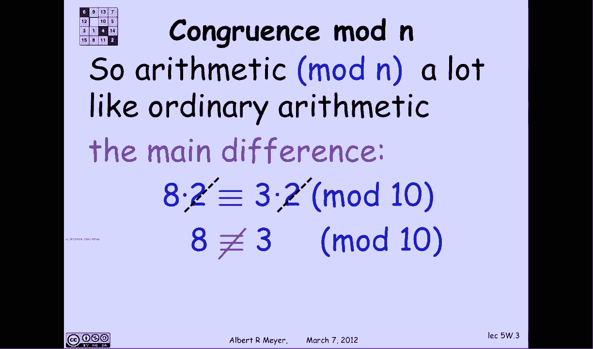

简而言之，它不是这样的，你不能随意取消，你不能取消两个。

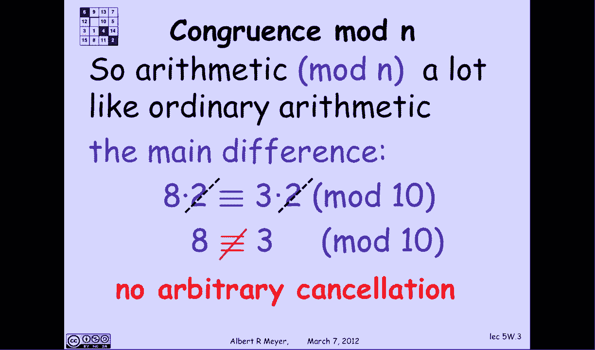

尤其是在这种情况下，所以这又回到了一个问题，你什么时候可以取消一个号码，你什么时候可以取消号码K，当不等式的两边乘以k时。

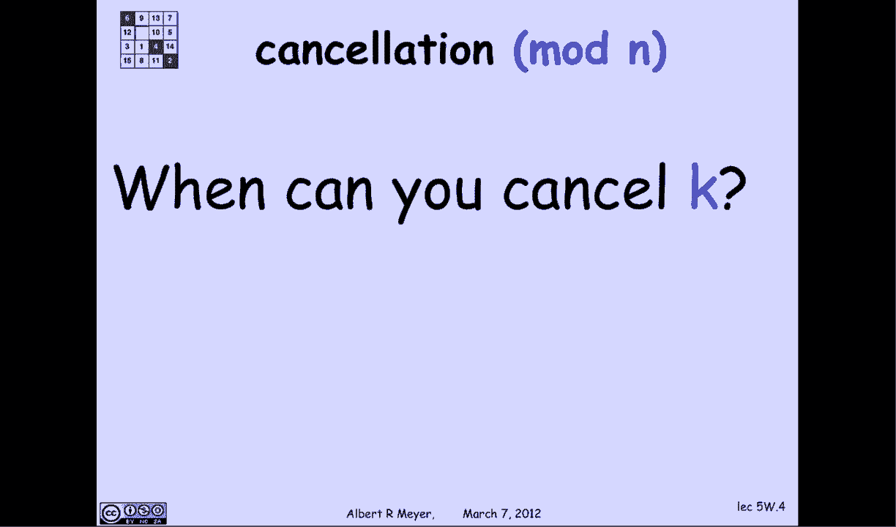

我想取消K，当k没有模n的公因数时，答案很简单。

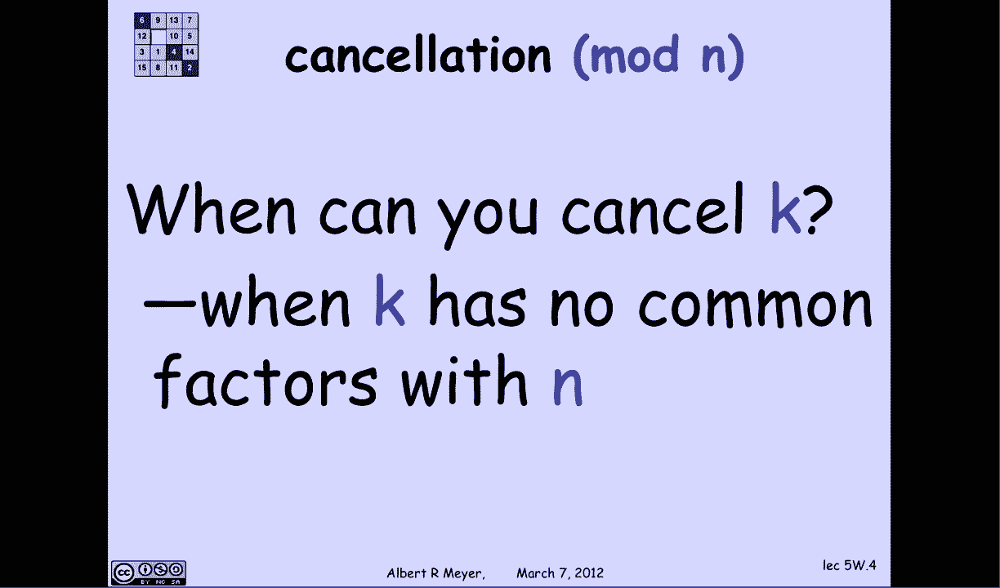

对此的证明是基于以下想法，假设一个数k素数是k模n的逆，k素数乘以k等于一模n，相对于mod n，k一撇是k的一撇，但当然，1/k是一个分数，除非k为1，所以k质数将是一个整数，它的作用就像k上的1。

那么我们如何证明这一点，这将是事实的一个简单后果，那么我怎样才能找到这个k的逆k质数呢，我有k的线性组合，n是1，所以s乘以k加t乘以n等于1，但如果你盯着看，有那么一瞬间。

这意味着k质数就是k的系数s，所以你所要做的就是把粉碎机涂在K N上，求k和n的s线性组合中的k的系数s。

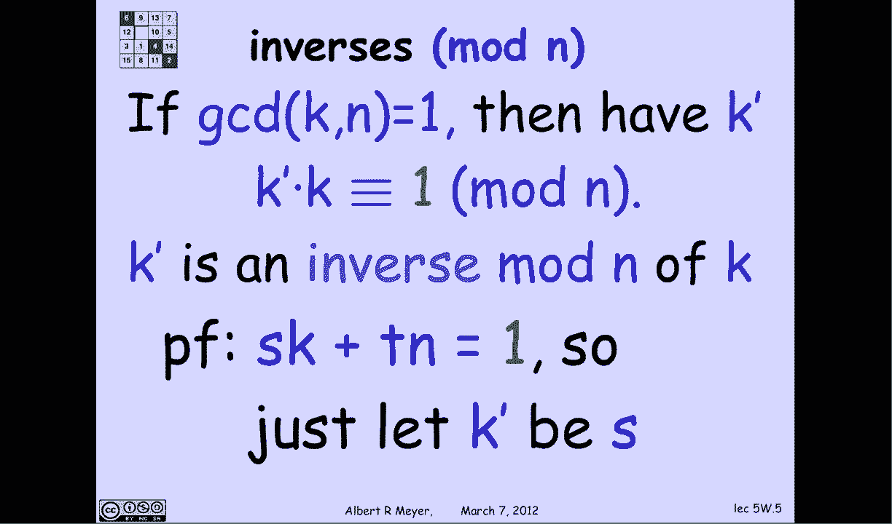

那等于一，让我们更仔细地看一下，看看发生了什么，我知道s k加tn是1，所以这特别意味着，因为他们是平等的，它们肯定是一致的，模n s k加tn等于一个模n，但n同余于零，mod n。

所以这就变成了t乘以0，剩下的s k同余于一个mod n。

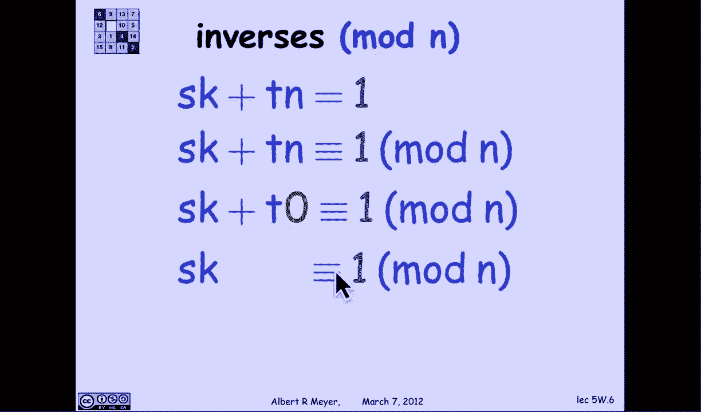

这正是s是k的逆的定义。

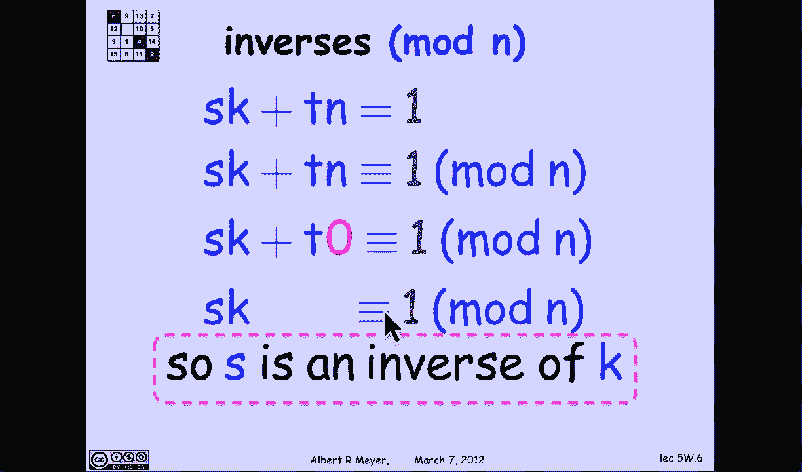

现在我也可以取消K，相对于n是素数，原因是如果我有一个k等价于b k mod n，然后我有一个k素数，它是k的逆，所以我把两边都乘以k的倒数，也就是k个素数，我得到左手边是一个乘以k的逆。

右手边是b乘以k k逆，当然那是1乘以1等于b乘以1，所以a与b mod n同等，所以我可以取消，那样的话，事实上，你可以计算出相反的含义，这个的笑点很好，首先呢，这是您可以取消的取消规则。

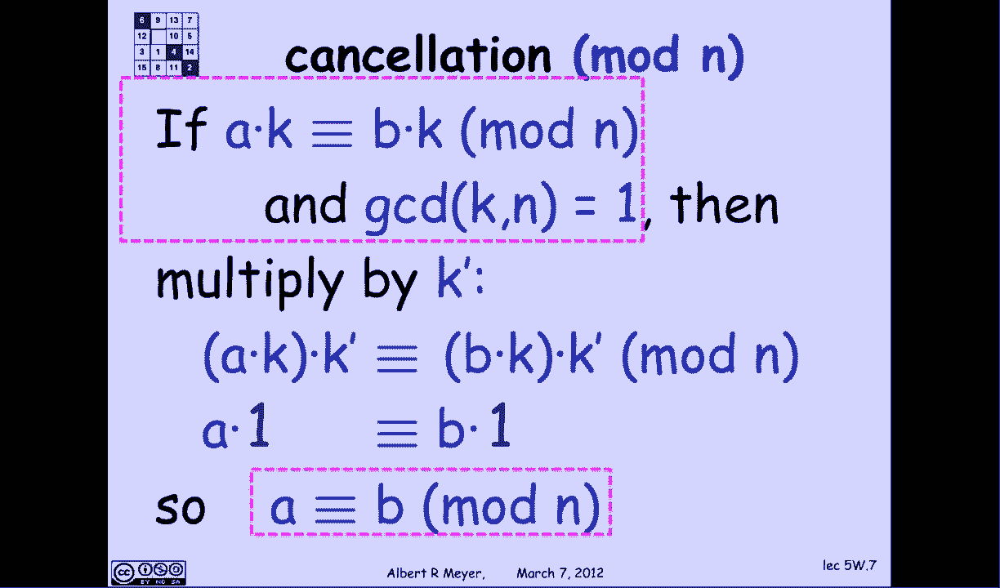

k相对于n是素数，所以这是总结，k是可取消模n当且仅当k有逆，我可以重述一下，因为k对n是相对素数的。

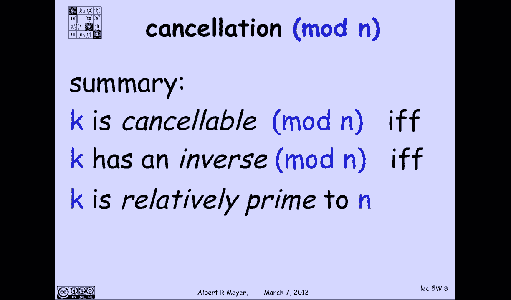