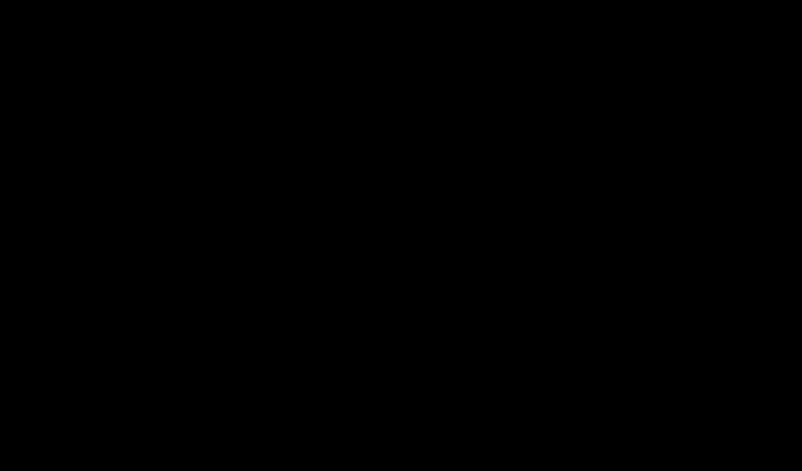
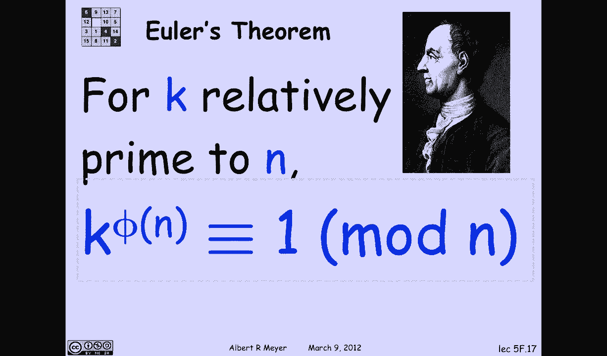

# 【双语字幕+资料下载】MIT 6.042J ｜ 计算机科学的数学基础(2015·完整版) - P42：L2.3.1- Modular Exponentiation Euler's Function - ShowMeAI - BV1o64y1a7gT

具有逆模量的元素，对我们来说特别重要，所以第一个问题是他们有多少人，这就是欧拉函数告诉我们的，所以n的欧拉函数费菲的定义是，它是从零到n减去1的余数间隔内的整数数，使得k相对于n是素数，所以要记住。

有一个包括零而不包括n的余数间隔的表示法，另一种说法是相对质数，所以让我们定义一组我们感兴趣的数字，设GCD n b中的一个，那就是有逆的数字和可消的数字，模n，所以它的意思是n的phi正好等于。

我没有发现一个非常翔实的符号，所以我不用它，N的费用也是供你参考的，称为欧拉函数，但我们还是叫它费或欧拉费，所以让我们看一个例子，相对于7的质数都是，所有小于7的正数，因为7是质数。

是与十二没有共同因子的数字吗，它们是下面绿色的数字，其他红色数字确实与十二有一个共同的数字，我和12有一个共同的质数，反正这里的纹路不是很明显，七个中的一个，也就是1到6套的大小，也就是六个。

十二决定十二的费用，十二费是绿色元素的数量，也就是四个，计算费用的简单规则，当费用是最好的，我们已经指出，即所有小于p的正数对p都是相对质数，所以p的phi就是p-1。

让我们看一个更重要的例子或说明性的例子，就是九口井的费用，好的，所以有从零到八的候选数字，哪些是相对于9的质数，嗯，到九点是相对质数，当且仅当它现在相对质数为3，这个区间内的哪个数相对于3是质数。

相对于三个质数，或者更确切地说，不是相对于三的质数，嗯，每三个数字中就有一个可以被三整除，所以那些是不好的，如果我们减去不好的，我们只剩下好的了，相对优质的，所以费是所有数字减去九的三分之一的集合。

哪个是坏的，坏的，也就是六个，这推广到素数的幂，如果k是正整数，然后p的phi到k，推理是一个数相对于p对k是素数，当且仅当它对p是相对素数，p整除每个peth数，所以区间中有一个数字是坏的。

这意味着p的phi是好的，减去一个p对k，即P对K的费用是P对K的费用，减去p到k/p，也可以用更标准的形式来表达，p=k减去p=k的次方减去1，这就结束了费的故事，素数幂的P费，嗯。

假设你在处理一个数字，那不是素数的幂，关于费，有一个非常优雅的小事实，这解释了如何处理素数的非幂，即如果a和b是相对质数，那么通过计算a的phi e就可以得到a b的phi，乘以b的phi，顺便说一下。

这个费用的性质叫做乘法，在数论中经常提到，函数是乘法的，当它的值是相对素数的乘积时，是这两个相对素数处的值的乘积，所以phi是乘法的，一个证明在习题集五，还有另一个证据，我们将在几周后看到。

当我们进入计数和包含排斥原理时，让我们利用这个关于费用的事实，费用的多重性，费用的乘法，看看它是如何让我们计算任意数字的费用的，特别是12美元以前看起来很复杂，十二是三乘以四。

所以这意味着12英镑的费用是3倍的费用，四个人的费用，但现在我状态很好，因为3是质数的次方，三到一，四是素数的次方，就是两个平方，所以应用素数公式的幂，我得到的费用是三倍的三倍。

2的平方减去2到2减去1，简化为四个，这就是我们之前看到的答案，我们为什么要检查费用的笑点，是欧拉定理吗，它告诉我们g、c、d中的数的幂是如何表现的，即如果k对n是相对素数。

那么如果你把k提高到n的电费，它与一个mod n是一致的，这将引导我们进入下一节。

