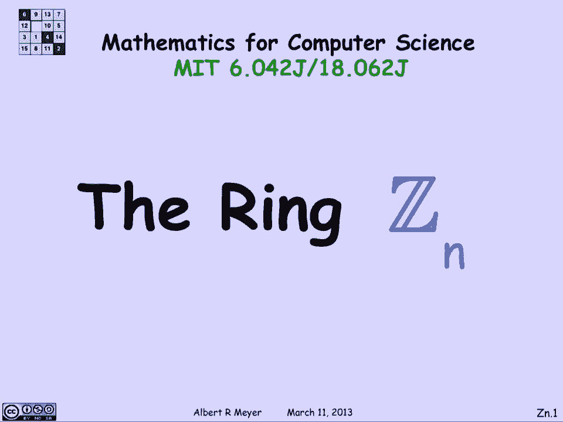
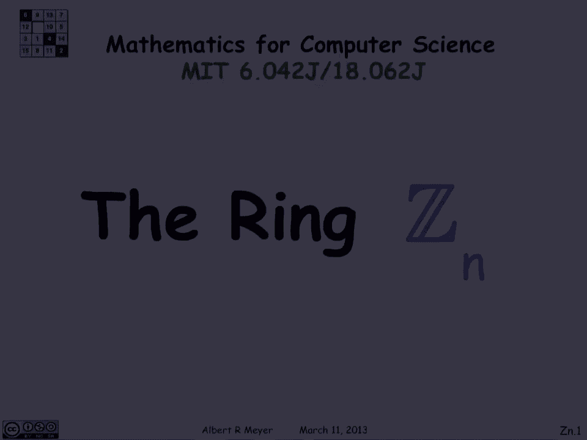
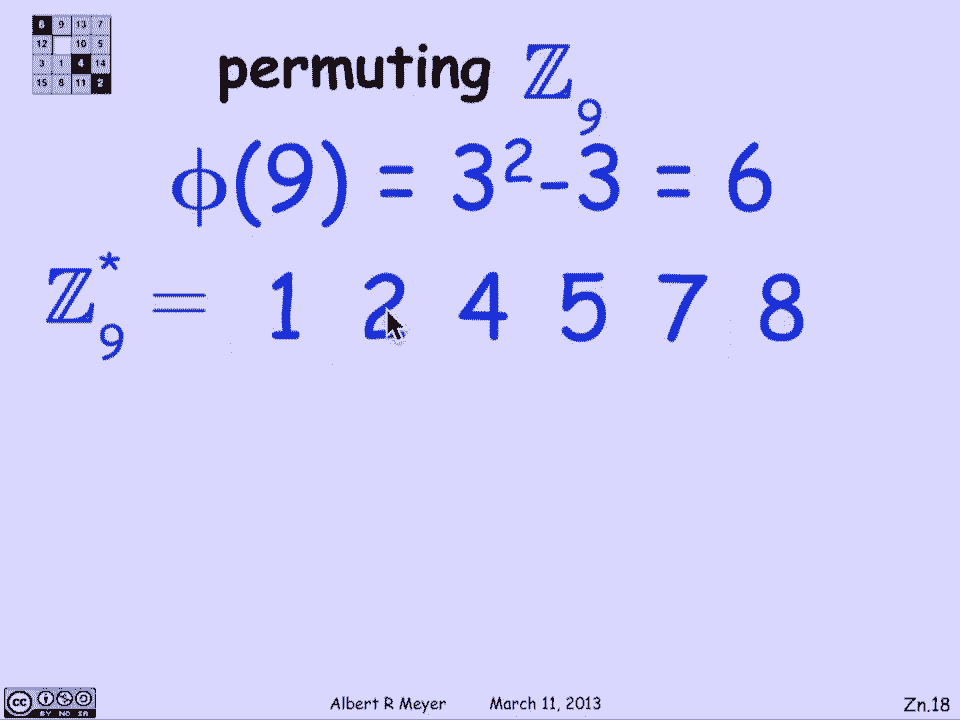
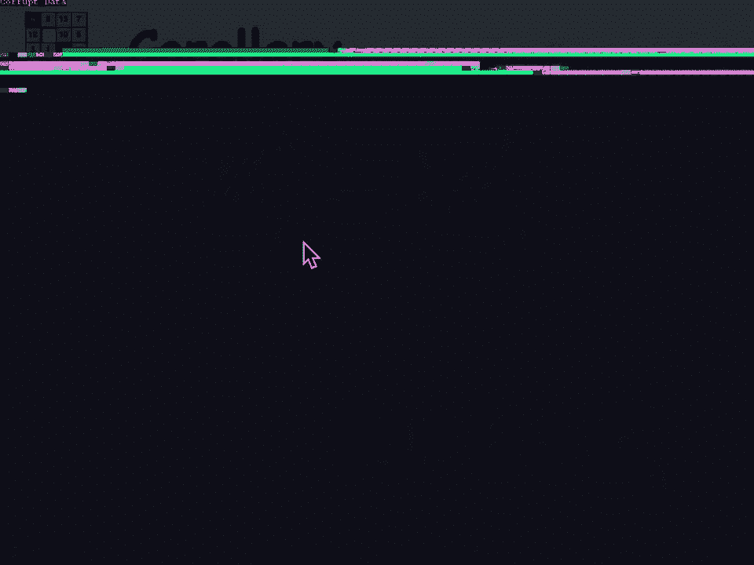
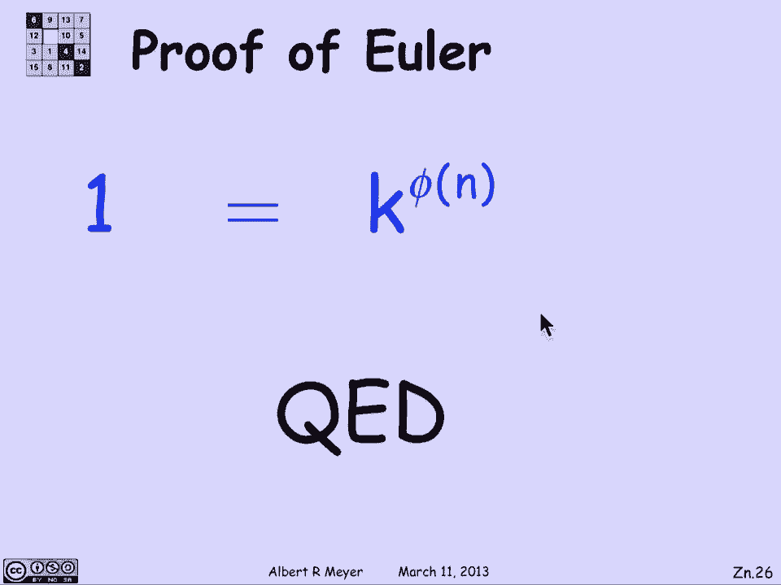
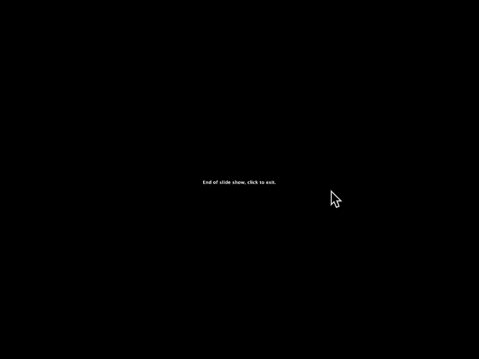

# 【双语字幕+资料下载】MIT 6.042J ｜ 计算机科学的数学基础(2015·完整版) - P43：L2.3.3- The Ring Z - ShowMeAI - BV1o64y1a7gT

谈论一致性的另一种方式，和余数算术是严格地与余数一起工作，这样事情就简单了一点，因为你不用担心，两个余数的乘积可能，比如说，太大了，不能成为余数，不能把它打回范围内，你得把剩下的再拿一次。

这就是整数环的抽象概念，模n。

Z Sub N以一种相当优雅的方式捕捉到的环。

所以它将允许我们严格地谈论平等，而不是一致性，让我们提醒自己，使用余数算术背后的基本思想是，每次我们得到一个太大而不是余数的数字，我们只是用剩余操作再次击中它，使它回到一个范围内。

所以ZN中的操作正是这样工作的，Zn的元素是余数，这是从零开始的数字，包括零到n，但不包括n，所以从零开始有N个，从1到n减去1，z n中运算的定义就在这里给出了，加法就是取和，然后马上把剩下的拿去。

万一太大了，同样地，Zn中的乘积是简单地将它们相乘，然后取余数，所以这不是一个非常戏剧性的想法，但事实证明，它的回报是让一些事情说起来更容易一点，因为我们谈论的是平等而不是一致，嗯，所以这个包裹在一起。

由这个区间中的整数组成的数学结构，记住这个符号，方括号表示包含，圆圆的，括号表示排他性，所以这包括零，不包括n，在加号和倍数运算下，该区间内的整数，这里定义的模Zn称为整数环，Zn。

所以它有两个手术和一堆现在正在手术的东西，我想值得强调一下，这就是ZN是整数环，模n或模n，现在算术和ZN实际上只是算术，一致性，算术，除了现在是平等而不是一致，所以我们可以说，比如说。

在z 7中3加6等于2，因为嗯，三加六等于九，除七的余数是二，我们直接去ZN中的两个，压制它，提到取余数，甚至不用去想，这就是使用锌的帮助之处，同样地，九乘八等于十一乘六，嗯。

那么所有整数的集合和整数之间的联系是什么，mod n，我们可以用下面的方式抽象地陈述这一点，让我们只是为了方便，缩写k a除法的其余部分，n是k的r，所以n是固定的，Z和Zn之间有什么联系，嗯。

如果你把i加j的余数，这实际上等于取Zn中余数的和，一旦你拿了剩下的，你在ZN工作的数字范围内，嗯，这个总数让你保持在ZN一边，同样地，如果取实数乘积的余数，这实际上等于锌中余量的乘积，这个操作。

顺便说一句，数学结构之间的联系，正数和倍数下的整数和正数和倍数下的Zn的结构，称为同态，在这种情况下，r定义了从z到z n的同态，这是代数中的一个基本概念，你会学到更多，如果你修了几门代数课。

但我只是出于文化原因提到它，我们不会进一步利用它，也不会进一步研究这个想法，哦，等价mod n或国会之间有什么联系，mod n和zn，嗯，这相当简单，嗯锌锌，我们把同余转换成等式。

所以i与j mod n同等，当且仅当i的r等于zn中j的r，这只是对两个数是全等的事实的重新措辞，当且仅当它们有相同的余数，一旦你有了这个自给自足的系统，ZN你可以开始谈论它满足的代数规则。

现在他们平等地持有，他们很熟悉，所以让我们来看看加法的一些规则，比如说，这是真的，和锌，首先，加法是联想的，i加j加k等于i加j加k，我们有一个身份元素，字面上为零，零加任意，我是我，我们有一个负操作。

关于加法的逆运算，也就是，那是什么，我怎么得到一些幻灯片，抱歉，打扰一下，好的，让我们继续前进，我做了一个逆运算，也就是说，对于每一个I，有一个元素叫-i，它是加法逆的，如果你加上i减去i，你得零分。

最后是交换性，也就是i加j等于j加i，你真的不需要记住这些名字，但你可能会在其他各种上下文中听到很多，尤其是在代数课程中，但即使在算术方面，这些是加法满足的一些基本规则，事实上，乘法满足几乎相同的规则。

乘法同样是联想的，乘法有一个恒等式叫做一，一次i是i乘法也是可交换的，这里一个明显的遗漏是逆，你不能指望，锌中存在逆，嗯，最后还有一个连接加法和乘法的运算叫做分配率，即i乘以j加k等于ij加i k。

正如你从普通算术中所知道的那样，这条规则对剩余物和在ZN中工作很有效，正如我所说，我们要注意的一件事不应该是惊喜，我们知道你不能取消关于同余的mod n，这反映在你不能在ZN中抵消的事实中，即在Z十二。

比如说，三乘以二等于二乘以八，三乘以二等于六，二乘八等于十六，你立即拿剩下的回到Z 12中的6，这两件事是相等的，但如果你试图取消这两个，你就会得出三等于八的结论，三个都不是。

3和8是从0到12范围内的不同数字，它们在Z 12中是不同的，所以你不能取消两个，现在，我们已经想通的规则，当您可以取消不一致时，直接转换为，当你可以在ZN中取消时，现在有一个标准的缩写在这里很有用。

如果我写ZN星，我的意思是Zn中相对于n为素数的元素，所以说，嗯，我们有以下锌星的等效配方，这与我们已经了解到的关于国会的事实相对应，也就是说，从零到n范围内的整数i在Zn星中，或者我在ZN中可以取消。

或者我在Zn中有一个逆，这三件事都是等价的，它们给你的感觉是ZN星是一种坚固的，呃，你想考虑的ZN子集，事实上，这是非常有价值的关注，关于ZN星我们还知道什么，嗯，n的phi的定义是区间内整数的个数。

从零到n相对于n的素数，当然，那正好是Z星的大小，所以n只是元素集合的大小，这并不奇怪，它们是这样定义的，所以现在我们可以用一种稍微方便的方式重述欧拉定理，而不是提到一致性，我们可以谈论平等。

欧拉定理说，如果你把一个数k提高到，n的phi，它实际上等于锌中的一，至少对于那些对n相对质数的k，那是那些在ZN星中的KS，结果会是，Weyl定理的证明实际上很容易。

它只是从几个简单的观察中走了几个步骤，所以让我们从那些开始，所以第一个评论是，如果我有任何子集，锌中元素的s，我不在乎它们是否是n的相对素数，如果我把它们每个乘以k，这个符号是k倍。

s表示我取形式为k的元素集，乘以s的一个元素，s so k的所有元素，也就是这组k的倍数，s乘k的元素的倍数与现在的s大小完全相同，为什么那口井，当然，这只适用于可取消的k。

但是引理是不管你取Zn的哪个子集，如果你把它们中的每一个都乘以一个可取消的元素，在锌星中，你会得到一套同样大小的，这很清楚，因为K1和K2怎么会相等呢，只有当s 1和s 2相等时，或者换句话说。

如果你在s one中有不同的元素，不等于s 2，当你把它们乘以k，你必须得到K的不同元素，因为k是可取消的，好的，所以这是一个简单的评论，一般成立乘以任何子集，可取消元素，你得到了一套同样大小的新衣服。

第二个评论是，如果你看区间内的数字i和j，从零到n在z n中，那么嗯，如果你把它们两个相乘，嗯，然后你会得到Zn星中的一个元素，当且仅当最初的两种元素在Zn星井中，让我们从左向右看，这是我们唯一需要的。

如果i和j相对于Zn星是素数，那他们的产品也是，因为如果i和j都没有与n相同的素因子，那么他们的产品显然没有一个共同的因素与n，然后当你取余数的时候，所以我们说如果你把两个可消的元素相乘。

得到一个可取消的元素，如果你把两个元素相乘，相对于Zn星，你得到了一个ZN星元素，几乎每一个锌星的配方，在GCDS方面是可取消的或逆的，嗯会，它们中的每一个都给出了一个单独而直截了当的证据。

如果i和j在Zn星中，那他们的产品也是，顺便提一下，总的来说，他们的总和不是，如果你在Zn星上加上两个相对素数的元素，即使它们的和不是零，你通常会得到一个不再是相对质数的元素，但对于乘法来说，它很有效。

这对我们来说很重要，好的，所以作为一个推论，我实际上可以得出结论，如果我选择一个可取消的元素，锌星中的一种元素，如果我把整套ZN星，所有相对于n的素数元素，我取K的倍数，那么事实上我得到了同样的ZN星。

证明这一点真的是。

直截了当，让我们考虑一下，因为我所知道的是这两套是一样大的，K ZN星和ZN星大小相同，只要k是可取消的，我甚至不在乎这是ZN星，是啊，是啊，另一方面，如果k在Zn星中，k倍锌星，它只给你ZN星的元素。

所以K ZN星是左手边的子集，它的大小与引理相同，引理说乘以i，K保留尺寸，所以他们必须是平等的，所以基本上这意味着如果你把z星中的所有元素，所有相对于n为素数的元素，你取其中的另一个。

从那个集合中挑一个，并将集合中的每个元素乘以那个元素，如果你事先把它们排成一个顺序，当你乘以k，你得到完全相同的元素，但刚刚重新订购，乘以k，有排列Zn星元素的作用。

让我们看一个例子，所以让我们看看Z9，我们知道按之前的公式九的费用是三的平方，减三六，它们是从零到n的六个元素，相对于9的质数，是组成ZN星的，所以让我们看看它们是什么，这样你就可以检查计算了。

但ZN星正是元素，一二四五七八，我们知道我们把他们都抓到了，因为他们应该只有六个人，我们可以检查这些都是相对于9的质数，1。他们当中没有一个人把三作为除数，例如，现在发生了什么。

如果我把它们都乘以2得到另一个好数字，就在这里，在ZN星中，将它们乘以二，嗯，让我们检查两次一等于二，二乘二等于四，二乘四等于八，二乘五等于一，因为是十加一的余数，嗯，呃，二乘七等于十四等于五。

二乘八等于十六，mod九转换成七，正如所声称的那样，看看这个，这里有两个，四，八，一五七，和1一样的数字，两个，四，五个，七，八，只是顺序不同，让我们再举一个例子，让我们试着乘以七。

这是另一个值得尊敬的元素，七乘一等于七，七乘以二等于十四，意思是一个，是九分之五，四乘七二十八井，三乘七等于二七，所以剩下一个，4乘以7等于1和Z9，同样地，五乘七等于八，七乘以七等于四。

七乘以八等于五，六，翻译成两个，果然，如声称的那样，我看到同样的数字，七，五，一个，八，四二，只是这些数字按顺序排列，它们是排列的，就是乘以七的结果，我们回去吧，我们刚才说明的事实是，我们已经得出结论。

如果你用Zn星乘以一个元素，锌星中的k，你以不同的顺序得到相同的一组，所以Zn星等于K乘以Zn星，现在我们即将证明欧拉定理，因为我想说看，这两套是一样的，让我们把左边的所有元素相乘，把右边的元素相乘。

让我们取这些元素的乘积，所以我们拿Zn星的乘积，并将其与K ZN星的产物进行比较，这里的大圆周率表示这个集合中所有元素的乘积，这个集合中所有元素的乘积，让我们看看右边的布景，嗯，这是k次的乘积。

Z星中的所有元素，嗯，有多少元素，Z星中n个元素的费用，根据定义，让我们把所有的K都排除掉，所以这里的这个表达式，k倍的乘积，Zn星中的每个元素，与Zn星中元素的乘积相同，乘以尽可能多的元素。

即k到n的费用，我只是把K从这个产品中剔除，我的K是N的费用，现在看看我在这里得到了什么，那是πzn星，那是πn zn星，我对ZN星中的元素乘法了解多少，他们在锌星，这个产品会是ZN星的一些其他元素。

这个产品也会，但我对ZN星了解多少，它们是可以取消的，所以我现在忽略了期中考试，我的结论是，Zn星的乘积是n次的φ，锌星的产物，让我们取消那些可取消的条款吧，我受够了，我刚想出了取消的结果。

左边的项等于k的费用n，我们成功地证明了欧拉定理。

