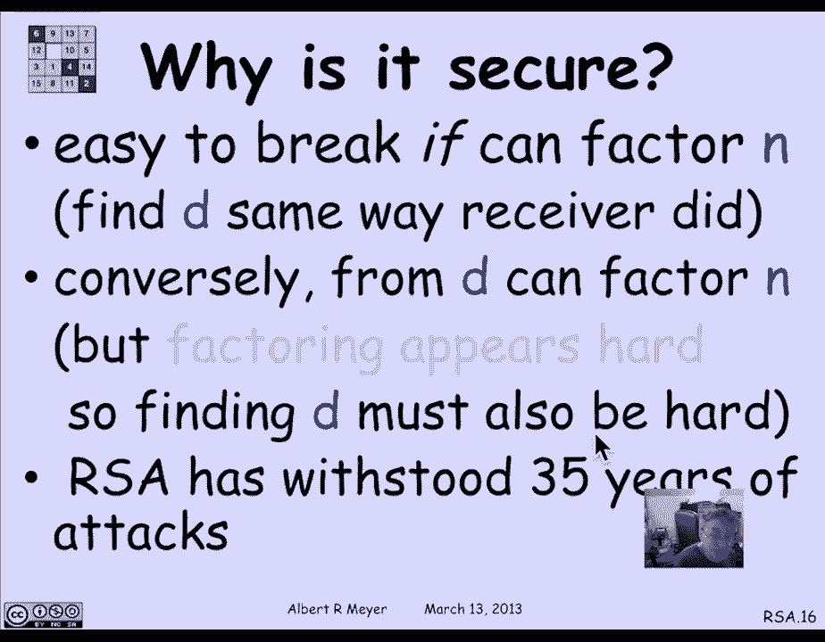

# 【双语字幕+资料下载】MIT 6.042J ｜ 计算机科学的数学基础(2015·完整版) - P44：L2.4.1- RSA Public Key Encryption - ShowMeAI - BV1o64y1a7gT

the RSA cryptosystem is one of the，lovely and really important applications。

of number theory in computer science so，let's stuff start talking about it。

the RSA cryptosystem is what is known as，a public key cryptosystem which has the。

following really amazing properties，namely anyone can send a secret。

encrypted message to a designated，receiver this is without there being any。

prior contact using only publicly，available information now if you think。

about that it's really terrific because，it means that you can send a secret。

message to Amazon that nobody but Amazon，can read even though the entire world。

knows what you know and can see what you，sent to Amazon and Amazon knows that。

it's the only one that can decrypt the，message you sent this in fact is hard to。

believe if you think about it it sounds，paradoxical how can secrecy be possible。

using only public info and in fact the，existence of this public key，cryptosystem has some genuinely。

paradoxical consequences which kind of，are a mind bender so let me tell you。

about one of them I don't know if you've，heard of mental chess but it's a。

standard thing in the chess world chess，masters are so talented and have such。

deep insight into the game that they，don't need a chess board and they don't。

need chess pieces they can just go for a，walk through the on a country lane。

talking to each other and saying pawn to，King four and and Knight to Bishop three。

and just talking chess code and play an，entire chess game that way that's known。

as mental chess it's quite impressive in，fact the grandmasters can play multiple。

games of mental chess against opponents，who are staring at the chess board and a。

win the great majority of the games of，course these are not against other。

grandmasters but still okay so now this，is what I propose how about playing。

mental poker if you know how to play，poker we deal out cards and we bet and。

so on and my only condition is that I'll，deal，now that sounds like a joke and an。

absurd thing for you to agree to do but，it's amazing，it's actually possible one of the famous。

papers of rivest and Shamir was how to，play mental poker using public key。

crypto so um I once tried to persuade a，feminine MIT beam who's it was a。

physicist researcher about this and he，just wouldn't believe it he argued that。

it was just impossible logically and，what he was thinking about was that if。

you know how to compute a function then，of course you can figure out how to。

invert it that is to say if I know how，to compute some function f of a number。

and let's say that the function is one，arrow in that is an injection then if I。

know what F of n is there's a unique end，that it came from so how can I not be。

able to find N and it's an insight of，computer science and complexity theory。

that says it's quite possible it's not，that you can't find the N that produced。

F of n it's that the search for it will，be prohibitive there are in short。

one-way func that is functions that are，easy to compute in one direction but。

hard to invert they're easy to compute，but hard to invert in particular we're。

thinking about multiplying and factoring，it is it's an observation that it's easy。

to compute the product of two large，prime numbers we all know how to。

multiply and in fact there are faster，ways to multiply them you know but the。

current state of our knowledge of number，theory and complexity theory is that。

given a number n that happens to be the，product of two primes it seems to be a。

hopelessly hard in general to factor and，into the components P and Q now this is。

an open problem it's similar to the P，equals NP question that famous open。

problem it's actually a a weaker it's，quite possible that you could factor and。

NP would not equal to NP but，nevertheless it's the same kind of。

problem and more generally the existence，of one way function，is closely related to that P equals NP。

question nevertheless even though it's，an open problem and theoretically has。

not been settled either way it's widely，believed I mean the banks the。

government's and and the commercial，world have really bet the family jewels。

on the difficulty of factoring when they，use the RSA protocol so I like to make。

the joke that my most important，contribution to MIT was being involved。

in the hiring of our SNA so this is a，adi shamir our ron rivest and l US a--。

an ailing Adelman back in the late 70s，when they first came up with these ideas。

so let's look at the way this RSA，protocol actually works so here's what。

happens to begin with you have to make，some information public so that people。

can communicate with you so there's a，we're looking at two players here。

there's a receiver who's going to get，encrypted messages and there's a sender。

who is trying to send an encrypted，message to the receiver so what the。

receiver does beforehand is generates，two primes P and Q now in practice you。

want these to be pretty big primes，hundreds of digits and they will examine。

in a moment the question of how you find，them but the receivers job is to find。

two quite substantial large Prime's P，and Q chosen more or less randomly。

because if you have any kind of，predictable procedure for how you got。

them that would be a vulnerability but，if you just choose in the random then。

there is enough Prime's in the hundreds，of digits that it's hopeless that people。

would guess which one you wound up with，okay what you do to begin with this。

multiply P and Q together which is easy，to do let's call that number N and now。

the other thing that receiver is going，to do is find a number e that's。

relatively prime to this peculiar number，P minus 1 Q minus 1 now as a hint you，might notice。

that P minus 1 Q minus 1 is in fact oil，is function event fee of n but for now。

we don't need to understand that this is，euler's function it's just the recipe of。

what the receiver has to do find a，number eat it's relatively prime to P。

minus 1 Q minus 1 again you don't want e，to be too small and we can we'll discuss。

in a moment how do you find such an e，but the receivers job is to find such an。

e on this pair of numbers e and n will，be the public key which the receiver。

publishes widely where it can easily be，found by by anyone who cares to look for。

it basically there's a phone directory，where if you want to know how to send。

somebody a secret message you look them，up and you find the receivers name in。

there and then you see his public key，and N and that's what you use to send。

him a message now how do you use a it to，send him a message well I'll explain。

that a minute but let's look at one more，thing that the the receiver needs to do。

to set himself up the receiver is going，to find an inverse of this number e that。

he's published in the part of his public，key modulo a P minus 1 Q minus 1 that is。

this e since it's relatively prime to P，minus 1 Q minus 1 it will have an。

inverse in Z star P minus 1 Q minus 1，let's let that inverse BD and of course。

we know how to find it because you could，do that with the pulverizer D is the。

private key that's this crucial piece of，information that the receiver has then。

that the receive is not going to tell，anybody，only the receiver knows that because the。

receiver chose the P and the Q and the e，more or less randomly maybe even as。

randomly as they can manage and then，they find the D and that's their secret。

okay that's what the receiver does how，does the sender send a message well to。

send a message what the the the sender，wants to do is choose a message that is。

in fact a number in the range from 1 to，N on，where we're thinking again of n if it's。

a product of two primes of a couple of，hundred digits each then the product is。

around 400 digits and so you can pick，any number any message M that can be。

represented by a 400 digit number now，there's a lot of messages that will fit。

within 400 digits and of course if it's，bigger you just break it up into 400。

digit pieces so that that's the kind of，message you're going to send so the。

message is going to be a number in this，range from 1 to N and what the sender is。

going to do is look up the public key e，and the other part of the public key N。

and raise the secret message to the，power e in Zn so we're going to compute。

m to the e in Zn and send that encoded，message M hat so M hat is what we think。

of as the encrypted version of the，message M so then we have the problem if。

that's what the sender sends to the，receiver how does the receiver decode。

the message M hat and the answer is the，receiver just computes M hat to the。

power D the secret key also in the ring，Zn and the claim is that in fact that's。

equal to M now you can check in a class，problem and it's easy to see that the。

reason why that method of decrypting，works is precisely an application of。

euler's theorem at least when m happens，to be relatively prime to n now the odds。

of finding an M that's not relatively，prime to n are basically negligible。

because it would because if you did find，such an M it would enable you to factor。

only believe factoring is very hard but，in fact it actually works for all M。

which is a nice theoretical result and，you'll work this out in a class problem。

ok that's how it works the receiver，publishes E&N keeps a secret key D the。

sender exponentiate s' the message to，the power e the receiver simply decodes。

by raising the receive mess，edge to the power D and reads off what。

the original was okay so we need to，think about the feasibility of all of。

this because we believe that it's，impossible to to decrypt but there's a。

lot of other stuff going on there the，players have to be able to perform and。

let's examine what their，responsibilities and abilities have to。

be so the receiver to begin with has to，be able to find large primes and how on。

earth do they do that，well without going into too much detail，we can make the remark that there are。

lots of primes，that is to say by appealing to the prime，number theorem we know that in among the。

N digit numbers about log n of them are，gonna be primes so that you don't have。

to go too long before you stumble upon a，random prime that is if you're dealing。

with a 200 digit N and you're searching，for a prime of around that size you're。

not going to have to search more than a，few hundred numbers before you're likely。

to stumble on a prime and of course how，do you know that you stumbled on a prime。

well you need to be able to check，whether a number is prime or not and。

efficiently in order for this whole，thing to be feasible so we'll have to。

discuss that briefly how do you test，whether or not a number is prime in an。

efficient way the other thing the，receiver has to do is find an e that's。

relatively prime to P minus 1 Q minus 1，but that's easy well it's easy because。

first of all if you just kind of，randomly guess a medium-sized e and then。

search consecutively from some random，number you've chosen in the somewhere in。

the middle of the interval up to P minus，1 Q minus 1 again you're likely very。

likely to find in a few steps a number a，that is relatively prime to P minus 1 Q。

minus 1 how do you recognize that it's，row that it's relatively prime well you。

just compute the GCD which we know how，to do using Euclid's algorithm so that's，really quite a fish。

recognising that it's relatively prime，is easy and you and you just don't have。

to search very many numbers till you，stumble on an e okay the other thing you。

have to do is find the D that's an e，inverse modulo P minus 1 Q minus 1 and。

again that is the extended you send a，Euclidean algorithm the extended GCD。

namely the pulverizer so those are the，pieces that the receiver has to do now。

let's look at this a little bit more and，think about the information about the。

prime so the famous theorem about the，primes is their density which is if you。

let a pie of n be the number of primes，less than or equal to n then it's a deep。

theorem of number theory that PI of n，actually approaches a limit in an。

asymptotic sense which we'll discuss in，more detail but that PI of n as n grows。

gets to be very close to n over log n，that's the natural log of n and and then。

now that's a deep theorem but in fact if，we want a self-contained treatment for。

our purposes there's an exercise that，will be in the text on where we can。

derive chebychev's bound which is weaker，than the tight prime number theorem but。

chebychev's bound which can be proved by，more elementary means that's within the。

ability of our own ability at this point，with the numbers here we have to be able。

to show that n over 4 log n is a lower，bound on pi of n so basically that says。

that if you're dealing with numbers，numbers of size n which means they're of。

length log n a few hundred digits then，you only have to search maybe a thousand。

digits before you're very likely to，stumble on a prime and if you search two。

thousand digits it becomes extremely，likely that you'll stumble on a prime so。

the primes are dense enough that we can，afford to look look for them providing。

we can have a reasonably fast way to，recognize when a number is prime。

well one simple way that it almost is，perfect but but works pragmatically。

pretty well is called the phase the，Firma test but let me just emphasize，this remark I got ahead of。

so fit if I'm dealing with 200 digit，numbers than about one in a thousand is。

prime using just the weaker chebychev's，bound and that says that I don't have to。

search too long only a few thousand，numbers to be able to find a prime and。

you know a few thousand numbers is well，within the ability of a of a computer to。

carry out providing that the test for，recognizing that a number is prime isn't。

too time-consuming so one naive way that，that really almost works to be a。

reliable prime ality test is to check，whether a firm oz theorem is obeyed from。

us theorem the special case of euler's，theorem says that if n is prime then if。

I compute a number a to the N minus 1，it's going to equal 1 in Zn and that's。

gonna be the case for all a that are not，0 if n is prime now that means that if。

this equality fails in Zn then I，immediately know a is not prime go on。

search for another one okay so suppose，I'm unlucky or lucky and I choose an a。

to test and it turns out that a to the n，minus 1 is 1 does that mean that n is。

prime unfortunately not it might be that，there's that I just hit an N that。

happened to satisfy firm us equation，even though and was not prime but uh it。

it's not a very hard thing to prove that，if n is not prime then half of the。

numbers are from 1 to N are not gonna，pass the Fermont test so if half of the。

numbers are not going to pass the the，firm our test then what I can do is just。

choose a random nonzero number in the，interval from 1 to N raise it to the N。

minus first power and see what happens，and if n is not prime the probability。

that this random number that I've chosen，fails this test is at least 1/2 so I try。

it 50 times and if in fact 50 randomly，chosen a is in this in the interval from。

1 to n all satisfy firmus theorem then a，there's a one chance in 2 to the minus。

50th that in two to the 50th rather that，but and it's not prime that's a great。

bet leap for it so that basically is the，idea of a probabilistic prime allottee。

test now there's a small complication，which is that there are certain numbers。

n where this property that half the，numbers will fail to satisfy for a mus。

theorem are not true or doesn't hold，they're known as the Carmichael numbers。

in they're known to be pretty sparse so，that really if you're choosing an end at。

random which is kind of what we're doing，when we choose random Prime's P and Q。

the likelihood that you'll stumble on a，Carmichael number is another thing you。

just don't have to worry about，so really the firm op primality test is。

a plausible pragmatic test that you，could use to pretty reliably detect。

whether or not a number was prime what，was the last component of the powers。

that we needed the receiver to have okay，so now we come to the question of why do。

we believe that the RSA protocol is，secure and the first thing to notice is。

that if you could factor n then it's，easy to break because if you can factor。

n then you have the P and the Q and that，means you know what P minus 1 times Q。

minus 1 is and therefore you can use the，pulverizer in exactly the same way the。

receiver did to find the inverse of the，public key e you could find the easily。

so surely if if you can factor then RSA，breaks no question about that what about。

the converse well what you can approve，and there's an argument that's scheduled。

in a class problem not fully in the book，is that if I could find the private key。

D then in fact I could also factor in so，if I believe that factoring is hard then。

in fact finding the secret key is also，hard and we could try to be confident。

that our secret key is not going to be，found even given the public key now。

unfortunately this is not the strongest，kind of security guarantee you'd like。

because there's a logical possibility，that you might be able to decrypt。

messages without knowing the secret key，maybe there's some other walk around。

whereby you can decrypt the secret，message Emma had by a method other than。

raising it to the dthe power and what，you really like is a theorem of security。

that said that breaking RSA reading RSA，messages by any means whatsoever would。

be as hard as factoring that's not known，for RSA it's an open problem and so RSA。

doesn't have the theoretically most，desirable security assurance but we。

really believe in it and the reason we，really believe in it is that for 100 or。

more years mathematicians and number，theorists have been trying to find。

efficient ways to factor and more，pragmatically on the most sophisticated。

cryptographers and decoders in the world，using the most powerful networks of。

supercomputers have been attacking RSA，for 35 years and have yet crackit now。

the truth is that in the course of the，35 years various kinds of glitches were。

found that required some added rules，about how you found the P and the Q and。

how you found the e but they were easily，identified and fixed and an RSA really。

is a robust encryption method public，encryption method that has a withstood。

attack for all these years that's why we。

