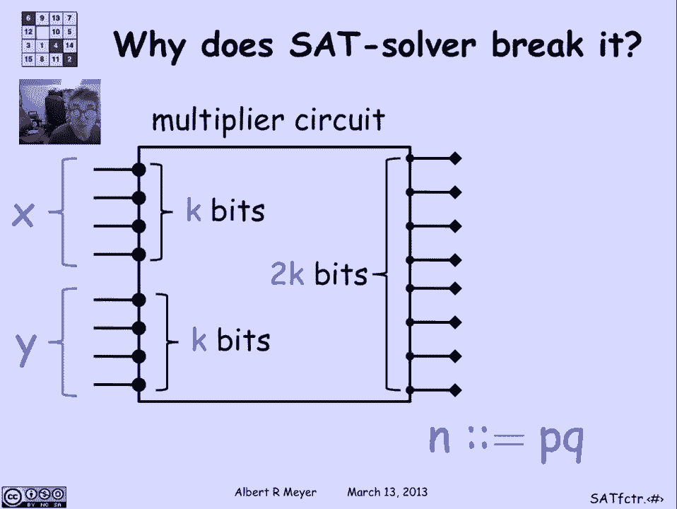

# 【双语字幕+资料下载】MIT 6.042J ｜ 计算机科学的数学基础(2015·完整版) - P45：L2.4.3- Reducing Factoring To SAT - ShowMeAI - BV1o64y1a7gT

we've mentioned the P equals and P。

question a number of times now as as the，most important question in theoretical。

computer science and we've said that one，way to formulate it is exactly to ask。

whether there's an efficient that is，polynomial time procedure to test，whether or not a formula in。

propositional logic is satisfiable now，why is that such an important problem I。

mean you know we're not just logicians，and we want to know whether or not some。

formulas satisfiable how did it take on，this enormous importance and apply to so。

many fields and illustrating how you，could use a satisfiability tester to。

factor efficiently is a good hint about，why it is that all sorts of things。

reduced to Sat and why it in fact is，such a centrally important problem so。

let's suppose that we have a。

satisfiability tester and use it to find，the factor a number n now the。

observation begins with how you use a，Sat solver is that you can begin by。

writing a or observing that it's easy，enough to design a digital circuit that。

multiplies that does arithmetic，multiplications in other words it's got。

some number of bits reserved for an，input X say K bits and another K bits。

for an input Y and it's got two K output，lines that produce the digits of x times。

y you might need one extra digit but，never mind that，okay so this is a multiplier circuit。

takes an X at a bit X in and a what K，bit Y in and it spits out the product。

which is another 2k bit number and this，is not a terribly big circuit the naive。

way to design it would use a number of，gates that was about and a number of。

wires that was about quadratic in the，number K the it's easy enough to design。

one of these things where the size is，literally bounded by five times K。

squared maybe plus a constant and so，there's definitely a small polynomial we。

can given the number of bits that I'm，working with it's easy enough to build，this multiplier circuit。

now suppose that I have a way to test，satisfiability of circuits how am I。

gonna use this multiplier circuit to，factor well the first thing I'm going to。

do is let's suppose the number that I'm，factoring scroll is N and it's the。

product of two primes P and Q those are，the kinds of ends that we've been using。

in RSA and let me also observe that it's，very easy to design an end tester that。

is a little digital circuit that has 2k，o input lines and produces a 1 on its 1。

output line precisely when the input is。

the binary representation of n so let's，attach this equality tester that does。

nothing but ask whether it's being fed，the digits of n as input and it produces。

an output yes for 1 for N and 0 if the，input pattern is an the digital。

representation a binary representation，of anything other than and that's。

another trivial circuit to build so we，put those two together and now watch。

what happens um I'm gonna take the，circuit and set the first of the input。

bits to 0 and then I'm gonna ask the Sat，solver the following question is there a。

way to set the remaining input bits，other than 0 so I've set the first one。

to 0 what about these other bits I mean，the Sat solver can tell me whether or。

not it's possible to get a 1 out of this，circuit with the 0 there fixed so let's。

ask the Sat solver what happens and the，Sat solver says hey yes there is a way。

to fill in the remaining digits and get，an output one well what does that tell。

me what tells me that there there is a，factor that starts with zero so let's。

fix the zero based on the fact that um，it's possible for me to fill in the。

remaining digits with the bits of，factors x and y that equal n okay let's。

try to set the second input bit to zero，and see what happens well well as the。

sat tester is it possible now to fill in，the remaining digits to get the two。

numbers x and y that multiply and，produce，and therefore output one and a set set。

the set tester says no this is an，unsatisfiable circuit you can't get a 1。

out of it anymore that tells me that I'm，have to set the second bit to 1 in order。

to have a factor that of n where the x。

and y will multiply together to be in，all right fine go to the third bit ask。

whether or not zero works the sat set，fester says let's say yes so then I can。

fix here oh I now know the first three。

bits of X and of course I go on and in，two case at tests I know exactly what P。

and Q are and I have in fact found the，factors P and Q so that's wraps that one。

up that's how you use a Sat tester you。

just do this at tests to K times and，you've factored this to K bit number um。

and of course if the Sat test is，polynomial and K then doing it to K。

times just is also polynomial and K with，one degree higher higher，okay now the this has five bility。

problem as we formulated was a problem，about formulas that as you wrote out a。

propositional formula and asked whether，or not it was satisfiable and i'm。

instead asking about satisfiability of，binary circuits but in fact as we did in。

some early exercises you can describe a，binary circuit by assigning a fresh。

variable to every wire in the circuit，and then writing a little formula around。

each gate which explains how the input，wires to that gate are related to the。

output wire of that gate and that little，formula explains that wiring of that。

gate and you take the end of all those，formulas and you have a formula that is。

describing the structure of the of the，circuitry and in fact the formula is。

satisfiable if and only if the circuit，can produce an output one so we really。

have by assuming that I could test，satisfiability of formulas I can，therefore test satisfiability of。

circuits and therefore I can factor so，this is if that's a simple trick to find。

a propositional formula that's equally，satisfying，both to the circuit if the circuit。

produces output one if and only if this，formula of about the same size as the。

circuit in satisfiable and that's the，last piece that I needed in order to。

completely reduce satisfiability the，factoring rather to the satisfiability。

problem and you can see that this is，actually a general method that will。

