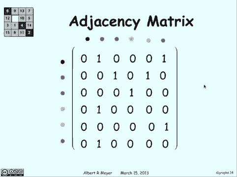

# 【双语字幕+资料下载】MIT 6.042J ｜ 计算机科学的数学基础(2015·完整版) - P46：L2.5.1- Digraphs - Walks & Paths - ShowMeAI - BV1o64y1a7gT

in this video lecture are going to，introduce the idea of directed graphs or。

digraphs for short so normally in before，this class you might have thought of。

graphs and being something like this Y，is a function of X and graphs on the XY。

plane but that's not what we want to be，thinking about instead we want to think。

about something like this this is a，graph to a computer scientists show a。

bunch of vertices which are those points，that you see and edges which connect。

vertices being more specific and direct，about this it suppose of a set V of。

vertices and they set E of edges which，are composed of two V each the way you。

write that out an edge is V comma W that，specifies an edge going from V to W and。

in the graph it would look something，like this，note that they are directed that an edge。

from V to W is not the same thing as an，example here we have one directed graph。

and you write out vertices as the set of，all the vertices you see there and edges。

are pairs of vertices you can also，realize that digraph is the same thing。

as a binary relation on the vs。 because，each edge just defines a relation from。

one version to another so every binary，relation can be drawn out as a graph did。

you just put each of the things in this，in each of the sets as vertices and。

edges being the things that relate from，one set to the other so now we're going。

to find walks and pass now a walk，follow successive edges but it can。

repeat vertices or edges for example，when I started at the black vertices see。

there you can go to red blue yellow red，and we can go back to blue again there's。

nothing stopping us and the length of，these paths is not how many vertices。

we've gone through but the，a number of edges that we've got so here。

the length would be five because we went，from where the black black to blue blue。

to yellow yellow red red blue right it's，not the six vertices that we went。

through and you have to be careful about，that that difference of one can kind of。

get you a path on the other hand walk，through vertices with that repeating a。

single vertex so for example sorry blue，you can go yellow and go red and go pink。

and go green but then we're stuck you，can't go back to red we've already been。

there so that's it that would be the end，of our path we went to red again then we。

have it wouldn't be a passenger not be，if that was path and here the art length。

is for it not five vertices and every，graph can be represented as a matrix。

representation you draw it out like this，and what we're gonna do is if there's a。

edge that goes from one of the things on，the right over to one of the things on。

the top we'll put a one at that position，for example there's an edge that goes。

from the black to the red so on the，black row in the red column we're gonna。

put in a one same thing there's one that，goes from black to green we'll put black。

row green column put in another one and，so on for all the edges that we have in。

our graph and the rest we just fill in，with zeros and this is called an。

adjacency matrix and as you can see，uniquely defined to graph every edge is。

represented here and every one of the，vertices is represented here so any。

