# 【双语字幕+资料下载】MIT 6.042J ｜ 计算机科学的数学基础(2015·完整版) - P47：L2.5.3- Digraphs - Connected Vertices - ShowMeAI - BV1o64y1a7gT

这个视频讲座的主题是连接的顶点，我们可以在不同的顶点和边之间建立的连接。

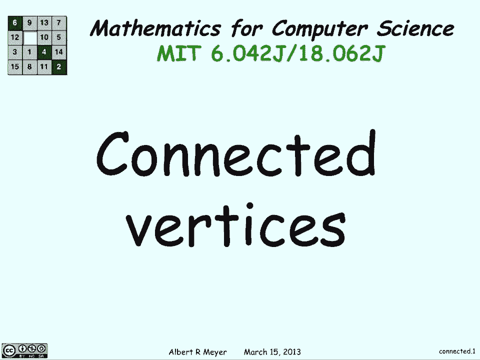

所以说，我们将从展示，两个顶点之间最短的游动是一条路径，我们将用矛盾来证明这一点，所以假设我们有一条从u到v的路径，它穿过自己，所以这里我们有u和v，在某一点上，你知道你到了C，你又回到了C。

从那里你到V右边，所以你已经通过了垂直，有的脊椎两次，但是如果你想得到从u到v的最短路径。

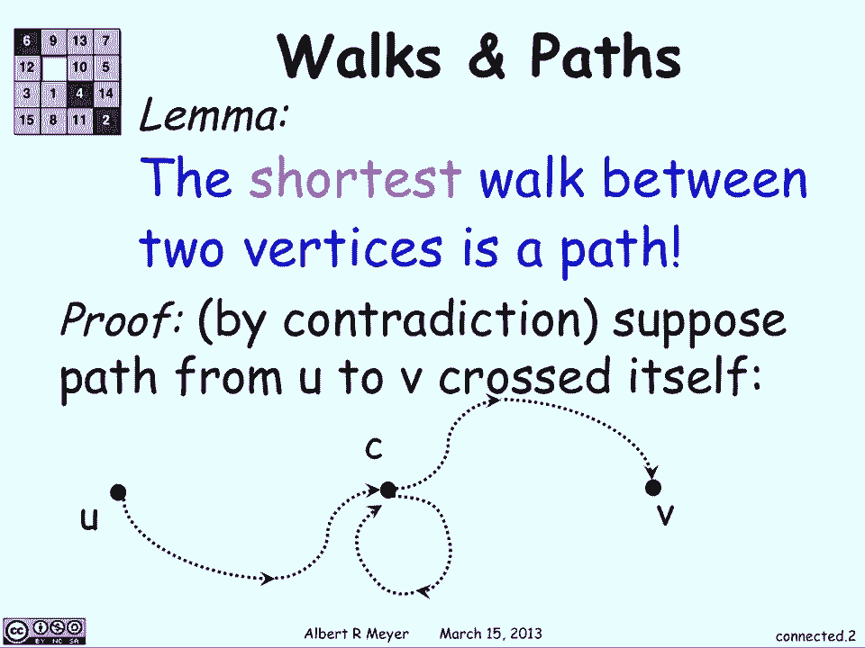

你为什么要经历这个循环，为什么不直接从c到v，所以你所知道的道路，从c回到自身的部分也从u到v，所以如果我们有任何路径穿过它自己，我们可以去掉绕回来的部分，我们还有一段路要走，因此。

从你到V的最短的步行将是一条路径。

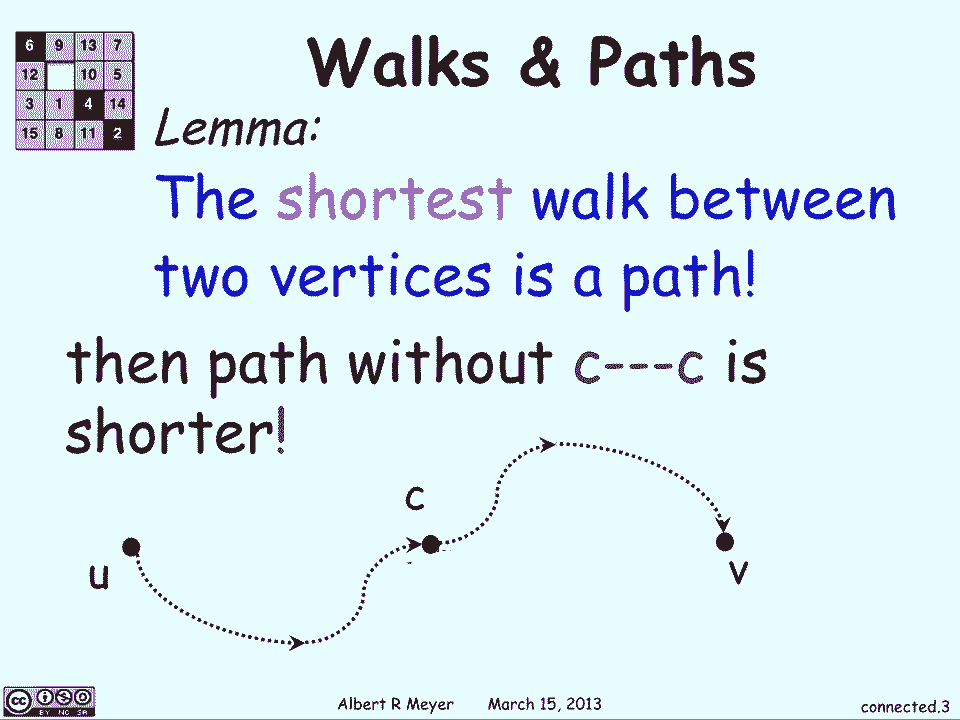

现在我们来讨论n步长关系，这意味着有两个顶点v和w，v和w之间有一个g n关系，如果存在，则存在从v到w的长度n的游动，而g n称为g的长度n游动关系，所以基本上，如果你能找到从V到W的方法，只需N步。

则GNN从B应用于。

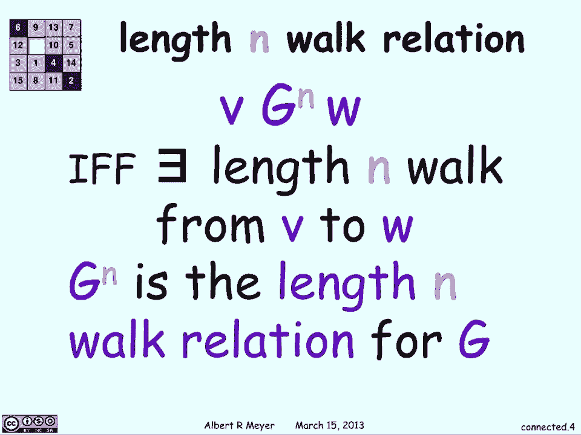

和g本身，当你想到它是一个长度，一次步行，步行关系，你知道图表定义了这些关系，从一个顶点到另一个顶点有一条边，如果有如果有长度，从一个脊椎到另一个脊椎的边缘，你知道它是，现在这个引理对了。

我们说GM和Gn等于Gm加N的关系组成。

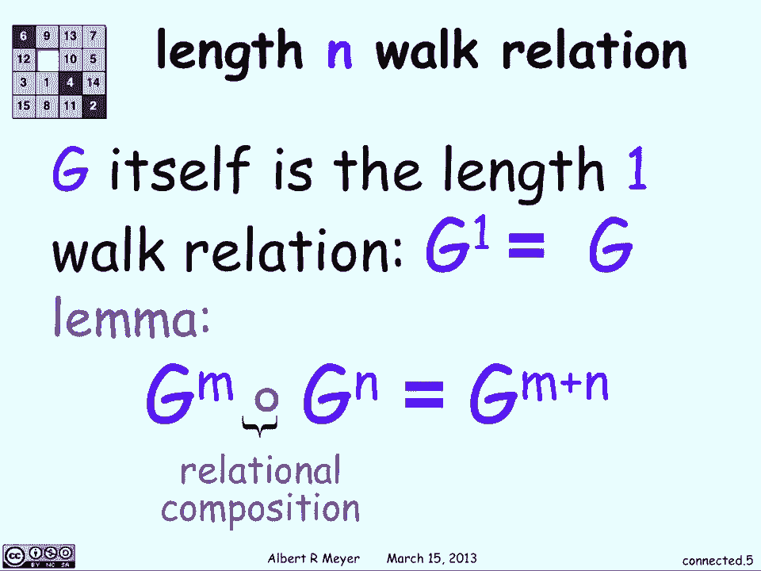

让我们解释一下这意味着什么，所以说，这种关系组成意味着，两者之间的关系组成从x到y，如果有一些脊椎，使得有一条从x到z的路径m，然后一条从z到y的路径n，对呀，从x到z有一些通用应用。

g n从z到y和y，这和gm加n有道理是一样的，就在那里有一条从m到z的路径，在从那里到y的路径长度n上，你只要从x到z和m步，然后z到y和n步，从x到y有n加n步。

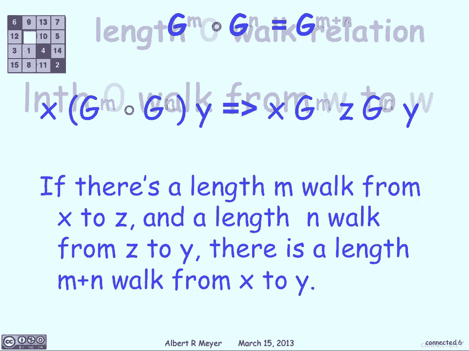

长度零游动关系只是使每个顶点回到自己，就像它指向自己，个人和莱姆仍然是正确的，你知道g 0和gnn的组合就是g n，这是有道理的，你知道一切本身加上g n只是给你g n。

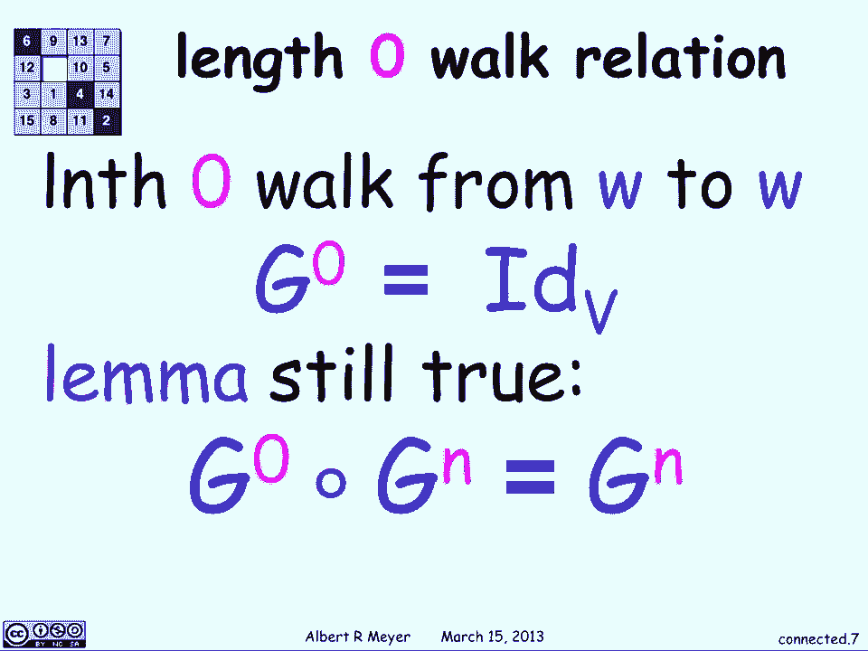

让我们来谈谈矩阵的组成，所以如果我们有g的邻接矩阵，然后我们用一些H做一个作文，然后我们可以通过应用这个布尔值和或矩阵乘法来得到它，你知道的，这些邻接矩阵是1和0，所以我们做矩阵乘法。

但是用布尔运算代替加法和乘法。

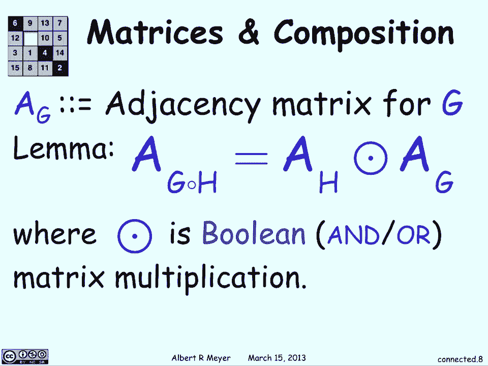

所以我们可以用快速矩阵幂计算n的g，我们怎样才能做好那件事，基本上你可以为g n做两次以上，然后两次每次超过4，在每个右边做布尔运算，所以n的g等于n的g除以2，呃，将此运算符应用于n/2。

所以你每次都可以把它一分为二，所以我们得到了对数的乘积，我们必须做。

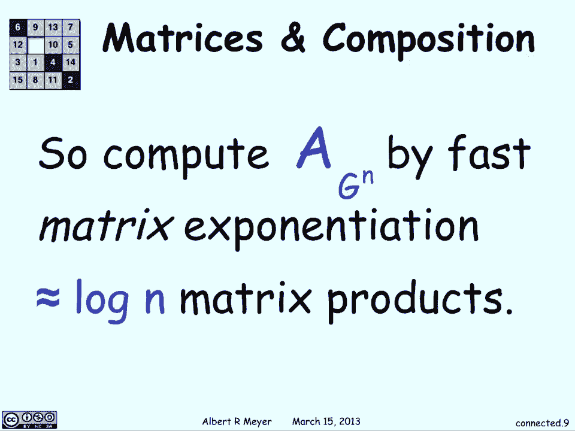

现在让我们定义另一个关系，g星称为g的游走关系，基本上你是一个g星，从u到v，如果有一个散步给你。

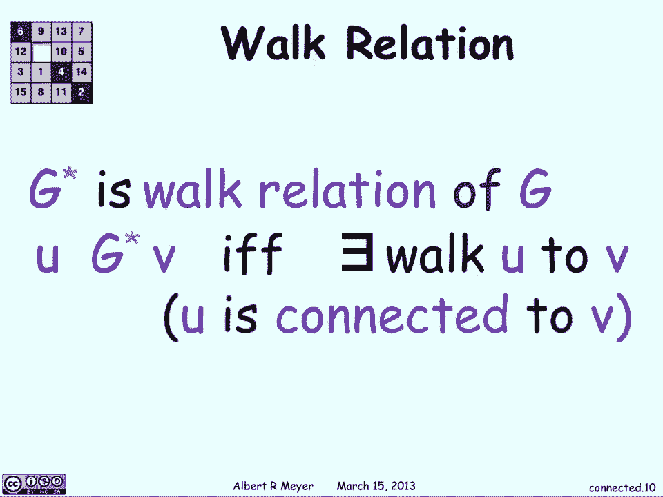

不管有多长，如果你能找到从u到v的方法，那么它适用于。

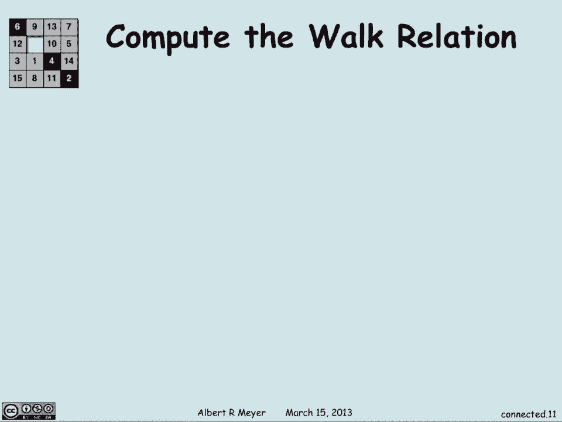

如果我们想得到行走关系，你只需要得到图中的所有内容，并应用self循环，所以在每个verdic中添加一条指向自身的边，我们称这个g小于或等于，基本上是g，然后加上这些g零的自边和自边，g小于等于。

有一个长度和步行，如果g{\displaystyle g}小于等于n{\displaystyle n}，现在想想，如果我能在n-1中从顶点到顶点，或者n减去g中的一些步数。

那么我可以在g内n步小于或等于。

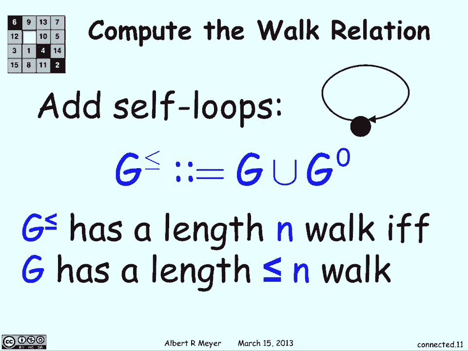

因为我可以绕着它转，如果我想从红色到蓝色，我可以一步就到那里，没有那些自我循环，但是有了自我循环，我可以一直从红色开始，我想要多少次就绕到红色N减1次，然后做最后一步，所以我可以做到，作n个长度。

并对n大于，现在让我们用我们刚才定义的来计算游动关系，所以g有n个顶点，所以路径的长度将小于或等于n对，如果你去，你只是从一件事到另一件事的直线，穿过每一个可能的脊椎，大多数情况下。

你会得到n-1左-右，因为你要穿过n个顶点，所以有n-1条边连接，所以G星，这只是关系，如果有一个从u到v的步行将是这样的，g小于或等于n减去1，所以如果我们得到g小于等于加上所有这些自环。

然后找到所有长度为n减去1的路径，这基本上都是通过的，因为一个G星，g小于等于n减去1，都小于等于n-1，但由于g只有小于或等于n减去1的路径，这只是所有的路径，只是每一首诗，所以我们定义了G星。

这就是我们如何获得所有连接的脊椎，我们可以用n的平方来做这个。

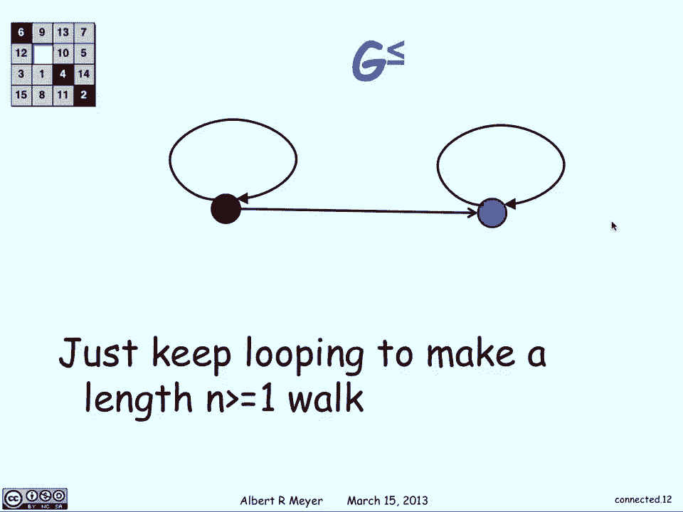