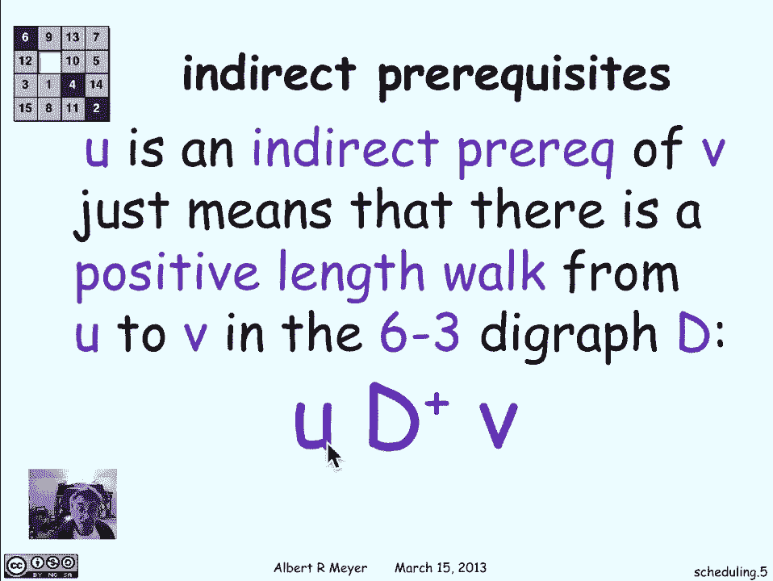
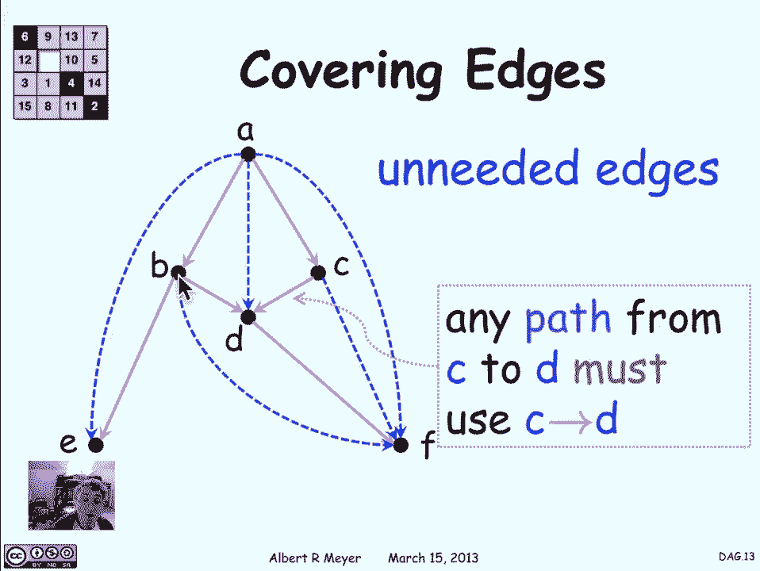

# 【双语字幕+资料下载】MIT 6.042J ｜ 计算机科学的数学基础(2015·完整版) - P48：L2.6.1- DAGs - ShowMeAI - BV1o64y1a7gT

directed acyclic graphs are a special，class of graphs that really haven't。

warrant the theory of their own of，course directed acyclic graphs is a lot。

of syllables so they're called eggs for，short okay so here's where is why they。

come up all the time let's look at a，diagram that may be familiar to you this。

shows the prerequisite structure of，required courses in the 6-3 program of。

MIT electrical engineering and computer，science department there are similar。

charts for the other sub majors of EECS，and in other departments as well so what。

does it mean well let's look at this，vertex corresponding to the first term。

calculus class 1801 and there's an edge，that points to 60 42 and that's because。

if you look at the catalog 6042 lists，1801 as a prerequisite if you look at。

the algorithms introductory algorithms，class six double O six you'll find if。

you look in the catalog that it has，listed two prerequisites 6042 and 601。

and the fact that that they're，explicitly listed in the catalog as。

prerequisites is why there's an arrow，from 60 16 double oh sixty-seven you。

want to take six double 06 of course，it's you have to attend and not just the。

fact that you have to take 60 for to，first and 60 one first but you've got to。

take the prerequisites of those，prerequisites for so you really have to。

take 1801 before you can take six double，06 and you need to take 80 two before。

you can take six double 06 there are，co-requisites here let's just ignore。

those and pretend that they were，prerequisites because they're kind of。

another kind of arrow that don't even，distract us okay so that's what the this。

diagram is telling us and this is a dag，um it's simply a bunch of vertices the。

course labels in in rectangular boxes，and and directed arrows showing catalog。

listings and what I said was that when，you're planning your coursework you're。

really interested in the indirect，prerequisites so one class you is an。

indirect prerequisite of another class，VIII means that there's a sequence of。

requisites starting from you and going，to V it means that you really have to。

have taken you some time before you took，V and that's a crucial fact and think。

that you need to take account of when，you're planning a course schedule so in。

terms of graph digraph language you is，an indirect prerequisite of V just means。

that there's a positive length walk that，goes from u to V in the digraph in this。

case we're talking about the 6-3 digraph，of prerequisites so there's a positive。

length walk from 1801 to six double 060，means that you really have to have taken。

1801 before you take six double o 6 and，of course we're talking then about the。

positive length walk relation the plus，of the digraph d if d is the digraph。

shown in the prerequisite your direct，prerequisite chart then we're interested。

in D plus and you d plus V just means。

there's a positive length walk that's。

what the plus is for going from u to V，now what happens if you have a closed。

walk well a closed walk is a walk that，starts and ends at the same vertex um。

and we can ask this question suppose，there was a closed walk that started at。

60 for two and end in it 60 for two how，long does it take to graduate then well。

it takes a long time because you can't，take 60 for two until you've taken 60。

for two and you're never going to be，able to take it that's a bad thing we。

definitely don't want the prerequisite，of structure of courses in the。

department to have a closed walk of，positive length and in fact there's a。

faculty committee that checks for this，kind of thing it bugs like this。

occasionally creep in when some busy，curricular office of a department is。

planning a complicated program with，dozens if not 100 courses and the。

committee on curriculars job is to check，for that kind of thing this whole staff。

it does it I used to be the chair of，that committee and we did spend a lot of。

time with proposals from departments and，making sure that those proposed course。

requirements satisfied faculty rules，okay so a special case of a closed walk。

is a cycle a cycle is a walk whose only，repeat vertex is it start and end and。

and let me remark because we keep，talking about positive length cycles。

that a single vertex will by itself is a，length zero cycle so you're never going。

to be able to get rid of length zero，cycles cause the same they're the same。

as vertices but positive length cycles，you can hope to ensure are not there so。

if you're going to represent the cycle，as a path you'd show the sequence of。

vertices and edges v-0 v1 v2 where the，understanding is that all of the。

vertices from v-0 up to VN minus 1 and，different that's what makes it a cycle。

except that the last vertex V 0 is a，repeat of the first one that's the one。

repeat that's allowed in a cycle so it's，naturally draw it in a in a circle like。

this where you started v-0 you follow，the edges around from VI tu VI plus 1。

all the way back around to v-0 and，that's kind of what a cycle is going to。

look like so we have a very，straightforward lemma about cycles and。

closed walks namely that the shortest，positive length closed walk from a。

vertex to itself it's closed means it，starts and ends at V is a positive。

length cycle starting and ending at V，and the reasoning and proof is basically。

the same proof that said that the，shortest walk between one place and。

another is a path from one place to the，other the logic is that if I have a。

closed walk from V to V and there was a，repeat in it other than at V I could。

clip out the piece of the walk between，the repeat occurrences and I'd get a。

shorter walk so the close the shortest，closed walk can't have any repeats it's。

got to be a positive ones cycling so it，directed acyclic graph now is defined。

simply as a positive as a digraph that，has no positive length cycles it's a。

cyclic no positive length cycles and of，course we can equally well define it。

since cycles or a special case of closed，works and closed works of positive。

length employ cycles as a digraph that，has no，positive length closed walk some。

examples of tags that come up well the，prerequisite graph um is going to be one。

and in general any kind of set of，constraints on tasks that you have to do。

which ones you have to do before you do，other ones is going to be defining a a。

dag structure a one that you might not，have thought of is the successor。

function defines a relation on the，integers say going from n to n plus one。

so I'm going to have an arrow that goes，directly from n to n plus 1 and what's。

the work relation then the positive，length walk relation in this graph well。

there's a positive length walk from n2m，precisely when n is less than M so the。

successor dag its pads represent the，less than relation and of course less。

than it doesn't have any cycles because，if a is less than B you're never going。

to get around from be back to something，that's less than it like back to a so。

there can't be any cycles in the，successor dag and that's why it is a dag。

another similar one is the proper subset，relation between sets so here I'm going。

to draw an arrow from this set to that，said if this set is contained in that。

set and but they're not equal so a B is，a subset of a BD but but a BD has this。

extra element D so the left-hand set is，a proper subset at the right hands said。

and I'm going to draw an arrow there and，by the same reasoning there can't be any。

cycles in this graph positive length，cycle because if there was it would mean。

that the the set had to be a proper，subset of itself which doesn't happen so。

this would be another basic example of a，dag and you know I hope you begin to see。

from these examples why the eggs are，really or pervasive and in mathematics。

and in other areas and why they merit，attention so when we're looking at a。

deck though we're basically usually，interested in just the walk relation of。

the deck so that if we're only，interested in the walk relation of the。

deck then I it would be typically the，to have，same work relation and it's natural to。

ask what's the most economical one is，there a minimum say dag that defines a。

give and walk relation so let's look at，this example here's a simple tag and you。

can check that there are no cycles in it，um what's the smallest dag with the same。

relation as this one and the way I can，get it is by going through the edges one。

at a time and asking whether I can get，rid of the edge because it's not。

contributing anything so look here，there's a path from a to b to e that。

goes through be well that tells me that，having this direct edge from A to E is。

not contributing anything in terms of，connectedness and that means I could get。

rid of it and I'm still going to wind up，with the same possibility of walking。

from one place to another because I can，always walk from A to E going through be。

instead of going directly from 80 I，didn't need that edge another example is。

here's a walk from A to D that goes，through see there's no need for me to。

walk directly from A to D as long as I'm，walking I can take the longer walking。

and get rid of the short circuit from A，to D likewise if i look at this path。

from C to D to F I don't need that edge，from C to F and as a matter of fact now。

if I look at this length 3 path from A，to C D to F there's no need for me in。

order to get from A to F there's no need，for me to take the direct edge I can get。

rid of that too it's kind of a redundant，extra edge finally if i look at the path。

from B to D to F I can get rid of the，direct edge from b2f and at this point。

i'm i'm done i'm left with the set of，edges called covering edges which have。

the property that are the only way to，get from a one vertex to another is。

going to have to be to use a covering，edge to the target vertex or more。

precisely the only way to get from safe，from A to B is going to be to use that。

covering edge if there was any other，path that meant from a elsewhere and got。

back to be without using this edge then，it wouldn't be a covering edge anymore。

the fact that it's a covering edge means，that if you broke it there's no way。

anymore to get from A to B so that's the，definition of covering edges。

do a class problem about them or，precisely in minutes so the the other。

edges are unneeded to define the walk，relation and all we need to keep on the。

covering relations to get the minimum。

