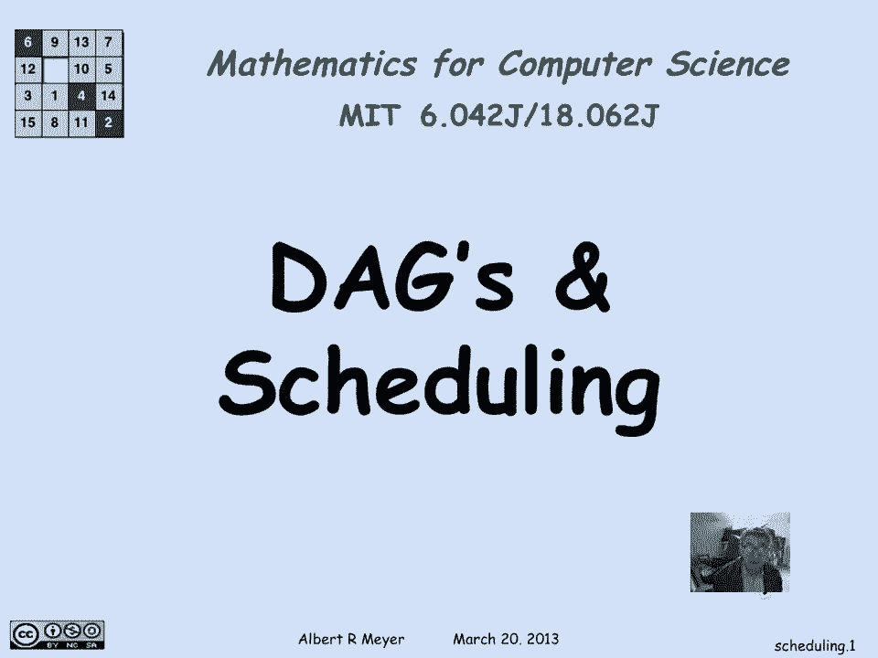

# 【双语字幕+资料下载】MIT 6.042J ｜ 计算机科学的数学基础(2015·完整版) - P49：L2.6.3- Scheduling - ShowMeAI - BV1o64y1a7gT

所以我们在上一期视频中看到，为什么如果用图表表示课程之间的调度约束，这很关键，那张图表实际上是一个DAG。

现在让我们来看看这个调度问题，更详细地由DAGS表示，这是一个课程选择的图表，六个先决条件，有些已经过时了，但它们的目的是作为一个说明性的例子，这里的小箭头指示图表中的箭头，所以这告诉我18。

零一在目录中被列为立即的先决条件，六零四二，嗯，十八零一也是十八零二的直接先决条件，嗯，六双O一是，和6double-o-4都是6zero-three的先决条件，和六零四六的二，哦四六。

六零四六六八四十，所以我们在这里看到了我之前提到的间接先决条件问题，也就是，尽管唯一列出的作为6440先决条件的东西，目录是六零四六，事实上，为了拿六零四六，你必须拿6-0-4-2。

所以6-0-4-2是6-8-40的间接先决条件，所以在图语言和路径语言方面，科目，u是v的间接先决条件，当从u到v有一个正的长度路径时，在描述类之间先决条件结构的图表中，嗯。

它只是意味着使用我们的r加符号，是有向图的正长径关系还是二元关系，r，它只是表示u r加v，它被读作从u到v有一个正的长度路径，现在，我们将要研究的一个关键想法。

所以最小主题的定义是一个没有先决条件的主题，大一的科目没有箭头，所以什么都没有进来，在前面的图表中，就是18点1分，八，零，二和六，双O一，让我说说这个有趣的术语Minimi是从哪里来的，是因为。

另一种谈论DAG的方式是用秩序关系之类的东西，称为偏序，我们很快就会看到，嗯，所以你认为后面的科目比前面的科目大，所以一个最小的主题是一个没有比它更少的主题，嗯，现在可能有几个最小的主题。

因为可能他们两个都不比另一个少，但是没有比1801更少的了，在1801年之前没有别的科目你必须修，这就是极小的定义，没有比这更小的了，现在你可以问一些最低限度，你可能更熟悉最低限度。

意味着它面前不仅什么都没有，但它高于一切，它将是间接先决条件链中所有可能的主题中最早的一个，在这个例子中没有任何，但它实际上曾经在麻省理工学院有一段时间，我们尝试给一个迎新周的暑期作业。

那是新入学学生的暑期作业，为了让他们在迎新周上一门课，在书中，他们讨论了一些他们事先被分配阅读的书，把新生社区团结起来似乎是个好主意，但事实证明是不可持续的。

因为他们找不到足够的教师和其他人愿意举办这些研讨会。

所以麻省理工学院不再有最低限度的科目。

所以让我们再看看先决条件，并讨论如何进行调度，我们要做的第一件事就是，正如我所说，识别最小元素，有我们提到的三个，我们将从，决定在第一学期选这三个，所以我们要用，基本上就是所谓的贪婪策略。

我们将在任何学期尽可能多地拿东西，考虑到限制，这样我们就可以在第一学期选修所有新生的科目，因为他们没有先决条件，下一步就是把它们处理掉，因为他们已经安排好了，这样我们就可以摆脱1801年发生的所有事情。

八零二和六二零一，不仅这里还有其他事件，在那里，十一点是事物的先决条件，所以他们都走了，我们得到一个简化的图表，我们现在去掉了最小的元素，在新的图表中，现在有一些以前不是最小的东西，但现在很少了。

这些是新的极小元素，我们可以识别那些，这里有五个科目，那里有一个，现在没有更多的先决条件，这些是第二级的最小元素。

我们接下来要安排他们，所以这些都是我们可以学习的科目，我们已经把第一组最小主题带到了第二级最小主题，我们将把它们安排在下学期，这是我们的，同样地，当你删除这些家伙的时候，然后你发现六零，四，六。

6个2O4是最小的现在可以把，因为他们所有的先决条件都得到了满足，所以我们把他们安排在第三个学期，在第四学期用同样的推理，和第五任的六八五七，通过这种特殊的方式获得了我们完整的学期时间表，当然有。

许多其他的安排方法，但这是一种特别有序的方式，策略又是贪婪的，你在一个给定的学期里尽可能多地拿东西，现在，当你谈论时，会出现一些概念，值得介绍的时间表，其中一个是反链，安迪·链在，在这个特定的例子中。

指一组科目，其中没有间接的先决条件，它们可以以任何顺序拍摄，因为你有没有吃并不重要，当你考虑再次用技术语言学习其他人时，被认为有一条路的想法所激励，好像它小于或等于某物，这些都是无与伦比的元素。

两者都不小于或等于另一个，所以就路径关系而言，u是v无法比拟的，当且仅当没有从u到v的正长路径，没有正长，从V到U的路径。

所以让我们来看看一些反链，定义它的部分要点是，我们选择了反链作为我们每个学期的时间表，所以没有先决条件的新生科目显然，他们中间没有路，因为根本没有通往他们的路，所以他们是一个反链。

我们选择的下一个级别是第二级最小元素，只有作为先决条件，原始的极小元素，所以当然没有一个是其他的先决条件，这是另一个反链的例子，当然第三层第四层第五层都是反链，但并不是所有的反链都在我们的时间表中。

例如，这里有一个斜躺反链六八四，六二○四和六零三四之间没有路径，所以事实上有可能同时服用它们，因为你可以把他们的所有先决条件都放在左上角，然后把他们三个，所以这就是这里的反链的意思。

所以技术上的定义是它们之间没有路径，但在课程安排方面，这意味着有可能把它们放在同一个术语里，如果你满足了他们所有的先决条件。

这是可能的，嗯，那么让我们询问一下可能的各种调度模式，我们发现了这个特别的绿色的，在那里我们每学期尽可能多地拿东西，但是假设我每学期只选一门课，我正要去，我在外面有工作，我太忙了。

不能上一个学期以上的课，如果麻省理工学院会让我磨蹭这么久，那正是我想做的，所以说，我能这么做吗，是啊，是啊，当然，只要把所有最小的元素按任何顺序排在第一位，一个，两个，三个，然后安排五个，第二级。

下一层和第三层的最小元素，以此类推，完全有可能，然后把我们找到的时间表修改成时间表，每学期只选一门课，当然还有，你只选一门课，在你接受了所有间接和直接的先决条件之后，这称为拓扑排序，再次。

排序词来自于认为有一条路径的动机，小于或等于关系，所以我们按大小的顺序排列东西，十八个是，在这种情况下，六分之一的最小元素。

八，五个，七个元素列表中最大的一个，从技术上讲，链是一种叫做反链的对偶的东西，链是一系列必须按顺序进行的主题，也就是说，这些主题，对于他们中的任何两个，你知道哪个先来，那是他们中的任何两个人之间的。

有一条路在一条路上，或者另一个，当然是狗，所以它们不可能是两个方向的垫子，所以链只是一组可比较的元素，这意味着它们必须按顺序服用，这里有一些链子这条链子被画成了一条垂直的链子，里面有五道菜，这里有一个。

这里有一个垂直的四链，并不是所有的都是垂直的，这里有一条链子，你必须先拿18。1，然后再拿18。1，哦三，在你拿六双四之前，所以它们形成了一个链条，重要的是要认识到这是一个有五个主题的链。

但是链不一定要有所有可能的元素，它仍然是一条链子，即使它只有这三个科目，因为有一条从8 0 2到6 2 0 4的路径，和一条从62。4到68。5 7的路径，嗯，最大长度链。

尽可能完整的链条在理论上很重要，所以这是一个最大长度链，这里最长的链子有五根长，现在它不是唯一的，这里还有一个长度为5的链条，如果你去找它，但没有一条链子的长度超过五条，有一个长度为五的。

这就引出了一个问题，它需要多少个术语，毕业，嗯，我们看到你可以在五分钟内毕业，但考虑到有一个最大长度为5的链，意思是你不能用更少的时间做，因为这五门课必须连续上，每一个。

第三个必须在前两个被选后的一个学期内被选上，第二个必须在第一个之后，如果你有任何大小的链子，实际上，毕业的学期数至少要和这个链条一样大，这意味着它必须至少和最大尺寸链一样多的项，所以五个术语是必要的。

我们看到用我们贪婪的最小策略，你总是可以在最大链长的情况下做，所以五个也足够了，这是规定你每学期可以选修不限数量的科目，记住我们的策略，分五个学期毕业，就是每学期尽可能多地选修科目。

所以有足够的方法在五个学期内选修科目毕业，当然，一个结果是，在我大一的第二学期，我上了五门课，因为有可能，但这给我留下了一个沉重的术语，与这里的一个有两个主题的术语相比，最后有一个只有一个主题的术语。

所以有可能，事实上，在某种程度上调整了术语负载，让我们把1802转到第三学期，那样做是完全可行的。因为我将满足十八零的所有先决条件，第一个学期后两个，但我不一定要在第二学期上，让我们把它关掉。

所以现在我把第二学期的负担减轻到了四门课，在一定程度上增加了负荷，我不得不在第三学期的某个地方做三门课，所以现在我一学期最多选四门课。

事实上，如果你摆弄，你实际上可以找到毕业阶层时间表，每学期只能选三门课。

