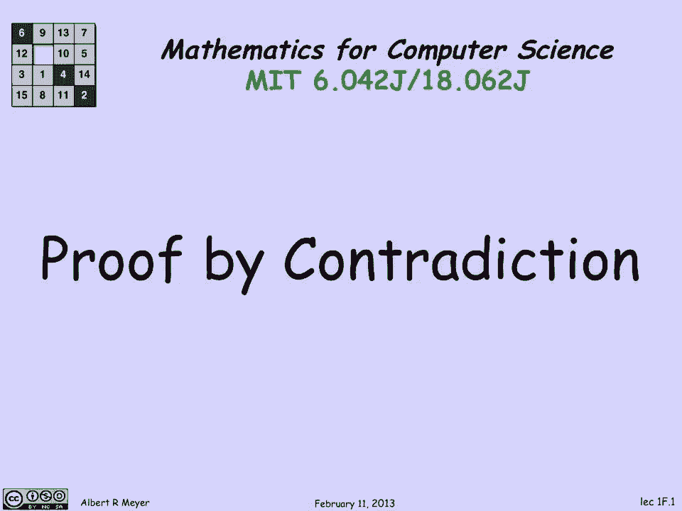
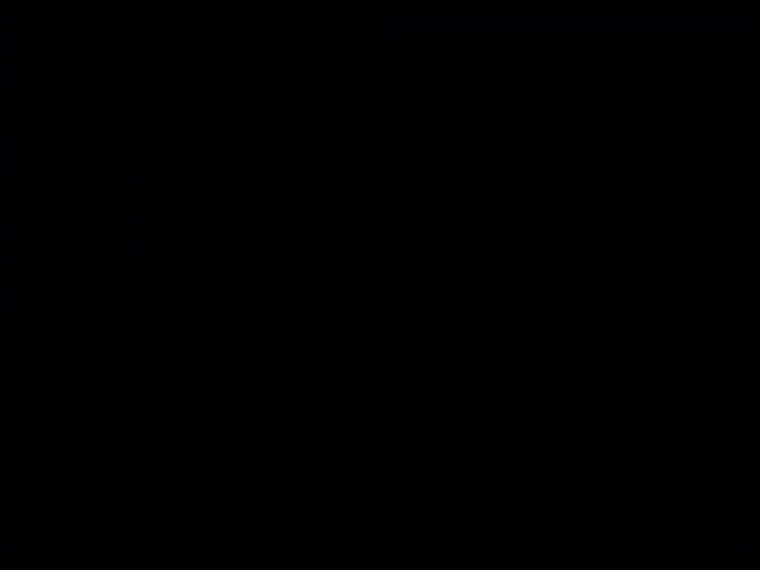
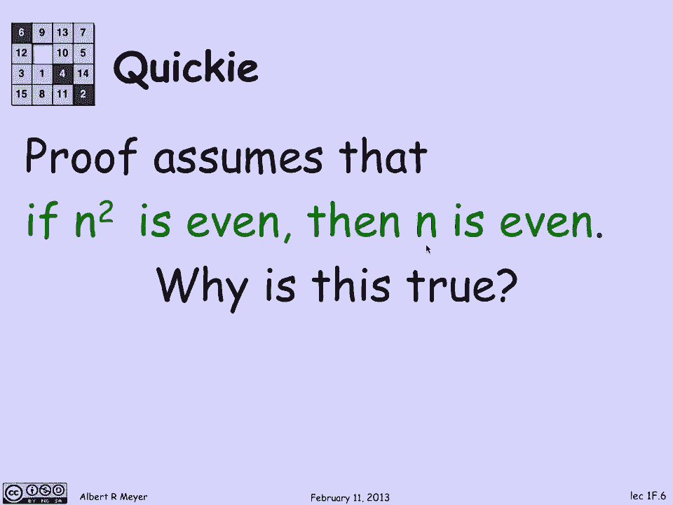

# 【双语字幕+资料下载】MIT 6.042J ｜ 计算机科学的数学基础(2015·完整版) - P4：L1.2.1- Proof by Contradiction - ShowMeAI - BV1o64y1a7gT

你是否真正了解某事是值得怀疑的，如果你不能解释为什么这是真的，这就是数学和计算机科学中的证明，所以说，我们将讨论证据，我们试图理解的许多事情，特别是，我们将研究一种现在被称为矛盾证明的证明技术。

这可能是如此熟悉，以至于你从来没有注意到你在使用它，现在我们要呼吁明确的注意它，并思考它。

所以让我们做一个例子，先来看看发生了什么事。

假设我想证明，一千三百三十二的立方根小于，或等于十一，或者更准确地说，假设我不知道，我在问这个问题，是一千三百三十二的立方根，小于等于十一，嗯，一种方法，那就是，简单地计算1332的立方根。

这是一个小麻烦，但可以管理，但是有一个，弄清楚如何计算第四位数字的平方根，四位数的立方根，让我们假设这个不等式是真的，那就是一千三百三十二的立方根小于，或等于十一井，如果那是真的。

那么我能做的就是暗示双方，我的结论是一千三百三十二小于等于，现在11个立方，11和立方比计算要容易得多，一千三百三十二的立方根，事实上，十一的立方是一千三百三十一，等一下。

我刚得出一千三百三十二比一千少的结论，三百三十一，那显然不是真的，这意味着我认为这种不平等存在的假设是没有意义的，它导致了这种直接的矛盾，这意味着事实上这种不等式并不成立，我现在已经明确无误地，和。

我希望，清楚地证明了，1。一千三百三十二的立方根大于十一，尽管我们从来没有真正计算过，一千三百三十二的立方根，哦，这是一个玩具和头脑简单的例子，用矛盾来说明证明，所以让我们退后一步，解释一下它是什么。

如果一个断言暗示了错误的东西，那么断言本身一定是假的，这就是这里发生的事情，如果你一步一步地推理，你的每一步推理，1。你的理由很充分，这意味着如果你有真实的东西，然后你一步步从中得出结论。

你得出的结论也是正确的，那么如果你一开始就假设，你一步一步地证明事情，以一种保持真理的方式，你得出了错误的结论，你一开始做的一定是假的，这是不可避免的，否则你完成的事情就会是真的，好的，嗯。

让我们看一个真实的例子，几千年前古希腊人就知道了一个惊人的事实，也就是2的平方根是不合理的，现在，让我们记住有理数是一个分数，有理数是整数的商，我们要证明的方式，二的平方根不是整数的商，假设是这样。

让我们假设2的平方根是一个有理数，这意味着我们有没有公共素因子的整数n和d，使2的平方根等于n/d，我在这里做的是，我是说2的平方根是超过d的分数，我们知道你总是可以把分数降到最低。

这意味着没有共同的因素，所以让我们把它做完，2的平方根等于n/d，没有同时除n和d的素数，从这个假设，我要向你证明n和d都是偶数，这当然是一个直接的矛盾，因为n和d也有一个共同的因子。

所以我所要做的就是得出2的平方根是，和你的有理数，这不是一个分数，就是向你证明n和d都是，即使2的平方根等于n/t，我们就这么做吧，我们将从什么开始，我假设，2的平方根是n/d，让我们去掉分母。

所以让我们把两边乘以d，得到2乘以d的平方根等于n，现在我们把2的平方根去掉，通过两边的平方，我得到了两个，d的平方等于n的平方，那太好了，因为你看，左手边可以被2整除，这就意味着n的平方可以被2整除。

但如果n的平方是偶数，那么n是偶数，我已经走到一半了，我已经证明分子是均匀的，我们现在继续走，因为n是偶数，等于某物的两倍，所以n是某个数的2k，k，我不在乎，K是什么，嗯，让我们。

并得出n的平方等于4k的平方，我为什么把它平方，这样我就可以把这里和方程联系起来，另一个关于n的平方的方程，n的平方是两个d的平方，我得到的是2d的平方等于4k的平方，当然我可以取消两个。

得到d的平方等于2k的平方，一次又一次，我的右手边可以被2整除，所以左手边可以被2整除，d的平方是偶数，因此d是偶数，我们已经完成了声称的证据，和D都有两个作为共同因素，与他们是最低条件的事实相矛盾。

我确实假设了一些事情，很明显，即如果n的平方是偶数，那么n是偶数，为什么这是真的，嗯，你可能会考虑一会儿，有一个简单的方法可以看到它，这是一个矛盾的证明，我们将使用一个你可以很容易地验证的事实。

通过做一点算术，即两个奇数的乘积是奇数，让我们假设如果两个奇数的乘积是奇数，如果我告诉你n的平方是，即使假设N甚至不好，这意味着这很奇怪，但这意味着n的平方是奇数，与n是偶数的事实相矛盾，因此。

假设n是奇数是矛盾的，一定是均匀的，这是一个特殊的证明，与均匀性和奇数性有关，有一个更普遍的方法来理解这一点，实际上会派上用场，也就是说，我所知道的是，数字以一种独特的方式计入素数。

所以如果我告诉你n的平方是我所知道的，n的平方是所有除n平方的质数都来自n，所以如果质数中有一个2除以n的平方，它必须是一个二，那是n的素因子之一，那就管用了，即使我们如果我告诉你n的平方可以被3整除。

它将遵循n可被3整除的推理，这是一个强有力的事实，我假设整数的素数因式分解，一点也不明显这是真的，虽然这很熟悉，可以假设，几周后，我们将回顾如何仔细地证明，但现在可以假设，我们也有一个简单的论点。

它基于偶数和奇数的性质，如果n的平方是偶数，那么n就是偶数。

这是证据中的最后一个空白。