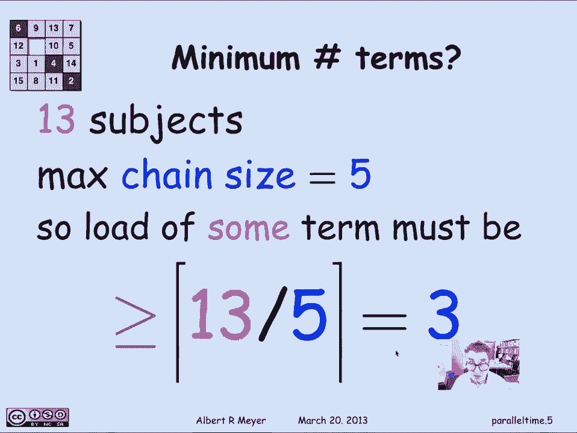
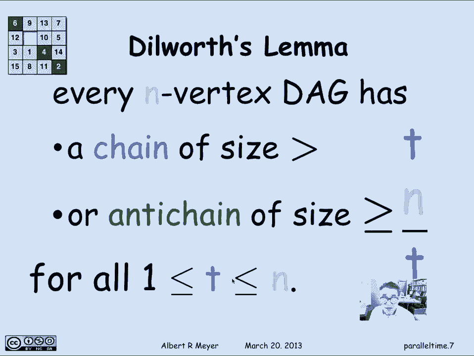

# 【双语字幕+资料下载】MIT 6.042J ｜ 计算机科学的数学基础(2015·完整版) - P50：L2.6.5- Time versus Processors - ShowMeAI - BV1o64y1a7gT

用术语安排课程的例子，实际上是一个一般问题的特例，你可能会看到，在约束下调度一堆任务或工作，其中哪些必须在其他之前完成，这是一个在许多应用程序中出现的主题，但你可以看到计算机科学中的应用。

其中一部分可以平行完成，其他部分必须按顺序完成，因为后来的结果依赖于早期计算的结果，它将我们引向并行调度的一般讨论。

我们已经从这个例子中得出了一些理论，也就是说，如果我们看看毕业的最低学期数，这对应于最小级数，或者处理一堆任务所需的最小时间，假设你可以并行执行任务，你需要多少平行，允许的并行度没有限制，那样的话。

我们能说什么，一组受限任务的最小并行时间，简单地说，就是约束图中的最大链大小，我们看到了课程先决条件的例子，我们有五个，一般来说，这就是定理，最小并行时间正好等于图中链的最大变化大小。

这限制了现在可以完成任务的顺序，最大期限负荷是多少？嗯，这与您需要的处理器数量相对应，并行地做任务，所以对于课程安排示例，意思是你一个学期能修多少门课程，但是如果你说做计算，您需要多少个独立的CPU。

以便能够充分利用，并行性尽可能多地并行，并且在最短的时间内需要大量的处理器。

就是最大反链尺寸，那个，在示例中，上次关于课程安排的会议，原来一个学期有五门课，这实际上是最大的反链尺寸，所以这是您需要的进程数量的上限，实现最短时间所需的处理器数，但实际上这是一个课程上限，因为。

尽管实现最小并行时间所需的处理器数量最多。

最大防链尺寸，事实上，在前面的例子中，事实证明，你可以通过三个过程逃脱惩罚，有可能安排受试者，所以你一学期只修了三门课，但还是在最短的时间内完成了。

那么你能做得比三门课更好吗，有一个琐碎的争论说不，你不能，因为在前面的例子中，我们有13个科目要安排，最大链条尺寸为五个，所以这意味着你必须在五个学期中分配这十三个科目，必须有一些术语。

至少有平均数量的主题，就是十三除以五，所以这意味着必须有一个术语，十三除以五门课的学期，当然你要四舍五入，因为它必须是一个整数，所以最大，所以完成和毕业的最低学期数。

在五个学期内完成这十三门学科就是三个。

因为十三除以五，四舍五入是三个，这是一个普遍的现象，我们可以说，如果你有一个有n个顶点的DAG，最大的链条尺寸是C，所以这是它最多可以有多深，最大反链尺寸为，这是你能并行做的最多的事情，那么很明显。

顶点的总数最多是c乘以a，所以你可以完成的任务总数，最多使用一个处理器的c步骤以c乘以a为界，所以这告诉你，你不能同时拥有反链尺寸，而且变化的大小太小了，因为他们的产品必须至少是n，可以改写的。

作为一个小引理，它归功于一个叫迪尔沃斯的人，迪尔沃思实际上以迪尔沃思定理而闻名，其中这个Dilworthlemma是一个特例，但我们不需要一般定理，Dilworth引理说，如果你有一个n顶点DAG。

然后对于任意数t，它要么有一个比T大的尺寸链，或者它有一个大小大于或等于n/t的反链，我们在上一张幻灯片上证明了这一点，这两件事的乘积至少要，一般情况是t乘以n除以t大于等于n。

这适用于1和n之间的所有胶带。

让我们想一个简单的应用。

如果我从改变大小中选择平衡反链大小的T，那么我选择t为n的平方根，所以在这里我有n的平方根，这里我把n除以n的平方根。

也是n的平方根，我们可以得出的结论是，每个n个顶点标记都有一个大小链，至少n的平方根，或者一个反大小链，n的至少平方根，这实际上有一些应用程序，但我们只是要看看这个的一个有趣的应用程序。

你必须有一个大小的链或反链，n的至少平方根，你可能只有其中一个你可能两者都有。

但其中一个或另一个必须至少和n的平方根一样大，嗯，让我们想一个新的DAG，我要构造如下，我要在班上的学生之间取得优势，我会认为一个学生比另一个学生有直接的优势，嗯，如果第一个学生又矮又小。

实际上是指不比另一个高也不比另一个老，让我们只说短，意思是更短，或者可能是相同的高度，年轻，或者可能同龄，所以规则是，如果我认为一个学生是以他们的矮小为代表的，他们的年龄，然后一个身高的学生。

一个有一个直接箭头指向另一个有身高的学生，It’s two and h a two，前提是这对夫妇，第一对在两个坐标中都小于或等于第二对，s 1小于等于s 2，1小于或等于2，我们这里不需要领带。

因为这会破坏DAG的属性，如果我有两个年龄和身高完全一样的学生，所以让我们假设我们用微秒来测量年龄，高度以微米为单位，带着那种细腻，平局的可能性很低，然后它又变成了一个DAG，嗯。

所以这就是拿DAG的定义，由成对的，身高有一个纯粹的达格，有一个纯粹的年龄达格，我把它们组合成一对，我得到了一个新的DAG，通过查看坐标在一起的行为，这叫做乘积图，这是一个一般的结构。

我们将更多地讨论当我们重新检查DAG时，在关系和偏序语言的语境中。

无论如何，这是产品图，根据迪尔沃斯引理，在像我们这样有141名学生的班级里，这意味着我们将有一个链或一个反链，在这个大小的产品标签中。

一百四十一的平方根四舍五入或十二，那么什么会，根据迪尔世界艾玛，在这个特定的年龄身高图中，这是一个反链意味着什么，假设我带一群学生，我把它们按大小排列，用更大的，左边最高右边最矮，如果这将是一个反链。

这意味着它们必须随着变矮而变老，因为如果我有一个案子，右边的人比左边的人又矮又年轻，它不会是一个反链，因为他们会有可比性，所以这是一个如此的反链，根据迪尔沃斯引理，如果你按身高对学生进行排序。

他们必须随着变矮而变老，如果是链子，他们会变得更年轻，因为他们变矮了。

但更有趣的是当他们得到，是这个高度生日示例中的反链，所以我们应该好好看看，在这门课上，我们要么有一条链，要么有一条反链。

根据这个产品甲板，事实上，我们真的有一个反链条，这里有十几个学生的快速名单，事实上，如果你看看生日，有一个六一岁的人是94年8月出生的，然后是一个出生于94年4月6岁的人。

一直到一个出生于1991年的人，谁有五英尺高，所以我们很幸运，我们只能有链子，但我们实际上有反链。