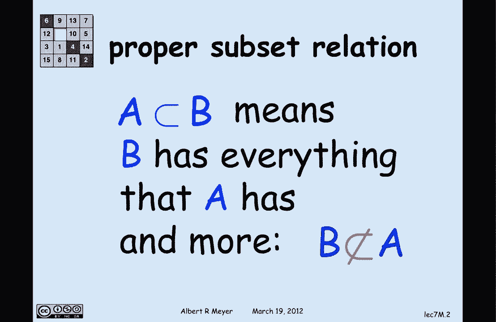
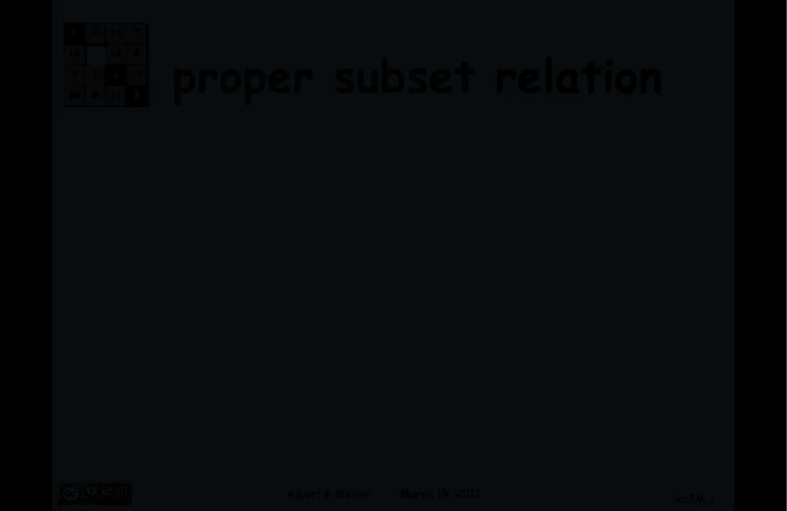
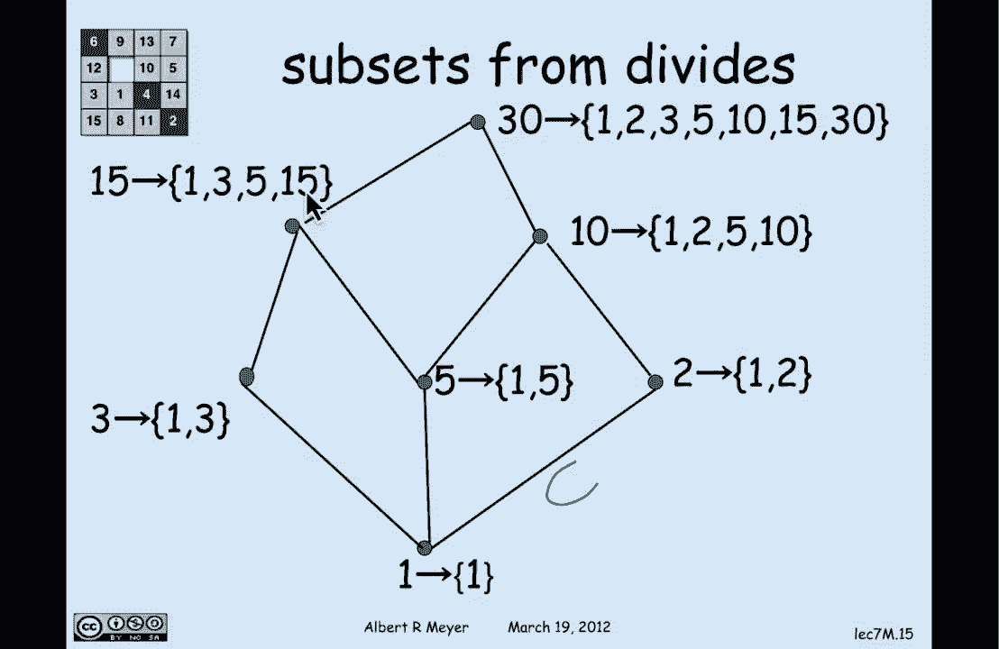

# 【双语字幕+资料下载】MIT 6.042J ｜ 计算机科学的数学基础(2015·完整版) - P52：L2.7.3- Representing Partial Orders As Subset Relations - ShowMeAI - BV1o64y1a7gT

so we've seen that partial orders are a，set of axioms that capture the positive。

path relation or the arbitrary past，relation in directed acyclic graphs or。

decks but there's still another way to，understand these axioms that gives a。

kind of representation theorem for the，kinds of for a kind of mathematical。

objects that are partial orders and that，every partial order looks like so let's。

look at that example I'm interested in，the proper subset relation a is a proper。

subset of B which you remember means，that B has everything in it that a has。

and something extra so in particular。

since B has something extra B is not a，subset of a certainly not a proper。

subset of a so let's look at an example，of that here are seven sets and the。

arrows indicate the proper subset，relation or more precisely the positive。

path relation in this graph represents，the proper subset relation where arrows。

are understood where edges are an，understood to be pointing upwards so。

I've left out the the arrow heads this，is also known as a Hassad aya Graham。

where the height is an indication of，what you of which way the arrows go so。

if arrows are pointing up this is，telling me that for example this set of。

two elements one in five because there's，a path up to the top set the top set has。

everything that this lower set has，namely the top set has one in five and。

it's got extra stuff 1 the set，consisting of just 1 is a proper subset。

of 1 in 5 because the set has 1 in it，but it has an extra thing 5 and also。

there's a path from 1 up to 1 2 5 10，because 1 2 5 10 has a 1 in it and extra。

stuff so that's what the picture is，illustrating the proper subset relation。

on this particular collection of seven，sets now let's look at a very similar。

example of the proper divides relation，on some numbers so proper divides means。

a properly divides B if a divides B and，it's not equal to B and I'm interested。

in the proper divides relation on this，set of seven numbers 1 2 3 5 10 15 and，30。

now there's a path from five to thirty，because five is a divisor of thirty and。

it's not equal to thirty it's a proper，divisor of thirty and of course the。

point of this picture is to show that，the proper divides relation on these。

seven numbers has exactly the same shape，as the proper subset relation on those。

seven sets so there's the seven sets and，their proper subset relation shown by。

the picture followed by the proper，divides relation on this set of seven。

numbers and the precise notion or sense，in which these things have the same。

shape obviously they can be drawn and，one superimposed on the other but。

abstractly what we care about with，partial orders and diagraphs in general。

is when things are isomorphic is the，technical name for the same shape and。

isomorphic means that all we care about，are the connections between。

corresponding vertices to graphs where，the vertices correspond in a way that。

where there's a connection from between，two vertices there's also a connection。

between the corresponding vertices are，isomorphic and the precise definition of。

isomorphic is that rice and morphic when，there's an edge preserving matching。

between their vertices matching means by，jek ssin and the formal definition is g1。

is isomorphic to g2 if and only if，there's a bijection from v1 the vertices。

of G 1 to V 2 the vertices of g2 with，the property that if there's an edge。

between two vertices U and V in the，first graph then there's an edge between。

the corresponding two vertices F of U，and F of V in the second graph and。

that's an if and only if relation，there's an edge between F of U and F of。

V if and only if there's an edge between，U and V in the original graph that's the。

official definition of isomorphism for，digraphs and the theorem that we。

illustrated with that example of proper，divides and proper subsets is that in。

fact every strict partial order is，isomorphic to some collection of subsets，partially ordered。

less than so this is a kind of a，representation theorem if you want to。

know what kinds of things are partial，orders the answer is that a strict。

partial order is something that looks，like a bunch of sets under containment。

it's isomorphic to a bunch of sets under，containment and the proof actually of。

this is is quite straightforward what，I'm gonna do to find an isomorphism is。

you give me your arbitrary partial，strict partial order R and I'm gonna map。

an element a in the domain of our to the，set of all of the elements that are。

quote below it that is all of the，elements that are related to R so a is。

going to map to the set of bees such，that B are a or B is equal to a and that。

is headed for a technical condition，remember R is strict so a is not related。

to a under R but I want it to be in the，set that meant that a maps to so I'm。

throwing that in another way to say this，is that the mapping F of a is equal to R。

inverse of a Union a and let's just，illustrate that by the example of the。

how do you turn the divides relation，into the subset relation well the。

smallest element in the divides proper，divides example was this number one and。

I'm gonna map it to the set consisting，of 1 which is all of the elements that。

properly divide 1 along with 1 and then，I'm gonna map the number 3 to all of the。

elements that properly divide 3 along，with 3 and that is 1 & 3 5 maps to 1 and。

5 2 maps to 1 & 2 and at the next level，I'm gonna map 15 to all of the numbers。

that properly divide 15 along with 15 so，1 3 5 and 15 are what the set of the。

number 15 maps to that's a set and，likewise 10 maps to 1 2 5 15 and 30 maps。

to all of the numbers that are below it，including itself and this is the general。

illustration of the way than you take an，arbitrary strict partial order and map。

elements into sets which are basically，their inverse images under the relation。

and the sets have exact，we the same structure under proper，containment as the relation so this is。

again a representation theorem that，tells us that if we want to understand。

partial orders they are doing nothing，more than talking about relations with。

