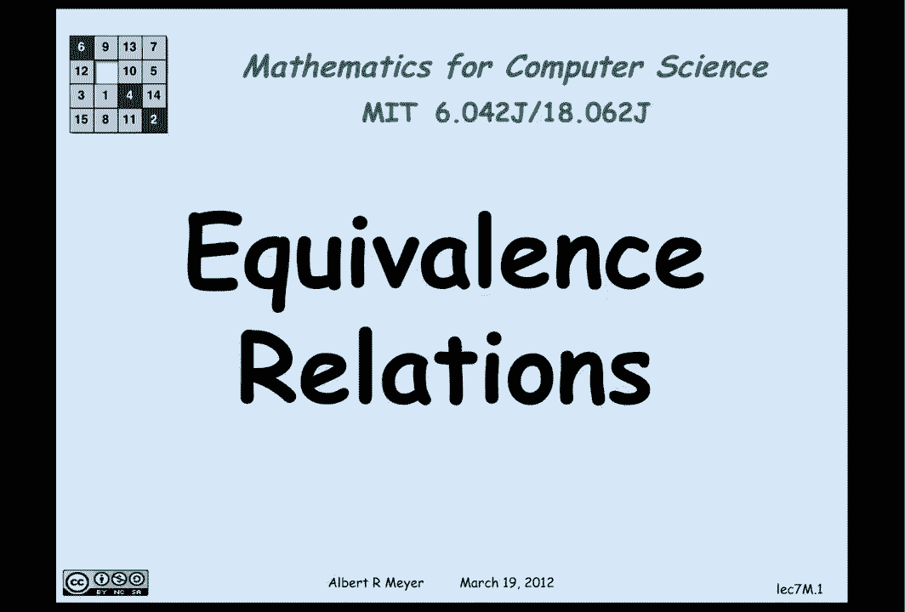
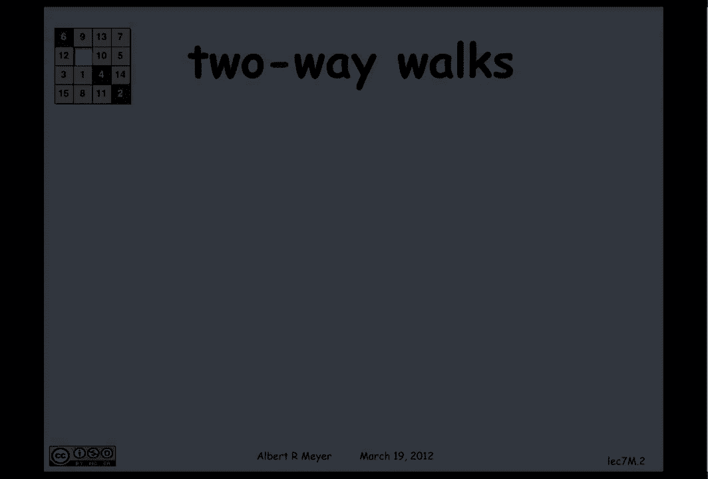
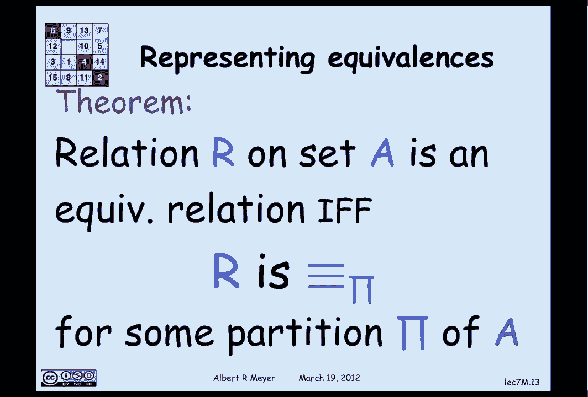

# 【双语字幕+资料下载】MIT 6.042J ｜ 计算机科学的数学基础(2015·完整版) - P53：L2.7.4- Equivalence Relations - ShowMeAI - BV1o64y1a7gT

equivalence relations are another kind，of binary relation on a set which play a。

crucial role in mathematics and in，computer science in particular and they。

can also be explained both in terms of。

digraphs and in terms of axioms so let's，begin with a digraph explanation of an。

equivalence relation and the kind of，relation that's an equivalence relation。

is the relation of there being a walk in，both directions between two vertices so。

if there's a walk between vertex u and，vertex V and conversely there's a walk。

from vertex V back to vertex u then U，and V are said to be strongly connected。

and strongly connected is going to be an，example of an equivalence relation so in。

terms of the walk relation including，zero length walks the relation that。

we're talking about is u g star v and v，g star u now as a property of relations。

this has a name it's called symmetry so，a relation R on a set a is symmetric if。

and only if a are B implies B are a and，the first remark is that the strongly。

connected relation is symmetric an，equivalence relation is a symmetric。

relation that is transitive and，reflexive and again we have immediately。

that the walk relation of the the mutual，walk relation the two-way walk relation。

or strongly connected relation in a，digraph is an equivalence relation。

because clearly if there's two way paths，between U and V and between V and V and。

W then there's one between U and W by，going from u to V to W and back likewise。

there is a length zero walk from any，element to itself and by definition。

strong connectedness is symmetric so the，strong connectedness relation in any。

digraph is an equivalence relation and，the theorem is conversely that any。

equivalence relation anything that's an，equivalence relation is the strongly。

connected relation of some digraph the，proof is trivial it's the strongly。

connected relation of itself，okay some examples of equivalence。

relations to see why they're so basic is，that the most fundamental one is。

equality obviously equality is symmetric，and reflexive and transitive。

and so it's an equivalence relation，another one that we've seen is。

congruence mod in which you can also，check is symmetric and transitive and。

reflexive and finally another relation，would be that two sets are the same size。

providing they're finite sets and，another example would be a bunch of。

objects having the same color two，objects have the same color is a。

relation among objects that have color，that is symmetric and transitive and。

reflexive so it's an equivalence，relation let's illustrate some of these。

axioms that we have in terms of graphs，it can be helpful to remember them so。

reflexive means that when you look at a，digraph it's reflexive when there's a。

little self-loop from every vertex to，itself so there's a length one path or。

an edge from the vertex to itself in，reflexive graphs，transitive means that whenever you have。

two edges connecting a one vertex to，another there's a path of length two。

from one place to another then in fact，there's an edge from that place to its。

target and of course as we said once，that there's a an edge wherever there's。

a path of length two it follows by，induction that there's an edge wherever。

there's a path of any length and that's，what transitive means a symmetric means。

that whenever you have an edge from one，vertex to another there is no edge back。

so in particular if I have an edge from，this vertex to that vertex in blue there。

is no edge because it goes back in the，other direction nor is there ever a。

self-loop in an asymmetric graph and，finally in a symmetric graph wherever。

there's an edge there's an edge that，goes back the other way so that can help。

you maybe remember what these properties，mean now，again equivalence relations besides。

being represented in terms of the，strongly connected relation of a digraph。

can be represented in two other very，they come，from what their properties are so。

whenever you have a total function f on，a set a it defines an equivalence。

relation on the set a namely if f is a，total function from domain a to co。

domain B then we can define an a，relation we can call equivalence sub F。

on the set a by the rule that two，elements are equivalence of F if and。

only if they have the same image under F，they have the same thing that is a is。

equivalence of F to a prime if and only，if F of a is equal to F of a prime and。

again equivalence of F immediately，inherits the properties of equality。

which makes it an equivalence relation，and the theorem that we have is that。

every relation are on a set a is an，equivalence relation if and only if it。

in fact is equal to equivalence of F for，some function f let's illustrate that we。

already remembered that congruence mod n，can be understood as equivalent sub F。

where the mapping is just map things to，remainders two numbers are congruent mod。

and if and only if they have the same，remainder on division by M by n so map a。

number a to f of K equal its remainder，and we have found the equivalence of F。

representation of congruence which is，another way to verify that congruence is。

an equivalence relation finally whenever，you have a partition of a set you can。

define an equivalence relation so a，partition of a set it cuts up the set a。

into a bunch of blocks which are，non-empty and every element is is a。

member of some block and the blocks，don't overlap so in fact every element。

is a member of a unique block and that，enables me to define an equivalence。

relation on a by the property that two，elements are in the same block in fact。

that's the proof of the previous，representation theorem in terms of of a。

function that you can map an element to，the block that it's in in order to see。

that the block representation and the，equivalence of F representation are the。

same the proof in the other direction，that every equivalence relation。

can be represented in this way is an，exercise in in axiomatic reasoning an。

elementary one that we're going to leave，to a problem and not do in this。

presentation so the theorem finally is，that again that a relation R in a set is。

an equivalence relation if and only if，it is in fact the being in the same。

block relation for some partition and，that is the story and multiple ways of。

