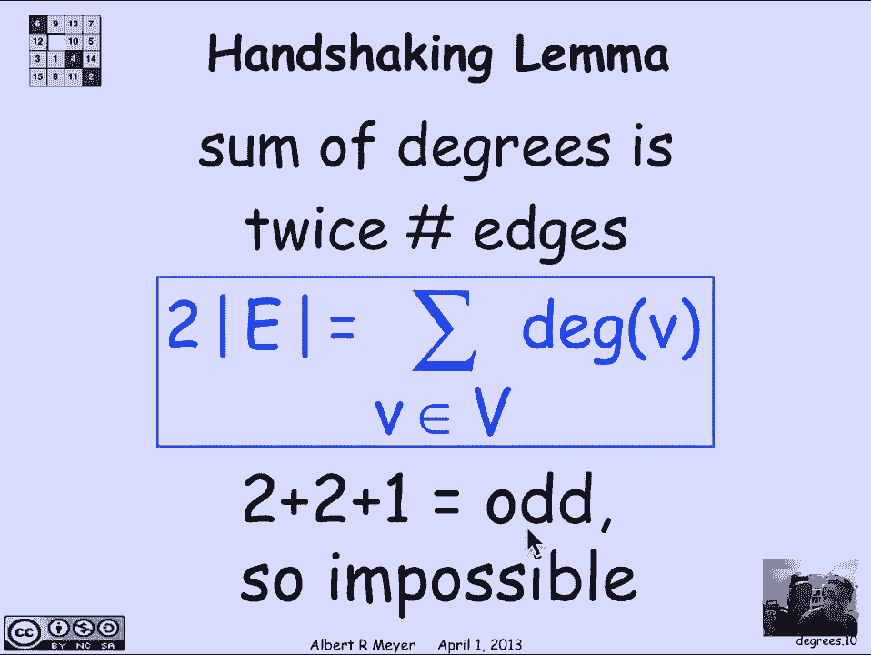
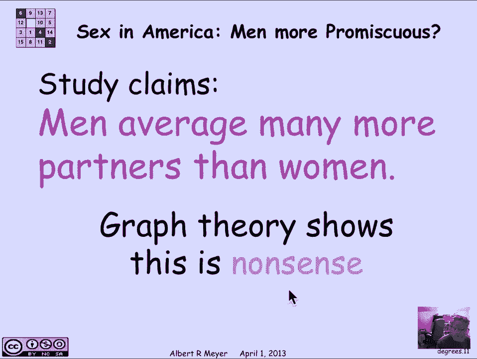

# 【双语字幕+资料下载】MIT 6.042J ｜ 计算机科学的数学基础(2015·完整版) - P54：L2.8.1- Degree - ShowMeAI - BV1o64y1a7gT

so now we start on another topic in。

graph theory namely the topic of simple，graphs so last week we were talking。

about directed graphs where the arrows，have a beginning and an end as shown。

here but simple graphs are simpler the，arrows of the edges don't have direction。

they just correspond to a mutual，connection which is symmetric so there's。

a picture of a simple graph and the，edges are shown without an arrowhead a。

special thing about directed graphs is，that it's possible to have an arrow。

going in each direction between two，vertices but when we have undirected。

edges like this that doesn't happen so，there's only one edge between a pair of。

vertices in a simple graph in addition a，directed graph might have a self loop。

and an edge that starts and begins at，the starts and ends at the same vertex。

and those are also disallowed in simple，graphs now you could allow those things。

there's a thing called multi graphs，where there are multiple edges between。

vertices and there could also be self，loops but we don't need those let's not。

complicate matters we're talking about，simple graphs ok so the formal。

definition of a simple graph is that，it's an object G that has a bunch of。

parts namely it has a non-empty set V of，vertices just like directed graphs and。

it has a set of e a set of edges but the，edges now are somewhat different since。

they don't have beginnings and ends an。

edge just has two end points that are，envy and we don't distinguish the end。

points so let's just draw a picture，here's a case where there are six。

vertices V shown in blue and there are，these undirected edges shown in green in。

this case I see seven edges in E there's，an example of an edge that goes between。

two vertices that I've highlighted in，yellow and red and we've made that。

particular edge dark green an edge like，that can formally be represented as just。

the set of its endpoints a set of two，things red and yellow in text will often。

indicate it as the two vertices，connected by a horizontal bar but you。

have to remember that the order in which，the red and the，occur don't matter because it's really a。

set consisting of red and yellow when，two vertices are connected by an edge。

they're said to be adjacent and the edge。

is said to be incident to its endpoints，just a little vocabulary that we use。

here now a basic concept in graph theory，which is what we're going to make a。

little bit of in this video segment is，the idea of the degree of a vertex the。

degree of a vertex is simply the number，of incident edges the number of edges。

that touch it the number of edges for，which it's an end points so let's look。

at the red vertex there are two edges，incident to the red vertex so its degree。

is 2 okay let's look at the yellow，vertex on here there are four edges。

incident to the yellow vertex so its，degree is for no surprises yet so let's。

examine some properties of virtus vertex，degrees that are motivated by a simple。

example suppose I ask the question is it，possible to have a graph with vertex。

degrees of two two and one so implicitly，it's a three vertex graph and a one。

vertex has degree 2 another has degree 2，and one has degree 1 well let's see what。

it looks like um if I'm going to have a，vertex of degree 1 then I know what it。

looks like there's the vertex it's got，one edge out of it it's going to some。

other vertex now this other vertex must，have degree too so it's connected to。

something else and the something else，must be another vertex with degree too。

because those are the only possible，spectrum of degrees one two and two and。

that means that this last guy has has to，have an edge out of it because it's。

degree 2 and it can't go back to 2，because there aren't any there's already。

an edge between these two and it can't，go back to one because that has degree 1。

so we're stuck and by this ad hoc，reasoning we figured out that there。

can't be a degree 3 graph with this，spectrum of degrees two to one it's。

impossible well we could have reasoned，more general in there's a very。

elementary property of degrees that，we're going to actually make something。

of in a minute and it's called the，handshaking lemma it says that the sum。

of the degrees of summed over all the，vertices is，equal to twice the number of edges there。

it is written as a formula twice the，number of edges so that's the。

cardinality symbol absolute value of a，set means the size of the set here is。

fine I twice the number of edges is，equal to the sum over all the vertices。

of the degree of the vertices why is，that true well if you think about it and。

the sum on the right every edge is，counted twice once for each vertex that。

it's the end of so we're really just，counting this is way of summing up over。

all of the vertices in which each vertex，gets numerated twice so the sum is twice。

the number of vertices and the proof is，kind of trivial but let's make something。

of this you might wonder why it's called，the handshaking lemma that will emerge。

in in some problems that we're going to。

have you to do but let's go on and apply，the handshaking lemma in an interesting。

way and by the way of course since two，plus two plus one is odd we could have。

without that ad hoc analysis figured out。

that the sum of the degrees can't be odd，because it's twice something all right。

so here's the application that's，designed to get your attention it is an。

application of graph theory to sex and，we ask the question are men more。

promiscuous than women and there have，been repeated studies that are cited in。

the notes that show again and again that，when they survey collections of men and。

women ask them how many sexual partners，they have it's consistently the case。

that the men are assessed to have thirty，percent more seventy four five percent。

more sometimes two and a half times，three times as many partners as the。

women and there's got to be something，wacky about this we're going to come up。

with a very elementary graph theoretic，argument that says that this is complete。

nonsense by the way the most recent，study that we could find was one that's。

mentioned in the notes in 2007 by the US，Department of Health and the。

statistician who collected the data know，that the results were impossible but her。

job was to report the data not to，explain it or interpret it and the men。

reported thirty percent more partners，than the women。

we're going to show that somebody's，lying here's how we're going to do it。

we're going to model the relationships，between men and women by having a graph。

that comes in two parts it's going to be，called a so-called bipartite graph so。

there's going to be one set of vertices，called em and another set of vertices。

called F mmmm for men and F for women or，females and we are going to have edges。

going between men and women between MS，and FS precisely when they have been。

involved in a sexual liaison so looking，back at this graph this edge from that a。

blue m to that orange F indicates that，they had had a sexual release on they。

were partners okay so this is a simple，graph structure that we can use to。

represent who got together with whom in，any given population of men and women。

now if you think about the same argument，that we use for handshaking if you sum。

the degrees of the men you're counting，each edge exactly once and so the sum of。

the degrees of the men is equal to the，number of edges in this graph and。

likewise if you sum over the females uh，you're counting each edge once and so。

the sum of the female degrees is also，equal to the number of edges in。

particular the sum over the degrees of，the males is equal to the sum over the。

degrees of the females because every，time there's a liaison it involves one。

male one female all right now let's do，this do a little bit of elementary。

arithmetic i'm going to divide both，sides of this equality by the size of。

the male population by the number of men，and if i do that i get this formula the。

left-hand side is the number of is the，sum of the degrees of men / the size of。

the m population and here i'm doing a，little trick notice that the f's cancel。

out but I've expressed this some of the，female degrees divided by M as the sum。

of the female degrees divided，by F times this factor f / M which is。

the ratio of the populations of women to，men now the reason I'm doing this is。

that if you look at this thing on the，left this is the average degree of the。

men this is the sum of all the degrees，of men divided by the number of men so。

it's the average number of partners that，men have and likewise now you can。

recognize over here that I've got the，average number of partners that each。

woman has and what we've just figured，out then is that there's a fixed。

relationship between the average number，of partners of men the average degree of。

the M vertices and the average degree of，the F vertices and these two average。

degrees these average numbers of，partners is simply related by the ratio。

of the populations the average men，degree is the female population divided。

by the M population times the average，degree of the females now what that。

tells us is that um these wild figures，of twice as many and thirty percent more。

and so on are completely absurd because，we know a lot about the ratio of females。

to males in the population as a matter，of fact in the US overall there are。

slightly more women than men there's one，point 0 35 women for each man in the US。

population and that tells us then that，when you if you surveyed the population。

of all the men and women in the country，you would discover that the men looked。

three and a half percent more had three，and a half percent more partners than。

women per man but this has nothing to do，with their behavior or promiscuity or。

lack of it it's simply a reflection of，the ratio of the populations which gets。

us to the question of where do these，crazy numbers come from and the answer。

seems to be that people are lying one，explanation would be that men exaggerate。

their number of partners and women under，state their number of partners but the。

truth is that nobody knows exactly，why we get these consistently false。

numbers but we do get them consistently。

