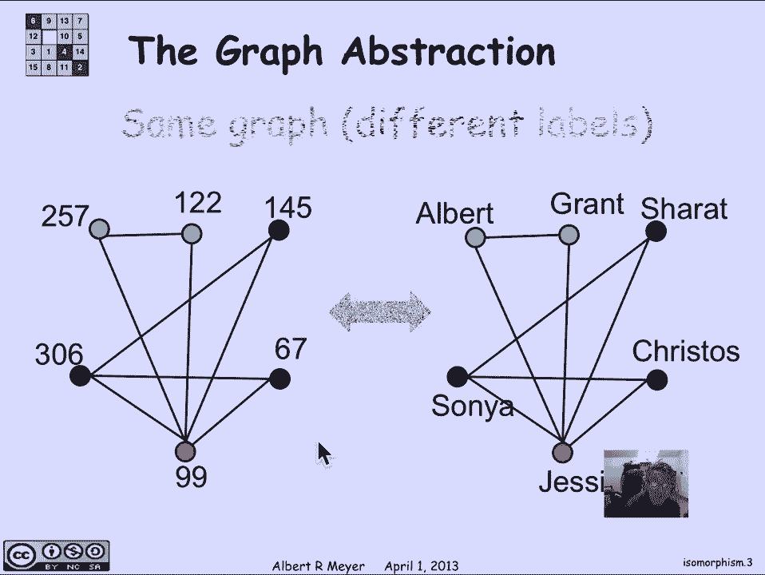
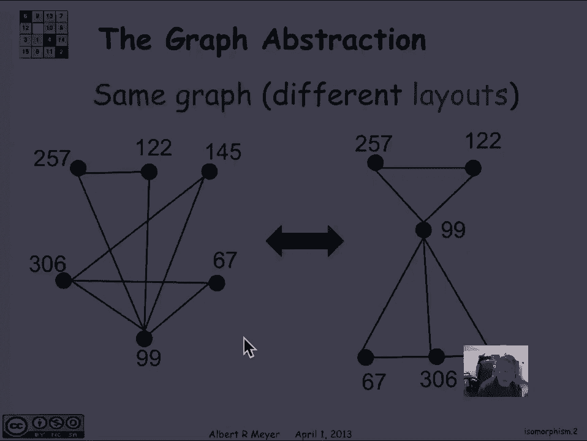
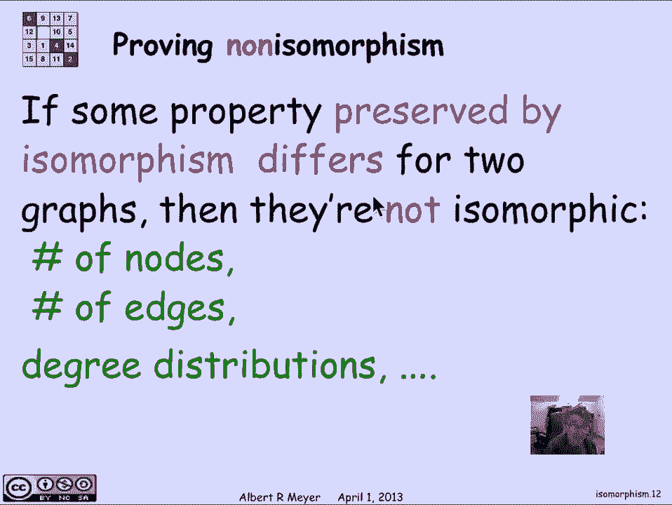
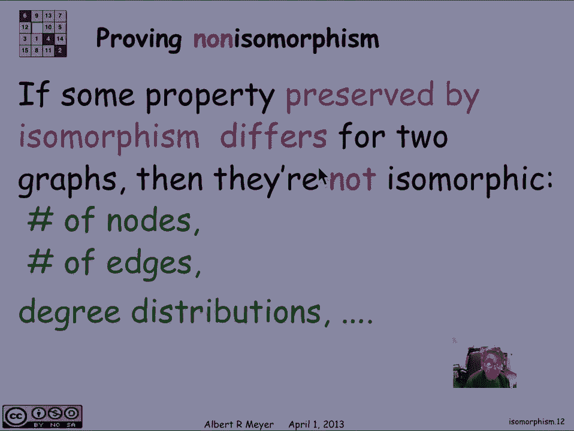
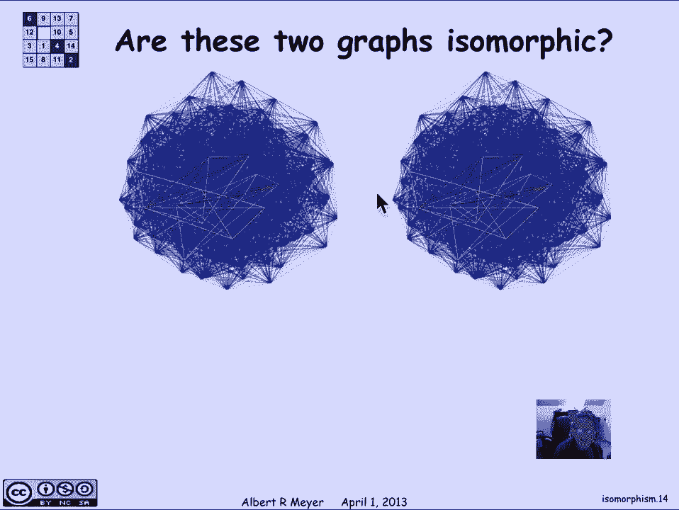

# 【双语字幕+资料下载】MIT 6.042J ｜ 计算机科学的数学基础(2015·完整版) - P55：L2.8.3- Isomorphism - ShowMeAI - BV1o64y1a7gT

我们在有向图的上下文中简要地研究了图的同构，它以一种更基本的方式出现，对于简单的图，其中定义更简单一点，所以让我们来看看这个图抽象的想法，以及同构是如何与之联系的，这是绘制同一图形的两种不同方法的示例。

这里是二五七，这里是二五七，它直接连接到一二二，就像这里，和5 7连接到99就像这里，如果你检查它是完全相同的六个顶点，完全相同，七八边，但他们只是画得不同，所以我们不想混淆像这两个图的绘制。

与图形本身，图本身只由节点集和边集组成，如果你从这两张图中提取出来，你会得到相同的节点和相同的边，所以相同的图形不同的布局，但这里有一个例子，它实际上是相同的布局，你可以看到这两张图。

如果你忽略标签是完全相同的，两个灰色两个灰色红色和红色，现在不同的是，我已经重命名了顶点。

所以我们给这些顶点分配了不同的标签。

现在两个图之间的联系，这个顶点为整数的图，在这个图中，顶点是人的名字，它们是同构的，同构的意思是两个图之间重要的是它们的连接，所以具有相同连接的图，在相同数目的顶点之间称为同构的，嗯，更确切地说。

两个图是同构的，当它们的顶点之间有一个保边匹配时，意思是顶点之间的双射，边缘保持意味着一边有边的地方，在另一边对应的顶点之间有一条边，让我们看一个例子，这里有两个图，我声称它们是同构的。

在左边我们有一群动物，狗子，猪，奶牛，在右边我们有一堆动物食品，嘿，咸牛肉，金枪鱼，然后呃，这是我们如何进行匹配的提示，所以我要告诉你，左边的狗点对应右边的牛肉点，所以我定义了一个函数。

从左边蓝色顶点的双射，右边的顶点是红色的，狗的F是牛肉，猫的f也是如此，猫吃金枪鱼，我要把猫和金枪鱼画在地图上，在剩下的两个顶点上继续，我要把牛画到干草上，也就是他们吃的，从猪到玉米。

这通常是喂猪的东西，好的，所以这是一个双射，我是说，左边的四个顶点完全对应，右边的四个顶点，但我现在得检查一下边缘是否保留了，那是什么意思，嗯，让我们举一个例子，在狗和猪之间的左边有一条边。

就是说右边应该有一条边，在他们去的地方之间，所以牛肉和玉米之间应该有一个边缘，因为那是狗和猪去的地方，确实有一个优势，所以这部分很好，你可以检查其他的，我们要检查左边的另一件事是，因为边缘保持是一个。

当且仅当右边有一条边，当且仅当左边有一条边，这和说，左边没有边，当且仅当右边没有边，所以让我们检查一下左边的非边缘，牛和猪之间没有优势，牛去吃干草，猪去吃玉米，果不其然，干草和玉米之间没有右边的边缘。

你可以检查剩下的病例，这两个图是同构的，函数f是，事实上，所以再说一遍，两个图g 1和g 2之间的同构，是顶点之间的双射，和g 2中的v 2，在g 1和e 1中有一个边UV的性质，当且仅当u中的f。

v的f是第二个图的边，这是一个当且仅当边缘保持，所以如果这里有边缘，那里有一个边缘，如果左边没有边，右边没有边，这是值得记住的定义，它基本上和A有向图的情况是一样的，但有向图除外，边缘有一个方向。

所以从u到v有一条边，当且仅当从u的f到v的f有一条边，但既然我们在简单的情况下不必担心方向，呃定义变得更简单了，嗯，非同构呢，如何证明两个图不是同构的，我可以告诉你这两个图是同构的。

通过简单地告诉你它们顶点之间的双射是什么，然后就变成了一个简单的检查问题，应该有的边缘有没有，你如何计算出两个图不是同构的，没有任何双射能很好地保留边缘，作为一个开始，都有四个顶点，所以很完美。

左边的四个顶点之间有很多双射，右边的四个顶点，为什么没有一个边缘保存得很好，如果你看左边的图表，它实际上有两个用红色标记的二级顶点，这里有一个二级顶点，右边有一个二级顶点，每个顶点都是三度。

如果你现在检查，同构的性质之一是，嗯，从红色中出来的边缘，这两条边必须对应于从，它映射到的任何地方，所以二度顶点只能映射到二度顶点，没有任何，那是证据，这两个图之间不可能有同构，所以总的来说，的。

这个想法是，我们正在研究由同构保留的性质，这几乎就像一个状态机不变的想法，所以一个性质通过同构保持意味着如果两个图，如果图一具有，图1与图2同构，那么图2具有，很明显，如果有一个性质是由同构保持的。

一个图形有它，另一个图没有，这就证明了它们不可能是同构的，那么这些由同构保留的性质是什么呢，嗯，节点数清楚，一定有双射，所以它们必须有相同数量的节点，嗯，他们必须有相同数量的边缘，出于类似的原因。

因为边缘被保留了下来，一边的边对应另一边的边，嗯，其他重要的事情是，我们刚刚提出了这个论点，度是保持边缘的结果，所有其他的结构特性都将通过同构来保存，就像，比如说。

圆形路径的存在和顶点之间的距离之类的东西。

这些都将是通过同构保留的属性。

所以这给了你一个陷阱，试图找出，两个图是否同构，但总的来说，就会有，如果你有一个有几百个或一千个顶点的图，它们之间有很多潜在的双射需要检查，问题是你怎么做，这是一个巨大的搜索，它不能真正有效地完成。

所以你要寻找的是由同构保留的属性，给你一个，所以说，比如说，如果顶点，如果左边的图恰好有顶点的度数，而这个度数是4，顶点与三度相邻，顶点，三级中四级的邻接，是通过同构保持的典型性质，所以你肯定知道。

如果在，第一个图和第二个图，这是一对四度和三次的相邻顶点，只能映射到第二个图中的另一对相邻顶点，也有四级和三级，所以这将大大减少，这个给定顶点在另一个图中可以映射到的位置数，它给你一个啊。

要使用的一些结构，试图缩小对同构数量的搜索，同构在哪里，以及它是否存在，在三度附近有一个三四，比如说，是在同构下保持的典型性质，但即使如此嗯，如果我给你两个很大的图表。

这些实际上是从一些通信网络中提取的图表，他们的形象，很难判断它们是否同构，嗯，你可以猜到，因为，当然我们拍了同一张照片，复制了两次，但如果这两者之间有什么细微的区别，就像我抹去了混乱中的一个边缘。

你怎么知道这两个图不是同构的。

那样的话，答案是，就像这些NP完全问题一样，没有已知的程序来检查两个图是否同构，保证高效并在多项式时间内运行，另一方面，有技术上的原因，图同构不是这些NP完全问题之一的技术性质。

除非p等于np或类似的东西，嗯和我，所以这是这个问题的一个显著特征，重要的是，事实上，在实践中，有一些非常好的同构程序，在许多情况下，给出两张图，它们是否同构，在时间上，这大约是两个图的大小。

所以务实地说，图同构似乎是一个可以管理的问题，你，你不能确定这些大部分时间都有效的高效程序，要去工作了，总是众所周知的程序，事实上。

