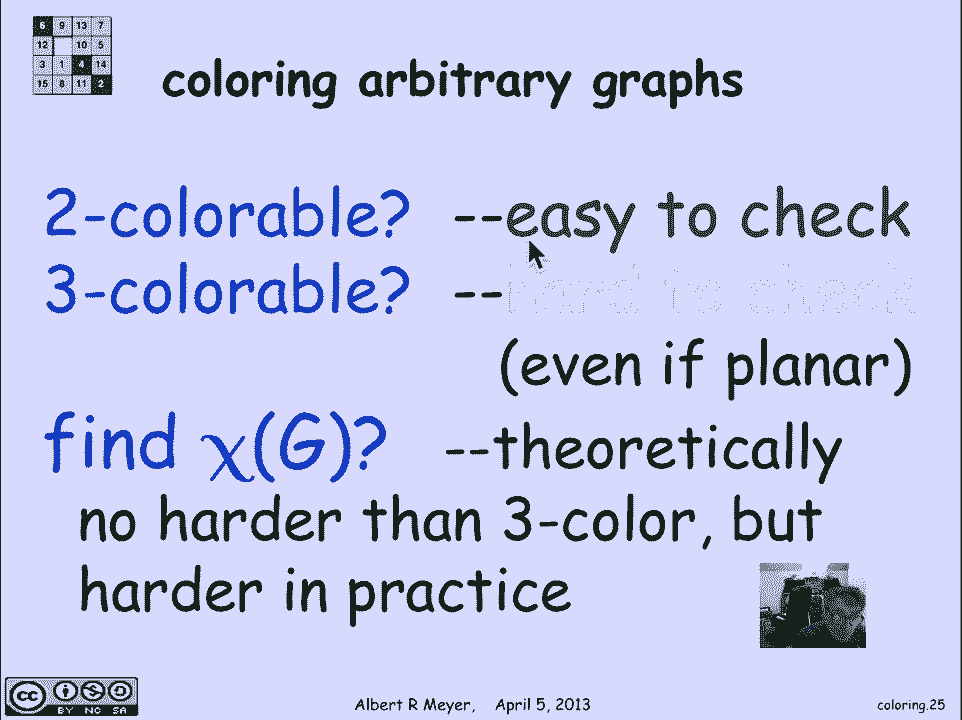

# 【双语字幕+资料下载】MIT 6.042J ｜ 计算机科学的数学基础(2015·完整版) - P56：L2.9.1- Coloring - ShowMeAI - BV1o64y1a7gT

graph coloring is the abstract version，of a problem that arises from a bunch of。

conflict scheduling situations so let's，look at an example first and then define。

the problem so let's think about a bunch，of aircraft that have to be scheduled on。

the ground a Czech ports or gates now if，two flights are on the ground at the。

same time they need to be assigned to，different gates since again serves one。

airplane and what we'd like to do is try，to figure out how many different gates。

do we need to be able to service all the，planes that might be on the ground how。

many gates are needed so let's look at a，sample schedule there are six flights。

here numbering 120 to 145 through 99 and，these the horizontal bar is say times。

during the day and this blue block，indicates that flight 122 is on the，ground from let's say 3 a。m。

 to 7 a。m。and fight 145 is on the ground and a，completely different disjoint time。

interval so 67 to 57 is on the ground，from midnight until about 6 a。m。 it does。

overlap with 122 and so on so this is，the information we have and what we're。

trying to figure out is how many gates，do we need well it's easy to see here。

that the worst case if you just think of，this a vertical Green Line sliding。

across the bar and you look at the，maximum number of blue intervals that。

the Green Line ever crosses it's 3 the，largest number of planes that are on the。

gate at any given moment is 3 which，means we can get by with 3 gates so we。

have to cope with that conflict now so，abstractly what we're going to do is。

assign each aircraft to be a vertex of a，graph and we're going to put an edge in。

to indicate not compatibility but，conflict compatibility was what we were。

looking at previously with our examples，of matching now this line means that 306。

and 145 are on the ground at the same，time they conflict they need the same。

gate and we have to serve them with，different gates and likewise 99 and 145，are on the ground，$6。

99 this was that that the three，flights that were on the ground at the。

same time and then if I fill in the，computer graph with all the other。

vertices and draw an edge when two，flights are on the ground at the same。

time I wind up with this little graph，okay，now we can talk abstractly about the。

coloring problem which is let's assign，colors to the vertices in such a way。

that no two adjacent vertices have the，same color okay adjacent vertices should。

have different colors and it should be，clear from the description of how we。

derive this graph from the airline，aircraft schedules that the minimum。

number of distinct colors needed to，color the graph corresponds to the。

minimum number of gates needed to serve，the aircraft so let's try coloring this。

graph I'll start with coloring for 257，red and 122 yellow and 99 green there's。

no loss of generality here because these，are the three that are on the ground at。

the same time reflected by the fact that，they're in a triangle and I'm gonna have。

to use three different colors since each，one is adjacent to the other two okay。

what next well let's color 145 yellow I，might as well reuse it since it's not。

adjacent to a yellow vertex and then um，here I've got a another triangle so if。

I'm not going to use an extra color the，sensible thing to do would be to color。

that red but opus I didn't do that I use，the red here there's another triangle I。

guess that's that allows me to color and，then I color this black because here I'm。

stuck I'm adjacent to both a yellow a，black and a green vertex so I have to。

come up with a fourth color all right we，did with four colors it means that we。

could could have gotten away with four，gates and the colors tell us which。

aircraft to assign to which gate so 257，and 67 can both be assigned to the red。

gate because they are not on the ground，at the same time there's no edge between。

them 122 and 145 can be assigned a，yellow gate and so on now this was not。

the smartest way to color a better，coloring you're shown here you can check。

that every two adjacent vertices have，different colors and now I've done it。

with only three colors red，yellow and green so now there are three，gates and I get a better schedule。

another example of this kind of conflict，problem comes up with scheduling final。

exams two subjects conflict if a student，is taking both because if a student is。

taking both I can't have the final exams，at the same time and so I need to assign。

different timeslots during exam period，two subjects that overlap that have a。

student in common and then the question，is given this data about which pairs of。

subjects have a student in common we，want to know how short an exam period。

can we get away with again it becomes a，simple graph model and a coloring。

problem so here we've drawn a graph with，some sample subjects 604 2 and 1802 have。

a student in common that's what that，edge means they need to be have final。

exam scheduled at different times，likewise 802 and 604 to have a student。

in common so they need to be scheduled，at different times on the other hand 604。

2 and 1802 sorry what are some two that，are not adjacent，309 1 and 1802 have no edge between them。

which means that they can be scheduled，at the same time there's no student。

who's taking both 309 1 and 1802 at，least according to the data in this。

graph so let's try covering it and again，it is a triangle I'm gonna have to use。

three different colors for a triangle，and here's another triangle and to be。

economical let's just reuse green now，here I've got another vertex that's。

adjacent to three different color，vertices and so it's gonna have to be。

colored with a fourth color this time it，turns out that the four colors are best。

possible you can check that and it，corresponds to a schedule in which the。

604 2 is scheduled on Monday morning at，nine and six double-o one is scheduled，on Monday at 1：00。

but 802 and 309 one can both be，scheduled for Tuesday 9：00 a。m。 and。

finally 1802 is scheduled on Tuesday at，1：00 p。m。okay so this kind of a conflict modeling。

situation comes up all the time，another place where you get these kind，of compatibility graphs or。

incompatibility graphs that you want to，color would be if you were running a zoo。

and you had to have separate habit，habitats for certain kinds of species of。

animals that you don't want to mix，together big fish eat little fish it's a。

truism in the aquarium world and so you，need to keep big fish separate from。

little fish and you don't want the，Tigers living together with the。

chimpanzees so we could again model this，problem as how many cages do we need we。

create a vertex for each species and put，an arrow between an edge between two。

species that mustn't share a habitat or，spheric or share a cage another one。

would be assigning different frequencies，to radio stations and again if two radio。

stations are close to each other they，they will interfere and so they have to。

be assigned to different colors or，different frequencies so now we would be。

using radio stations as vertices and，radio stations that were near enough to。

interfere with each other would get，connected by an edge indicating that。

they needed to be assigned different，color frequencies and one of the classic。

ones is literally to color a map if you，were trying to take say a map of the US。

and assign colors to it in such a way，that you never had two states that。

shared a border with the same color and，this is an illustration of doing it with。

four colors the question is if I give，you some kind of a planar map like this。

what's the minimum number of colors that，will work now you're allowed to have two。

vertices with the two countries rather，share the color if they only share a。

meet at one point but if they have a，positive length boundary they have to be。

different colors okay the way that this，turns into a vertex coloring problem is。

if you take a planar graph like this，here's just an arbitrary one what I can。

do is I'm interested in coloring the，regions the，tres with different colors but I'll just。

replace each region by a vertex so I'm，going to stick a vertex in the middle of。

each of the regions notice there's an，outer region here - that gets a vertex。

so one two three four five six regions，four six vertices and then I'll simply。

connect two vertices when there is a，positive length edge that their regions。

share so there's that vertex that edge，corresponds to the fact that there's。

this boundary that's shared between this，region in this region if you look at。

this same triangular shaped region it，has a boundary with the outside region。

so there's going to be an edge from here，to the vertex that represents the。

outside and there's the rest of the，edges and edge appears when between two。

regions that share a boundary and now，the question is coloring the countries。

corresponds to coloring the vertices and，we'd like to color the graph with as few。

colors as possible well a famous result，that was proved in the seventies is that。

every planar graph is in fact four，colorable now this was first proved to。

claim to be proved in the 1850s but in，fact the published proof was wrong its。

sat around in the journal literature for，a decade before somebody found a bug or。

that is to say that the proof was wrong，not the result there was a big hole in。

the proof that that had not been，adequately justified the proof did give。

a correct argument for five coloring and，the four color problem was opened for。

two mathematicians came up with a proof，of the four color theorem that was very。

controversial because a lot of it of，their proof required a computer program。

to crank through several thousand sample，graphs that needed to be verified for 4。

colorability they had an argument that，showed that that there could only be a。

few thousand counter examples if there，was or rather if there was any graph。

that couldn't be for colored it would be，one of these several thousand graphs and。

then they went to work on coloring these，several thousand graphs which were。

generated with the age eight of a，computer and then colored with the aid。

of a computer and also by hand，this did not make the mathematical。

community happy because a proof like，that is essentially uncheck Abel a much。

improved version was developed in the，1990s but it still requires in the end a。

computer program to generate about 600，maps and verify their caller ability so。

it remains to find a proof of the，four-color theorem that you could say is。

humanly comprehensible without the aid，of a computer but there's no longer any。

doubt really about this theorem in the，mathematical community in general if I。

take an arbitrary graph and I ask what's，the minimum number of colors to color it。

that's called the chromatic number of，the graph so Chi of G is the minimum。

number of colors to color G and let's，look at some guys for different kinds of。

graphs so here we have a simple cycle of，length four and it's obvious that that。

can be colored with two colors just，alternate the colors on the other hand。

so what and if that generalizes I by the，way to any even length cycle the the。

chromatic number of an even length cycle，is simply two you will color the。

vertices alternately on the other hand，if the cycle is of odd lengths you're。

gonna need a third color there's no way，around it because even if you try to get。

by with two colors then your color，things alternately and then when you。

wrap around you discover that um you，can't alternately color you're going to。

need a third color in order to avoid a，clash so in general the chromatic number。

of an odd length cycle is three the，complete graph on five vertices is shown。

here this is a five vertex graph in，which every vertex is adjacent to the。

other four and since every vertex is，adjacent to the other four you're going。

to need five colors you can't do any，better they have to all have different。

colors and so the chromatic number of，the complete graph on n vertices where。

every vertex is adjacent to the other n，minus one is n another simple example。

that comes up is if I take the cycle and，I put a an axe，and Axel in the middle call it a wheel。

then a wheel with a a ring of light a，cycle of length five around the outside。

a perimeter of length five is called W，five and we can color it with four。

colors and in general the argument for，that the chromatic number for an odd。

length wheel is four is that I know I'm，going to need three colors to color the。

rim and since the axle is adjacent to，everything on the rim I'm going to need。

a fourth color for it on the other hand，again if the if the perimeter is even。

though I can get by with three colors，one more remark about chromatic numbers。

is there's an easy argument that shows，that if you have a graph every one of。

whose vertices is at most degree K there，are at most K other vertices adjacent to。

any given vertex then that implies that，the graph is K plus one colorable and。

the proof is really constructive and，trivial basically you just start。

coloring the vertices any way you like a，subject to the constraint that when you。

color a vertex it's supposed to not be，the same color as any of the vertices。

around it but that's easy to do because，when it's time to color some vertex even。

if all the vertices around it are，coloured there's only K of them and so I。

will always be able to find a k plus，first color to assign it without and get。

a satisfactory coloring so I can get by，with K plus 1 colors now the general。

setup with color ability is that to，check whether a graph is 2 colorable is。

actually very easy and we may talk about，that in some class problems but 3。

colorability dramatically changes we're，back in the realm of np-complete。

problems in fact a result of a student，of mine almost 40 years ago was that。

even if a graph is planar where you know，it can definitely be colored with four。

colors determining whether or not it can，be colored with three colors is as hard，as satisfiability。

and it is in fact an np-complete problem，in fact the proof of how you reduce。

satisfiability the color ability appears，in a problem in the text which we may。

assign as a problem set problem，so in general finding Chi of G is hard。

even for three colors now it's not any，worse again from a theoretical point of。

view for for checking what Khayyam G is，even if it's a very large number or the。

pragmatically three color will be easier，to check than end color ability and that。

