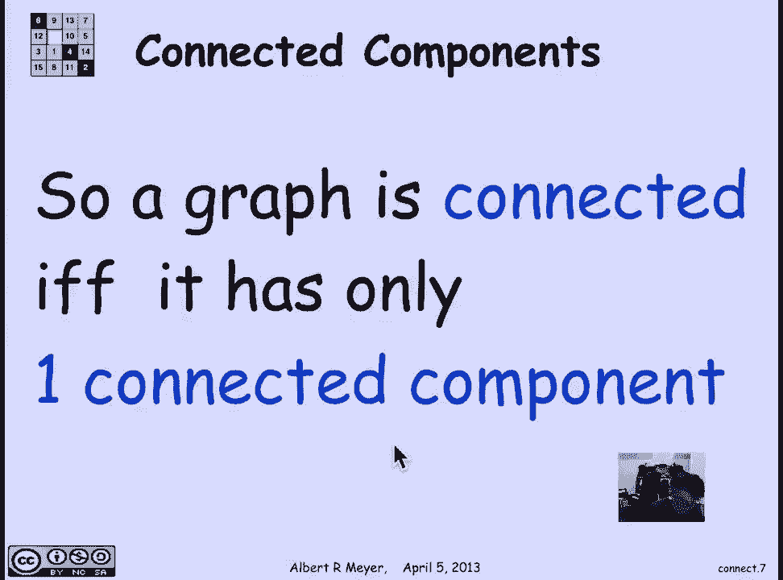

# 【双语字幕+资料下载】MIT 6.042J ｜ 计算机科学的数学基础(2015·完整版) - P57：L2.9.3- Connectivity - ShowMeAI - BV1o64y1a7gT

the point of switching from relational，language to graph theorem radical。

languages really so that we can talk，about paths and connections so let's。

look at the topic of graph connectivity，in general two vertices in a simple。

graph or for that matter a directed，graph I said to be connected if and only。

if there's a path between them in a，directed graph the path would have a。

direction in a simple graph it pads，don't have direction so a is connected。

to B if and only if B is connected to a，it's a symmetric relation so two。

vertices are connected if and only if，there's a path between them that's。

equivalent of course to saying if and，only if there's a walk between them we。

include like zero paths in length zero，walk so every vertex is considered to be。

connected to itself a whole graph is，said to be connected if all of its。

vertex are connected to each other now，so every graph you can think of as。

broken up into the mutually connected。

pieces or sub graphs which are called，its connected components so let's look。

at a simple example let's look at the，connections between MIT buildings where。

we draw an edge between building 10 and，building 13 if there's a door between。

them or a corridor between them so，there's a corridor between building 10。

building 4 but not between building 10，and building 12 to get to 12 you have to。

go through four that's the main building，numbers off the MIT infinite corridor。

these campus course isn't connected to，anything so it's a single isolated。

vertex and then there's the Medical，Center in E 17 and e 25 which are a。

sequence of four buildings that are，connected as indicated but not connected。

at all to East Campus or the infinite，corridor that is you have to go outside。

to get from East Campus to the infinite，corridor from the infinite corridor to。

the Medical Center unless you sneak，through the basement which and an other。

restricted areas so this is one graph，it's not three graphs this is one graph。

which has three parts and so it has。

three connected components in general，the more connected components a graph。

has the more broken up it is that's a，way to remember it the formal definition，of the connected。

of a vertex V is simply all of the，vertices W that are connected to V and。

if you look at these connected，components they've defined an，equivalence relation on the vertices of。

course because a connected component is，a block of the equivalence relation it's。

a block of the partition associated with，the equivalence relation another way to。

say to define this the set of W that are，connected to V is simply it's taking the。

image of V under the O greater than or，equal to zero walk relation East are we。

is our notation for the walk relation in。

the graph whose edges are II including，walks of length zero so a graph is。

connected then means it really has only。

