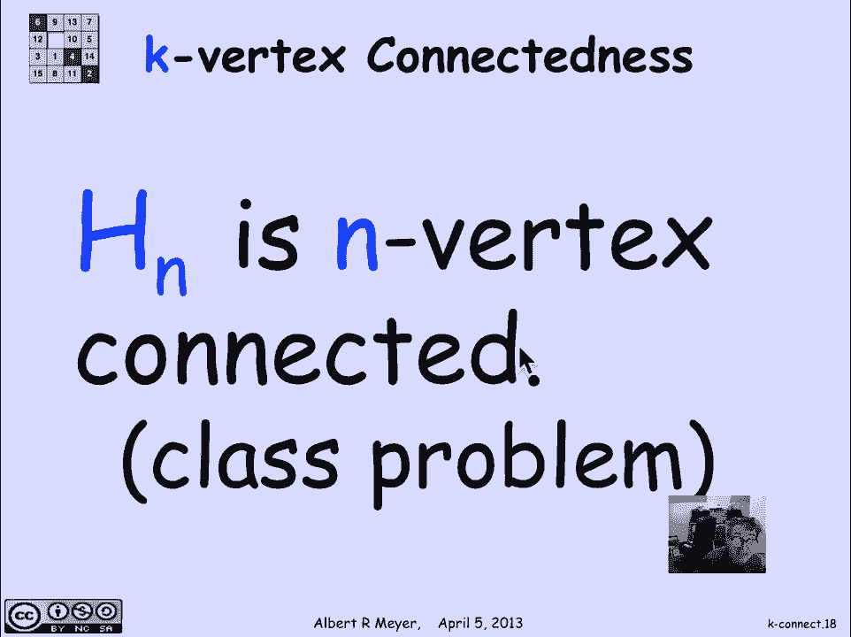
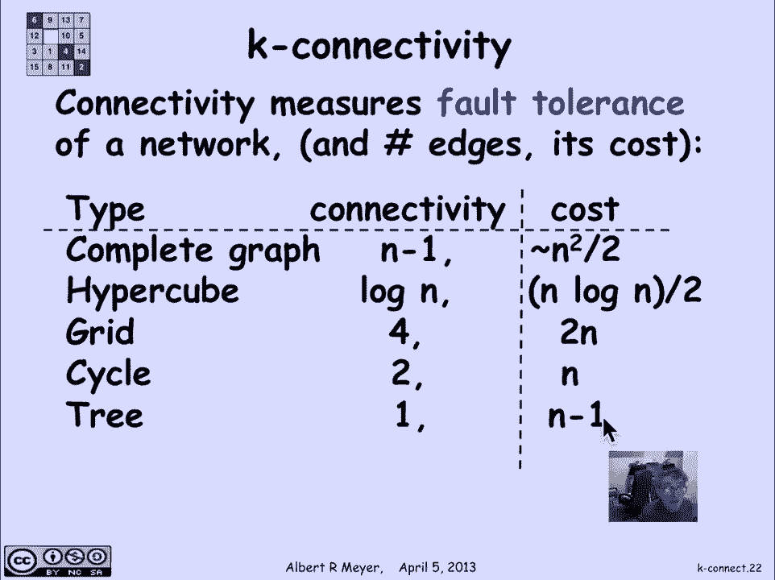

# 【双语字幕+资料下载】MIT 6.042J ｜ 计算机科学的数学基础(2015·完整版) - P58：L2.9.4- k-Connectivity - ShowMeAI - BV1o64y1a7gT

so connectivity is more than just an，all-or-nothing affair we can talk about。

how connected a graph is so let's begin，with two vertices two vertices are said。

to be K edge connected if they remain，connected if you remove fewer than K。

edges from the graph let's look at an，example so here's a graph and let's。

focus on those two vertices that I've，highlighted in magenta they are one edge。

connected because they're connected and，if you remove one edge they become。

disconnected so they're one edge，connected but they're not two edge。

connected if in particular if I delete，that edge then they no longer as a path。

between the two magenta vertices here's，an example of two vertices these two。

green vertices that are two edge，connected that means that I can remove。

any number of edges less than toe which，is to say one edge and they'll stay。

connected so I could try but if I do，remove two vertices they become。

disconnected so with those two vertices，now those two edges judiciously selected。

there will no longer be a path between，the two green vertices for a three edge。

connected example we can look at these，two vertices highlighted in purple and。

discover then we can remove any two，edges and they're still going to be。

stuck together you can kind of see that，because they're in a cycle here and in a。

cycle there and in order to break them，you're gonna have to break both cycles。

which means of breaking two edges to，break two cycles and if you remove three。

on the other hand you can't separate，them so if I cut these three edges I。

might have been more obvious to cut that，one but I'm doing it this way to make it。

interesting if I cut these three edges，then in fact I wind up with no path。

between those two vertices so they are，two edge connected they are three edge。

connected but not four edge connected，meaning you can remove two but you can't。

three and keep them connected for a，whole graph a whole graph is connected。

if every two vertices are kedge，connected and the point of this degree。

of connectivity is to measure one one，motivation of it is it if you think of。

this graph as indicating a communication，network where vertices are centers that。

are sending and receiving data and an，edge corresponds to having some kind of。

a channel or cable between adjacent，centers then connectivity is a measure。

of how many of your channels or cables，can go down and still have the property。

that every Center of information can，communicate with every other Center of。

information so how many connections can，fail without cutting off communication。

here's an example of a graph that，globally this is was the graph that we。

saw before that has some vertices that，are one edge connected others that are。

to other others that are three but the，graph as a whole is only one edge。

connected because there's this one edge，this graph on the other hand a。

modification of it is two edge connected，now I can remove any one edge and no。

matter what single edge I remove this，will remain a connected graph which。

makes it two edge connected now there's，a corresponding definition of vertex。

connected meaning it's K vertex，connected if you can remove any number。

of vertices up to K and it will stay，connected if it's K vertex connected。

it's certainly K edge connected but not，conversely if here's a graph that is two。

edge vertex connected but one vertex，connected if you remove one vertex it。

breaks if you remove that vertex it，breaks but on the other hand it needs。

two edges to be cut in order to split，the graph into the complete graph on n。

vertices is to cut it up and requires，cutting or n minus 1 edges。

and in fact n minus 1 vertices to break，it up because everything is connected to。

everything else so KN is as connected a，graph on n vertices as you can possibly。

have but of course it's got a lot of，edges it's got n choose 2 edges or about。

n times n minus 1 over 2 edges another，interesting structure is the，n-dimensional hypercube。

so the square is a 2-dimensional in the，cube the the ordinary cube is the h3 has。

has 8 vertices it looks like a cube and，in general the way we define HN is that。

its vertices are the binary strings of，length n and two vertices are adjacent。

if they differ in one bit they're the，same except that in one coordinate one。

of them has a 1 and the other has a 0 in，that case you can make the edges。

adjacent it turns out that the the n。

dimensional hyper graph is n vertex，connected and this is worked out in a。

homework or class problem so to，summarize well actually before we。

summarize there's a basic theorem that，we're not going to prove it's just a。

little bit too much of a challenge for，us to get into would take maybe a couple。

of lectures is to prove mangers theorem，which says that a graph is K vertex。

connected if and only if you can connect，any two vertices with completely non。

overlapping different paths K of them so，if two vertices are K connected then。

there are completely separate K separate，paths connecting them which means of。

course that you have to cut each of the，paths in order to separate them and a。

similar theorem goes for edge，connectivity so to summarize about some。

graphs that we know about if given that，connectivity measures fault tolerance in。

a network we're interested in，well how many edges did it take to。

achieve this level of connectivity so，the number of edges is kind of a measure。

of the cost and the complete graph on n，vertices is n minus 1 connected。

it has about and squared over two edges，the hypercube now if we're gonna be。

talking about graphs of size n to be，uniform the hypercube on HN has 2 to the。

N vertices so if we want an end vertex，version we're talking about H sub log n。

which has n vertices and then it has，about n log n over 2 edges so it's got。

fewer edges than the complete graph but，a significantly less exponentially less。

connectivity the grid is simply like the，XY axis or the XY plane with points at。

integers so that every node is connected，to every two for adjacent nodes to one。

up one down one right and one left now，of course when you get to the edge of it。

if you make it finite the ones on the，edge you're only going to be Knut 2。

connected so you have to wrap it around，in the shape of a doughnut to really。

make it work with a finite graph but if，you do that then the thing is for。

connected a four edge connected but and，only has two n edges and then a cycle is。

two connected a cycle of size n is two，connected with n vertices and finally。

trees which we'll talk about next time，on are the smallest possible connected。

graphs they are one connected indeed，everything is in a tree is connected and。

they only have n minus 1 edges but if，you remove one edge it splits and that's。

