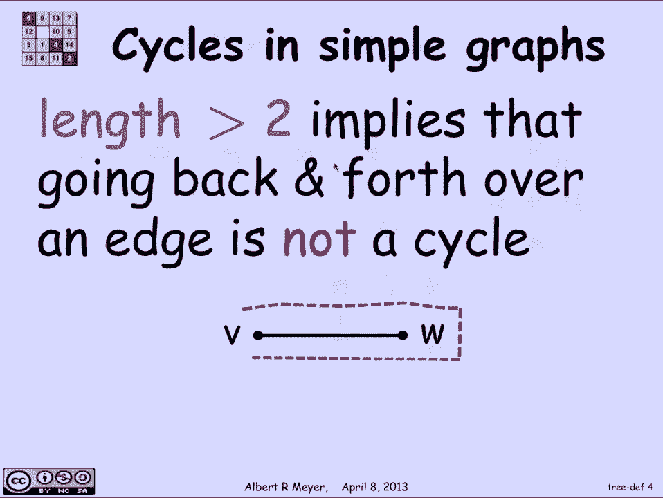
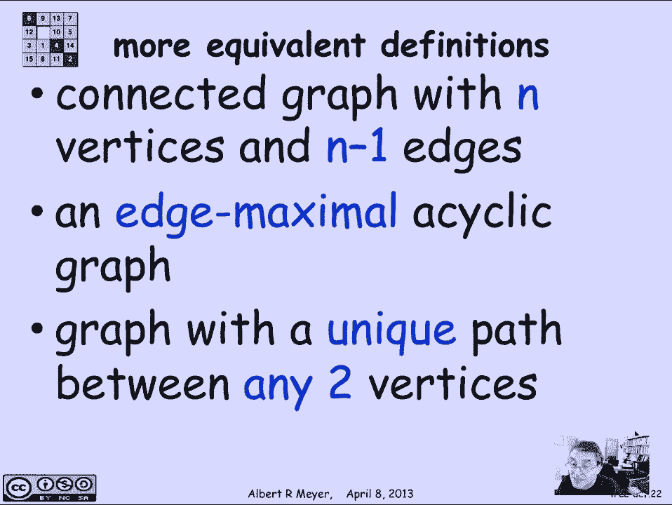

# 【双语字幕+资料下载】MIT 6.042J ｜ 计算机科学的数学基础(2015·完整版) - P59：L2.10.1- Trees - ShowMeAI - BV1o64y1a7gT

树是您所遇到的最基本的数据结构，它们遍布计算机科学和其他学科，所以让我们来谈谈他们，树的最简单定义是树是连通图，在此设置中没有循环，我们说的是简单的图和无向边的树，嗯，为了理解这一点。

我们最好有一个循环的定义，有一张典型树的照片，但准确地说，简单图中的循环是什么，嗯，这是一条长度超过两条而不交叉的封闭步道，所以不穿越本身是我们使用的循环的标准定义，在有向图中，它只是意味着这是一条路。

除了起点和终点是一样的，所以看起来你从V的某个地方开始，然后你绕到A和W，当你沿着这条路走的时候，它都是不同的顶点，除了路径在V开始的地方结束，这就是为什么它不是一条路径，使它成为一个循环。

大于2的长度是循环定义的区别，在简单图之间，有向图中的有向图，完全有可能有一个长度为1的自循环，这是一个有趣而重要的循环，但我们在简单的图表中禁止它们，因为没有办法避免有一个长度为2的循环。

因为你总是有能力在边缘来回穿梭，那没什么意思，所以我们不认为这是一个循环，一个循环的长度必须大于两个，它也排除了长度为零的循环，它是通过取一个顶点来得到的，同意这个技术定义。

我们现在知道在这个简单的图表中什么是循环，我们理解树的定义，这里有更多的树的照片。

没有圈的简单图。

现在它们真的每时每刻都在出现，为什么会有你可能熟悉的家谱，在那里你画了一幅给定人的后代的画，它们以树状结构不断分支，就像传统上显示的那样，嗯，在计算机科学中一直有搜索树，在那里你开始回答一些问题。

它告诉你下一步要搜索哪条路，有一些游戏树，我们在这节课中已经讨论过了，用来定义游戏和策略，在编译器技术和语言理论中出现了解析树，然后是跨越的树，我们今天要讨论的是，除了这些树木生长的地方。

有很多不同种类的树，有根的树，其中有一个指定的顶点叫做根，你想从根到所有其他顶点，有有序的树，当你在给定的顶点时，有一个明显的顺序，你将是，呃，其中出口边缘，从顶点，有第一个和第二个，第三个。

或者左边的，下一个，最左边，等等，这样你就可以选择离开顶点的顺序，有一些二叉树，其中每个顶点有两种出路，完全或没有出路，如果它是一片所谓的叶子，还有一些完整的树，它们的定义对我们来说并不重要。

因为我们不会考虑这些，顺便说一句，还有，边具有方向的有向树，就像在有向图树中一样，但我们不考虑这些，我们将专注于所谓的纯树，无序的，无根，这就是我们所说的，所以让我们研究树的更多性质和树的等价定义。

由于理论上的原因和方便，这将是重要的，了解树木的许多不同特征，所以我们从一个定义开始，它说它是一个连接的简单图，没有循环，但还有其他方法来描述它，所以简单图中的边叫做切边，如果当你把它从图中移除时。

两个曾经连接的顶点，它们之间有一条路径，他们之间不再有一条路，这里有一个简单的图解，边e是切边，因为如果我删除它，那么现在有两个组成部分，曾经有两个顶点，实际上这里的任何顶点都曾经连接到。

通过那条边的任何顶点，但一旦我删除了那条边缘，所有这些曾经连接在一起的顶点，不再是这样，切边，f不是切边，因为即使我删除了Edge，f，有一个，事实上，仍然是从这里的每个顶点到其他顶点的路径。

所以f没有断开任何东西，嗯，正如我所说，删除后仍连接，所以现在我们得到了一个简单的方法来描述树木的切边，因为边不是切边，当且仅当它在循环中，如果你想一想，如果它是在循环中，你从一个循环中切出一个边缘。

那么循环中的所有东西仍然是通过循环的另一条路连接在一起的，不用那个边的，如果它不是在循环中，那么事实上你可以考虑删除，这意味着在它的两个事物之间不会有两条路，在其终点，所以它会把他们分开，好的。

所以定义树的另一种方法是说树是连通图，其中每个边都是切边，那就是只要你从树上剪下任何边缘，它停止连接，这就产生了另一种说法，即某物是一棵树，树是一个连接的边最小的简单图，这也意味着如果你去掉任何边缘。

它不再具有连接的属性，所以它是一个边最小连通图，这就是为什么树如此重要的原因，因为，如果你想办法得到一大堆东西，连接在一起的一大堆顶点，一棵树的边数最小，足以让他们都联系起来。

如果你考虑网络中需要相互通信的不同节点，你想知道这些通信中心有多少直接连接，为了让每个人都能和其他人交谈，答案是，它必须是n个顶点上的树，n个顶点上的树正好有n减去1条边。

所以这给了你树的另一个等价定义，树是一个连通图，有n个顶点，n减去一条边，一种双重的思考方式，树是一个无环图，它有尽可能多的边，而没有任何循环，所以通常一个无环图可能不连接，但只要它不连接。

你可以不断地添加边缘，这些边缘将把东西连接起来，而不会产生循环，但是当你得到一棵树，让一切都连接起来的时候，你不能再加一条边，所以一条边，边缘，极大无环图仍然是刻画树的另一种方法，也许。

最有用的方法是说一个有唯一路径的图，在任意两个顶点之间是一棵树，所以当然，如果有一条独特的道路，特别是有一条路，所以所有的顶点都要连接起来，但是是什么让它成为一棵树。

在两个顶点之间没有两种不同的连接方式，因为一旦有了，就会有一个循环，这些是树可以等价地表述的一些基本方法，事实上还有更多。

