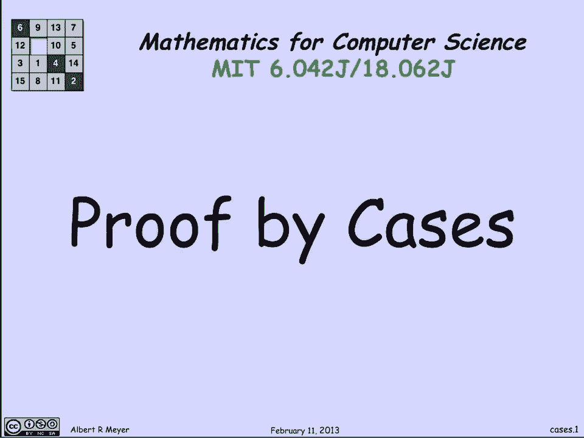
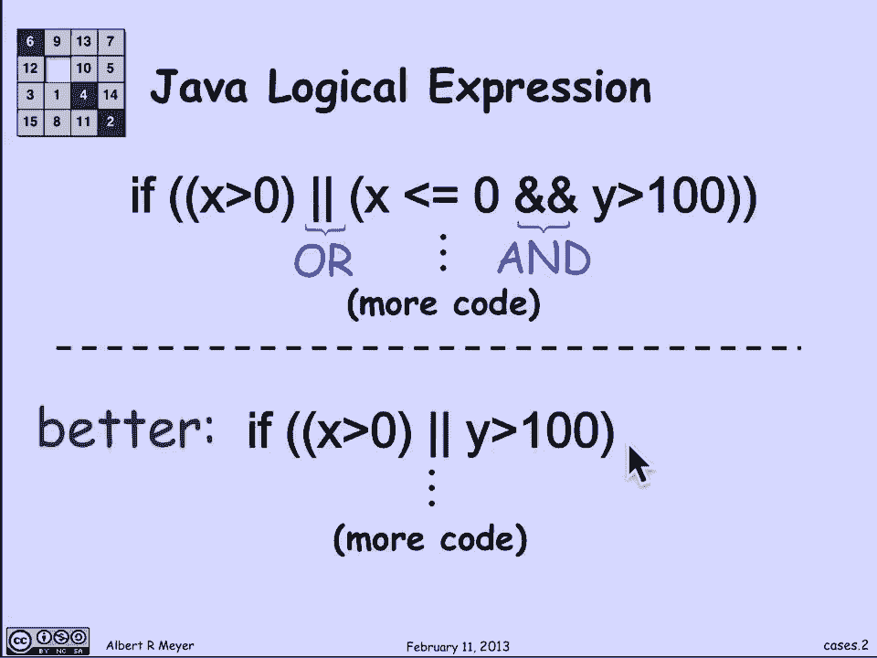
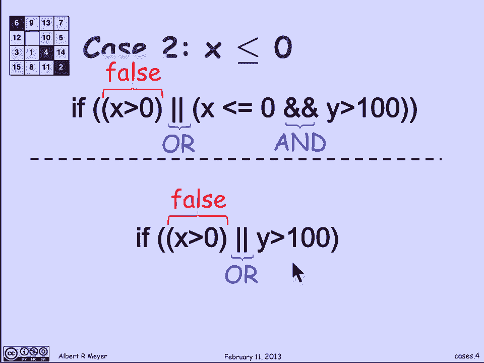
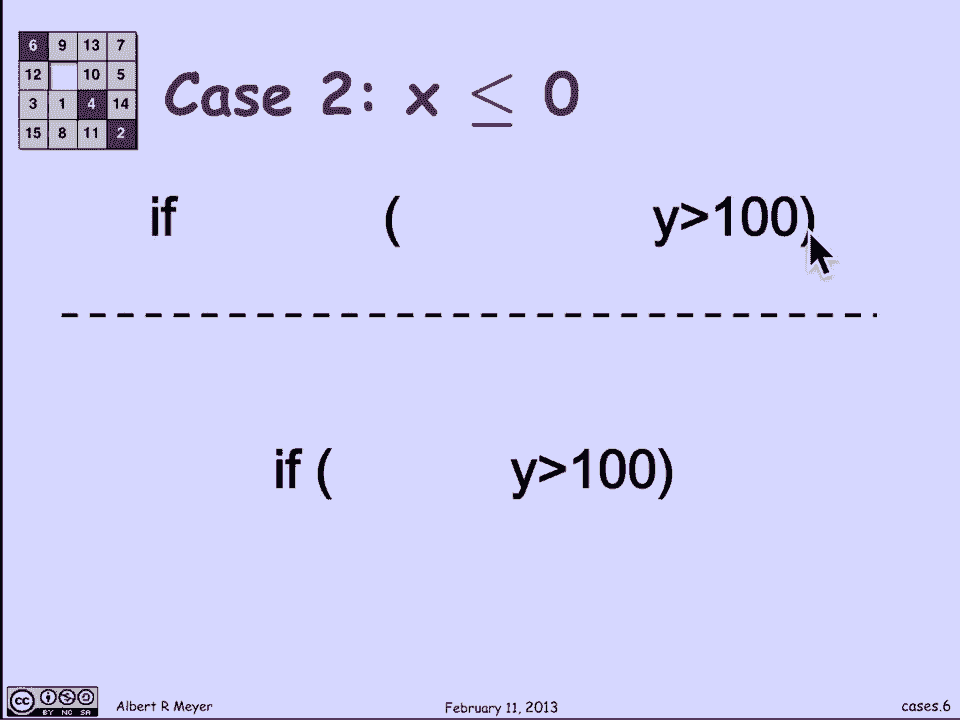
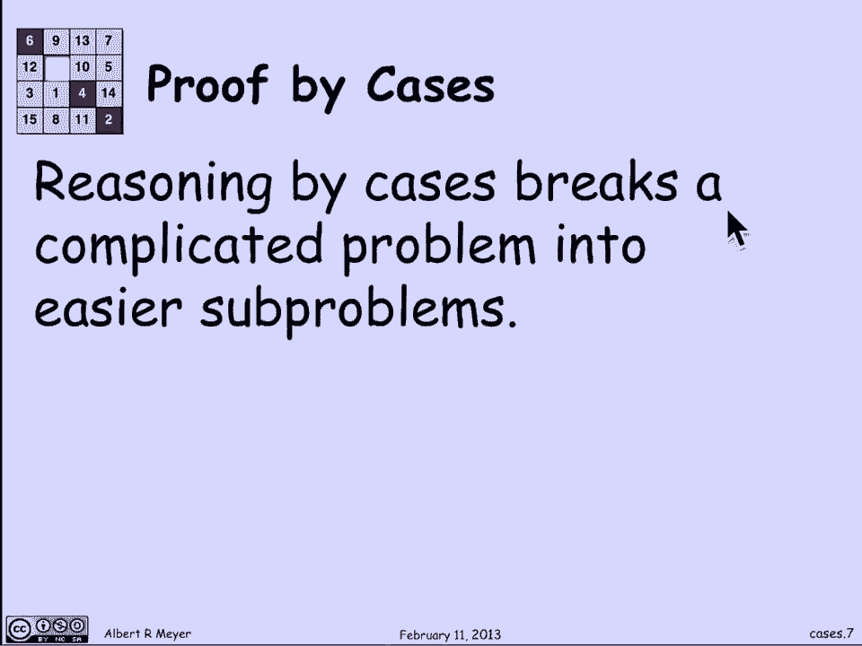
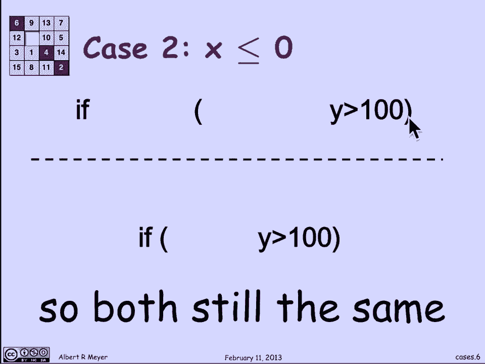
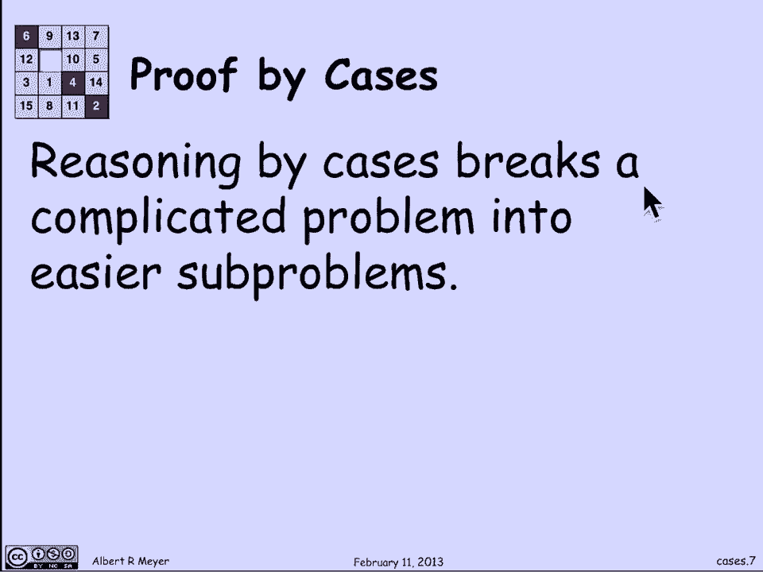
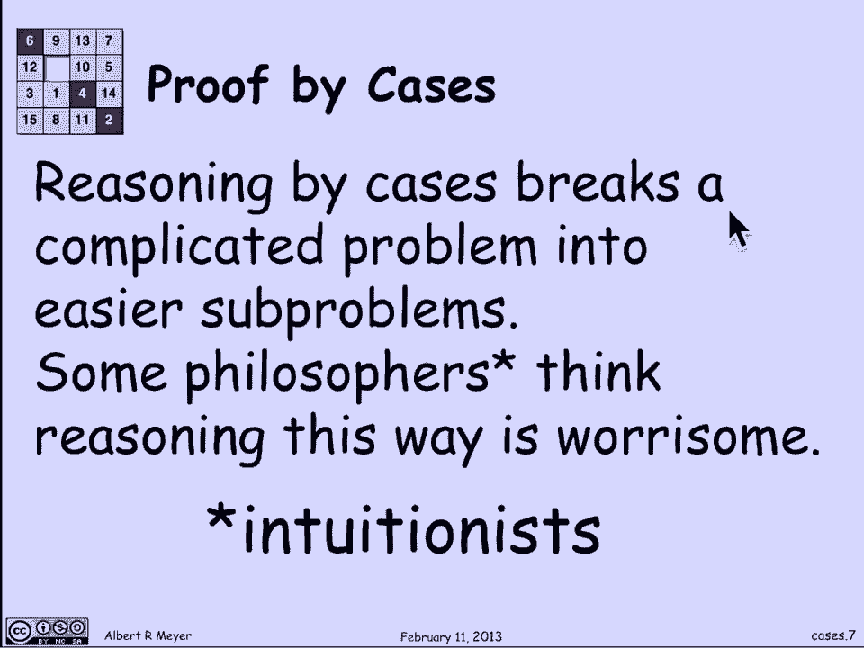
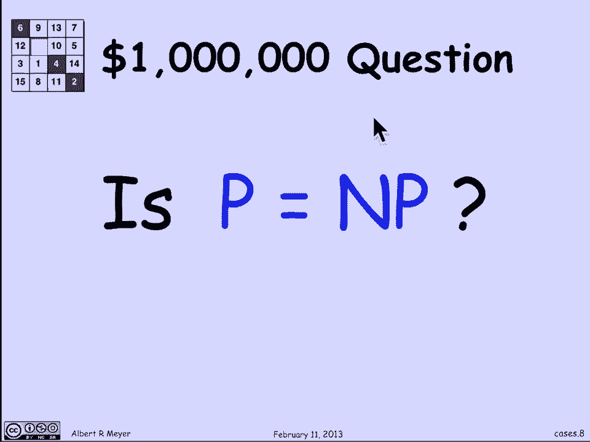
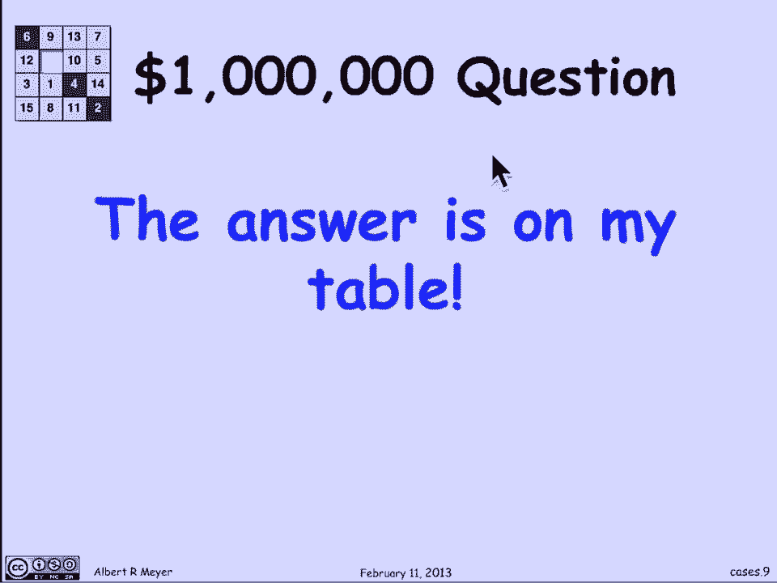

# 【双语字幕+资料下载】MIT 6.042J ｜ 计算机科学的数学基础(2015·完整版) - P5：L1.2.3- Proof by Cases - ShowMeAI - BV1o64y1a7gT

another basic proof technique is called，proof by cases in which we prove。

something by breaking it up into pieces，that are easy to prove but that together。

cover all possibilities let's look at。

the explicit simple example from，computer science here's a Java logical。

expression way to decipher this is that，the double vertical bar means or in Java。

and the double ampersand means an end in，Java so this is a conditional test and。

if test that is the guard on a bunch of，code to be executed if this test comes，out to be true。

let's read the test if X is greater than，0 or if X is less than or equal to 0 and。

Y is greater than 100 go ahead and do，the code that's in there indicated by。

the vertical dots we're going to assume，here that x and y are variables that are。

declared to be of type float at a point，or real number or integers for that。

matter ok now what I claim is that this，code can be improved and if it's。

rewritten in the following way namely if，X is greater than 0 or Y is greater than。

100 so the claim is that these two hunks，of code if I just replace this test。

which has three components that require，an extra step to evaluate in some cases。

by this code the programs are going to，behave exactly the same way and。

therefore it's just more efficient and，easier to understand ones one step。

faster if I replace this longer，expression by this shorter expression。

now how do I argue that these two pieces，of code are going to behave in exactly。

the same way you come up with the same，final output they won't behave exactly。

the other，but they're going to yield the same，results ok let's consider how these two。

behave in two cases the first case will，be that the number X really is positive。

that it's greater than 0 what happens，then well the first test above in the or。

to be true and that means that the whole，or expression is true because we're。

natural or anything at all it comes out，to be true and you go ahead and execute。

the code that follows likewise the，second expression starts with X greater。

than zero or so it comes out to be true，so in this case if X is greater than。

zero both conditional expressions will，allow the code that follows them to be。

executed and then because they both，evaluate to true okay the next case is。

that X is less than or equal to zero，let's see what happens then well in the。

top expression since X is less than or，equal to zero that first expression X。

greater than zero maybe what if it's，evaluated returns false and same thing。

in the second expression the initial，test X greater than zero returns false。

now one of the things that the way or，works is that if you have an or of a。

bunch of things if the first thing is，false you ignore it and just proceed to。

the other things to see how they come，out so what that means is that in both。

of these expressions since the first。

test in the sequence of things that are，being ORD together came out to be false。

I can just ignore them the code is going，to behave as though after the false was。

detected is just going to behave in the，same way that the rest of the test says。

to behave well in the top case the，expression to be checked now is that X。

is less than or equal to zero and Y is，greater than 100 but what do we know。

well X is greater or equal to 0 and less，than or equal to 0 in this case so this。

test comes out to be true and we have，something of the form true and，something-or-other。

that means that the net outcome of this，expression it depends entirely on the。

something-or-other that is it depends，entirely on whether Y is greater than 0。

because the X is less than or equal to 0，and so this expression can be simplified。

it's going to behave exactly according，to whether or not Y is greater than 100。

so look what I've just done I've argued，that in this case both of these test，cards actually like。

why is the test y greater than 100 which，is they behave the same in this case as。

well so what I just figured out was that，in both cases all these two expressions。

yield the same result which means and，the only possible cases are that X is。

less than zero or the X is greater than，zero or likes X is less than or equal to。

zero so in all cases they're the same，and we're done that's why it's safe to。

replace the upper complicated expression。

by the lower less complicated expression，so in general as I said reasoning by。

cases breaks complicated problems at the，easier subproblems which is what we just。

saw there wouldn't be clear how to prove，that these two things were equivalent。

but I chose those cases and it made each，case or easy to figure out that the two。

things were the same now the truth is，that there are some philosophers who。

worry about reasoning by cases for kind，of subtle reasons they're called。

intuitionists and here's what bothers，them with let me illustrate there's a。

million dollar Clay Institute question，one of a dozen corso questions that are。

considered to be the major open problems，in various disciplines of mathematics。

and one of the disciplines of，mathematics is complexity theory in，computer science computational。

complexity feeling this question is，known as the P equals NP question and。

we're actually going to talk about a，fair amount in just the coming few。

lectures but for now it doesn't matter，what it means well I'll tell you what it。

means P stands for polynomial time and，NP stands for non deterministic。

polynomial time I'm not going to define，non deterministic polynomial time but it。

would be momentous if those two things，were equal and everyone expects that。

they're not equal but no one knows how，to prove that so the million-dollar。

question is is P equal to NP yes or no，and you get a million dollars for。

settling this question now I claim that，in fact the answer to this。

is on my lecture table and I will show。

