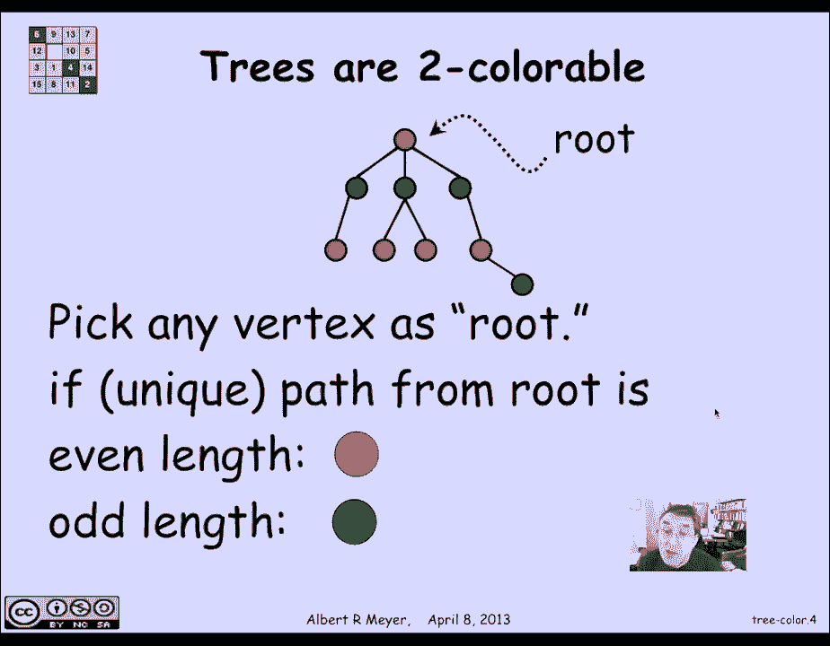

# 【双语字幕+资料下载】MIT 6.042J ｜ 计算机科学的数学基础(2015·完整版) - P60：L2.10.3- Tree Coloring - ShowMeAI - BV1o64y1a7gT

现在，我们可以利用树的唯一路径表征来，很快就发现每棵树都太鲜艳了。

所以说，我们知道树是一个图，在每对顶点之间有唯一的路径，因此，具有两个或多个顶点的树的色数为2，证明就是给大家演示一下怎么给它上色，显然不能用一种颜色，如果你有任何两个相邻的顶点。

两种颜色的方式是你只需要选择一个任意的顶点，称之为根，但你可以任意选择根是什么，每个顶点都有一条独特的路径，从根到每个顶点，使用这种唯一的路径表征，所以我们要给顶点着色。

通过从根开始的路径是奇数长还是偶数长，如果是偶数长度，把它涂成红色，如果是奇数长度，把它涂成蓝色，彩色绿色，所以我们最终交替使用红色和绿色，事实是相邻的节点将在一段距离上，其中一个是奇数距离。

一个是偶数距离，这就是为什么这种上色方法会奏效，两种颜色的一个一般性质是计算出，一个图形是否太色，如何做是，你只要开始选择一个任意的顶点，给它一个颜色，它是红色的。

然后把它附近的所有顶点都涂成绿色然后继续这样，用与相邻顶点不同的颜色给顶点着色，那是彩色的，直到你卡住，如果你不被卡住，颜色太鲜艳了，如果颜色不是太鲜艳，你肯定会被卡住的。

所以这是一个很简单的方法来计算一个图表是否太有颜色，两种可着色性的另一个特征是图的可着色性过强，前提是它所拥有的所有循环，如果有长度均匀的，当然啦，树没有周期。

