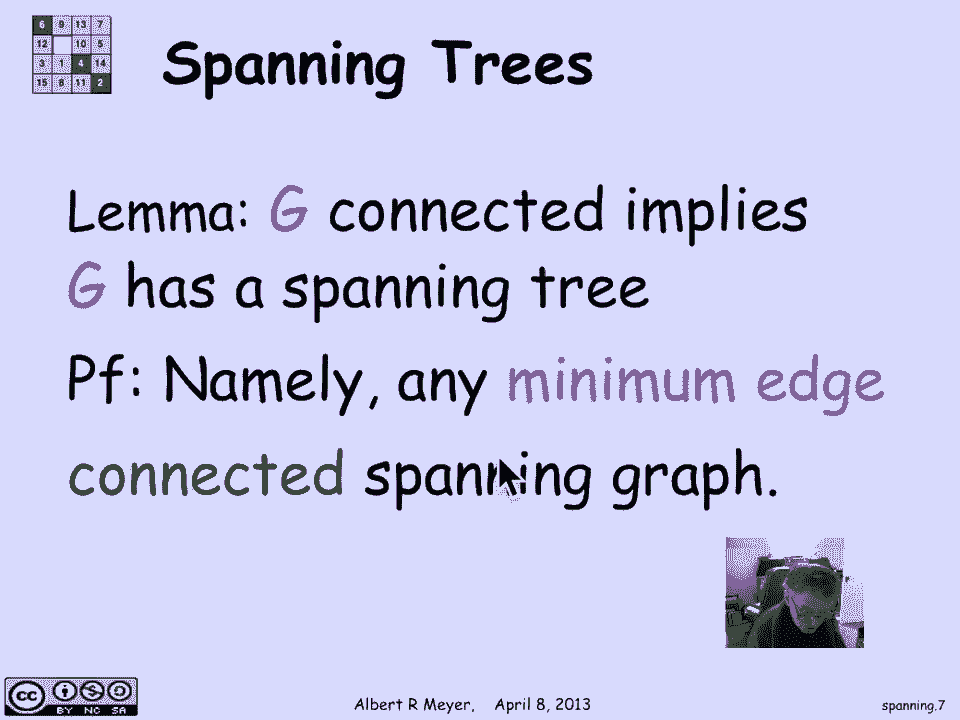

# 【双语字幕+资料下载】MIT 6.042J ｜ 计算机科学的数学基础(2015·完整版) - P61：L2.10.5- Spanning Trees - ShowMeAI - BV1o64y1a7gT

one of the multiple definitions of trees，that we saw is that it's a minimum edge。

a simple graph that connects up a bunch，of vertices and that leads to the idea。

of finding a spanning tree within a，simple graph that maintains the same。

connections so let's begin with a，precise technical definition a spanning。

sub graph of an RF G is simply a sub，graph that has all the vertices of G so。

again a sub graph of a graph means it's，got a subset of the vertices and a。

subset of the edges spanning sub graph，is that it has all of the vertices but a。

subset of the edges and the definition，of a spanning tree is a spanning sub。

graph that is a tree now not all graphs，are going to have a spanning tree。

because the tree has to be connected if，the original graph is not connected。

there's no way you can find a spanning，tree using only the edges that are there。

already but it's going to turn out that，if the graph is connected it's。

guaranteed to have a spanning tree let's，look at an example here's a simple graph。

and what I want then is a spanning tree，a selection of edges that connect up all。

the vertices such that we're only using，edges in the original graph and there。

they form a tree there it is so if you，check on these magenta edges that that。

I've highlighted they define a tree I，haven't used three of the edges in the。

original graph now this particular，choice of spanning sure is kind of。

arbitrary in general there's lots of，spanning trees here's another one this。

time with green edges again I'm using，only edges from the original graph I've。

left out three different ones and used a，different set of edges to form the tree，but there it is。

it's got no cycles and it spans the，graph because every vertex in the graph。

is part of it and of course it's，connected since it's a tree okay there's。

actually some lovely combinatorial，theory which enables you to calculate。

the number of spanning trees in a simple，graph without too much difficulty just。

given its adjacency matrix but we're not，going to go into that for now okay um。

first remark is that every connected，graph is going to have a spanning tree。

and the reason is you just pick a，minimal edge，tree so minimal edge connected spanning。

sub graph rather so G itself if it's，connected is by definition a spanning。

graph of itself because it's got all its，own vertices that means by the well。

ordering principle there's going to be a，connected spanning sub graph with a。

minimum number of edges and that one，given that it has a minimum number of。

edges it's guaranteed to be a spanning。

gray a spanning tree okay now the，problem gets more interested when an。

interesting one has a little more，structure of instead of just trying to。

find a spanning tree that has a minimum，number of edges it's quite typical in。

applications that the edges have weights，and we want to find a minimum weight。

spanning tree so here's an example where，we have a simple graph with a bunch of。

edges and a bunch of vertices and the，edges all are assigned in this case an。

integer weight now the motivation for，this kind of graph is you could think of。

these weights on the graph as indicating，the cost of transporting some quantity。

commodity from this vertex to that，vertex directly by a road or the time it。

takes to transmit a signal over this，channel there are lots of ways that that。

simple graphs are used to model issues，of communication among various locations。

and it's quite typical that the channels，and connections between them have。

different costs and it's a natural，question to say ok what's the minimum。

cost overall tree structure that will，enable me to have everything connected。

to everything else in the same way but，that I can tolerate some of my edges。

going down and I still would like to，have the cheapest kind of tree that。

spans them all all right well there's a，fairly simple way to construct such a。

minimum weight spanning tree and that's，what we're going to talk about now how。

do you find it well the idea is to build，it using gray edges so what that means。

is that starting off with the vertices，we're going to start building a tree and。

at any point we will have a bunch of，edges that are going to be part of our。

spanning tree that means that the edges，don't have any cycles among them。

there are so called forests but they're，not yet connected and at each stage in。

this procedure we're going to look at，the connected components of the graph。

that we have at this moment and color，them black or white and then look at the。

gray edges so a gray edge is defined to，be an edge where one endpoint is black。

and the other endpoint is white and what，I'm gonna do at any stage in the。

procedure as I'm growing my spanning，tree numb and white spanning tree is I'm。

gonna look at all the gray edges and，pick a minimum white gray edge well。

let's do an example to get this clear so，to begin with I don't have any edges oh。

I have are the isolated vertices so it，means that I have six connected。

components each of which is a single，vertex with no edges okay um that says。

that I'm allowed to color them black and，white in any way I chose um and I will。

do that the only constraint on the，coloring is there has to be at least one。

black component and one white component，so there's an arbitrary colouring I've。

colored two of the vertices white and，the other four black now in this。

particular coloring I could have chosen，any one but I chose this one um where。

are the gray edges well I've highlighted，them a bit by thickening them so this is。

a gray edge because it's black and white，um this is a gray edge because it's。

black and white black and white black，and white um this is not a gray edge。

because it's white and white this is not，a gray edge because it's black and black。

so that's a simple enough idea and now，what I'm supposed to do is among my gray。

edges pick the one with a minimum weight，well if you look at the weights of the。

gray edges I got a for a for a nine a，seven and a 2 the two is the minimum。

weight gray edge I'm gonna choose that，to start building my tree okay so at。

this moment once I've committed to that，magenta edge what I now have is a graph。

with five components namely the，component defined by this edge with two。

vertices and the other four isolated，vertices which still don't have any。

edges connecting them in the structure，of magenta edges that I'm building to be。

my minimum spanning tree so according to，the rules now with these five components。

I can recolor them and as long as I，recall er them in a way that this。

component gets the same color there's a，recoloring I've made both of those。

vertices in this component black and the，other four vertices which are isolated。

components I can call her arbitrarily so，here's my new colouring now again once I。

have this coloring I can proceed to，identify the gray edges there they are。

and this time there are only two gray，edges because I chose to have only one。

white vertex there's a gray edge and，there's a gray edge and of course the。

minimum weight among the two gray edges，is three so that's gonna be my next edge。

in my little minimum weight spanning，tree that I'm growing what's next。

well now I have four components left，here's one component defined by that。

edge here's another connected component，defined by that edge and these two。

vertices are isolated still so that，components all by themselves and the。

rule is recolor in such a way that both，of these vertices in that component have。

the same color all the vertices in this，component have the same color I could。

switch them from black to white in fact，I will and those can be colored。

arbitrarily let's do that there's eerie，coloring now this component is all white。

that component is all white these two，separate components happen both to be。

black and as long as I had I could have，called one of them white and one of them。

black I need to have one black given the，other commitment to colors okay so now。

again we could find the minimum weight，edge a gray edge I guess it would be。

there are two ties for minimum of both，of those ones and I proceed in this way。

and I wind up with this minimum weight，spanning tree that's the procedure now I。

haven't discussed why it works yet and，that is explained in the notes but we're。

going to hold off on that and just，examine applying this algorithm so there。

are a bunch of ways now to grow a，minimum weight spanning tree。

one way is to start at any vertex um and，then start keep building around that。

vertex so you start with that vertex and，color it black and everything else white。

well and that means that all the gray，edges are going to be connected to that。

vertex so pick a minimum white one now，you have a component with two vertices。

color it black and everything else white，and in that way you keep working on one。

component that you're gonna grow by，always coloring it one color and。

everything else the other color this is，a method known as prims algorithm for。

growing a minimum weight spanning tree，another one is to globally among all the。

different connected components find a，minimum weight edge among them so what。

that means is that you find the minimum，weight edge among all the the connected。

components and then having identified，where that minimum weight edge is you。

can color one of its components black，and the other one white and that will。

cohabit conform to our procedure for，picking a minimum weight edge between。

different coloured components that's，kruskal's algorithm and finally you can。

grow the trees in parallel well you can，just start choosing the minimum weight。

edge around each connected component，because you can always take a connected。

component color it one color and color，while the other edges another color and。

so all of the edges touching a given，component will be gray in that color and。

you can choose the minimum one and grow，that component and if they're not too。

close to each other so that your choice，of engines doesn't conflict you can grow。

these trees in parallel so I call that，jokingly Myers procedure and that is the。

