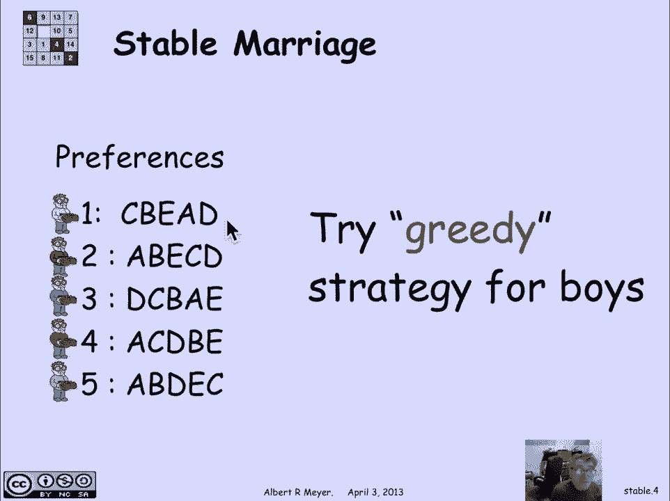

# 【双语字幕+资料下载】MIT 6.042J ｜ 计算机科学的数学基础(2015·完整版) - P62：L2.11.1- Stable Matching - ShowMeAI - BV1o64y1a7gT

we've seen graphs involving boys and，girls and connections between them in。

the context of our sexual demographics，calculation and study a similar problem。

comes up in terms of what it calls，stable matching which is again the issue。

of matching up boys and girls in a，special way according to some。

constraints it turns out to have a lot，of applications which we'll discuss。

towards the end let's just look at what。

the problem is the setup is that there's，some number of boys in this case five。

one through five and an equal number of，girls labeled a through e and each of。

the boys has a ranking of the girls，different rankings because different。

boys have different preferences and，likewise the girls have rankings of the。

boys different girls have different，preferences so here girl a likes boy。

three best and boy five second best and，boy one likes girls C best and girl。

'they least so the problem basically is，that we want to get all the boys married。

to all the girls we want to form five，monogamous bisexual marriages a boy and。

a girl and we'd like in some vague way，to acknowledge these preferences and。

satisfy as many as we can，I'll be more specific about that in a。

minute let's just play with that idea of，trying to accommodate people's。

preferences so one way to do it is let's，just decide will will favor the boys。

this time let's try a greedy strategy，than the boys let's just look at the boy。

preferences and we really strategy，because I'm gonna try to give each boy。

the best possible choice that he can。

make so I'm gonna start off by deciding，that let's let boy one have his first，choice girl's safe。

I'm gonna marry them off and once I've，married them off I'll just stop。

considering one in C and now I have a，reduced problem I've have for remaining。

boys and four remaining girls and，proceeding in this way greedy way for。

boys I'm gonna now give boy to his next，choice that remains namely girl a and。

I'll marry them off and again now to an，a the，it can be eliminated from consideration。

I continue in this way and I wind up，with this set of five marriages ending。

with boy 5 married the girl II okay now，if we look at this set of marriages。

there's a problem which motivates the，whole stable marriage problem that we're。

gonna be examining named examining，namely we've married off boy 1 to his。

first choice girls see he should be，happy but she may not be。

and we've also married off boy 4 to girl，B now a difficulty here is that if you。

look at the preferences girls see，actually is more desirable to boy 4 than。

than girl B girls see a boys boy 4 like，somebody else's wife better than his own。

and what makes it really bad is that，girls see the other person's wife likes。

boy 4 better than her husband each of，them would be better off if they ran off。

together they are whether they do or not，they certainly are under tremendous，pressure。

it makes the set of marriage is unstable，so they're called a rogue couple when。

you have in a set of marriages a boy and，a girl who prefer each other over their。

current spouses they are said to be a，rogue couple and a source of instability。

so the stable marriage problem is let's，see if we can get everybody married off。

and have no rogue couples it'll be a，stable set of marriages now people may。

not be happy but it doesn't matter，because they'll never find anybody else。

that sanity that is unhappy in the same，way that would be willing to run off。

with them and make them happier so it's，stable and it turns out that there。

always is a way to find a stable set of，marriages a couple of ways but why don't。

we just play with the idea here is a，display of those preferences again and。

you can stop the video and fiddle with a，piece of paper and see if you can come。

up with a stable set of marriages，between the boys and the girls we used。

to do this in class in real time we，would give a 5 different boy。

a chart of preferences of girls and we，give the five different girls a chart of。

preferences of boys they were not，supposed to tell each other what their。

preferences were but the girls were，supposed to be interviewing the boys and。

the boys interviewing the girls but，simultaneously in parallel and try to。

agree to get married and see whether the，set of marriages that they wound up with。

rest' able most of the time they，actually did wind up with a stable set。

of marriages but not always just an，amusing exercise and it does illustrate。

something about the fact that the，procedures that were going to be going。

through define stable marriages work。

very nicely if you choose to do them in，parallel anyway there are it turns out。

two sets of stable marriages um that we，can find in this particular set of。

preferences the simplest one to，understand is all the girls get their。

first choice it so happens if you look，at that chart all of the girls have。

different first choice boys if we simply，give them their first choice。

no girl is gonna be tempted to be part，of a rogue couple cause she's got our。

first choice it's absolutely stable but，of course that's a very special。

circumstance it would be unusual that，all the girls first choices were。

different or likewise it would be，unusual if all the boys first choices。

were different but if they were then you。

instantly get a stable set of marriages，there's another stable set that's not。

quite so obvious and you can check that，um that all of these pairs have no。

instability there's no rogue couples in，here when I marry five to a and one to e。

um this is a so-called boi optimal set，of marriages it turns out that in this。

set of marriages every boy gets the best，possible spouse that he could possibly。

get in any set of stable marriages，there's no set of stable marriages in。

which boy five gets a more desirable，girl than a there's no set of stable。

marriages in which boy one gets a girl，that's more desirable to him than girl。

II the sad news is that it's，simultaneously pessimal for the girls。

that is each girl is getting their worth，possible spouse among all sets of stable。

marriages we'll examine that further in，a minute but let me just point out that。

this is more than a puzzle I mean it's，fun and it is it's a nice puzzle but。

it's more than a puzzle because the，original case，where it was studied or published first。

was in a paper by Gale and Shapley in，1962 you remember that may remember the。

name David gale from the subset game，that we played early in the term when we。

were practicing with set relations and，what they were dealing was with the。

problem of college admissions where，students have rankings of colleges that。

they've applied to and their preferences，and colleges have rankings of students。

to whom that have applied to them and，we're trying to get matching up between。

college offers and student preferences，and in a circumstance where a college。

made an offer and a student's sort of，accepted but then later the student got。

a another offer from a place they，preferred more and they were changing。

their mind and withdrawing with a，acceptances and so on it was making，everybody crazy。

the administrators and the students，themselves and the desire was let's get。

some stable set of offers on the table，and Gale and Shapley proposed a protocol。

to get stable marriages that would apply，to college admissions it turns out。

interestingly enough that although Gale，and Shapley are credited with the stable。

marriage a solution that we're going to，discuss they they did that because they。

were the first to publish it but in fact，it had been discovered and put into。

practice at least 20 years earlier by a，national board whose job was to match。

interns and hospitals that is graduating，medical students who were about to start。

their further clinical training as，interns now called residents in modern。

language had to be matched up with，hospitals and the residents had。

preferred hospitals that they'd like to，go to and the hospitals had rankings of。

residents that met their criteria and，again the issue was how do you assign。

residents to hospitals in a stable way，before they had discovered this。

stability algorithm it was a mess again，there's a wonderful story in the book by。

Gus field and Irving that is an entire，book about the stable marriage problem。

published by MIT press I think in 89 and，as a matter of fact I was the editor of。

the series in which it appears this，stable marriage problem turns out to。

have a lot of structure and they，described a wonderful anecdote and in，their preface about。

problems that were happening between the，hospitals and the residents and the。

measures that were taken to try to，achieve stability before they discovered。

this algorithm another a genuine，computer science application is one that。

oh it was described by Tom Leighton who，is a co-author of the text and now the。

CEO of the of Akamai a an Internet，infrastructure plumbing company that has。

some large number of servers I think，65，000 servers in 2010 around the world。

and it basically is providing cached web，pages so that they can respond more。

quickly local calls they have a problem，that they get something like sixty two。

thousand sixty five thousand servers and，they get I think two hundred billion web。

requests a day so the web requests are，kind of acting like the boys and me and。

the servers are kind of acting like the，girls or the hospitals and the residents。

have based and the the web requests have，preferences based on proximity and speed。

of server and the servers have，precedence based on where they're。

located and the magnitude of the web，request that they're coming to and the。

question is how do you assign web，requests to servers so that things get。

done expeditiously and it turns out that，the stable marriage method gave a。

satisfactory way to accomplish that kind，of matching it also and in particular。

because there's such large numbers，involved that the stable marriage ritual。

which were described shortly is very，amenable to being run in parallel。

another application that turns out to，come up was in matching Vance partners。

when I was teaching this course ten，years ago with a with a co instructor。

who was a member of the Indian dance，team she said we could use this because。

it turns out that again there boy and，girl partners in the dance and it was。

constantly the case that one boy would，like another boys partner better and。

vice versa and they would start pairing，up and leaving the other people hanging。

and there were bad feelings and it was a。

disruptive source of disruption in the，in the society there's a picture of that，Indian dance group。

my co-instructor is not actually there，but it gives you a some sense of the。

reality of the problem here at MIT and。