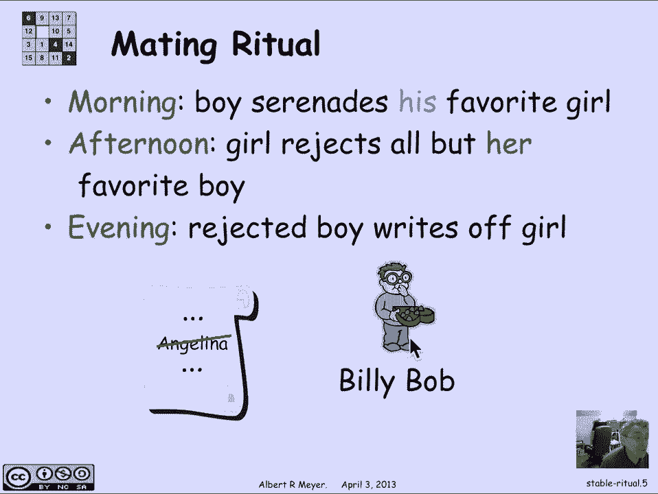
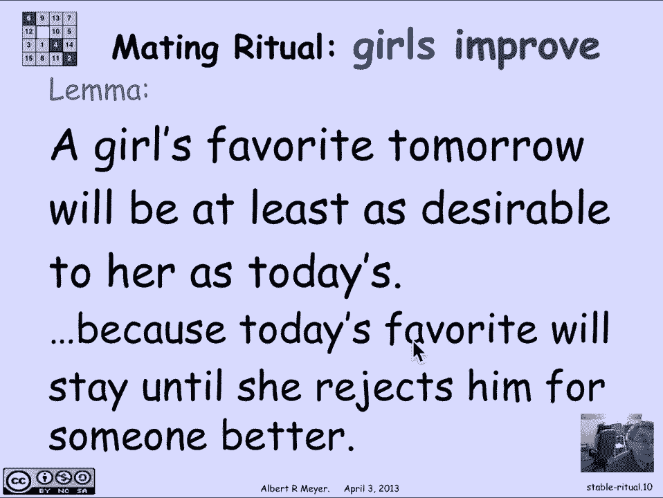
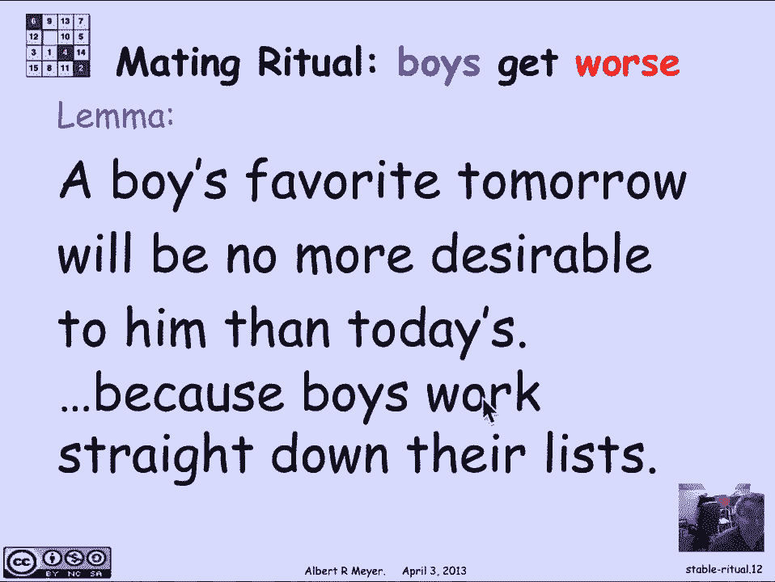
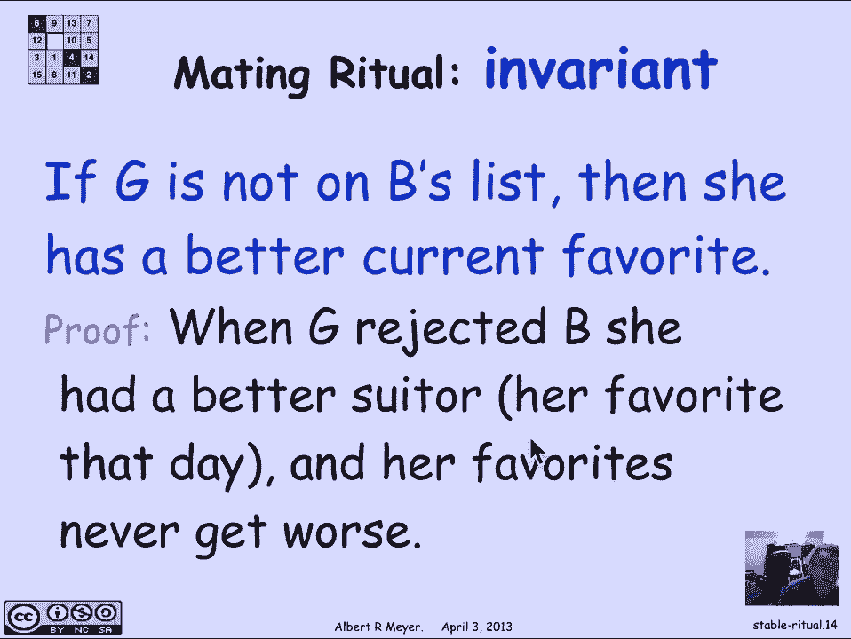
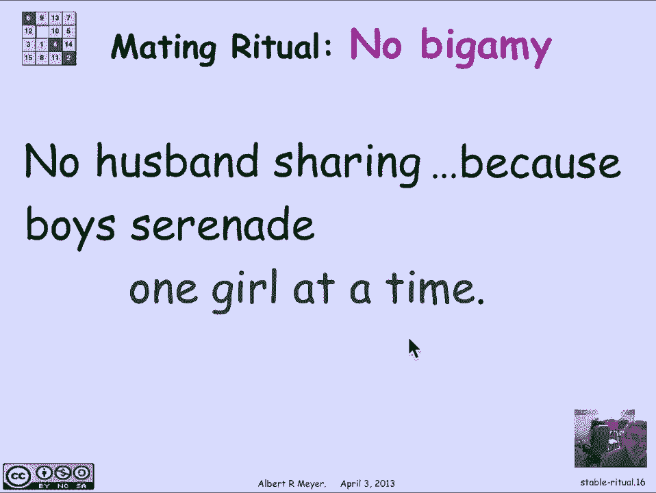
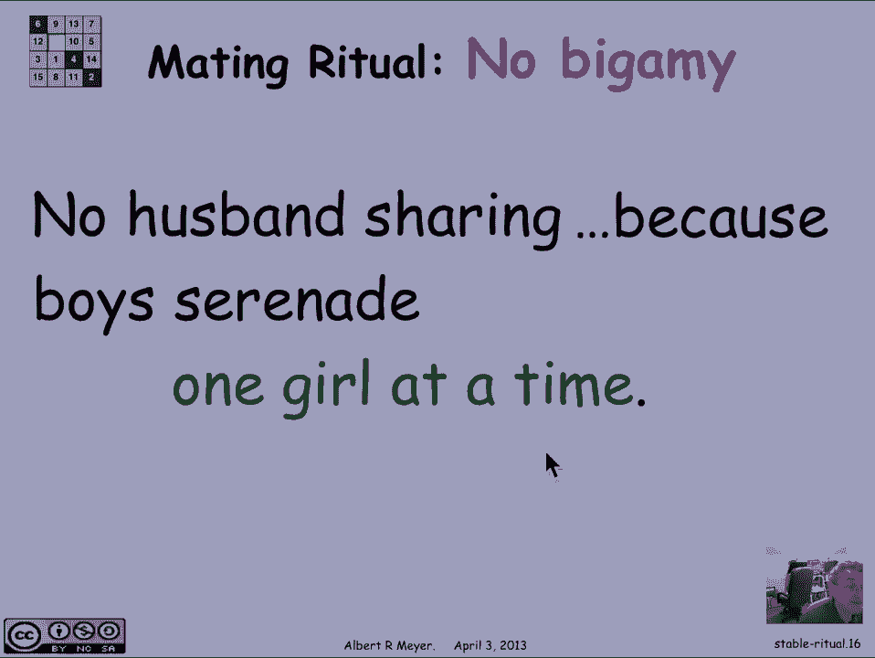
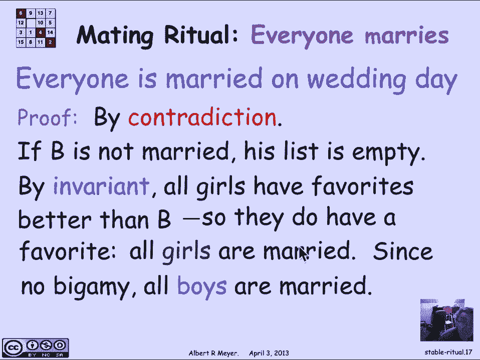
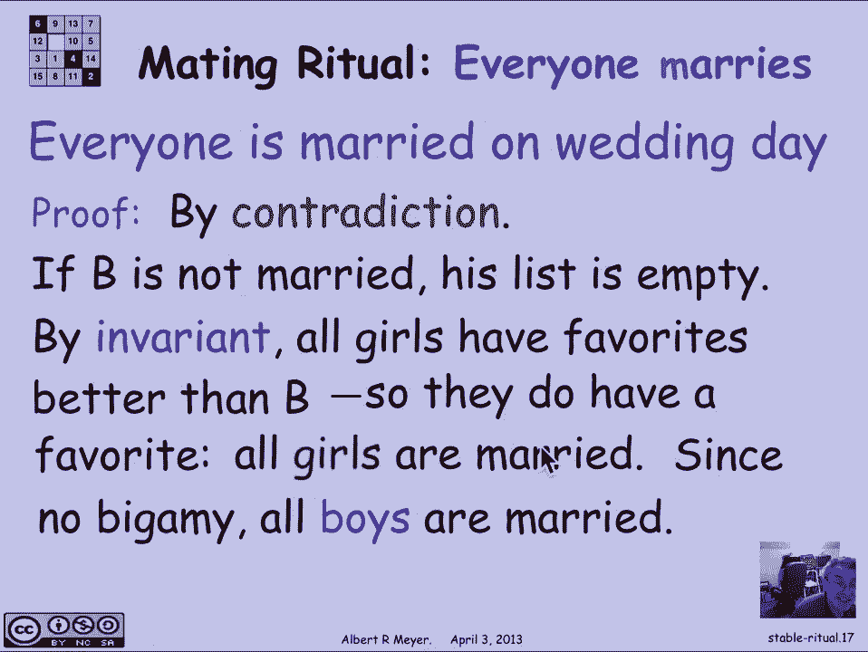
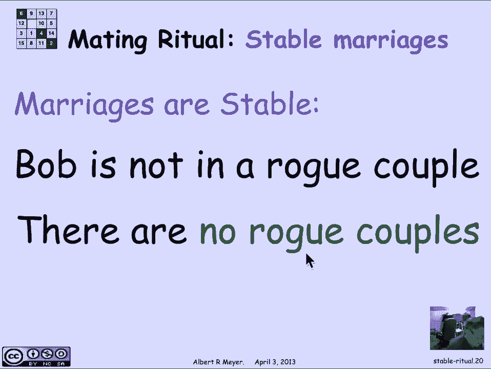

# 【双语字幕+资料下载】MIT 6.042J ｜ 计算机科学的数学基础(2015·完整版) - P63：L2.11.2- Matching Ritual - ShowMeAI - BV1o64y1a7gT

okay so how do we find these stable，marriages well there's a procedure for。

doing it which is kind of elegantly，described as a day-by-day mating ritual。

that the boys and the girls cooperate in，so let's see what happens on the first。

day on the morning of the first day each，boy looks at his list of girls and picks。

the one that he likes the best that at，the top of his list and he goes off and。

serenades her or proposes to her so here，we have Billy Bob and Brad proposing to。

Angelina that means that on the first，day Angelina was at the top of both。

Brad's list and Billy Bob's list and，they're both going to be proposing and。

asking if she's willing to marry them，well in the afternoon each girl rejects。

all but her favorite suitor so in this，case Angelina likes Brad best of all so。

she says to everybody else if you're not，Brad take a hike and that's what happens。

at that stage and then in the evening，here we look at rejected by her boy。

Billy Bob a boy who's rejected crosses，off the girl who rejected him so Billy。

Bob is gonna cross Angelina off his list，and then the whole ritual is going to。

repeat starting the next morning except，that now Billy Bob will have a different。

woman at the top of his list because，Angelina has gone forever。

okay this mating ritual continues until，nothing changes and that's gonna happen。

exactly when each girl has it most one，suitor because if she has more than one。

suitor she's going to reject the less，favorite ones so that is the definition。

of the stopping condition and on that，day by definition no girl can have more。

than one suitor so she will marry the，one suitor she has and that's the。

definition of the marriages that result，if and when the mating ritual stops and。

we claim that they are going to be，stable marriages now if we think about。

this process it's really a state machine，in fact if you think about it what the。

states are is the is the set of girls on，the boys list on any given。

morning and then those states evolved to，a new list after the crossing out。

happens on the next morning so this is，kind of a memorable way to tell a story。

about the transitions of a state machine，and we can bring our state machine。

concepts to bear so the first thing we，want to prove is that this state machine。

terminates that is to say there exists a，wedding day then we want to prove that。

this state machine is partially correct，and what that means that when the。

machine stops everyone is married and，that the marriages are stable so that's，our task。

well termination is easy because if you，look at the state the state is the boys'。

lists on a given morning and things，evolve because boys get rejected and。

they cross girls off the list so what，that means if we take the total number。

of names remaining on the boys lists on，any given morning that is a strictly。

decreasing a non-negative integer valued，variable so by the well ordering。

principle that's strictly decreasing，well ordered on derive area Bowl will。

reach a minimum value and by definition，that's when the algorithm has to stop。

because it's strictly increasing so it，can't move once it's reached its minimum。

so there's a wedding thing all right so，now let's examine correctness of this。

procedure and figure out what's supposed，to happen on the wedding day we want to。

show that everybody's married and that，the marriages are stable and in order to。

do that we're going to look at some more，derived variables and in variant that。

explains why the mating ritual works，so the first remark is that the girls。

improve day by day or at least they，don't get any worse namely a girl's。

favorite tomorrow will be at least as，desirable to her as her favorite today。

that's for any given day if you look at，a girl's favorite on this day and if。

there is it tomorrow then her favorite，tomorrow is going to be at least as good。

as the one she has and why is that well，because today is favorite。

we'll keep serenading her until he gets，rejected and he only gets rejected when。

the girl that he's serenading gets yet a，better suitor and so the girls are。

always gonna win probe we can，reformulate this in in state machine。

language by saying that the rank of a，girl's favorite where she rates the boy。

that's serenading her on her own list of，preferences is a weakly increasing。

variable it never gets any worse from，one day to the next，by the same reasoning or similar。

reasoning a boys favorite tomorrow is，gonna be no better than today is it。

might be worse and it's so it's no more，the woman then you're gonna say tomorrow。

is no more desirable to him than today，is basically because he worked straight。

down his list if he hasn't been rejected，he'll keep serenading the same woman。

tomorrow if he has been rejected then，he's gonna be working on somebody lower。

on his list that's less desirable so，again the rank of a girl on a boy that a。

boy serenades is a weekly decreasing，derive variable of this process and。

these observations lead us to an，invariant that holds for the mating。

ritual and the invariant is that if you，look at any girl gee and if there's a。

boy B and G is not on B's list that is G，must have been crossed off by B at some。

point then the invariant is that the，girl G has a favorite that is better。

than than B and the reason is that again，when G rejected B she had a better。

suitor than B and her suitors keep，getting better by the weekly increasing。

property of her suitors and therefore，she's gonna have a suitor that she likes。

and we better than B whose list she's，not on this holds for all Gees and B's。

and that is an invariant from one day to，the next so let's look at what happens。

on the wedding day and use the invariant，to prove that everybody's married and。

that stability holds so the first remark，is that each girl has it。

most one suitor and we've observed that，spy definition of a wedding day and now。

what we want to prove is that um uh each，boy gets married well what's going on。

with a boy a boy is either married，because he's serenading the top woman on。

his list or maybe all the other women on，his list have been crossed off then he's。

not Sarah nany s serenading anybody so，that's the only way that he could be not。

married now the reason that this is the，case is that there's no bigamy here so。

um boys serenade only one girl at a time。

so if a boy is married there's only one，possible woman that he can be married to。

and a woman is only married to one，possible boy so let's now put these。

facts together and argue that everybody，is married on the wedding day and the。

proof is by contradiction suppose，there's some point B that's not married。

well that happens exactly when his list，is empty otherwise he'd be serenading。

somebody and may it be married to her，but if his list is empty by the。

invariant every girl has a suitor that，she likes better than B which means。

she's gonna be married to somebody that，she likes better than B every girl's。

married but there are the same number of。

boys and girls so in fact given that，there's no bigamy all the boys have to。

be married to and that settles that one，so the next crucial property that we're。

interested in is stability that in fact，this set of marriages which must come。

into being on the wedding day are all，stable and the argument for stability。

has two cases both of them trivial and，that follow immediately from the。

invariant um first of all let's look at，an arbitrary boy Bob I claim that he。

won't be in a rogue couple with case one，any girl G that's on his final list。

because if a girl is on his final list，then he's already married to the best of。

them he marries the girl at the top of，his list so he's not going to be tempted。

to switch to be part of a rogue couple，with some girl that's uh still on。

list k-stew is he's not gonna be in a，rogue couple with a girl that's not on。

his list because by the invariant she's，married to somebody she likes better。

than him so there's no available girl，either way for Bob to be in a rogue。

couple with Bob of courses an arbitrary，boy and therefore no boy is in a rogue。

