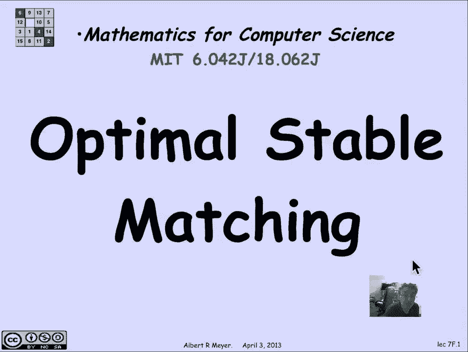
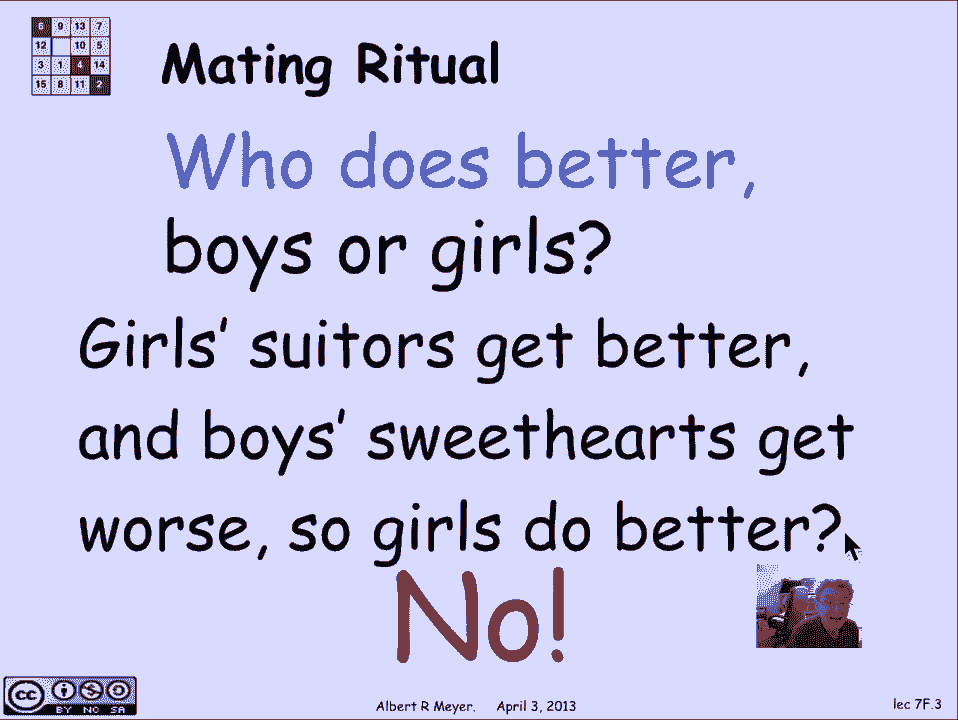
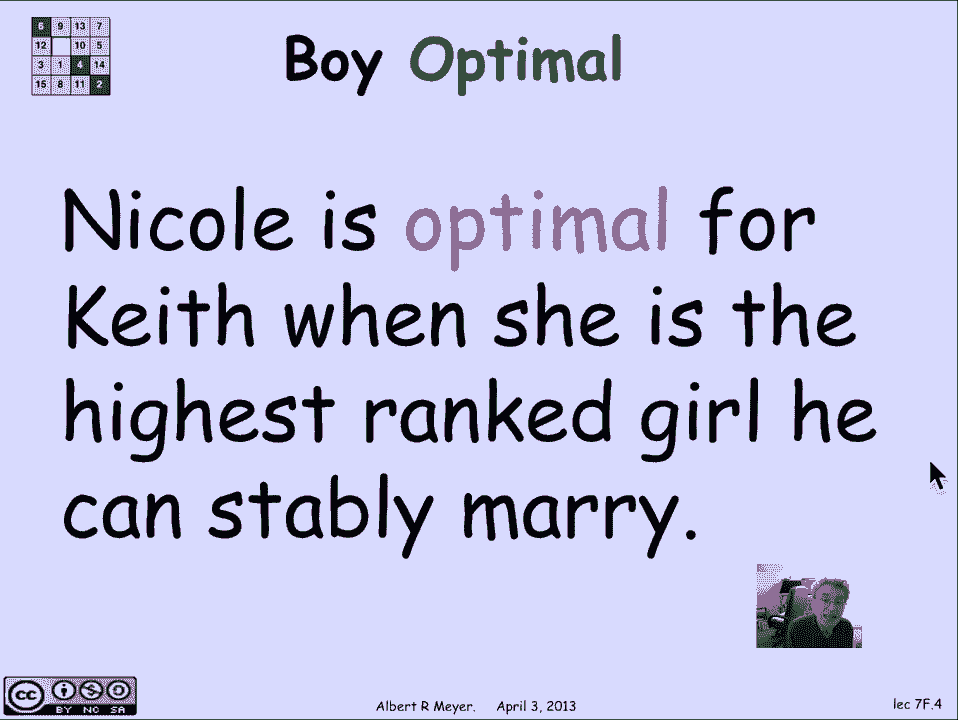
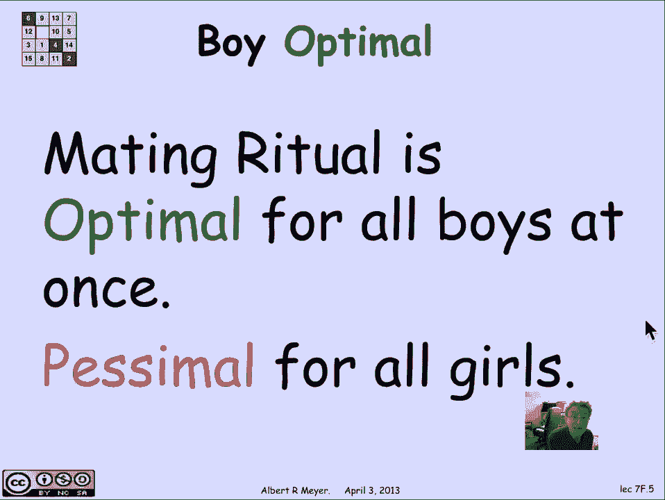
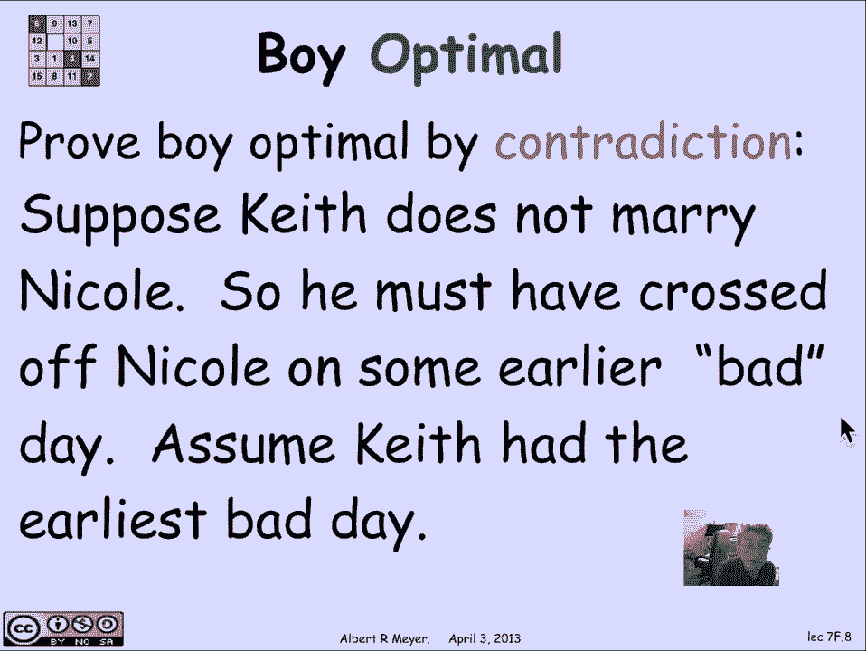
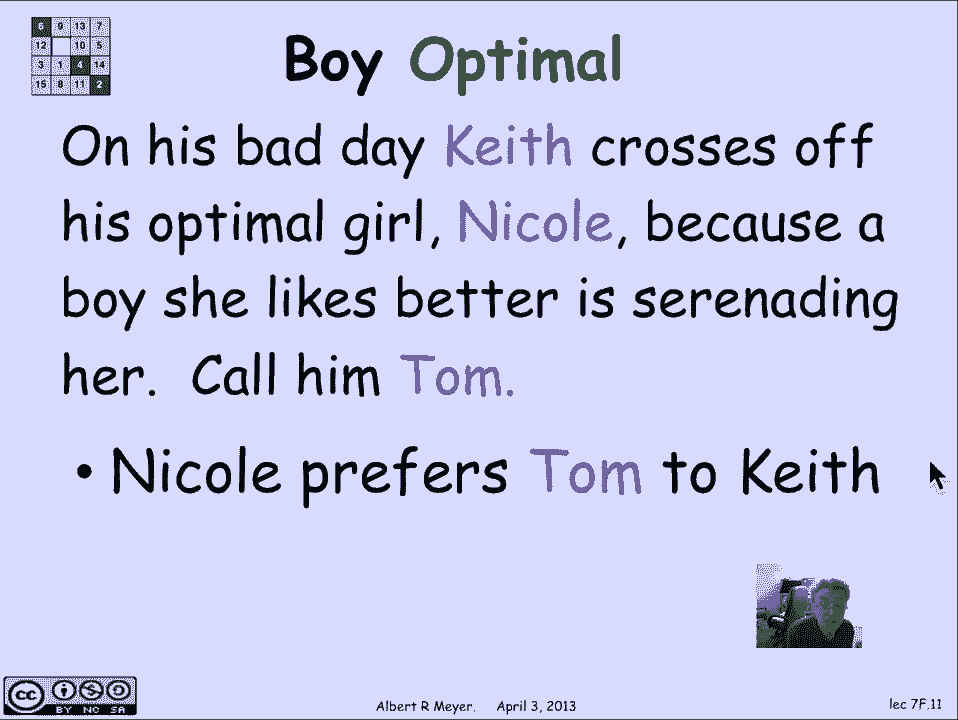
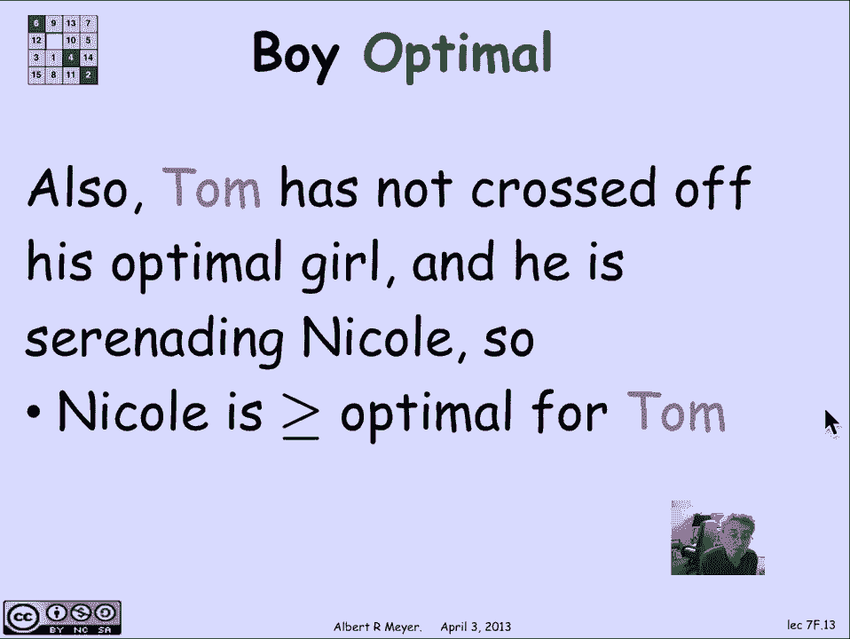
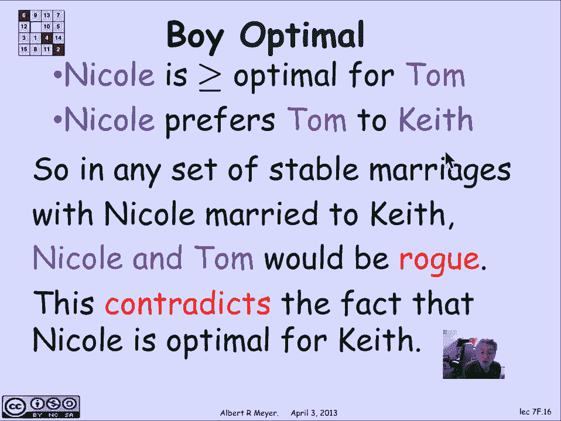
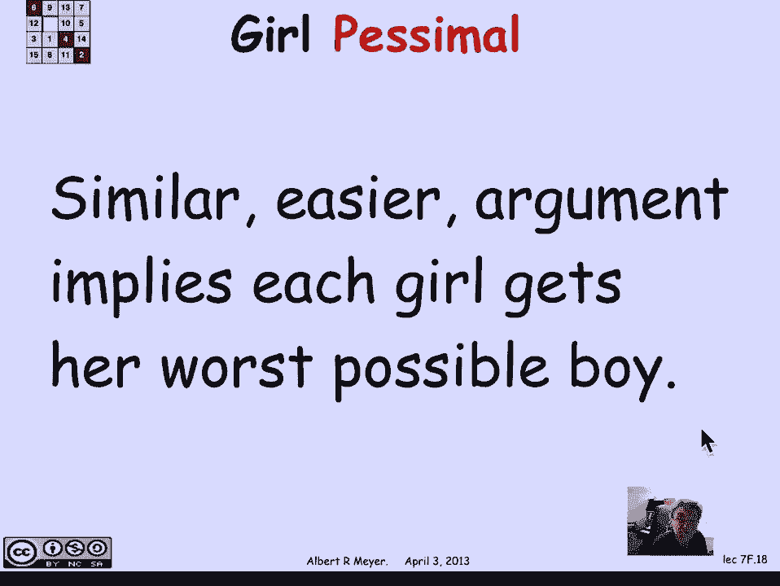
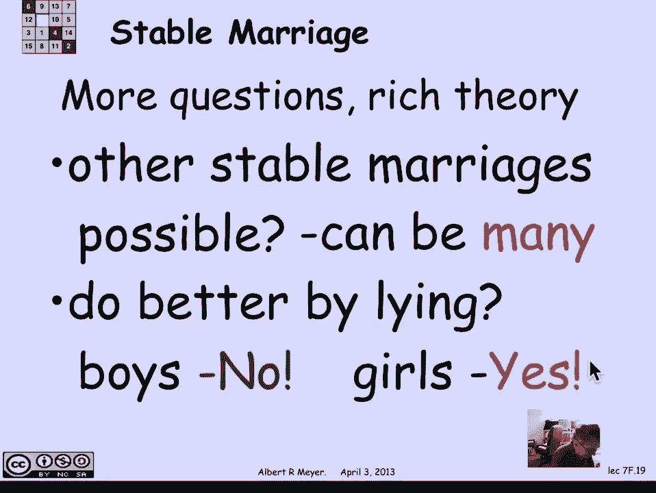

# 【双语字幕+资料下载】MIT 6.042J ｜ 计算机科学的数学基础(2015·完整版) - P64：L2.11.5- Optimal Stable Matching - ShowMeAI - BV1o64y1a7gT

所以稳定性是有一定价值的，但这并不意味着每个人都快乐，事实上，这只是意味着没有人能找到其他同样不快乐的人，他们会想带着，所以让我们来研究一下人们在交配仪式上做得有多好的问题。

或以其他可能的方式找到稳定的婚姻。

所以基本上我们想从谁做得更好的问题开始，男孩和女孩也许是混合体，也许男孩们做得更好，女孩们做得更好，也可能有些男孩比其他人做得更好，有些女孩比其他人做得更好，要注意的一点是。

我们知道女孩们的追求者一天比一天好，听起来像是，你知道的，交配仪式可能会向他们倾斜，同样地，男孩们的心上人是他们唱小夜曲的人，情况一天比一天糟，这听起来可能是女孩们做得更好的理由，但那不是真的。

不是的原因是如果你仔细想想，男孩们从他们的第一选择开始，他们从给名单上最重要的女孩唱小夜曲开始，的确，他们一天天在下降或保持不变，或者往下走，但他们只会下沉到，事实上，他们可能娶的最好的女人，嗯。

让我们检查一下，所以我需要一个定义，那就是我们会说一个女人妮可被称为基思的最佳人选，当她是排名最高的女孩，他可以稳定地结婚，所以让我们考虑一下，所以基思喜欢不同的女孩，他喜欢的程度不同。

可能会有一些他喜欢的喜欢的，基思认为安吉丽娜很棒，但她不可能和他在一起，因为她只是把他排在很低的位置，所以没有稳定的婚姻，其中基思可以结束与这个非常令人向往的女人安吉丽娜，但是嗯。

如果你看看所有稳定的婚姻，基思可以参与其中，妮可是他最喜欢的女人，这就是我们所说的妮可最适合基思，她是他能稳定结婚的理想女人中的最佳人选。

我们所提出的主张，交配仪式产生了一系列稳定的婚姻，这对基思和其他男孩来说同时是最佳的，现在这是一种不寻常的事情，你通常，当你优化的时候，你觉得，你最适合一个男孩，它牺牲了其他男孩的最佳状态。

但这不是交配仪式中发生的事情，所有的男孩都在交配仪式中得到了他们绝对理想的配偶，结果所有的女孩都得到了最糟糕的配偶，他们可以在所有可能的稳定婚姻中找到一个悲观的配偶，好吧好吧，理解了这一主张。

让我们来证明一下，我们将证明交配仪式导致男孩，矛盾最优婚姻，所以让我们假设妮可是基思的最佳选择，在所有基思可能以稳定的方式结婚的女人中，妮可是最好的，假设基思没有和妮可结婚，在一些交配仪式中，好的。

所以他不娶妮可，在交配仪式中，这意味着他一定有，因为妮可是基思的最佳选择，他一定是嫁人了，那对他来说不如妮可受欢迎，所以他一定在某一天把妮可划掉了，让我们称之为他糟糕的一天，所以在他糟糕的一天，基思。

在呃，如果发生这种事，会有一个男孩有最早的糟糕的一天，我们不妨假设是基思，所以让我们假设这是男孩中最早经历糟糕一天的人。

那是他把他的最佳配偶划掉的一天，因为他被她拒绝了，在这个糟糕的日子里，当基思把妮可划掉的时候，因为妮可拒绝了他，这意味着妮可有一个比基思更喜欢的追求者，让我们叫那个求婚者汤姆吧。

我们知道妮可更喜欢汤姆而不是基思，在她拒绝基思的那天。

他把她划掉了，我们也知道，因为这是任何人最早的糟糕的一天，汤姆还没有把他的心上人划掉，所以这意味着既然他在为妮可唱小夜曲，她最终会拒绝基思而选择汤姆，妮可至少和汤姆一样受欢迎，作为他的最佳配偶。

因为他还没有找到他的最佳配偶，但他在名单上努力工作，他还没有过糟糕的一天。

所以让我们把这两块拼在一起，妮可至少和汤姆的最佳配偶一样受汤姆的青睐，妮可更喜欢汤姆而不是基思，这告诉我们，如果我有一套稳定的婚姻，妮可嫁给了基思，然后在稳定的婚姻中，当然啦。

汤姆将要和一个最适合他的人结婚，所以他和某人结婚了，他不喜欢妮可，妮可嫁给了基思，她喜欢汤姆胜过喜欢谁，她嫁给了，这告诉我们妮可和汤姆是一对流氓夫妇，在任何稳定的婚姻中，妮可和基思结婚。

但这与妮可被认为是基思的最佳选择这一事实相矛盾，应该有一套稳定的婚姻，妮可和基思结婚的地方。

所以类似的论点，其实稍微容易一点，交配仪式产生了一系列稳定的婚姻，所有的女孩都得到了最糟糕的配偶。

他们可以在任何稳定的婚姻中拥有，好的，所以这就引出了一大堆问题，事实证明，有一个非常丰富的稳定婚姻理论，正如我提到的，嗯，第一个要问的问题是好的，还有其他可能的稳定婚姻吗，嗯，你显然可以做的一件事是。

你可以切换男孩和女孩的角色，所以如果你转换角色男孩和女孩，你会有一段稳定的婚姻，对女孩来说是最好的，对男孩来说是比索莫，也许那样更公平，你宁愿那样做，所以至少有可能利用交配仪式得到两个不同的。

稳定的婚姻，除非两者碰巧是一样的，问题出现了，还有其他可能存在的，交配仪式也找不到，通过选择男孩扮演男孩或男孩扮演女孩，答案是，一般来说，事实上可以有很多，如果有N个男孩和女孩，有可能。

在n中可能会有指数级的稳定婚姻，这就引出了井的问题，哪一个可能是更好的选择，与完全偏爱男孩或完全偏爱女孩的相比，嗯，另一个有趣的问题出现了，这是个问题，提出了多方协商和优化的通用协议。

撒谎对任何人都有好处吗，这不是遵循协议，而是总是去，男孩们总是为他们最喜欢的女孩唱小夜曲，女孩们总是拒绝，任何比他们最喜欢的追求者更不受欢迎的人，假设他们违反了惯例，撒谎，他们能做得更好吗，事实证明。

当然，在交配仪式中，男孩们做得最好，所以他们试图撒谎不会得到任何东西，但是女孩们，事实证明，几乎是这样，女孩可以通过撒谎做得更好，如果他们，如果他们合谋撒谎，它们实际上可以迫使交配仪式结束。

变成一套稳定的婚姻，那是女孩的最佳选择，所以这就提出了另一个问题，有拒绝撒谎的协议吗，嗯，我们不打算讨论这些问题，我们主要想了解稳定的婚姻问题，它有它的应用，以及如何再次找到他们。

如果你想了解更多关于这个的信息，你可以看看格斯菲尔德和欧文的书。

