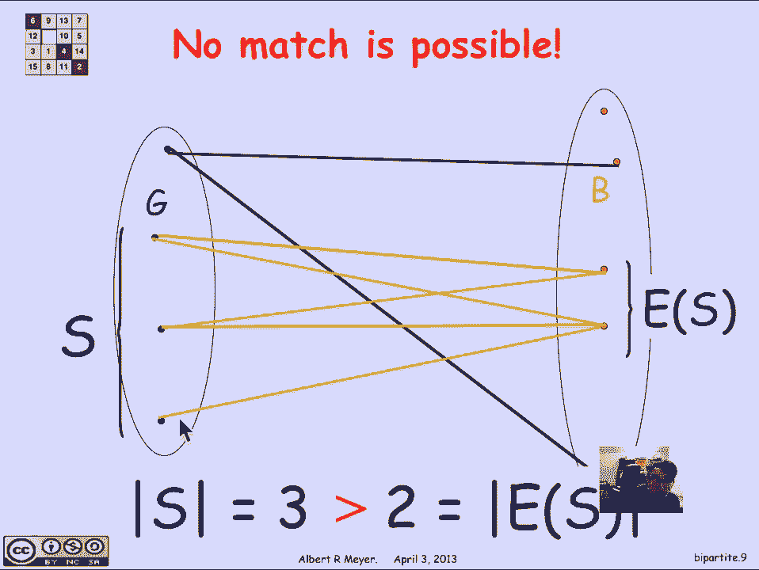
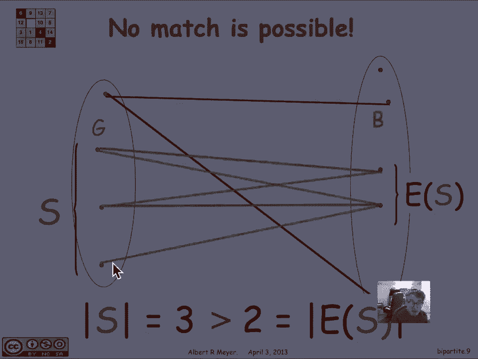
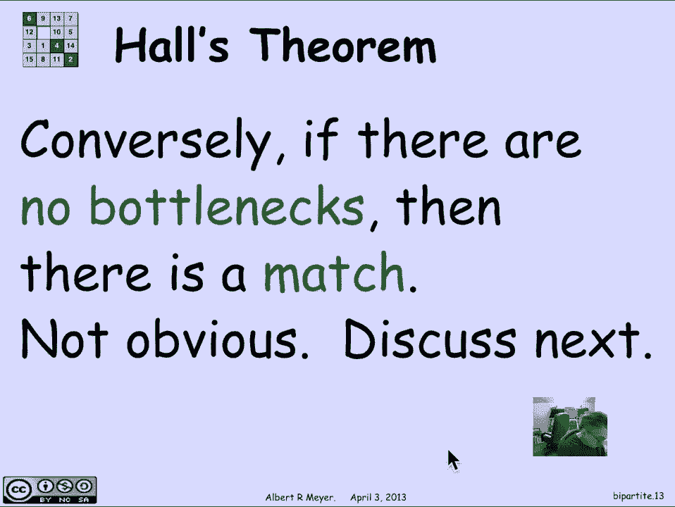

# 【双语字幕+资料下载】MIT 6.042J ｜ 计算机科学的数学基础(2015·完整版) - P65：L2.11.7- Bipartite Matching - ShowMeAI - BV1o64y1a7gT

我们刚才看到的稳定匹配问题，是二部匹配问题的一个例子，因此，具有二部匹配问题的设置是，你有一个简单的图表，顶点分成两组，就像在貂皮匹配问题中一样，我们可以叫他们女孩和男孩，G和B。

所以二部图的定义是一个有一些顶点的图，称为左顶点，和一组不相交的顶点称为右顶点，每个顶点不是左就是右，边只在左顶点和右顶点之间，现在在这种情况下，我们要考虑的匹配问题是有一个规范。

每个女孩都愿意和某些男孩配对但不是所有人，所以我们可以通过添加边来指定，如果这是名单上的第一个女孩，她愿意和第二个男孩和最后一个男孩配对，这就是这两条边所表明的，所以边缘是信号兼容性。

对女孩和男孩匹配的限制，我们试图实现的目标，让所有的女孩都匹配一个独特的男孩匹配，每个女孩给一个独特的兼容男孩，所以有一个匹配的例子，每个女孩身上都有一个突出的洋红色边缘，他们去了不同的男孩。

所以我们正式地想要女孩和男孩的双射，那就是很好地遵循边缘，让我们看一个案例，我找不到匹配的，假设那条边不见了，我们在比赛中使用了边缘边缘，但让我们假设它不在那里，让我们把它处理掉。

我们现在发现最后一个女孩已经无法匹配，成为第二个男孩，也就是我们之前的，所以说，让我们试着找到其他匹配的，没有任何，原因是如果你看左边的三个女孩，你看看右边所有的男孩，它们共同兼容。

那是三个女孩中的一个，至少愿意和右边的一个男孩配对，只有两个男孩必须由三个女孩分享，这就是所谓的瓶颈的一个例子，所以我们有三个女孩，总的来说，他们只喜欢两个男孩，只是没有足够的男孩来照顾这些女孩。

这证明了匹配是不可能的，嗯，所以更一般地说，如果你有一套，左边的女孩，你看S在边缘关系下的图像，那是S的E，这是所有男孩的集合，与S中的一个或多个女孩兼容，那么每当你有这样，我们之前有一个例子。

其中s是三，s中的e是二，因为三大于二。

因为s大于s中的e，我们遇到了瓶颈，我们不可能找到匹配的。

更一般地说，瓶颈的定义是，如果你有一组，其中s的大小大于s的图像的大小，那就是所谓的瓶颈，我们可以做的第一个观察是瓶颈，引理说，嗯，瓶颈是一群女孩没有足够的男孩，大于被称为瓶颈的s的e，当有一个。

不可能匹配，很明显，是啊，是啊，所以这就是为什么可能没有匹配的原因，有一个瓶颈，现在一个相当深刻的定理是，反过来说，如果没有瓶颈，那么事实上有一个匹配，这就是众所周知的霍尔定理，不太明显。

尽管我们会找到一个可以理解的证据。

