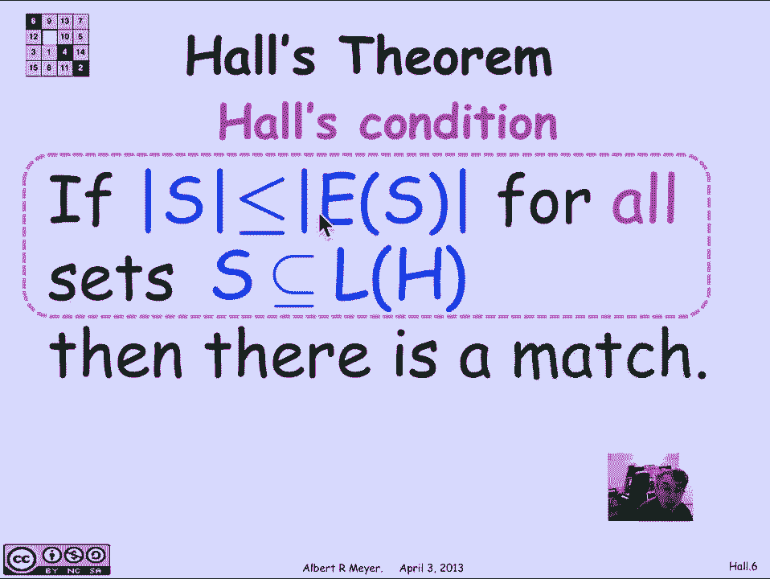
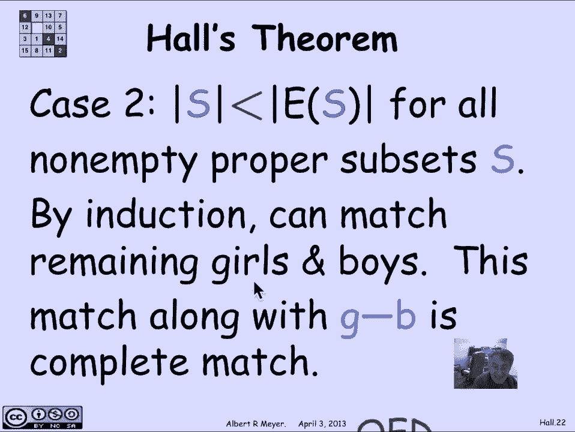
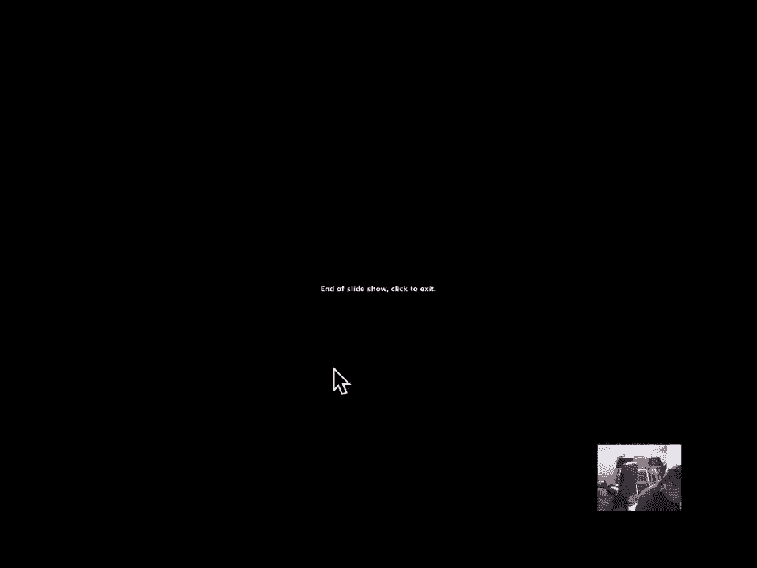

# 【双语字幕+资料下载】MIT 6.042J ｜ 计算机科学的数学基础(2015·完整版) - P66：L2.11.9- Hall's Theorem - ShowMeAI - BV1o64y1a7gT

so let's get set to state halls theorem，in a way that doesn't mention boys and。

girls but let's remember the girl boy，set up to start so in the general setup。

is a bipartite graph H and a bipartite，graph has two sets of vertices the girl。

vertices and the boy vertices formally，there's a set L of age called the left。

vertices of H and a set R of H called，the right vertices of age the vertices。

of H all together are elevates Union R，of H both of these are non empty and。

they don't overlap then the edges of H，have the property that they only go。

between L of H and R of H that is the，definition of a bipartite graph now。

we're interested in a matching in a，bipartite graph so let's be precise。

again of what's a matching without，having to mention boys and girls and。

likes a match is a total injective，function from the left vertices to the。

right vertices so that means every on L，vertex or girl has a match M of L that。

is on the other side so and we we need，this total injective function match。

function M to follow the edges what does，follow the edges mean precisely it。

simply means that the edge L M of L is a，legitimate edge of H another way to say。

that is that the graph of this total，injective function is a subset of the。

edges of a so we can state the no，bottleneck condition halls condition as。

follows if the size of s is less than or，equal to its image under the edges for。

every set of left vertices H that's，called halls condition that the size of。

s is less than or equal to the image of，s for every s then there is a match so。

this is a way of precisely stating halls，theorem no boys and girls mentioned will。

be comfortable going back to the，boy/girl language because it's it's more。

memorable and easier to talk about but，just for the record we have now formally。

stated defined bipartite graphs matches，in bipartite graphs and halls theorem。

halls theorem really that。

there is a match when halls condition is，satisfied without mentioning boys and。

girls okay the puzzle is how do you，verify that there are no bottlenecks。

it's pretty hard the bottleneck，condition involves checking that every。

subset s of L of H satisfies this，cardinality condition and there are a。

lot of subsets of L of H relative to the，size of the graph exponentially many so。

we can ask how do you verify that there，are no bottlenecks well it turns out in。

algorithms classes you will learn a，fairly efficient matching procedure runs。

about quadratically for finding Mak，perfect matches when they exist but。

there's one particular special case that，ensures no bottlenecks that will have to。

make that will be making use of several，times in the term and that special。

situation is when it turns out that，every girl likes at least D boys and。

every boy likes at most D girls this is，called a degree constrained graph if a。

graph is d constrained is degree，constrained then there are no。

bottlenecks so this condition that there，are at least the each girl likes at。

least D boys and every boy likes it at，most D girls could have been rephrased。

as saying that the minimum degree of the，girls is greater than or equal to the。

maximum degree of the boys but I think，expressing it in terms of D is maybe。

makes it a little clearer okay let's，prove this I'm gonna prove that if you。

have a deconstruct agree constrained，bipartite graph then in in fact。

satisfies halls condition there are no，bottlenecks so we have that if every。

girl likes at least D boys and every boy，likes and most D girls there are no。

bottlenecks the proof goes as follows，let's look at some arbitrary set s of。

girls and suppose that the total number，of edges that are incident to s are。

it has cardinality e there are e edges，that touch vertices in s okay well that。

tells us that since every vertex in s，has at least B edges out that may be。

more the times the size of S has to be，less than or equal to the total number。

of edges coming out of s likewise all of，the edges that come out of s go by。

definition into a of s and each vertex，in a of s can only absorb the edges。

TGIRLS so that means that the total，number of edges absorbed by E of s that。

is at most the times a of s had better，be bigger than the number of edges that。

have to be absorbed e so we get that d，times the size of s is less than or。

equal to the total number of edges，incident to s which is less than or。

equal to D times this total the total，number of vertices in a of s but cancel。

the DS and we have that the size of s is，less than or equal to the size of its。

image that's the definition of a，bottleneck the violation of that would。

be a bottleneck this says there's no，bottlenecks and we have proved the。

degree constrained condition is，sufficient to verify halls condition and。

by halls theorem it's sufficient to，guarantee that there is a match now。

there's a lot of graphs with matches，that are not degree constrained this is。

not an if and only if theorem it's just，a sufficient condition that comes up。

often enough that it's worth mentioning，the Greek constrained implies halls。

condition is satisfied which implies，that there's a perfect match so let's。

turn now to the general case of halls，theorem and let's talk about proving。

halls theorem halls theorem says that if，there's no bottleneck then there is a。

match so let's begin by setting up a，lemma that will play a crucial role the。

strategy for showing for proving it is，basically going to be to try to break。

the problem of finding a match for a，large set of vertices into subproblems。

of finding matches for smaller sets，vertices and by-and-by strong induction。

halls condition will apply to the，subsets and will win let's look at that。

more carefully so let's begin by，supposing that there are no bottlenecks。

in some bipartite graph H well in，particular if there's no bottlenecks。

anywhere then if you restrict yourself，to some set s of girls no subset of that。

set s is gonna have a bottleneck，obviously because a bottleneck within s。

would be a bottleneck within the whole，graph so that part's trivial what's not。

trivial and takes a little bit of，arguing is that suppose you have a set。

of girls that with the property that the，number of boys that are compatible with。

that set of girls is exactly the same as，the number of girls so technically the。

size of s is equal to the size of a of s，in that case we can argue that there。

aren't any bottlenecks within the，complement of s and the complement of V。

of s either well let's look at a picture，to illustrate what's going on so here we。

have a bipartite graph and there's s and，it's image on the right a of s ok now。

we're interested in and we know that a，bottleneck here would imply a bottleneck。

in the whole graph what we want to argue，is that a bottleneck in the compliment。

of s would imply a bottleneck in the，complement of V of s so there's the。

complement of e of s and there's the，complement of s now notice that some。

edges that come out of the complement of，s may very well go into e of s that is。

this would be a point that's both in E，of s and in e of s complement but we're。

not allowed to use that point because，we're trying to find a match only within。

s bar and E of s bar and and what we're，really trying to argue is that a。

bottleneck here would imply a bottleneck，in the whole graph so let's see if we。

can argue this there's no we want to，claim that there's no bottleneck between。

s bar and EF s bar given that there's no，when s and e of s are the same size so。

let's suppose that we had a set T over，here that was a subset of s bar and。

let's look at its image over here in，orange so we've got that the image of。

this set T when we restricted just to，the part that's in the complement of s。

notice I'm leaving out this point here，I'm not taking the image of T I'm taking。

the image of T restricted to the points，that are not in the image of ass and。

what I want to know is could that cause，a bottleneck after all I've left out。

some points that used to be included in，the image of T and so the image of T。

might have been small so the image of T，might have been bigger than T because of。

those extra points that I'm leaving out，I have to be sure that that doesn't。

happen could there be a bottleneck，that has been created by these points。

that I've left out could there be a，bottleneck in a of T intersection a。

compliment of e of s could that orange，guide be a bottleneck，well if it was a bottleneck then I'd。

have a bottleneck in the whole graph and，that's because s and e of s are the same。

size because all I do is if I had a，bottleneck there I would take this set T。

along with s and this set orange along，with a of s and that would be a。

bottleneck because now if you look at，the size of T I've added the same amount。

to the size of T as I've added to that，arm set because e of s and s are the。

same size so if this orange part was，smaller than T then orange part along。

with e of s is smaller than T Union s，and that defines a bottleneck in the。

whole graph so again if there was a，bottleneck in here caused by restricting。

images to the compliment to V of s it，means that was a bottleneck in the whole。

graph if there's no bottleneck at all，then indeed there's no bottleneck in。

this other part of the complement of s，and the complement of V of s and this。

gives me a hook on proving halls theorem，because that's basically the way I'm。

going to split the problem into two，separate matching parts so let's now，proceed to prove。

if there are no bottlenecks in a graph，then there's a perfect match and it's。

going to be by strong induction on the，number of girls so case one is the case。

that we just examined that there's a，non-empty subset of girls a proper。

subset not all the girls some subset of，girls know who that another way to say。

it is there's a subset of girls that's，not empty and it's complement does not。

empty either and the size of s is the，same as the size of EFS that is the。

number of boys that are compatible with，this set of girls is exactly the same。

size as this set of girls well if，there's going to be a match there has to。

be one in that subset and um by the，lemmas they'll be if there's no，bottlenecks anywhere there's no。

bottlenecks when I restrict myself to，just s and e of s and also by the，previous lemma。

there's no bottleneck in the complement，of s and restricted to the the vertices。

in EFS so this is a new bipartite graph，where I'm using s for the left vertices。

and E of s for the right vertices and，here I'm using the complement of s for。

the left vertices and the complement of，e of s for the right vertices and we and。

the previous lemma says that if there's，no bottlenecks overall there's no。

bottlenecks in either of these two，restricted graphs so what I can do now。

is by induction since there's no，bottlenecks in se of s I can find a。

match there so I can match up all of the，girls in s with compatible boys in II of。

s and I can match up all of the girls，that are not in s in the complement of s。

with boys that I haven't used already，and there'll be a perfect match there。

and then these two separately will，combine will provide a match for the。

entire set of left vertices s Union the，complement of s will be all of the。

vertices so and these two matchings，don't overlap so they they're combining。

them gives a complete matching that，knocks off this case that's the nice。

case where I can find some subset where，the number of boys is exactly equal to。

the number of girls which means that，that has to work by itself and。

work that one by itself and what's left，over by itself and that's how I can find。

an overall match the second case is that，there isn't any set of girls which are。

compatible with exactly the same number，of boys well since halls condition holds。

that means that every set of girls，actually has to be compatible with a。

larger set of boys than the number of，girls that is for every set s the size。

of s is strictly less than the size of，EFS for every non-empty and proper。

subset s well in that case actually，finding a match is easy because now I've。

got slack what I can do is just pick an，arbitrary girl caller G and she's got to。

be compatible with it with at least one，boy because there's no bottlenecks in。

fact in this case you'll actually be，compatible with at least two boys but。

all we need is one boy since there's no，bottlenecks if I pick a girl she's got。

to be compatible with some boy and I'm，just going to arbitrarily match her with。

that boy match G with B now the，consequence of that is that if I now。

remove G and B from the graph I am left，with a graph in which at worst I've。

shrunk the set e of s by that girl that，I've matched with B which means that P。

of S which used to be strictly greater，than s has gone down by at most one it's。

still greater than or equal to e of s so，I'm left then the graph after I've。

removed this G with paired with an，arbitrary be that she's compatible with。

I'm left with a graph that satisfies，halls condition and that has one fewer。

boy hurt that girl vertex and so it has，no bottlenecks and therefore it has a。

match and that match in the sub graph，where I've taken out G and B when I put。

back the match when I add the part of G，matching with B it's a match for the。

whole graph and that's how I get it that。

