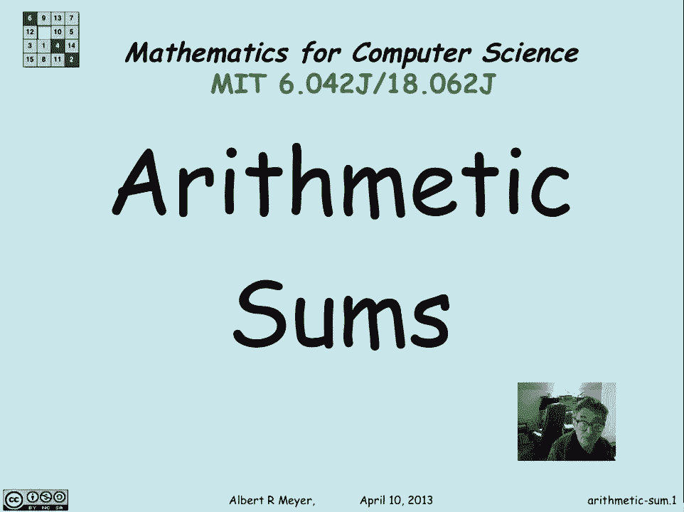
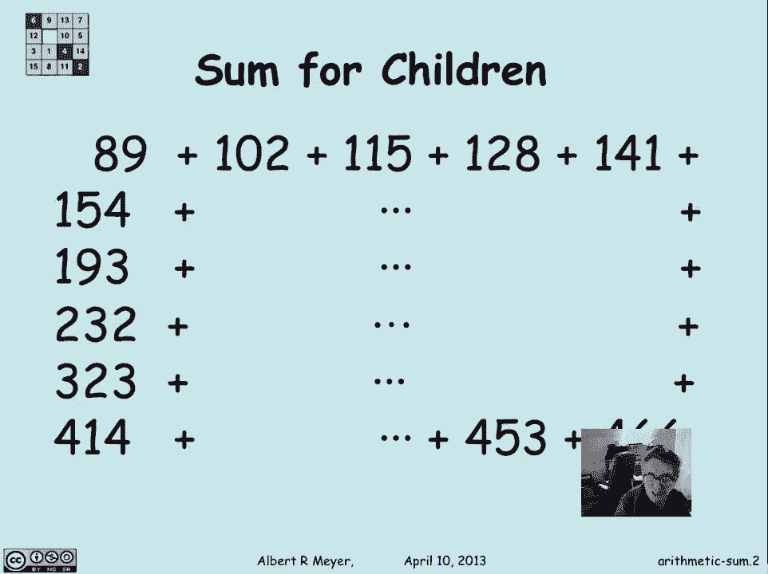
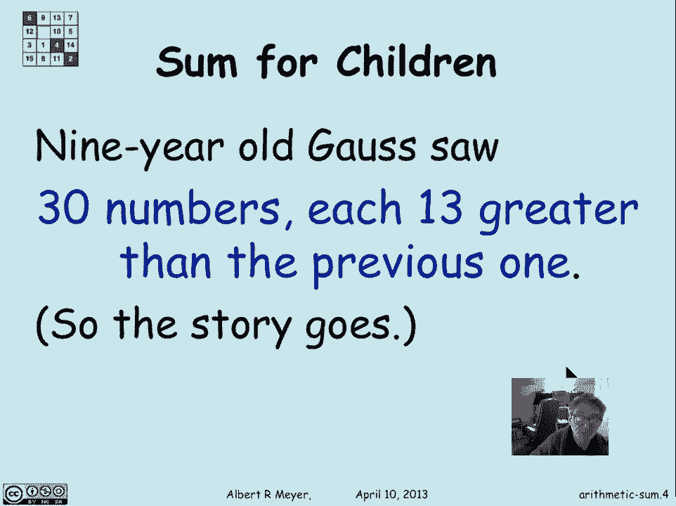
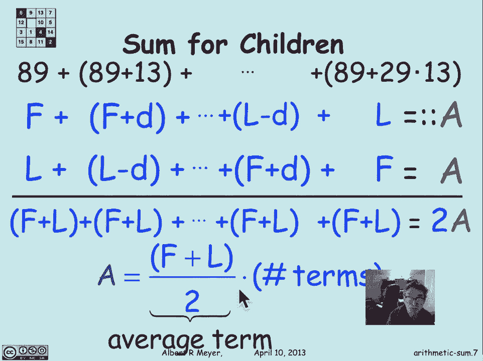
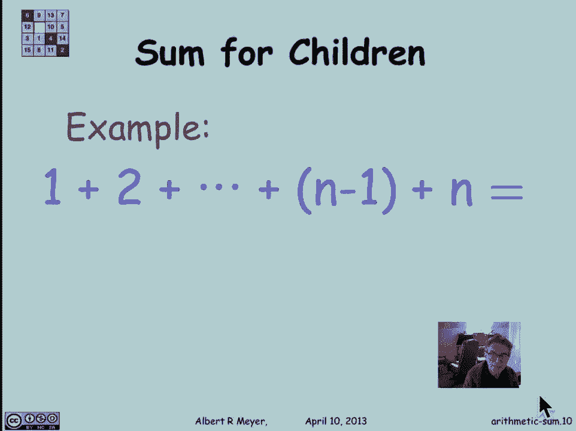
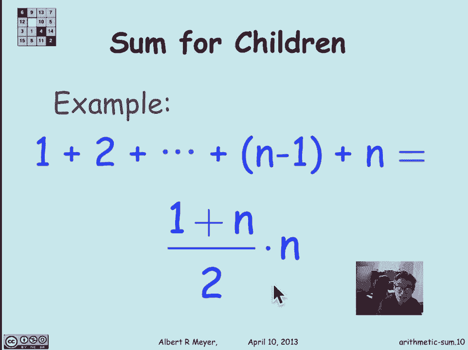

# 【双语字幕+资料下载】MIT 6.042J ｜ 计算机科学的数学基础(2015·完整版) - P67：L3.1.1- Arithmetic Sums - ShowMeAI - BV1o64y1a7gT

所以现在我们开始一个新的单元，叫做计数或组合学，现在是关于数数的，当你数数的时候发生的一件事，就是，你通常是把一堆数字加起来，你一路上数过的，所以你最终需要处理很多总数，所以让我们从那些数学预习开始。

我们要看三种和，算术和，几何和和调和和，所有这些都很有规律地出现，它们都有相当好的公式来解释它们的总和，让我们从最简单的算术和开始。

所以有一个例子，这应该是分配给孩子们的问题，在18世纪的晚上，让他们在课堂上忙得不可开交。

嗯，伟大的数学家，高斯，卡尔，弗里德里希，高斯，你从磁学和概率论中认识的人，而且也是，事实上，同余的发明者，我们研究的数论，他九岁时就显示出他作为神童的才华，据说他注意到在我们刚才看到的数字图表中。

有三十个数字，创1：13一个比一个大十三个，这个想法是导师不想通过，总结一切的努力，他知道迅速得到那笔钱的诀窍，但他让他的学生忙了几个小时，做那种问题，我不知道这是不是真的，但这是个好故事。

所以让我们继续吧。

所以换句话说，高斯注意到的是，那页上的数字看起来像89和89加13，向下到第三十个数字，八十九加二十，九乘十三，然后他看到了如何得到一个简单表达式的和，为了这笔钱的价值，逻辑是，让我们称第一项为f。

下一项是f加两个d和f加d，其中d是十三，f是89，下一个是f加2d，我要把最后一个学期叫做L，就是八十九加二十，九乘十三，这就是l减去d，八十九次加二，八乘十三，我们称它为A，我们还不知道是什么。

但我们很快就会得到它，找到求和公式的标准技巧之一，就是找到和之间的算术关系，和的轻微扰动，在这种情况下，我就把总数倒着写，所以它是相同的和a，但写在第一项是最后一项的地方，最后一个学期是第一个学期。

现在请注意当我把这两个和相加时会发生什么，我得到两个A，当然，但这些术语中的每一个，这是一个f加l，这是一个f加d，加l减d，是f加l，最后一个是f加l，这些两对和中的每一个，子和是f加l。

现在我们有了整个系列的公式，一个很好的简单公式，a等于第一项的一些，加上最后一项除以项数的两倍，顺便说一句，第一个学期加上最后一个学期除以二也许更值得纪念，如果你还记得这是平均术语，这是平均尺寸。

术语乘以术语数。

这就是你如何求和一个算术和，所以我们可以用一个熟悉的例子来结束。

即从1到n的整数之和，这是一个算术级数，从一开始，D，这就是与连续项的区别，只是一一加一，加1加1到n，根据我们的公式，这是第一次，加上最后一个超过术语数的两倍。

