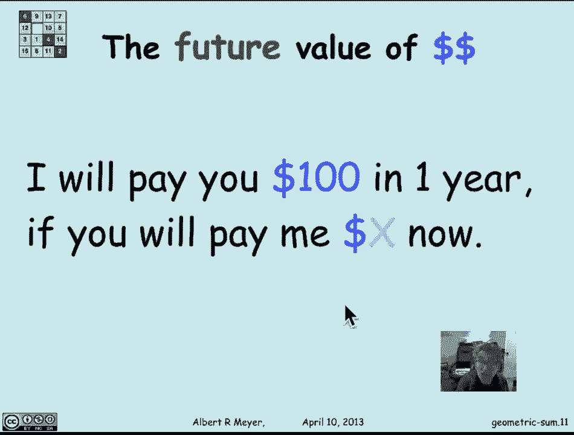
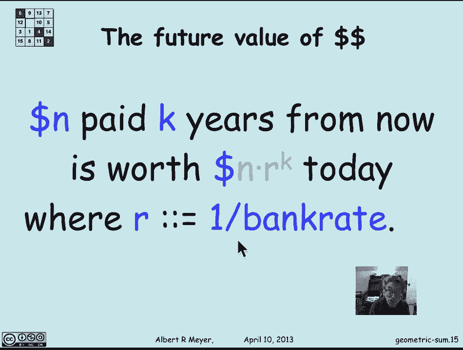

# 【双语字幕+资料下载】MIT 6.042J ｜ 计算机科学的数学基础(2015·完整版) - P68：L3.1.3- Geometric Sums - ShowMeAI - BV1o64y1a7gT

我们考虑过算术和，其中每个项都是一个固定的量，比上一项大一个加法量，另一种和叫做几何和，我们要看看，现在来看看每个和都是前一个和的固定倍数，这些在许多不同的环境中一直出现，在这种特殊情况下。

我们将看一个例子，说明它如何适用于，分析货币在未来的价值。

所以让我们从几何和开始，它有标准的形式，几何和的形式是，一加x加x的平方通过x的n次方，和均匀性，注意1实际上是x到0，所以我们取n的和，从k等于0到n，x对k的，现在我想做的是找到一个很好的封闭形式。

没有这些省略号，并且有越来越多的项n，算术和有一个简单的技巧，高斯得到它的方式，我们得到它的方法是通过颠倒和，把东西混合在一起，这一次的诀窍是将gnn乘以x，现在要做的是，每项x的幂都会增加1。

相当于右移，让我们来看看，这里有x，g，of，n，so，a，呃，1乘x，我当然是在减去展望未来，所以1乘以x是负的，呃减去x，x是x的平方，我要把它从x减去n再减去1次，x给出了n项的x。

最后我有一个额外的学期从右边，把x移到n，就是x移到n加一，现在我们来做这个减法，嗯，但我当然会把条款排好，这样就很容易减去，现在中间所有的条款都取消了，非常的帅气，因为我们刚刚发现GNN。

减去xn等于1减去x到n再加上1，所以我们有一个很好的优雅的配方，现在我可以排除GNN，左边是g n乘以1减去x，结果是我得到的gnn是1减去x，n加1除以1减去x。

这实际上是我们之前通过归纳法证明的一个公式，但是当我们用归纳法来做的时候，不知道谁是想出这个公式的聪明人，现在你知道那个聪明人是怎么找到它的了，这是一个标准的把戏，我们会看到更多，当我们看生成函数时。

但就目前而言，这是一个简单的技巧，可以获得一个漂亮的封闭表单，为了一笔钱，我们称之为扰动法，你拿总数，你稍微扰乱了它，看看它是如何与自己联系在一起的，得到一个算术关系，求解和的公式。

好的，嗯几何级数，我用sum这个词来表示有限和，几何级数是当你取一个无限和，所以无限几何和是一加x的和，加x的平方x到n，它一直在继续，它是从i等于零到无穷大x到i的和。

这也有一个简单的公式，就更简单了，其实，因为无限和的定义是，这是截断和的极限，它是前n和的极限，n趋于无穷大时的项，假设极限存在，所以对于呃，这个无穷级数的值是g n的极限，等于n的和，让我们看看，嗯。

就是这样，gn是1-x除以n+1/1减去x，所以极限的分布超过了极限，x里面没有n，所以它最终是，嗯一减去极限，当n接近x的无穷大到n加一除以一减x时，只要x小于n的1 x，加1等于0。

我最后得到了一个很好的简单公式，无穷级数。

i的和等于零，等于1/1减去x，前提是x的大小小于1。

现在几何级数中的几何和。

让我们来看看一个典型的应用程序，与货币的未来价值有关，假设我们想做以下交易，我保证在一年内付给你一百元。3。你能不能先给我一个固定的数额，所以我们叫它X，难题是一百美元值多少钱，如果你现在不能拥有它。

你只能在一年内拥有它，它值x美元，我们如何计算x应该是什么，你付给我多少钱是公平的，所以我愿意在一年内付给你一百美元。

这是公平的，没有人输，好的，嗯，这里有一个基本事实，这是评估什么的基础，货币在未来的价值是，就是，我假设银行会付我百分之三的利息，在今天的经济中，这是一家慷慨的银行，但这曾经是一个吝啬的提议。

在我的一生中，利率在每年17%之间，每年降低到1%以下，百分之三是玩的合理数字，所以说，让我们假设我的银行承诺付给我，现在存款的百分之三的利息，也就是说，让我们把银行利率b定义为一点零三。

交易是银行会增加我现在的钱，一年增加b倍。

嗯，所以如果我现在存你的X美元，这意味着我在一年内将有B乘以X美元，好的，假设银行完全可靠，那里没有风险，我在一年内得到了B乘以X，那我就不会损失任何b乘以x大于的钱，或等于一百。

我需要你现在给我的X美元来值这100美元，我应该付钱给你，如果bx大于或等于100，我就走在前面，嗯，少于一百我就输，如果bx等于一百，这是完全公平的，所有的权利，嗯，这意味着x是b的100除以b。

我们决定是一分零，397，哦九，所以一年一百美元。

九美分或正常化为一美元，一年一美元值九十七美分，基本上现在，现在我们可以稍微改变一下视角回想一年前，去年我需要多少钱？为了今天能值一美元，同样的推理，今天银行要付我2倍的钱。

所以我需要b乘以r等于一美元，换句话说，R必须是一个以上，B r是银行利率的一个，所以一年前的一美元值我们的美元，一年前的价值今天的一美元，同样的推理，两年支付的n美元等于一年支付的r的n倍。

它的价值是今天支付的n倍r平方，今天付了钱，所以我可以迭代这个银行或这个银行的银行利率因子，随着时间的推移。

K年后，在k年中支付的n美元的价值是今天k的n倍r，其中r是银行利率的1，好的，很高兴知道。

嗯，让我们想想年金，现在年金是一种合同，人们购买它是为了在没有风险的情况下为自己提供收入，所以他们会做个交易，通常是保险公司，他们现在会向保险公司支付一定数量的钱，保险公司承诺为他们提供定期收入。

有时是终身的，有时是固定的，所以让我们看一个例子，我每年付给你一百元，分十年给你。如果你付我固定的保险费，应该是什么，所以我保证，作为保险公司在十年内每年付给你一百美元，我要你付给我Y美元的保费，现在。

你应该付多少钱，让我们考虑一下，嗯，一年一百元值一百倍，两年100美元等于100倍r的平方，最后，十年后一百美元值一百倍r到十分之一，这就是我今天要付给你的美元，我现在需要这么多钱。

因为这些术语中的每一个都是，这一百美元付给你是值得的，多年后，嗯，看看这个总数，如果我减去100 r，我只剩下一百次了，从1到R到9的几何和，其中和的基数为r，因子是r井，我们有一个很好的公式。

就是1-r的十分之一，大于1减去r，现在插入r等于1/1点，零三，我最后的结论是这份年金价值850英镑，今天三块二毛，我答应付给你一千美元，但在接下来的11年里，价值850英镑，今天三块二毛。

假设银行利率是每年3%。

这是一个典型的案例，嗯，几何级数出现，你会在问题中看到其他例子，只是一个快速思考的事情，假设银行利率迅速上升，意外增加，美联储最终推动了经济的发展，利率上升到5%，说说这笔年金发生了什么。

你已经付给我8美元5美元3美分了，我已经答应每年付给你一百美元，在接下来的十年里，一年后开始，谁走在前面，如果银行利率上升，你走在前面，交易保持公平，或者我走在前面。

