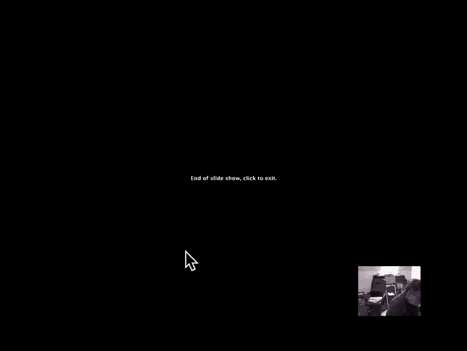

# 【双语字幕+资料下载】MIT 6.042J ｜ 计算机科学的数学基础(2015·完整版) - P69：L3.1.5- Book Stacking - ShowMeAI - BV1o64y1a7gT

so now we'll look at a third kind of sum，that comes up all the time called。

harmonic sums and we'll begin by，examining an example where they come up。

really directly so here's the puzzle，suppose that I'm trying to stack a bunch。

of books on a table assuming all the，books are the same size and weight and。

uniform and I'd like to stack them up，one on top of the other in some way and。

try to get them as far out past the end，of the table as I can manage now notice。

in this picture it seems kind of，paradoxical the top book the the back。

end of the top book is past the edge of，the table is it possible to do that is。

it possible to get the top book though，the back of the top book past the edge。

of the table and how far out can you get，the furthermost book to the right that's。

the question we want to ask well let's，go back and do it for the simplest case。

which is one book so this amount will be，a function of how many books we have。

we're interested in the overhang using n，books overhang is the amount past the。

edge of the table that the rightmost on，end of any book can be okay。

what do you do with one book well with，one book assuming that the thing is。

uniform the center of mass is in the，middle assume the book is of length one。

so the center of mass of the book is at，halfway down the book and if that center。

of mass is not over the table then，you're gonna have torque and the book is。

going to fall so you've got to keep the，center of mass supported and the way to。

get the largest overhang is to have the，center of mass right at the edge of the。

table here and in that case you can get，the book to stick out half a book length。

without falling and what that tells us，is that the one book overhang is 1/2。

it'll balance with the farthest end out，exactly at the center of mass is on the。

edge and I get a half a book length from，unit overhang all right let's proceed。

recursively or inductively suppose I，have n books how am I gonna get them to。

balance well let's assume that I figured，out how to get a so-called stable stack。

of n books which if I complete，supported it flat on the table it。

wouldn't fall over and I'm gonna show，you how to go from n to n plus one which。

is how you construct an arbitrarily，large stack of books that won't fall。

over well if the stack of completely，resting on the table won't fall over。

that means that if it if I have the，center of mass of it past the edge of。

the table by definition at the center of，mass there's gonna be an equal amount of。

weight on both sides of the center of，mass and the thing is gonna fall off the。

edge of the table by the same reasoning，as we did for one book so the the stable。

and stacked stable in the sense that，it'll it won't fall over of itself if it。

was lying completely over the table in，fact it won't fall over as long as its。

center of mass is over the table and to，get it out the furthest amount to the。

right what I'm going to do is put it at，the edge of the table okay so now I know。

how to place a table stack of n books to，get the largest overhang out of it what。

next well let's consider n plus 1 books，and what do I have to do so I'm trying。

to do the same deal suppose that I have，a nice stack of n books and I know how。

to support it so it won't tip over and I，now have n books and plus 1 books and I。

want to get out further what do I have，to do well by the basic reasoning that。

we just went through now the center of，mass of the whole stack of n plus 1。

books has to be over the edge of the，table that's the way I'm gonna get out。

the furthest so I know where the center，of mass of n plus books are gonna be at。

the edge of the table okay what about，the center of mass of the top and books。

and well I need them to be supported I，need their center of mass to be。

supported they'll be supported providing，their center of mass is over the bottom。

book somewhere and the way to get it out，furthest is to have it over the right。

edge of the bottom book so I'm gonna put，the center of mass of the top and books。

at the edge of the n plus first book，here yeah and that means that the。

increment or overhang that I get the，increase in overhang that I get by。

adding one more book we can call the，delta overhang and it's the distance，between the。

center of mass of n plus-1 books and the，center of mass of n books and n here and。

n plus one here well let's see what's，going on the center of mass of thee n。

books is at some location here and the，center of mass of the bottom book is。

half way away half a book length away，from where the end books are balanced on。

the edge of the bottom book so the，center of mass of the end books is here。

the center of mass of the bottom book is，there the distance between them is one。

half and I need the table to be at the，balance point between the end books and。

the one book that's where the center of，mass of the n plus one books will be so。

I need to calculate amount that's going，to be the increase in overhang so let's。

abstract it a little bit the delta，overhang is the distance from the end。

book to the n plus one book centers of，mass and if we think of this as a。

balancing diagram there's the end books，or at least there's the center of mass。

of the end books there's the center of，mass of the one book their distance。

one-half apart which we said and they，have to balance at the edge of the table。

so think of the edge of the table as the，pivot point and it's there and I need to。

calculate where is that pivot point how，do I get this fulcrum or this balance。

beam to balance with weight and here and，weight one there when they're a total。

length apart is a half what's this，distance that distance is the Delta that。

I'm trying to calculate well you just，know from physics that the balance point。

is going to be the distance 1/2 divided，by the sum of N and n plus 1 ok I need。

the end times this amount to equal 1，times that amount and if you check that。

out it means that Delta is 1/2 over n，plus 1 or simplifying 1 over twice n。

plus 1 now you should stare at that，diagram a little bit and remember your。

elementary physics to realize the，reasoning behind the formula for Delta。

okay well now I'm done because basically，I've just figured out that the increase。

is this Delta over hang and now I know，what it is it's 1 over twice n plus 1。

and so what I can conclude is that，overhang of n books B 1 is 1/2 and B n。

plus 1 is B n plus 1 over twice and plus，1 so this is a recursive definition of。

BN but it's easy to see how it unwinds，it means that BN is 1/2 plus 1 one half。

of one plus one plus one half of two，plus one plus one half of three plus one。

and so on if i factor out the 1/2 BN is，1/2 times 1 plus 1/2 plus 1/3 out。

through 1 over n ok that sum is the，harmonic sum the sum 1 plus 1/2 up。

through 1 over N is called HN or the，harmonic some and what we figured out or。

really the harmonic number is the value，of that sum and B what we figured out is。

that BN the amount that I can get n。

