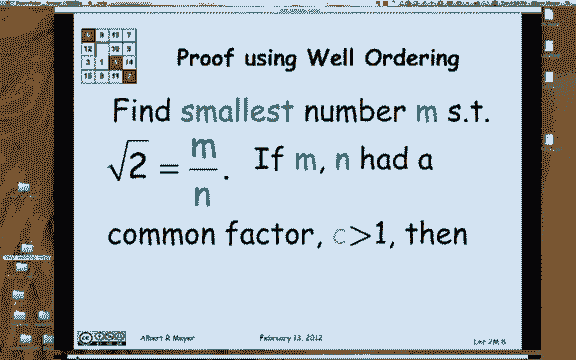
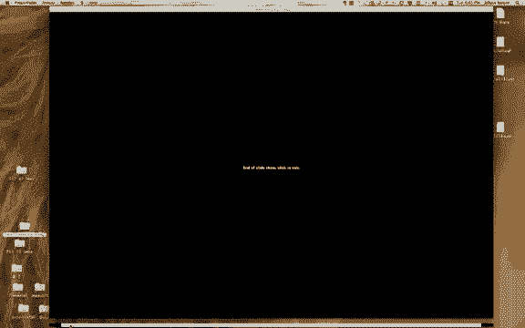

# 【双语字幕+资料下载】MIT 6.042J ｜ 计算机科学的数学基础(2015·完整版) - P6：L1.3.1- Well Ordering Principle1 - ShowMeAI - BV1o64y1a7gT

the well ordering principle is one of，those facts in mathematics that's so。

obvious that you hardly notice it and，the objective of this brief introduction。

is to call your attention to it we've，actually used it already and in。

subsequent segments of this presentation，we'll show lots of applications of it。

so here's a statement of the well，ordering principle every non-empty set。

of non-negative integers has a least，element now this is probably familiar。

maybe you hadn't even thought about it，but now that I mentioned it I expect。

it's a familiar idea and it's pretty，obvious too if you think about it for a。

minute here's a way to think about it，given a non-empty set of integers you。

could ask is zero the least element in，it well if it is then you're done then。

you could say is one the least element，in it and if it is you're done and if it。

isn't you could say to is is to the，least element and so on given that it's。

not empty eventually you're going to hit，the least element so if it wasn't。

obvious before there's something of a，hand waving proof of it but I want to。

get you to think about this well，ordering principle a little bit because。

it's not if there are some technical，parts of it that matter so，for example suppose I replaced。

non-negative integers by non-negative，rationals and I asked does every set。

non-empty set of non-negative rationals，have a least element well there is a。

least non negative rational namely zero，but not every non-negative set of。

rationals has a least element I'll let，you think of an example another variant。

is when instead of talking about the，non-negative integers I just talk about。

all the integers is there at least，integer well no obviously because minus。

one is not the least and minus two is，not the least and there isn't any least。

integer we take for granted the well，ordering principle just all the time if。

I asked you what was the youngest age of，an MIT graduate well you wouldn't for a。

moment wonder whether there was a，youngest age and if I asked you for the。

smallest number of neurons in any animal，you wouldn't wonder，whether there was there wasn't a。

smallest number of neurons we may not，know what it is but there's surely a。

smallest number of neurons because，neurons are non-negative integers and。

finally if I asked you what was the，smallest number of US coins that could。

make a dollar 17 again we don't have to，worry about existence because the well。

ordering principle knocks that off，immediately now for the remainder of。

this hook I'm going to be talking about，the non-negative integers always unless。

I explicitly say otherwise so I'm just，going to use the word number to mean。

non-negative integer there's a standard，mathematical symbol that we use to。

denote that non-negative integers it's，that letter n at the top of the slide。

with a double with a diagonal double bar，these are sometimes called the natural。

numbers but I've never been able to，understand or figure out whether zero is。

natural or not so we don't use that，phrase we zero is included in n the。

non-negative integers and that's what we，call them in this class，now I want to point out that we've。

actually used the well ordering，principle already without maybe not。

noticing it even in the proof that the，square root of two was not rational that。

proof began by saying suppose the square，root of two was rational that is it was。

a quotient of integers M over N and the，remark was that you can always express a。

fraction like that in lowest terms more，precisely you can always find positive。

numbers m and n without common factors，such that the square root of two equals。

M over N if there's any fraction equal，to the square root of 2a then there's a。

lowest terms fraction M over N with no，common factors，so now we can use well ordering to come。

up with a simple and and hopefully very，clear and convincing argument for why。

every fraction can be expressed in，lowest terms in particular let's look at。

numbers m and n such that the square，root of 2 is equal to M and M over N。

that fraction and let's just choose the，smallest numerator that works try to。

find the smallest numerator M such that，square root of 2 is equal to M over N。

well I claim that that fraction which，uses the small as possible numerator has。

got to be in lowest terms because，suppose that m and n had a common factor。

C that was greater than 1，a real common factor then you could，replace M over N by M over C the。

numerator is a smaller numerator that's，still an integer and over C with the。

denominator is still an integer and we，have a numerator if it's smaller than M。

contradicting the way that we chose M in，diction of course implies that M&N have。

no common factors and therefore has，claimed M over N is in lowest terms。

and of course wait I formulated this was，for our application of the fraction that。

was equal to the square root of 2 but，this proof actually shows that any。

rational number any fraction can be。

