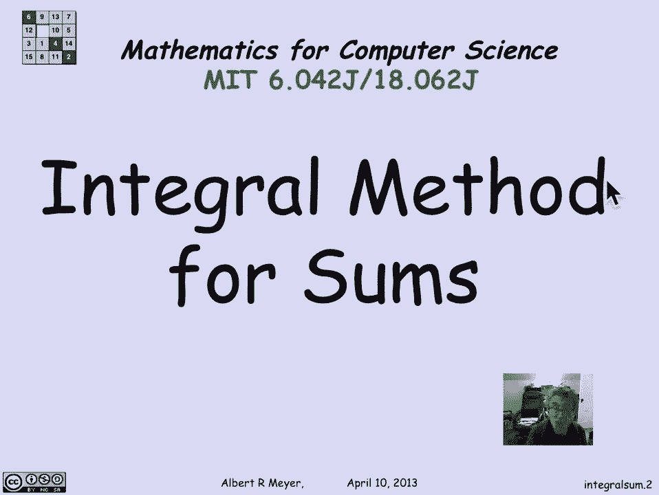
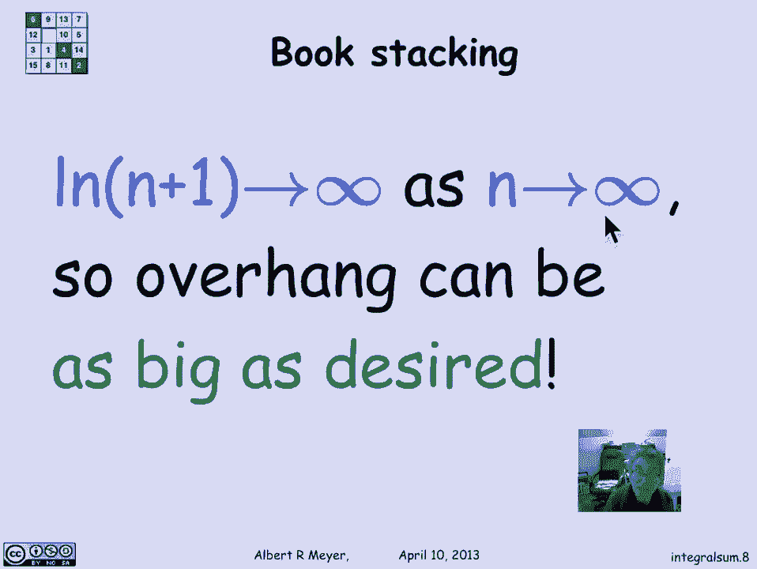
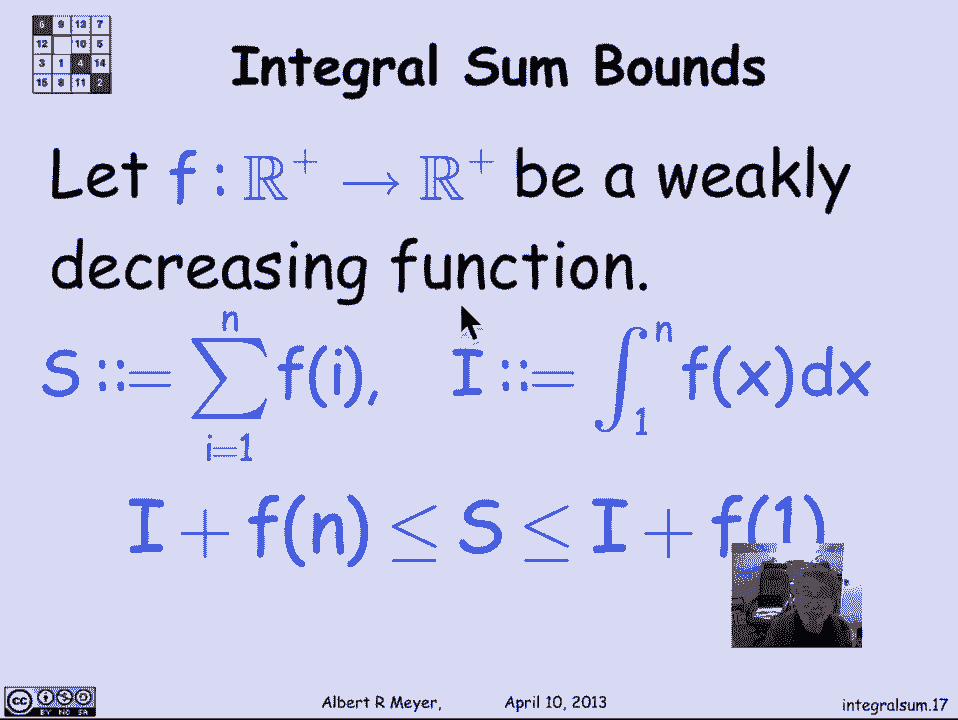

# 【双语字幕+资料下载】MIT 6.042J ｜ 计算机科学的数学基础(2015·完整版) - P70：L3.1.7- Integral Method - ShowMeAI - BV1o64y1a7gT

所以我们发现你可以得到书堆，书的悬垂部分是谐波和的一半，有N本书，你可以买两本以上，其中h n是这个谐波和或谐波数，问题是我们如何估计或计算这个和是多少，现在事实证明，这个和到底是多少，没有简单的公式。

但有一个简单的公式可以非常准确地估计它，我们用积分把和围起来得到估计，所以让我们看看这个估计和的积分方法。

记住我想要的是一加半的和，加三分之一到n的1，所以让我们形成一些单位宽度的高度矩形，等于我想要的金额，所以这里有一个高度的长方形，一个高度长方形，高度的半长方形三分之一，我要出去找你，实际上数到八。

但让我们假设这是一个高度，1/n，我所知道的是，这些矩形的总面积实际上等于我想要的数字，这些矩形的总面积是谐波数，我对HN的下界感兴趣，因为我想知道我能走多远，我想要一个紧的下界，它说hn大于一定的量。

这是我确信我能堆积起来的书的数量，所以我要得到这个数字的下限的方法，通过看这条曲线，穿过矩形的角，如果你检查它，那条曲线是x的一加一，这里的点是当x为零时，我在一个比一个，当i当x为1时，我在一半。

第二个矩形的高度，等等，所以1/x加1是一条曲线，严格低于所有这些矩形的边界，这意味着1/x+1下的面积从0到n，是HN的下界，因为它是矩形面积的下界，所以h n等于矩形的面积，大于1/x+1的面积。

它等于1/x+1从0到n的积分，其中移位变量与从一到n的积分相同，加1/x dx中的一个，我们当然知道它是n加1的自然对数，所以我们有了它，你买三本书所需的悬垂部分，大于或等于3的bn。

意味着h n必须大于或等于6，所以根据这个估计，我需要n加1大于或等于6的对数，为了出版三本书，和，和最远的书的右手端，超过桌子边缘三本书的长度，所以我的书告诉我我需要N本书。

使n加1的对数大于或等于6，两边的指数，右手边变成E到第六个，我发现只要n大于，或者等于e到六减一的书四舍五入，当然啦，因为只有你不能拥有一本书的一部分，你估计有403本书，我真的可以让我的堆栈伸出来。

超过桌子边缘的三本书长度，如果你做实际的计算，而不是估计数，原来二百二十七本书就足够了，但这估计有点离谱，但对于我们的目的来说，它告诉我们一个戏剧性的事实，我们知道n加1的对数接近无穷大。

当n接近无穷大时，这意味着有了足够的书，我可以想走多远就走多远，你告诉我你想出多少本书的长度，我将用log n公式来计算有多少本书，我需要走那么远。

所以这里有一个例子，呃，几年前班上的一些学生，嗯，现在决定把这个作为一个实验，当我们以前在课堂上这样做的时候，我们首先试图用一本又大又重的教科书来做，我们一直试图让它们保持平衡然后从桌子边缘出去。

他们失败了，因为事实证明教科书很重，它们压缩，它们不是我们模型所基于的刚性矩形截面，但是CD盒很好用，他们更僵硬，它们不容易压缩，它们很轻，这样它们就不会引起扭曲的问题，因为堆栈的大小。

所以你可以让CD盒伸出很远，这是一个四三CD盒高的例子，排名前四的病例完全超过了桌子的边缘，最左边的边缘大概是一点八到一点，九个K箱长度，嗯，做堆栈的人对它有另一种看法，当然，他们正处于稳定的边缘。

试图让光盘尽可能突出，所以如果你注意到这些，就平衡而言，空间很小，它真的就在跌倒的边缘，如果你对着它打喷嚏，它就会翻倒，如果你不对它打喷嚏。

它很稳定，你得到了那么远的顶级CD，所以当我们在做的时候，让我们得到h n的上界，我们刚刚得到了h n的下界，但是同样的逻辑使用积分，会给你一个HN的上限，我现在做的是，我从矩形的右上角运行一条曲线。

这条曲线只是x的一乘，所以谐波数的上限，是1/x除以n加上这个的面积，所以我得到了一个上界，它说谐波数，hn小于x dx上1到n的积分，或者等于n的一加对数，所以把我通过看得到的这两个界限结合起来。

曲线是该区域的下界，和一条曲线，这是面积的上限，积分，我发现一个n被置于n的自然对数之间，加上1和1加上n的拉丁自然对数，现在这两个数n加1和1加n的对数非常接近，他们越来越近，嗯，随着n的增长，嗯。

所以事实证明，我们能非常准确地说，hn是渐近等于log n，它约等于log n，以及我用洋红色突出显示的波浪符号的精确定义，称为渐近相等，和渐近相等的一般定义，hn渐近等于log n。

n的函数f渐近等于n的函数g，当他们的商的极限为1时，也就是说，作为乘法因子，每个都在一个常数内，极限中的另一个，一加一减的ε，gnn的epsilon将括号fn，反之亦然，渐近等价或渐近等式。

让我们举一个例子，所以评论是，比如说，n的平方加n渐近等于n的平方，为什么好，让我们看看当n接近n的平方的无穷大时的a极限，正数除以n的平方，这和用代数简化是一样的，n接近无穷大时，1/1加n的极限。

那个项归零，果然极限是1，所以这两个项渐近相等，渐近相等的思想，我们所关心的只是高阶项，低阶项就会消失，我们在看控制函数增长率的主要项，当我们把它们看作渐近等价物时，所以让我们后退一会儿。

并概括我们在这里所做的，用估计谐波和，有一种通用的方法叫积分法，在这种特殊情况下，假设我们有一个正实值函数的函数f，那是微弱的下降，就像1/x，那我们就，设s为i等于i的f的1到n的和。

所以我感兴趣的是x的f，x的f是x的一乘，我想要从1/1到1/i的n的和，是第n次谐波数，我把它和积分进行了比较，从x的f的1到n或x的1，在我们的示例中，所以如果i是积分，S是我想要的和。

我们能得出的结论，实际上，一般来说，和是在积分之间的括号内的，加上f的第一项，和中的1的f和积分加上和的最后一项，记住f是弱递减的，所以n的f小于1的f，有一个类似的定理。

实际上只是把1的f和n的f反转，用积分估计得到弱递增函数的界。

