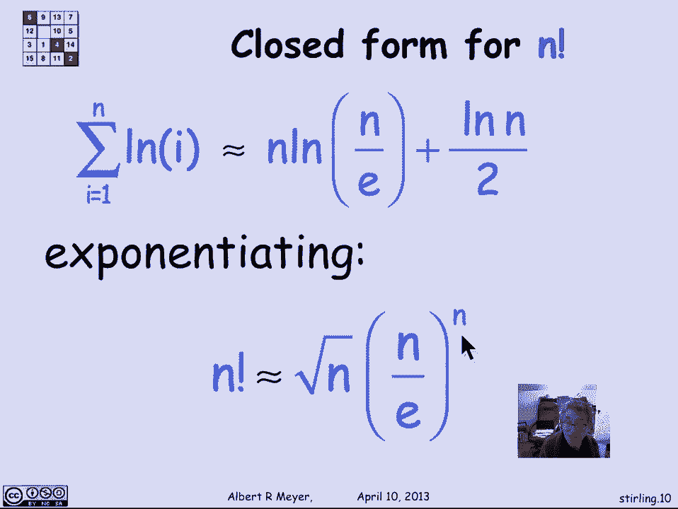
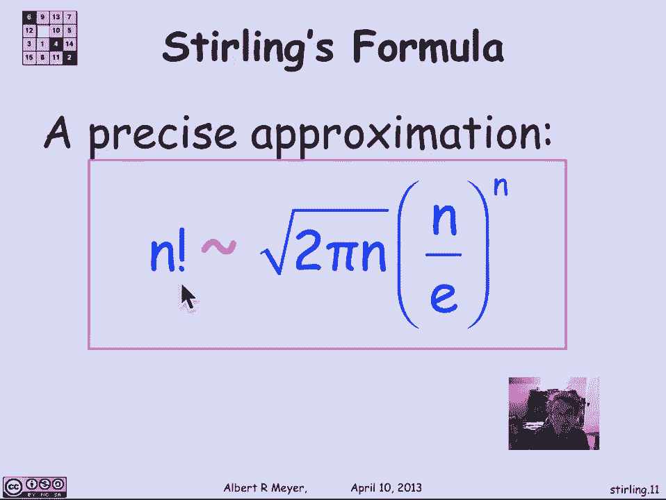

# 【双语字幕+资料下载】MIT 6.042J ｜ 计算机科学的数学基础(2015·完整版) - P71：L3.1.9- Stirling's Formula - ShowMeAI - BV1o64y1a7gT

our method for estimating sums can also，be used to estimate products basically。

by taking logs to turn a product into a，sum and we're going to use that to come。

up with another important estimate of a，quantity that will come up really very。

regularly called n factorial so n，factorial is the product of the first n。

integers 1 times 2 of little n minus 1，times n and concise product notation。

it's the product that's PI capital ply，for product from I equals 1 to N of I。

and it's standard abbreviation is to，write it as n bank pronounced n。

factorial so what I'd like to do is get，an asymptotic estimate for n factorial。

again n factorial is one of these，quantities where there isn't any exact。

formula that doesn't have those ellipses，in it there's no short formula with。

basic operations fixed size up formula，that expresses n factorial but we get a。

nice formula for a tight asymptotic，estimate so as I said the first trick is。

to turn the product into a sum by taking，logs so log of n factorial is the log of。

1 the product of 1 through n but a log，of a product is the sum of the logs so。

it's simply log of 1 plus log of 2 up，through log of n and expressed in some。

notation it's the sum from I equals 1 to，N of log of log of a my now the integral。

method gives us a way to estimate this，sum by bracketing it between the values。

of some integrals namely restating the，the integral method for some metaphor。

for bounding integrals by sums this time，we're looking at an increasing function。

because it's log of X let F be a weakly，increasing function from positive reals。

to positive reals I'm interested in the，sum from I equals 1 to N of F of I and I。

want to relate it and bound it by the，integral from 0 from 1 to N of f of X。

where in this case the particular F that，we're interested in is f of X is log X。

and the theorem says that with，increasing functions S is bracketed，between the integral plus the。

term in the sum and the integral plus，the first term in the sum remember since。

the functions weakly increasing f of 1，is smaller than f of n so that's the way。

you remember which way the bounds go so，s is between I plus F of 1 and I plus F。

of n by our general formula for applying，integral balance to sums well what that。

tells us then is that the sum from 1 to，N of log of I which is what we're。

interested in is bracketed between the，integral from 1 to N of log X and the。

integral from 1 to N well it's plus log，of 0 but a log of 1 rather but that's 0。

and the integral from 1 to N of log of X，plus the last term which is log of n ok。

in case you don't remember from first，term calculus the integral from of log。

of X is in fact has the indefinite，integral is X log of x over E which you。

can easily check by differentiating X，log X over e ln means natural log。

remember in computer science l OG log，means log to the base 2 unless you。

explicitly put some base on it like log，L o G sub 10 so ellen is the natural log。

from calculus and plugging in this value，for the indefinite integral of log of X。

and using the bounds 1/n what we come up，with is that the sum of the logs is。

bounded between n Times log and over E，and n Times log and over e plus log of n。

it's a pretty tight bounds what that，means is that informally speaking the。

sum of the logs is about this term Plus，that term Plus let's take the average。

value of that term which is half this，term so we could say that the sum of the。

logs is approximately equal that's a，little vague but live with it n log n。

over e plus a lot half of log n well now，if I'm interest to remember in an。

estimate for n factorial so let's，exponentiate both sides so taking eita。

this sum gives me a product of e to the，e to this times e to that well eat to，this。

is really--it's e to the log of n over e，to the nth power which means it's n over。

e to the N and this is e to the log of n，to the power half or square root of n so。

we wind up with n factorial is，approximately equal to the square root。

of n times n over e to the N now this，approximately equal is imprecise it's。

not asymptotically equal because we were，doing an arithmetic average of zero and。

log n over two in addition it's very，dangerous when you have two things that。

are approximately equal to exponentiate，them and expect that they're still。

approximately equal often they aren't，but nevertheless this is a kind of a。

heuristic derivation of some kind of，asymptotic estimate that we would expect。

that n factorial was roughly like the。

square root of n times n over e to the，enth power and it turns out that it's。

that this heuristic gives a pretty，accurate answer a precise approximation。

is that n factorial is actually，asymptotically equal to the square root。

of 2 pi n times n over e to the end and，we're not going to prove that it。

requires elementary calculus but more，than we want to take time for and this。

crucial formula though that we will be，using very regularly to estimate the。

size of n factorial is called Sterling's。

