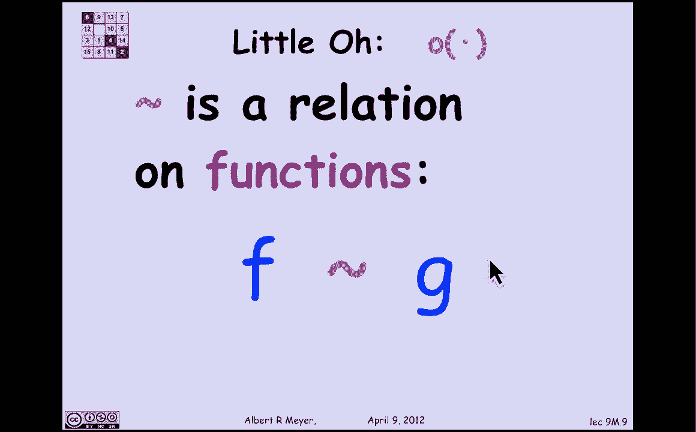
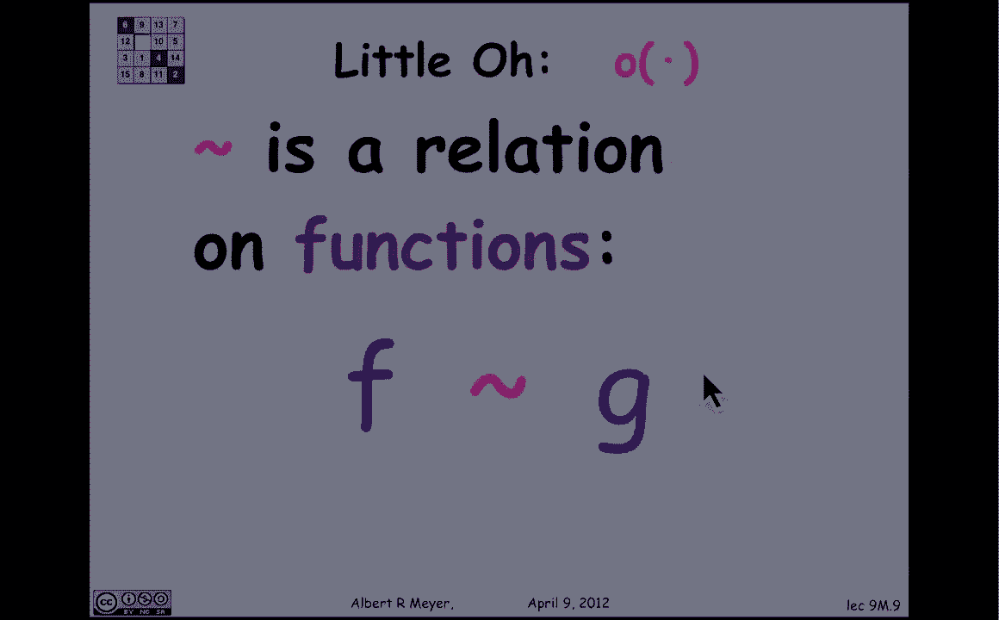
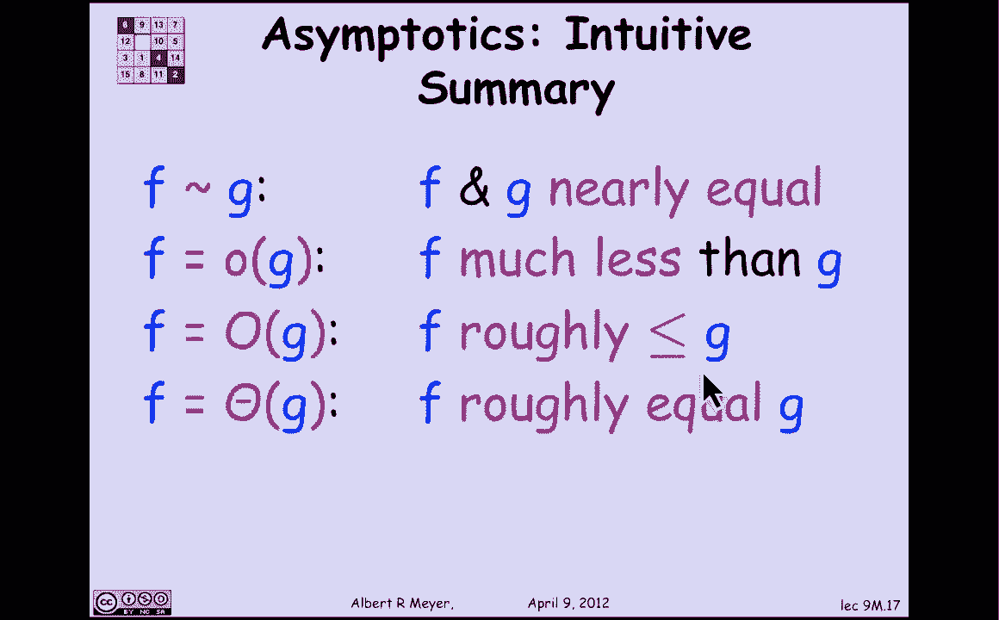

# 【双语字幕+资料下载】MIT 6.042J ｜ 计算机科学的数学基础(2015·完整版) - P72：L3.2.1- Asymptotic Notation - ShowMeAI - BV1o64y1a7gT

The issue of the approximate rate at which things happen。

Common in a lot of Sciences the rate at which Things fall，The rate at which reactions occur。

Computer science typical，Concerned about growth rates comes up in looking at the。

Efficiency of algorithms in whether they're growing linearly are quite radically，Or more，And。

We're going to look today at 4 notations that describe relations between the growth rates of functions。

The first of these relations is the simplest one is cold asymptotic equal equivalent to a synthetic equality。

This，Tilde symbol is read as，Asymptotically equal to，Asymptotically equal to giovan。

Different only if the limit of the quotient of f of an over G of n，1，Let's look at an example。

10 squared is asymptotically equals m squared plus and，Why is that，Follows trivially by manipulating。

The algebra，Are the limit of x squared plus Andover and squared。

Simplifying is just the same as a limit of 1 + 1 / n。

What is endorsement silly one of her and goes to 0 so the limit is one，Has claimed，Those two。

Expressions that on other functions 8 Defiance squared in squared + 1 are asymptotically equal。

Easy properties of asymptotic equality than follow immediately from the definition one of them is that if symmetric。

Namely，Supposed to，Memphis asymptotically equal Fuji I want to prove that she is a synthetically equal to F while what's going on here let's look at the limit of。

G / f which is what I'd like to prove his one，The limit of G / f by algebra Geographics the same as 1 over。

So，Moving a limit，Across the division that's the same as one over the limit of f over G。

Which is 1 / 1，Approved another words that g is asymptotic。

Ecopath given that f is a synthetic legal to Jake，Symmetric。

What is a similar argument for transitivity let's just cranks do it for practice on the definition suppose。

 that f is a synthetic legal to G & G is asymptotically equal paychecks，Is asymptotically equal to H。

Well again，Plug into the，Algebra and distribute limits let's just look at this one is the limit of f over G 。

because after assessing product to Jay but fo Virgie can be expressed as/ h / G，Cancel，So，This limit。

Now biking distribute the limits to the numerator and denominator assuming both exist。

And the numerator limit，Is what I'm interested in the denominator limit is going to be，1，Because the。

Limit of G / H has one since，She is asymptotically equal to H，Inclusion is indeed。

The limit of fo4 H's equal to 1，This is not really very interesting，Stuff and。

Top-level message is that many of these，Elementary properties of asymptotic equality，And the other。

Alaskan pollock relations that we're going to see Follow by this kind of Elementary algebra and distributing。

Limits over sub expressions，Anyway the corollary of this is that asymptotic equality。

Is in fact an equivalence relation we've proved is symmetric and transitive in his trivially。

It's an equivalence relation，By the way it's worth noting that it's an equivalence relation on functions of one variable when we write sometimes that。

Death of an assassin publicly equal 2 G of n，We mean that Estevan is the description of a function f。

Nothing about the number that effervescent happens to have for some particular value of that 。

这就是为什么有时在事件是渐近事件以进行描述性目的，The proper thing we should be writing is the f is asymptotically equal to J。

Equality is a relation between functions。

Okay the next asymptotic would like we're going to look at is called asymptotically smaller than。

and it's the notation for this this little old notation so you，Is equal to little all of giovan。

If and only if，The limit of，Half of an overage event goes to 0，As n approaches Infinity。

I like looking example of that and squared is little all of ncube because trivially。

Limit of N squared over and killed is the famous a limit of one over and it's equal to zero。

By similar kind of reasoning that we did for asymptotic equality being an equivalence relation it's not very hard to prove。

Little off，Find a strict partial order，Functions，Malaysian asymptotic relation is the most complicated of the 300 it's arguably the most important in computer science。

It's called the asymptotic order of growth Big O，The definition is that a function f is Big O of a function G。

What it means is that the limit of f over G，Is finite，It's，Like the other than 0 or 1，What is finite。

And that means that f is，G，That is a technicality there。

Where of the expression actually says the women suit，Of effervescent / Giovanni。

Let's just ignore that for now and will look at it。

Explain why that limb soup is there a little later，So，An example，3 m squared，Is，Bigo event Square。

Because，The quotient of 3 and squared / M squared is free Which is less than infinity so what Big O is doing is kind of saying the cussing factors don't matter。

And，That turns out to be，Computer science where，You can't really talk about the time that our procedure takes because that's going to depend on the hardware。

So，When you implemented on faster Hardware，It may grow at the same rate。

What the time will actually change，And that's why they go place a prominent role。

Funny relation of a 4 is called fada，Or same order of growth the definition of。

F is fader of G is simply，F is OMG，She is all of f，And，Michelle from the definition that SATA。

An equivalence relation，So to summarize there are these formulations。

If asymptotic latiqua pudgy means that，Nearly equal，OMG informally means the f is much less than G。

F equals OMG means that f is roughly less-than-or-equal-to G we're roughly means that we're not concerned about constant factors。

And f equals fate of g means that f is roughly equal to J，We'll examine these。

Properties in more detail in the next。

