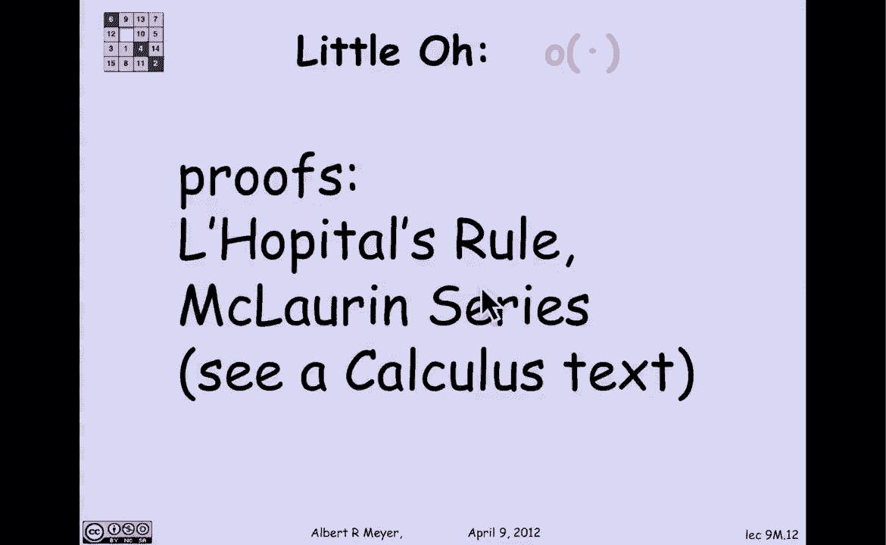
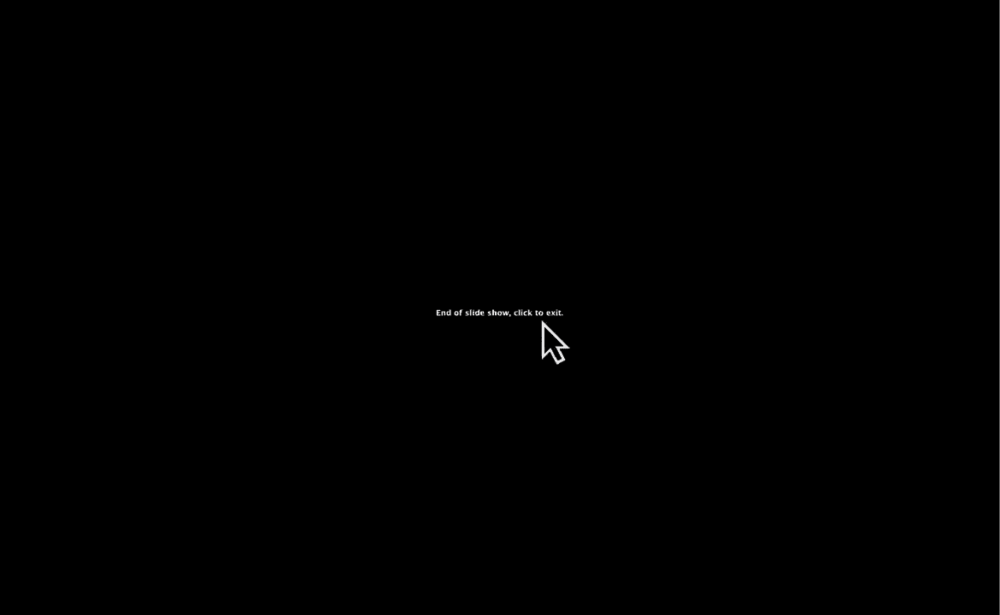

# 【双语字幕+资料下载】MIT 6.042J ｜ 计算机科学的数学基础(2015·完整版) - P73：L3.2.3- Asymptotic Properties - ShowMeAI - BV1o64y1a7gT

用极限表示渐近符号的一个优点是，它们的一堆属性然后立即变得明显，这里有一个，如果f是g的小o或者f渐近等于g，那么事实上f是g的大o，我们可以非正式地推理，通过说第一个意味着f比g小得多。

第二个意味着f和g差不多，最后一个意味着f大致不那么重要，差不多，肯定少，当然，这意味着大约更少，但我们可以，事实上，完全精确地使用定义，因为f等于g的o意味着f在g上的极限为零，f渐近等于g。

意味着f/g的极限是1，f的定义等于g的大o，极限是有限的，是零还是一，那么它是有限的，另一个这样的性质是如果f远小于g，则g大致不小于f，更准确地说，如果f是g的小o，那么g不是f的大o。

左手边说f/g的极限为零，但这意味着g/f的极限是1/0或无穷大，这意味着它不是有限的，所以g不是，文献中通常定义大o的方式根本没有提到限制，事实上，正如我所说，定义真的不是一个限制，这是一个四肢汤。

让我给你看一个标准的定义，然后解释为什么四肢汤抓住了它，所以f的官方定义是g的大o，有一个常数乘数c，你可以把g放大，使得一旦g被因子c放大，那么事实上f小于或等于c乘以g，但这可能一开始就不成立。

有一个点和零，之后它永远保持，让我们试着说明这个复杂的量词交替表达式，用一个图表可能会让它更清楚，假设我想表达f是g的大o，其中f是绿线，所以绿线是x的f的图，函数和蓝色的g显示，事实上。

x的g小于或等于x的f，但是f是g的小o大o，因为如果你用一个常数乘以g，它变成了这种恒定的时间，变成这个紫色的曲线，紫色的曲线从某一点开始就在绿色曲线之上，那是零。

所以通过把蓝色曲线g提高一个量c来得到它，就是这个紫色的曲线，紫色曲线从某一点到F以上，在，这就是为什么f现在是g的大o，当然啦，蓝色曲线g乘以一个常数并不能使它升高，固定数额，它改变了它。

但如果我们想象我们的曲线是对数刻度，那么事实上，g乘以c等于在对数刻度上加对数c，所以如果垂直刻度是对数的，图片实际上是准确的，所以使用这个标准定义，我可以解释为什么，在限制条款的等效定义中。

我不能说极限，我需要说，四肢汤，以下是四肢汤对我们的作用，假设我有一个函数f，小于等于2g，这意味着根据前面的定义，f肯定是g的大O，因为你把g放大2得到f以上，问题是n的f/g可能没有极限。

所以我不能简单地说f是g的o，因为f/g的极限，让我们看看这是怎么发生的，假设f实际上是，等于g乘以1到2之间变化的数字，这是一个例子，哪里嗯，nπ的正弦在零之间变化，一减一，你把它平方。

就变成了0或者1，你在上面加一个，它就变成了一两个，所以这是一个随着n增长的表达式，在值1和值2之间交替，我把n的g乘以这个常数，这要么是由这个因素，那不是一个就是两个。

但是n的f对n的g的极限是不存在的，另一方面，n/g的f的四肢发达是2，它是有限的，因此根据四肢汤的定义，的确，f是g的o，现在，肢体汤的技术定义是你可以在课文中读到的，或者在微积分书上找到，嗯。

它基本上是分数的最大极限值，n的f/n的g，如果你不知道什么是极限点，这是我们不需要讨论的事情，但我想让你明白为什么，正式来说，我们需要利布汤，在大多数情况下，限制是存在的。

我们可以使用更简单的极限定义，而不是存在一个常数，使得对于每一个大于或等于n的数n，等，这是一个更复杂的定义，好的，让我们收集一些关于小O和大O的更基本的事实，我们需要的，即如果a小于b。

我知道它们可能是负数，我不在乎，但是实数，如果a小于b，那么x到a是x到b的小o，证明几乎立即从定义中得出，因为要证明x到a是a，x到b的小低点，我们想看看x与a的商，x与b的商，但当然，x与a的商。

除以x除以b等于1除以x除以b减去a，因为a小于b，b减去a为正，分母是x的正幂也是无穷大，因此1/x的正幂为零，也就是x对a的定义，x对b的小o，嗯，另一个关键的事实是对数比根增长得慢。

所以你认为Epsilon是一半或三分之一，说x的对数小于或等于平方根，它小于立方根，小于等于五十根没关系，好的，这是一个回到初等微积分的证明，嗯，我想我已经强调过了，因为它绝对值得记住。

对数比路由增长慢，证明是从一个显而易见的评论开始的，即y上的1小于，或等于y，因为当y大于或等于1时它们是相等的，1除以y等于y，当y大于或等于1时，随着Y的增加，y变大，y上的一个变小。

这样就保持了不等式，那很容易，好的，嗯，这意味着我可以从一个开始整合两边，所以如果我把1/y的积分从1到z，它将小于或等于y的积分，从1到Z井，y上1的积分是log z。

y的积分是a到z是z的平方除以2，所以我们得到的是这种新的不平等，z的对数小于等于，z大于或等于1时除以2的平方，所以我们正在去那里的路上，我们得到z的对数小于z的平方，但不是z到任何ε幂。

但我们只要对Z做一个聪明的替换就能得到它，所以这是下一步，z的对数小于等于z的平方除以2，对于任何大于1的z，设z是x到delta的平方根，其中delta只是某个正数，那么在这种情况下，Z的对数是多少。

x的平方根对delta的对数，平方根表示x到delta的对数的一半，也就是delta log x，所以z的对数是x除以2的δ对数，当然z的平方就是x的δ，所以z的平方除以2等于x除以2，我可以取消分母。

我也是，我得到x的对数，然后把三角洲转置，x{\displaystyle x}的对数等于或小于x{\displaystyle x}，只要Delta小于Epsilon，delta，对δ函数的x值。

会比对ε函数的x值要低一些，这意味着x到delta乘以一个常数，就是，1/delta也是x的一个小o/epsilon，我刚发现，我已经证明了x的对数是x对ε的小o，视需要，还有一个关键的事实。

我不会证明，但我要说的是，多项式比指数增长得慢，这与原木比根生长得慢密切相关，嗯，但特别是，如果x是任意一种，c是任意常数，a大于1，那么x到c是a到x的小o，有很多方法可以证明这一点。

使用Loi ital的规则er迈凯轮系列，我把它留给你去查你的1801微积分课文。

