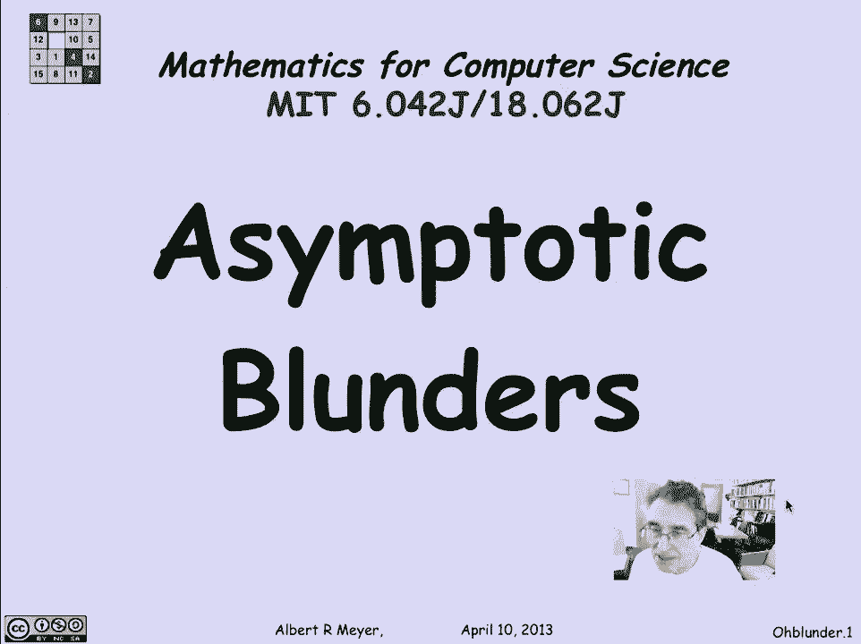
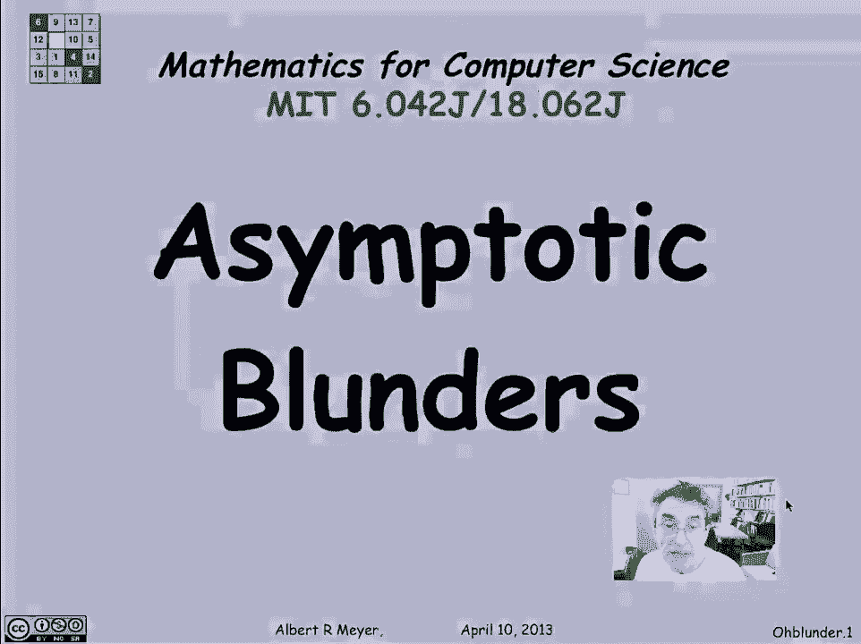
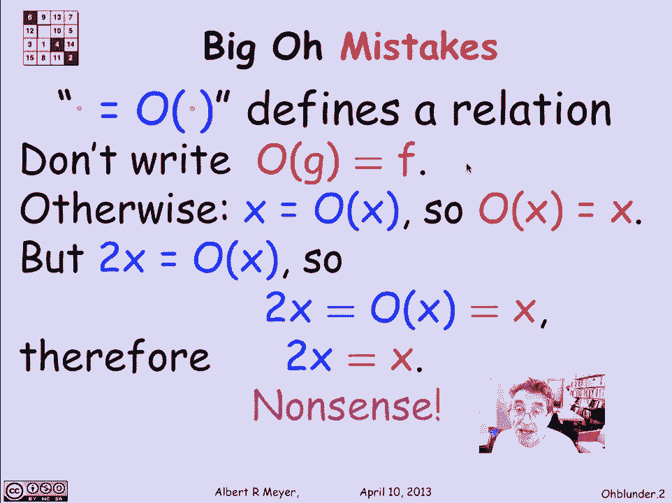
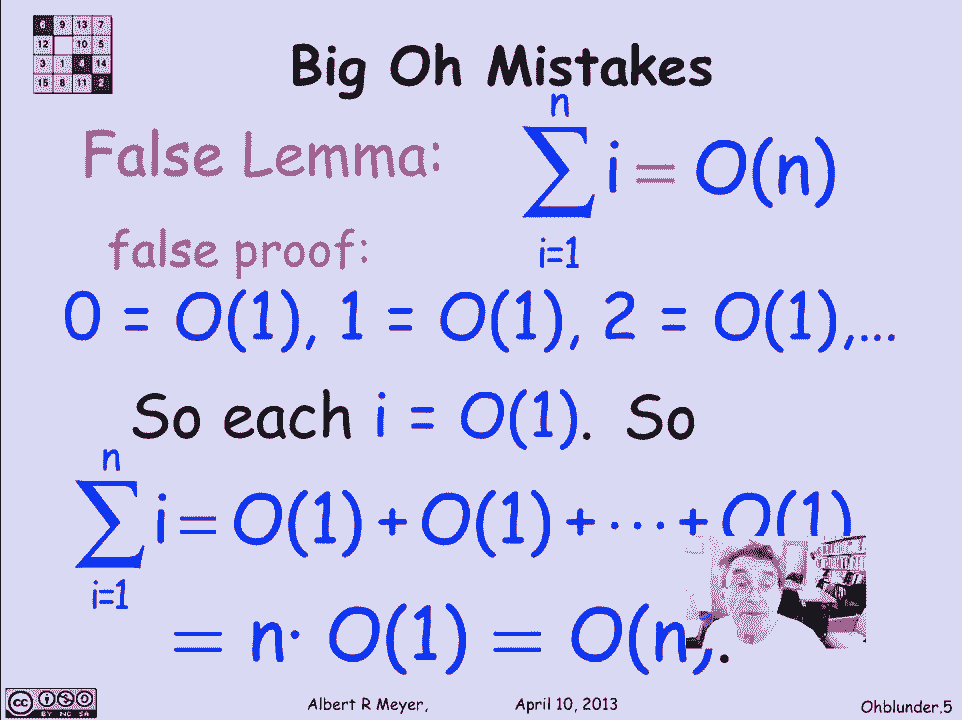

# 【双语字幕+资料下载】MIT 6.042J ｜ 计算机科学的数学基础(2015·完整版) - P74：L3.2.6- Asymptotic Blunders - ShowMeAI - BV1o64y1a7gT

let's take a quick look at some blunders。

that people regularly make in dealing，with asymptotic notation in particularly。

with Big O notation which tends to。

confuse people so the most important，thing to remember is that this notation。

something equals o of something else 1，over x equals o of 1 say is actually to。

be understood as just a not such，attractive notation misleading notation。

for a binary relation between two，functions this is supposed to be a。

function there and there's supposed to，be a function there and this is saying。

that the there's a relation between the，growth rates of these two functions o of。

F is not quantity and you mustn't treat，it as such so for example and the。

Equality of course is not an equality，once upon a time we tried to get the。

Equality replaced by an epsilon which，makes much better sense that is that。

membership symbol but there was a sense，that this notation was so deeply。

embedded in the mathematical culture，multiple mathematical communities that。

there was no way we're going to change，it okay in particular a confusion with。

where you think that that equality sign，means some kind of inequality is to。

write instead of f equals o of G well if，F equals o of G by symmetry o of G or to。

equal f don't write that the reason is，that it's a recipe for confusion because。

look at this I know that X is o affects，trivially which would suggest that o of。

X is equal to X if you believe in，symmetry and you think of all of X as。

being quantity well remember though that，2 X is also equal to O of X by。

definition of all so what we wind up，with is combining 2 x equals o of x with。

o of x equals x is I get 2x is equal to，this thing is equal to X I conclude that。

2x is equal to X which is absurd so，that's nonsense it's the kind of trouble。

that you can get into if you start，thinking of this equality as meaning。

equality between two quantities as。

opposed to just being a part of the name，of a relation，another mistake that people make it's。

less serious but it's sloppy is to think，that Big O corresponds to a lower bound。

so that people will say things like F is，at least oh of N squared。

well again at least of N squared is，starting to treat o of N squared like a。

quantity you could say that F is equal，to o of N squared but that means that N。

squared is an upper bound on F to within，a constant factor after a certain point。

if you want to say intuitively that that，N squared is a lower bound on F then all。

you have to do is say that N squared is，o of F and that is a proper use of O of。

F of getting a lower bound on a function，by saying that the lower bound is o of。

the function that's another example of，the kind of nonsense that you say this。

is a stretch but let's look at it as a，reminder of things not to do。

I'm gonna prove to you that the sum from，I equals 1 to N of I that is that 1 plus。

2 Plus 3 up to n is of n now of course，it's not we know that the sum of the。

first n integers is n times n plus 1，over 2 which is o of N squared theta of。

N squared actually so I'm gonna prove，something false watch carefully how I do。

it here's the false proof let's first of，all notice that any constant is o of 1。

so 0 is o of 1 1 is o of 1 2 is o of 1，and so on any constant is any constant。

function is o of the constant function 1，ok that's true so that means that each I。

in this sum is a number so that means，it's you know it might be 1 in my 2 it。

might be 3 you might be 50 whatever it，is it's o of 1 and that means that I。

could think of this sum from I equals 1，to N is o of 1 plus o of 1 plus o of 1。

and that's of course n times o of 1，which is oh of n now there's all kinds。

of weird arithmetic rules and things，being used here none of which are。

justified but you it's just a heads up，you do see stuff like this from，inexperienced students。

I hope that you won't fall into this，kind of a sloppy trap all of something。

