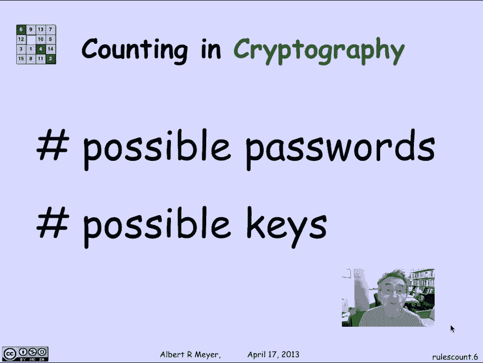
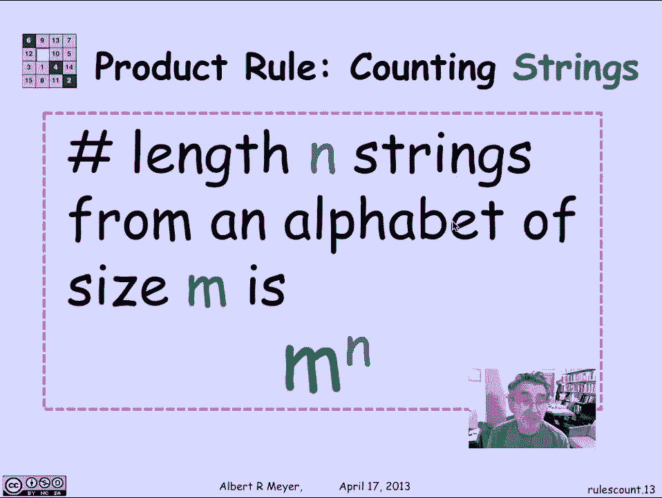
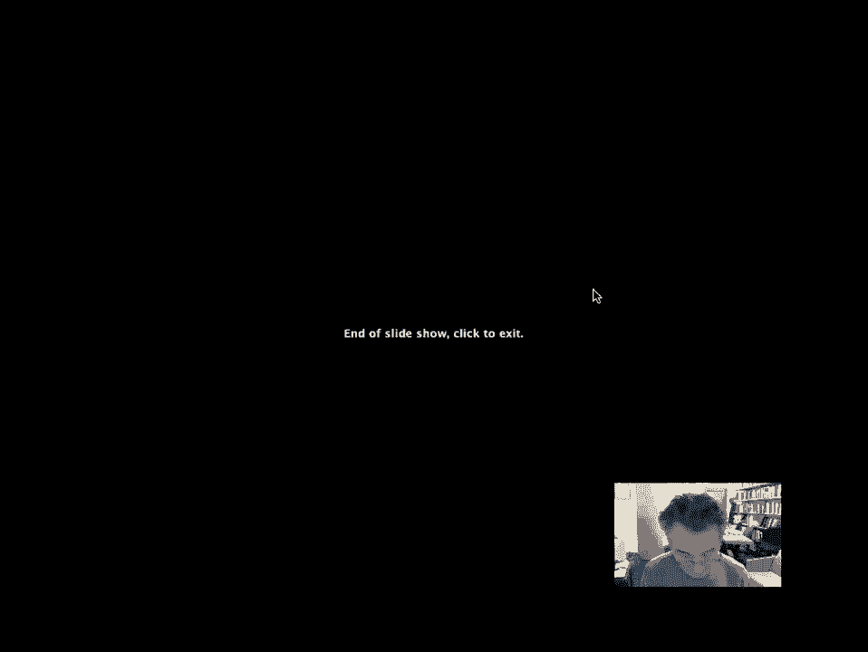

# 【双语字幕+资料下载】MIT 6.042J ｜ 计算机科学的数学基础(2015·完整版) - P75：L3.3.1- Sum And Product Rules - ShowMeAI - BV1o64y1a7gT

计数的话题，或者组合学是许多不同学科中的一个重要学科，尤其是在计算机科学方面，所以说，组合学和计数的起源有点声名狼藉，它们来自历史上研究赌博并试图计算赔率的人，各种事件发生的次数。

知道在他们身上下什么样的赌注，所以一个典型的问题是，如果你知道扑克是如何工作的，扑克中五张牌的手牌有各种各样的分类，你可能会问，所有可能的一小部分，五张扑克手变成一对千斤顶。

这基本上是扑克手总数中属于这一类别的一小部分，一对千斤顶是一对千斤顶的概率，所以计数和赌博是它真正出现的一个基本地方，从历史上看，这是许多组合学开始的地方，嗯，与此相关的是，当你试图写的时候。

在游戏中计数，比如说，计算机程序设计，下棋或跳棋的计算机程序，等等，其中一个方面是获得一种感觉，为了向前看，你必须做多少搜索，找到好的招式，你最终从给定的棋位数数。

在给定的移动次数中你能达到多少可能的位置，嗯一个谜题，解决魔方玩具的问题是，有多少个不同的位置，从一个给定的位置你可以得到多少不同的位置，具体在计算机科学中，它出现在算法中。

对数据结构进行操作需要多少操作，和一个从一个更新到另一个，比如说，对n个数字项进行排序需要多少次比较，有一个典型的计数，如n log n证明，作为一些既可实现又有下限的操作，嗯，当我们快速观察时。

我们看到了一个，幂是一个问题，就像，如果你想计算一个数d的n次方，需要多少次乘法，用迭代平方法大致为log n，我们希望能够计算一个特定程序使用的乘法数，来计算，D到N。

以及你能逃脱的最大和最小的乘法次数，一个地方，计数和组合器变得至关重要的地方是为了安全，和密码学问题，如果你要有密码的安全性，需要有两个大的，供对手彻底搜索的密码空间，并同样检查它们，如果你在做加密。

带有某种秘密密钥，使您能够读取消息，你要确保可能的键的空间也太大了。

彻底搜索以查看哪些键有效。

现在让我们简单地谈谈最基本的计数方法，和两个会计规则，这是其中最基本的，但事实上我们从中得到了一些里程，所以第一条规则叫做求和规则，这是完全直截了当和显而易见的，也就是说。

如果我有两个不重叠的集合a和b，则并集b中的元素数仅为a中的元素数，加上b中的元素数，没有问题证明这是不言而喻的，但让我们举一个例子，假设一个班有四十三个女人和五十四个男人，有多少，里面有多少人。

四三加五四等于九十七，这是含蓄地假设，没有一个人的性别是模棱两可的，没有第三性，嗯，所以男人和女人是分开的，学生总数是男女人数之和，另一个是有两个六个小写罗马字母，并两个六个大写罗马字母和十位数字。

所以有二十六加二十六，加上十等于62个角色，第二个规则称为乘积规则，这也很明显，假设我有四个男孩和三个女孩，有多少对男女情侣，4。我可以把四个男孩和三个女孩拼成，答案是选择男孩有四种方法，其次是。

他们每个人都有三种选择女孩的方法，所以在这种情况下，有四乘以三或十二对可能的男孩女孩女孩夫妇，更一般地，如果我有一套M号的A，和大小为n的集合b a十字b，记住这是一组有序的对，其中第一个元素来自A。

第二个元素来自B，十字架的大小，b是竖条，记住平均大小等于m乘以n um，所以让我们举一个例子来说明它，嗯，假设A是四个元素的集合，小a b c d b是三个数字的集合，一二三。

然后我可以很好地有序地列出一个十字B，作为四乘三矩阵，但这实际上只是一个元素列表，但我是这样组织的，所以花纹比较明显，对每个男孩来说，一个或每个元素，一点点，我可以把它和B中的三个元素中的每一个配对。

对于第二个元素，a中的小B，我可以把它和a和c中的三个数字配对，我可以和三个数字配对，我可以和三个配对，这就是四乘以三的来源，更一般地说，m乘以n来自，它的一个有用的直接应用是有多少二进制字符串。

有多少个0和1的字符串，长度四，嗯，这个弦，二进制字符串的长度，它可以解释为b乘以b乘以b乘以b的乘积，我们不写括号，这里，是b乘b，所以我认为像这样的四倍是，嗯，第一元素是三元组的对。

三元组是第一个元素是对的对，考虑到你如何分手并不重要，我们只是通常把它写成B，十字b，十字b，甚至把它缩写为B到第四个，其中b是零一，和规则，乘积规则说这个的大小是b倍的大小，b倍的大小，b倍的大小。

b或2到4的大小，所以总的来说，如果我看长度为n的字符串，其元素来自大小为m的字母表。

