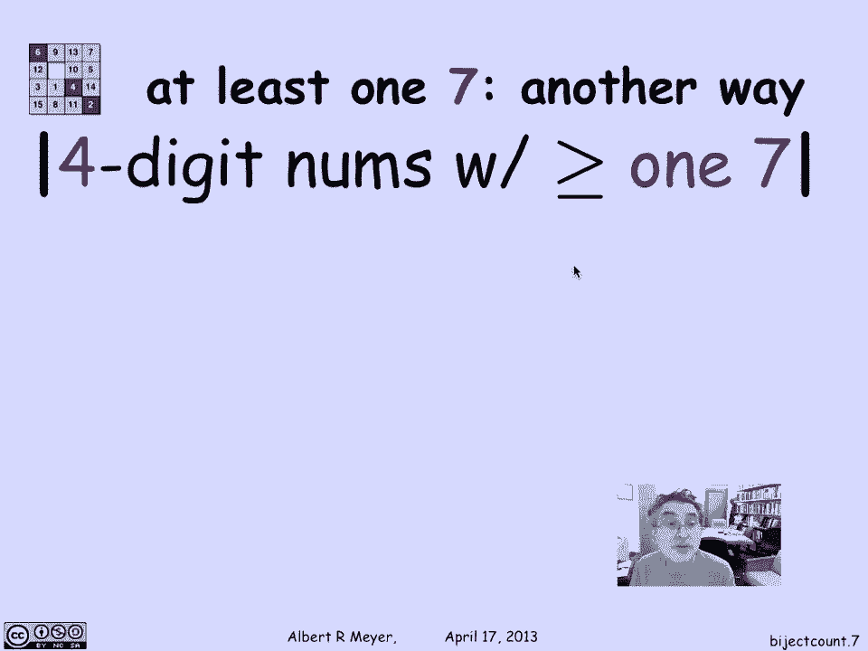
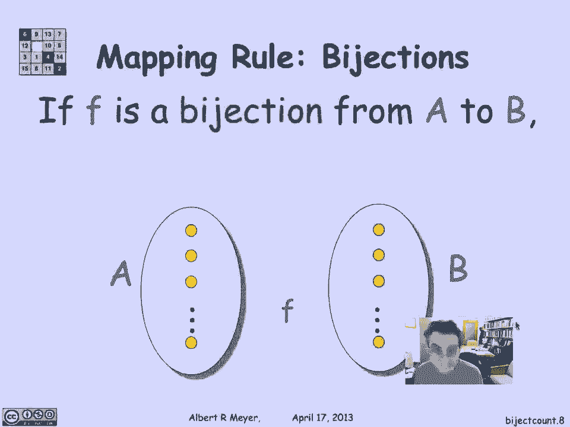

# 【双语字幕+资料下载】MIT 6.042J ｜ 计算机科学的数学基础(2015·完整版) - P76：L3.3.3- Counting with Bijections - ShowMeAI - BV1o64y1a7gT

一个基本的想法，让你在计算事物方面走了很长一段路。

用双射计数的想法，算一件事，通过数另一个，我们可以通过例子来说明这一点，让我们从一些容易计算的东西开始，只使用简单的和和乘积规则。

假设我正在计算密码，这是一个人为的过于简化的例子，但它给了你一个想法，这就是我所说的密码，密码是字母或数字的字符序列，它们的长度应该在6到8个字符之间，他们应该从一封信开始。

它们是大小写敏感的，这样你就可以区分大小写字母了。

所以让我们定义所有字母的集合L，大小写在一起，设d是从零到九的一组数字。

然后我们说密码应该在六到八个字之间，但实际上用长度作为参数更容易一点，所以让我们考虑长度为n的字，满足密码条件，所以pn是长度n的单词，从一封信开始，这是密码约束之一，所以我们可以表示，作为一个长度。

n个单词可以分解成第一个字符，这是一个L与单词的其余部分配对，剩下的n减去一个字符，剩下的n减去一个字符可以是l或这些，因此长度n的密码可以表示为l的乘积，用L联合d的n次方。

也就是l并d十字l并d十字l并d n减去1次，嗯，现在我们有一个简单的方法来数这个，因为根据乘积规则，这个乘积的大小是L的大小，l并d的大小乘以n减去1次方，和，当然是联盟。

因为字母和数字不按总和规则重叠，它们的大小正好是l加d，所以我得到了这个很好的公式，是五个两个字母乘以，五个两个字母加十位数字升到n减去一次幂。

密码呢，嗯，密码是p6，工会，七联，第8页，因为长度为6的单词不会与长度为7或8的单词重叠，这是一个不相交的结合，因此，指定的密码总数只是p6的大小，加上圆周率，P7的大小，加上P8的大小。

当我插进去的时候有公式，结果是一个很好的尺寸。

数十九乘以十到十四，这是一个简单的例子，在那里我把一个规范翻译成我可以很容易地表达的东西，作为一个乘积和总和，和我已经知道大小的东西的不相交和，让我们再举一个例子，假设我要数四位数字的个数。

所以这四位数字的元素是从零到九，有十种可能，至少有一种是七，四位数，至少有一个七的数字序列，一种计数的方法是，我可以把它变成包含一个7的不同四位数字的和，取决于前七个在哪里，如果至少有一个七。

有一个前七个，这就是应用的井序原则，所以如果我们让x缩写任何数字，x和o有十个可能的值代表7以外的任何数字，所以O有九个可能的值，那么以7开头的单词后面可以跟着任意三位数字。

所以七XXX是一种可能的模式，当七的第一次出现是第一次，另一种可能的模式是当你的数字不是7时，然后是一个七，这是七第二次出现的时候，后面跟着任何东西，这里七个发生在第三个，这里七个出现在第四个。

现在这些单独的模式很容易计数，使用产品规则，因为在这里我要数，有多少个三位数，有十个数字，所以这里是十的立方体，有多少个序列，其中第一选择是九，第二个选择是，这里是九乘以十的平方，是九的平方乘以十。

这里是九的立方体，这些是不相交的，因为嗯，它们是通过前七个发生的地方来区分的，所以我只是把它们加起来，我得到这个数字不是特别有趣，但是是三四三九，好的，所以这是一个计算某物的练习，有点巧妙地把它拆散了。

变成一个不相交的东西的总和，这些东西本身更容易计数。

还有一个办法，这是组合学中出现的另一个标准技巧，1。你是怎样算这个数的？至少有一个七的四位数字的序列，数着他们的赞美，数数没有7的四位数字的数字。

简单地减去这个数字，没有七的四位数字的数目，从四位数字的总数，这将是剩下的数字，有一个七，现在，四位数的数字很容易数，结果会是，没有7的四位数的数字也很容易数，因为四位数的个数是十的四次方。

和没有七的四位数的数字，剩下的每个数字都有九个可能的选择，省去了7的4次方，或者九到四，你可以重复检查十到四。

-九到四等于三，四，三个，九。

所以现在有了这个练习，使用基本和和乘积规则，我们可以开始应用和思考双射规则，所以双射规则简单地说，如果我在两个集合之间有一个双射，a和b，然后它们的大小是一样的，至少假设它们是有限集。

我们唯一计算的是有限集。

让我们举一个例子，其中我要计算一个集合a的子集数，通过寻找双射，在集合A的子集和我知道如何计算的东西之间，其实我们已经数过了，给定长度的二进制字符串，什么是双射，假设A是由n个元素组成的集合。

叫他们1到N，嗯和我有一个任意的子集，说它有一个1，它没有一个2，它有一个三，它有一个四，它没有五，然后它有一些其他数字的选择，事实证明，它有一个英寸，它很好，如果我想到一个子集是这样布局的，它与一个。

我可以用一个明显的方式来解决这个问题，其中元素在子集中，和一个零，其中元素不在子集中，实际上，这就是子集的所谓特征函数，其中一个意味着索引元素，I中的一个，th位置意味着AI在那里，I中有一个零，th。

位置意味着AI不在那里，是一个零，就是说没有2，这很容易被视为双射，给定字符串，您可以计算出给定子集的子集是什么，你可以弄清楚唯一的字符串是什么，所以我们有一个双射，我们得出的结论是，然后呢。

n位字符串的个数等于，等于，当然我们知道如何计算n位字符串的数量，2比N，所以我们刚刚发现的是，如果我有一组大小为n的，它有两个到n个子集。

用一种巧妙的方式说，不提到n是A的幂集的大小简单地是2到。

一个的大小，双射的另一个例子，考虑到这是一种有趣和有趣的，并将说明这样一个事实，即我们通过找到双射来学习一些东西，即使我们还不知道如何计算任何一个，所以我感兴趣的是，假设我有一种情况，有五种甜甜圈。

五种不同口味的甜甜圈，我想选一打，我想知道有多少选择所以，例如，这些小O代表甜甜圈，我可能会选择一打，选两个巧克力，不要柠檬，我不太喜欢那些，六颗糖，两个上釉，太平淡了，所以这里有十二个甜甜圈。

使用五种可能口味的甜甜圈中的四种，这就是我所说的精选甜甜圈，我想知道有多少这样的甜甜圈，让它成为集合A。

选择十二个甜甜圈的所有这些不同方法的集合，有五种口味的甜甜圈。

好吧，又有一个，一组甜甜圈选择之间的明显对应，由0和长度为16的1组成的集合B包含四个1，有什么对应关系？嗯，这是我的甜甜圈选择，当然，我用这些O来做甜甜圈的原因，它们也对应于零。

我可以放一个作为不同口味之间的分隔符，所以吃完巧克力甜甜圈之后，我放了一个，然后在柠檬甜甜圈之后，碰巧没有，我又放了一个，然后在六个糖甜甜圈之后，我放了一个，然后我巩固了，我从甜甜圈的选择中提取。

这个16位的单词有12个零对应12个甜甜圈，四个1对应于将这些零组分成五类，与每种口味的甜甜圈数量相对应的五个槽。

所以一般的双射，当然是如果我有C巧克力甜甜圈，L柠檬甜甜圈作为糖甜甜圈在任何数字的P平面上釉。

真的是啊，一个精选的甜甜圈和这个数量的巧克力，柠檬釉面对应于一个，c加l加s加g加p0和4个1，所以我们可以说，16位数字的单词和4个1的集合，大小与甜甜圈选择的数量完全相同。

尽管此刻我们不知道如何计算其中任何一个，我们将在下节课中看到一个简单的方法来计算，四个一的十六位字，但就目前而言，我们从双射计数中得出的结论是，这两个集合的大小相同。

