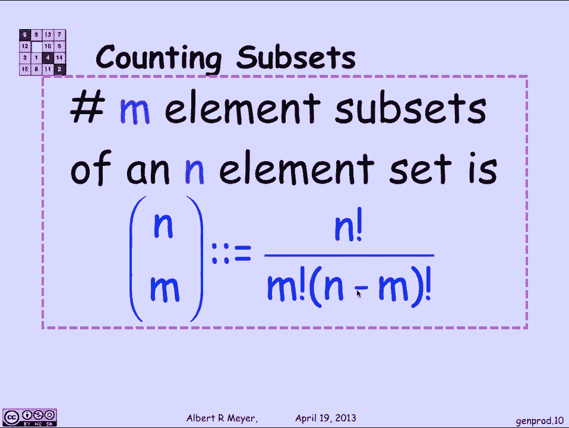
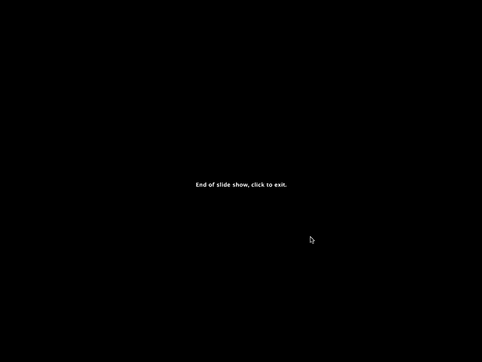

# 【双语字幕+资料下载】MIT 6.042J ｜ 计算机科学的数学基础(2015·完整版) - P77：L3.4.1- Generalized Counting Rules - ShowMeAI - BV1o64y1a7gT

双射规则有两种推广，和产品规则，这些规则一直在出现，而且是必不可少的，在任何计数器的曲目中都起着至关重要的作用，所以让我们看看那些，第一个是乘积规则的推广，让我们看看它出现的例子。

假设我要数一下班上五个学生的阵容数，所以如果我是学生的数量，比如说下午的会议，s是91，五个学生的阵容数，如果我使用普通的产品规则，我会得到我说的是s到第五，也就是长度序列，s的五个元素。

所以产品规则会说拿91到5，作为五个学生的阵容数，如果同一个学生可以排两次队，那就正确了，但对真正的学生来说，这当然是可能的，所以阵容没有重复，我们真正计算的是这些长度序列的数量，五个没有留级的学生。

广义乘积规则很简单地告诉你如何计算，也就是说，在所有的学生中选择第一个学生有九十一种方法，你选的第一个学生，剩下90个学生，你可以选择成为第二名，一旦你选择了前两个，剩下89个学生，你可以选择第三个。

第四个八十八，第五个是八十七，公式是91倍，九十次，八十九八，长度为5的不同学生的序列数87，现在，一个很好的方式来表达91到87，在阶乘方面，是九十一阶乘吗，也就是从1到91的产品。

除以1到86的乘积，它抵消了91阶乘中的前86项，留给你的是87到91，所以第二条规则是双射规则的一种明显的推广，但我太超前了，让我们一般地陈述广义乘积规则，所以如果我们让q是一组长度为k的序列。

具有以下性质，在这些长度k的序列中有n个可能的第一元素，对于第一个可能的元素中的每一个，如果你看元组的数量，第二个可能的坐标是什么，对于给定的第一坐标，总是两个，同样地，如果你看可能的第三个坐标的数量。

给出前两个，它是三个，它是统一的，不管前两个是什么，那么如果你有这种设置，当你一个接一个地挑选学生时，就会发生这种情况，他们不能，你发现有n个第一可能选择的长度k序列，和两个第二种可能的选择。

可能的选择是n到n，这就是品红色盒子中的广义乘积规则的陈述，现在我们来讨论广义双射规则，这被称为除法规则，简单而难忘的方式来说明它是，如果你要数6-0-4-2班的学生人数，你可以数学生的手指数除以十。

现在数手指可能比学生更难，所以这不是一个实用的方法，但它说明了一个基本而直截了当的想法，当然啦，它含蓄地假设，我们没有任何截肢或多指畸形的例子，事实上，每个学生正好有十个手指，所以总的来说。

除法规则可以这样说，如果我有一个从集合A到集合B的总函数，共域a a域a码域b，这个映射是k到1，a的基数是b的基数的k倍，所以k到1意味着，击中每个B元素，另一种说法是，在的每个元素中都有k个箭头。

那么箭头的数量就是k乘以b，如果你有一个总函数，箭头的数量等于，这就是我们得到公式的地方，这就是广义双射规则，让我们把它应用到一个关键的例子中，这绝对是基本的，我们会反复使用，假设。

我想知道有多少大小为4的可能子集，从数字1到13，我可以选择的十三个可能的数字，我想随便挑四个，我想知道有多少种方法可以做到这一点，我们将通过找到一个映射来做到这一点。

我们知道如何计算到这些特定子集的东西，所以我们知道怎么数，如果我让a是1到13的所有排列的集合，我知道A的大小是十三阶乘，因为排列的第一个元素有十三个选择，第二个十二个，第三个十二个。

设B为我要数的对象，即大小为4的集合，从1到13的子集，我想从一个，我知道如何数数，但我还不知道如何数数，但在某种程度上，我可以计算出它是K到1，K我也能数数，我是怎么做好的，让我们对一个，也就是说。

在某种程度上叫它们1 2到13，所以这些数字从1到13，是从1到13的数字吗，和一些未知的秩序，我要绘制一个，像这样到它的前四个元素，只要取排列的前四个元素，并将它们映射到由这四个元素组成的集合。

因为这是一个排列，这些元素都是不同的，所以我真的有一套四种不同的东西，一个1，2和3和4应该是不同的，这给了我一个定义得很好的总函数，从十三个数的排列到它的前四个元素的集合。

现在我们想知道的是这是什么样的地图，我认为这是千分之一的千分之一，这并不难，所以当我看其他东西映射到布景时，一二三四，我们对它的前四个元素进行排列，如果我们从1到4，作为映射到该集合的其他东西。

一二三四井，答案是具有相同前四个元素的任何排列，但可能顺序不同，因为我们要把前四个按顺序，并将它们映射到前四个的集合，前四个无关紧要的顺序，剩下的九个元素五到十三的顺序也不重要，不管它们是什么。

如果我有一个给定的四个元素的集合开始，不管剩下的九个是什么，它们将映射到四个元素的相同子集，所以有四种可能的阶乘方法可以对前四个元素进行置换，有九种阶乘方法可以对最后九个元素进行置换。

每一个都指向同一组四个元素，从1到4，只有这些人去那里，所以我们发现地图，在这些序列中，给定的四个元素以某种顺序首先，剩下的九个元素按其他顺序，四次阶乘，九乘一，有四个阶乘时间。

对任意给定的四个元素集的九个阶乘排列，这意味着，但是通过应用除法规则，我发现一个，我知道是十三阶乘等于k中的k，到四个阶乘时间之一，九次阶乘，b的大小，b是，作为我试图计算的大小四的子集。

所以我得到的是b的大小是13阶乘，除以k 4阶乘，九阶乘，十三阶乘大于四阶乘，九阶乘，这个数字经常出现，它有一个特殊的符号，叫做二元二项式系数符号，我们读的是十三选择四，如果我有一个n个元素集。

我会选择其中m的一个子集，推广这个论点，因为十三个中的四个和九个完全是武断的，这个论点总体上是有效的，选择一组m个元素的方法的数量，在n中是n选m，选择m的定义是n阶乘而不是m阶乘。

排列前m个元素的方法，和n减去m的阶乘方法来置换剩余的n减去m的元素，那个符号，二项式系数称为n/m是n选择，这是一个绝对基本的公式，你需要记住。

