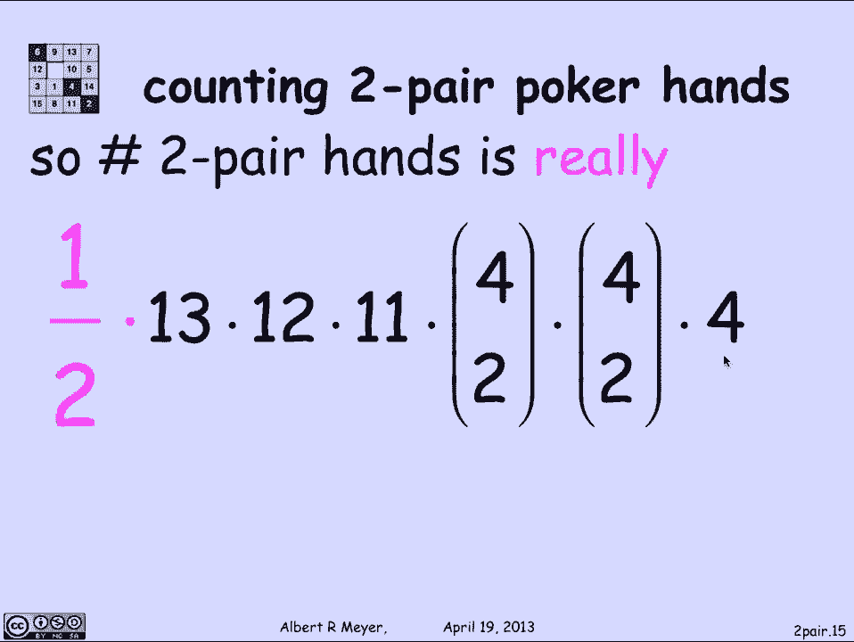

# 【双语字幕+资料下载】MIT 6.042J ｜ 计算机科学的数学基础(2015·完整版) - P78：L3.4.3- Two Pair Poker Hands - ShowMeAI - BV1o64y1a7gT

so let's do a basic example of uh，counting that uh illustrates。

the use of these new generalized rules of the division，rule in the generalized product rule uh。

and let's count some particular kind of poker，hands called a two pair，so poker is a game。

where each player is dealt five，cards from a deck of fifty two cards。

and the definition of a two pair，hand is that u there are two cards of some rank。

the ranks are ua dus up through king，so the ranks are thirteen possible ranks。

ace is one two three up through ten，and then jack queen king is eleven twelve thirteen。

so there were thirteen possible ranks，we're going to choose two cards of sumranks that。

that's called a pair，then we're gonna choose，choose two cards of a different rank。

the second rank and finally uh，we're gonna choose a card of still a third rank。

so i get a pair and another pair and a third and another card。

that does not match the ranks of either of the first two，that is the definition of a hand。

that in poker is called to pair，so um，let's take an example，here's a typical two pair hand。

i've got two kings，they both have ranked thirteen，one is a king of diamonds。

the other is a king of hearts um，there are four of these suits，so called diamonds，hearts。

spades clubs，there are two aces，a pair of aces，one is an ace of diamonds，the others in ace of spades。

and finally their hanging，loose a third，rank that doesn't match the kings of the ais。

namely a three of clubs，now the way that i'm gonna propose to count the number of two，pair。

hands is to think about it，this way，i'm going to begin by choosing the rank for the first pair。

and there are thirteen，possible ranks that the first pair might have once。

i fixed the rank for the first pair，the second pair has to have a different rank。

so there are twelve ranks，left um once，i've picked those two ranks for the first。

the ranks for the two pairs，then i have the rank of the last card uh。

which is eleven possible choices，then in addition once，i've chosen the rank of the first pair。

the rank of the second pair in the rank of the loose card，the fifth card ui uh。

i i select a pair of suits to go for the first pair，so let's say，if the first pair i figured out。

we're going to be two aces，which two aces should they be well。

pick two of the four suits and there are four，choose two ways to choose the suits for the pair of aces。

likewise，there are four，choose two ways to choose the two suits for the pair of king。

and finally there are four possible suits，i can choose for the rank of the last card。

so that says that um，i might for example specify a two pair hand by saying，ok。

let's choose a pair of kings to come first，and a pair of aces to be the second pair。

and a three to be the loose card，let's choose the set of two elements。

diamonds and hearts for the kings，the two elements。

diamonds and spades for the aces and a club for the three，this sequence of choices specifies。

exactly the two pair hand illustrated on the previous slide，namely two kings of diamond hearts。

two aces a diamond in a spade，and the three of clubs，so i can count the number of two pour hands。

fairly straightforwardly，there were thirteen choices for the。

rank of the first pair twelve for the second eleven for the rank of the，third card，four。

choose way to choose the suits of the first pair for。

choose way to choose two ways to choose the suits of the。

second pair and four ways to choose the suits for the last pair，so this is the total thirteen times。

twelve times，eleven times four，choose to twice，times four，and that's not right，there's a bug。

what's the bug，well，the problem is that what i described。

and this number on the previous slide that number，exactly the set of six tools。

consisting of the first card ranks and the second card ranks，and the last card rank。

and the first card suits and the second card suits in the last card suit。

that is if it's counting the number of possible ranks for a，first choice。

the number of possible ranks for a second choice third，and so on this set um。

this of six things are being counted，correctly by the formula on the previous page，the difficulty is。

these six counting these six tools is not the same，as counting the number of two pair hands。

we've counted the number of six，tops of this kind correctly，but not the number of two prepared hands。

because this mapping from six tools to two，pair hands is not a objection，mainly。

if i look at the topot the sixth toole，choose kings and then aces in a three。

with these suits and most suits and a final suit for the three uh，which determines this hand。

the king of diamonds，king of heart，sand diamonds ais spades three of clubs，there's another six tool。

that would also yield the same hand namely uh，what i can do is i keep the three of clubs。

uh specified，but instead of choosing the kings and their suits，and the aces and their suits。

i'll choose the aces and their suits，and the kings and their suits。

so i'm just switching these two entries，and those two entries。

and if i do that here's a different six toole，that specified the same to pair hand。

this tuple is specifying a pair of ases，in a pair of kings，where the aces have suits diamond，spades。

and the kings have space space，i have suits diamond hearts，and the three has suits clubs。

so the bug in our reasoning was that when we were counting。

and we said there are thirteen possible ranks for the first pair。

and there are twelve possible ranks for the second pair。

and we were distinguishing the first pair from the second pair，that was a mistake。

there isn't any first pair and second pair，there are simply two pairs，and there's no way to tell。

which is first in，which is second，which is why we got uh two，different ways from our。

sex tools of mapping to the same two pair，depending in the sex tuple。

which ones which of the two pair，i wanted to list first，so in fact，since either pair might be first。

what i get is that this map from six tools to two pair，hands is actually a two to one mapping。

it's not a objection，because there's no difference between the first pair，and the second pair。

there's just a couple of pair，if i do that then i can fix this formula。

now that i realized that the mapping from these six tumbles。

which i've counted correctly to the things，i want to count namely the two pair hands is two to one。

then by the generalized product rule by the division rule。

all i need to do is divide this number by a half。

