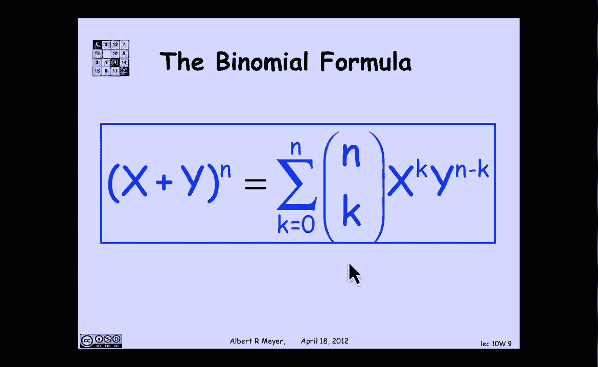

# 【双语字幕+资料下载】MIT 6.042J ｜ 计算机科学的数学基础(2015·完整版) - P79：L3.4.4- Binomial Theorem - ShowMeAI - BV1o64y1a7gT

我们将花几分钟讨论二项式定理，高中的你可能很熟悉，这是一个很好的说明，代数与计算之间联系的首次说明，因此，这种联系的基础思想是由分配律来说明的，我故意用这种古怪的方式写它，纯粹是象征性的。

在那里我要用两条领带乘三只蜜蜂，3个小圆帽乘以2条领带会得到什么？嗯，苹果，应用分配定律，我们得到了每一个可能的配对，一顶小便帽和一条领带繁衍生息，你把它们加起来，所以这里有三个项，那里有两个项。

你看到的是，基本规则是分配律和的乘积，变成乘积的总和，你得到的金额，涉及每个组件的所有术语的乘积，以一切可能的方式，让我们看看它应用于二项式定理，所以二项式定理感兴趣的是。

让我们看看一加x的n次方的表达式，我们知道这将是一个n次的多项式，所以它可以写成常数C0加C的形式，1乘以x到1 c 2 x到2，cn x到n，我们想问c k的表达式是什么，例如。

这是x的前四次幂的布局，假设1加x到4等于1加4 x，加6 x平方，四x立方，一乘四，这些系数背后的模式是什么，一四六四一井，一种思考的方法是如果我把1加x写到n，完全，它当然是n的乘积。

一加x乘以一加x的出现，分配定律的应用，和等于的乘积，乘积和规则，但这次有N个产品，我得到的是2到N，我正在加的条件，它们中的每一个都是n项选择的乘积，每个因素中的一个，所以这两个术语中的一个到n。

项对应于从n个因子中的每一个因子中选择一个或一个x，所以如果我开始，比如说，从n个因素中选择一个零一零一，我把术语1到n，如果我从每个术语中选择了x和x，x和x，我把最后一项x到n。

如果我做了一些任意的选择，就像我从第一个中选择了一个X，和第二个的一个，从第二个到第三个，我正在读这学期的书，从第四节开始，以此类推，一个从下一个到一个从下一个到最后一个，最后一个的一个。

我会得到这个特殊的术语，这不是下一个按字母顺序出现的，但这只是一个例子，所以这是一个简单的想法，如果你乘以n项，每一个都是两件事的总和，你最终会得到两个N项。

对应于选择其中一个或另一个的每一种可能的方式，n种产品中每一种成分的术语，那么x与k的系数是多少，嗯，x与k的系数，这两个项中的项数是n，其中x的幂是k，这就是我选择K的地方。

x{\displaystyle x}的任意n{\displaystyle n}减去k{\displaystyle k}的井，在这n项中有多少种选择k x的方法，我们知道答案，它是n选择k。

这是选择K项子集的所有方法，n项中的n项，这就是答案，是简单的n选k，这叫做二项式，现在我们知道1加x等于n选择0，加n选择一个x n选择两个x平方，n选择k x到k，是以n结尾的一般项吗？

选择n到x到n，所以这个表达式一加x称为二项式表达式，选择的数字，我们以前见过的是选择的方法的数量，说，在这种情况下，n个元素中有k个称为二项式系数，这就是为什么它们被称为二项式系数。

所以如果我要更笼统地表达它，我不需要它是一个，我用了一加X，只是因为更容易遵循公式的结构，但是如果我再看一次x加y的n次方，系数是一样的，它是N选择零，但这次从y到n选1 x y到n减去1。

现在发生的事情是我选择一个或一个y，而不是每个术语中的x或1，所以xy项总是有度数之和，等于n，如果我选kx's，我一定选了n减去ky，在那里，它以一种更简洁的形式表达出来。

