# 【双语字幕+资料下载】MIT 6.042J ｜ 计算机科学的数学基础(2015·完整版) - P7：L1.3.3- Well Ordering Principle2 - ShowMeAI - BV1o64y1a7gT

so let's look at two examples of using。

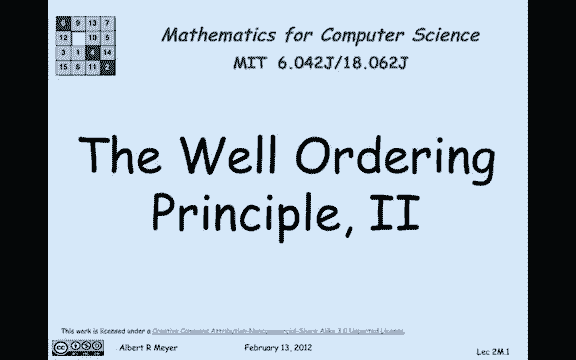

the well ordering principle one of them，is pretty obvious and the other one is。

not hard but a little bit more。

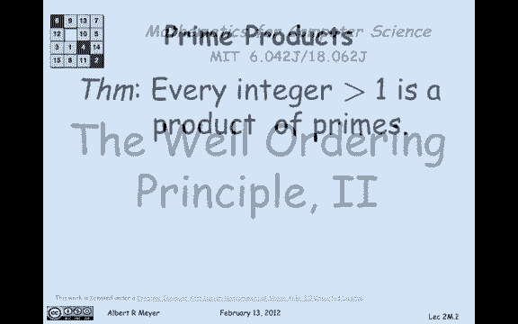

interesting so what we're going to prove，is that every integer greater than 1 is。

a product of primes so remember a prime，is an integer greater than 1 that is。

only divisible by itself and the number，1 it can't be expressed as the product。

of other numbers greater than 1 so the。

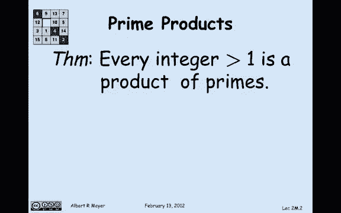

way we're going to prove this is by，contradiction，and we're going to begin by assuming。

suppose that there were some numbers，that were non products of primes。

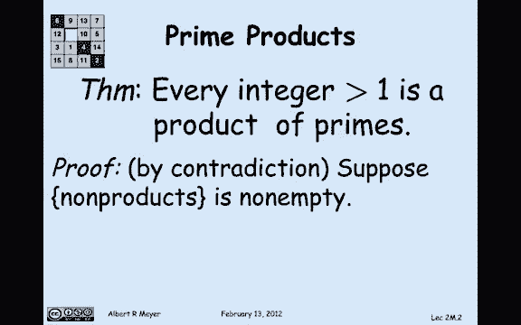

ok that is to say the set of non，products is non-empty so applying the。

least the well ordering principle to，this non empty set of non products。

there's got to be at least one so M is a，number greater than 1 that is not a。

product of primes now by convention if M，itself was a prime is considered to be a。

product of one prime so we know that M，now look em is not a prime or if it was。

a prime it would be a product of just，itself so that means that it must be a。

product of two numbers Coulomb J and K，where J and K are greater than one and。

less than M that's what it means to be a。

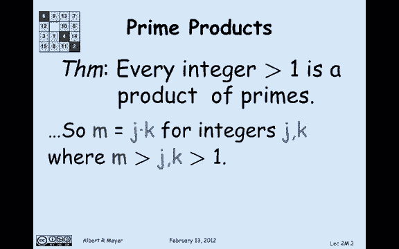

non-prime it's a product of J and K well，j and k are less than m so that means。

that they must be prime products because，they're less than m and greater than 1。

and m is the smallest such number that's，not a product of primes so we can assume。

that J is equal to some product of prime，say P 1 through P 94 and K is some other。

product of primes q1 through q4，so you can see where this is going。

now what we have is that M which is JK，is simply the product of those P is。

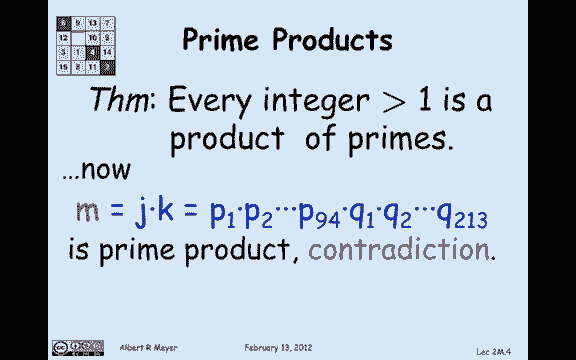

followed by the product of those Q's M，is in fact a prime product which is a。

contradiction so what did we assume that，led to the contradiction we assume that。

there was some counter examples and，there must not be any and no counter。

examples means that in fact every single，integer greater than 1 is indeed a，product of primes as。

let's start looking at a slightly more，interesting example using the。

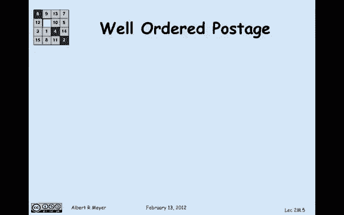

well-ordered principle two reasoning，about postage so suppose that we have a。

bunch of five cent stamps and three cent，stamps and what I want to analyze is。

what amounts of postage can you make out，of five cent stamps in three cent stamps。

so I'm going to introduce a technical，definition for convenience let's say。

that a number n is postal if I can make，n plus eight cents postage from three。

and five cent stamps okay so this is，what I'm gonna prove I claim that every。

number is postal in other words I can，make every amount of postage from eight。

cents up okay I'm gonna prove this by，applying the well ordering principle and。

as usual with well ordering principles，will begin by supposing that there was a。

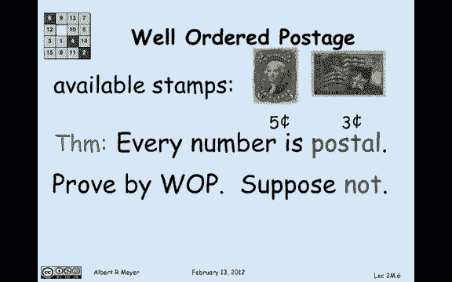

number that wasn't postal that would be，a counter example so if there's any。

number that's not postal then there's a，least one em by the well ordering。

principle because the set of Cather，examples is non-empty if some number is。

not postal so there's at least one so，what we know in other words is that this。

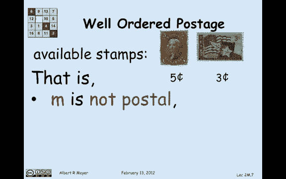

least m that's not postal has the，property it's not postal and any number。

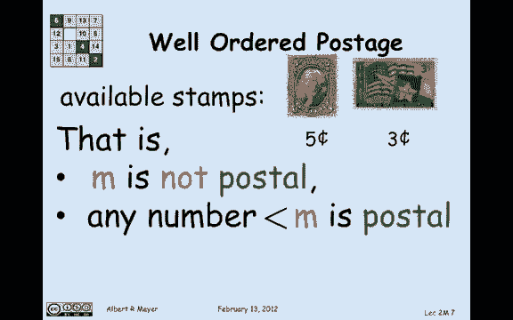

less than it is postal，what we can figure out about em first of。

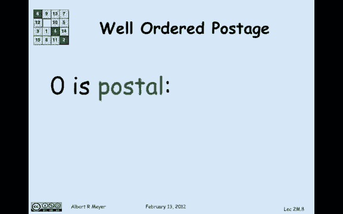

all em is not zero zero was postal，because zero plus eight cents can be。

made with a 3-cent stamp and a five cent。

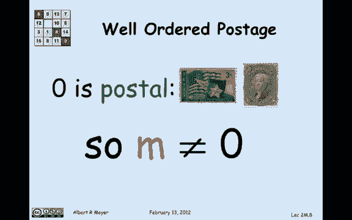

stamp M is not zero because M is，supposed to be not postal as a matter of。

fact by the same reasoning M is not one，because you can make one plus eight。

cents with three threes and M is not 2，because you can make two plus eight。

cents 10 cents using two fives so we've。

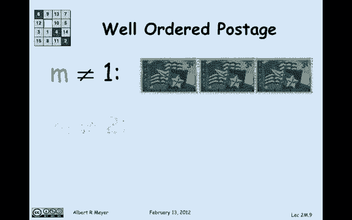

just figured out that this least counter，example has to be greater than or equal。

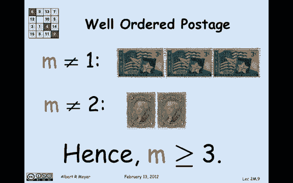

to three because 0 1 & 2 are not counter，examples so we've got that M is greater。

than equal to 3 the least non-postal，number so if I look at M minus 3 that。

means it's a number that's greater equal。

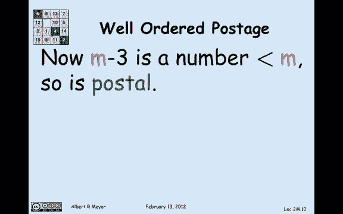

to 0 and it's less than M so it's postal，because M is the least non-postal one。

alright so in other words I can make out，of 3 & 5 cent stamps I can make em minus。

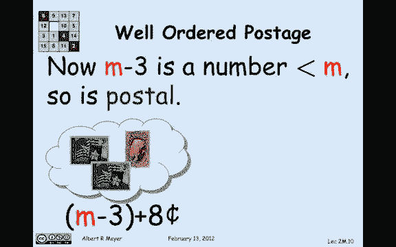

3 plus 8 cents but look if I can make M，minus 3 plus 8 cents then obviously M is。

postal also because I just add 3 cents，to that M minus 3 number and I wind up。

with M plus 8 cents which says that M is，postponed as a contradiction so assuming。

that there was a least non-postal number，I reach a contradiction and therefore。

there is no non-postal number every，number is postal 0 Plus 8 is postal 1。

plus 8 is postal 2 plus 8 is postal，every number greater than or equal to 8。

