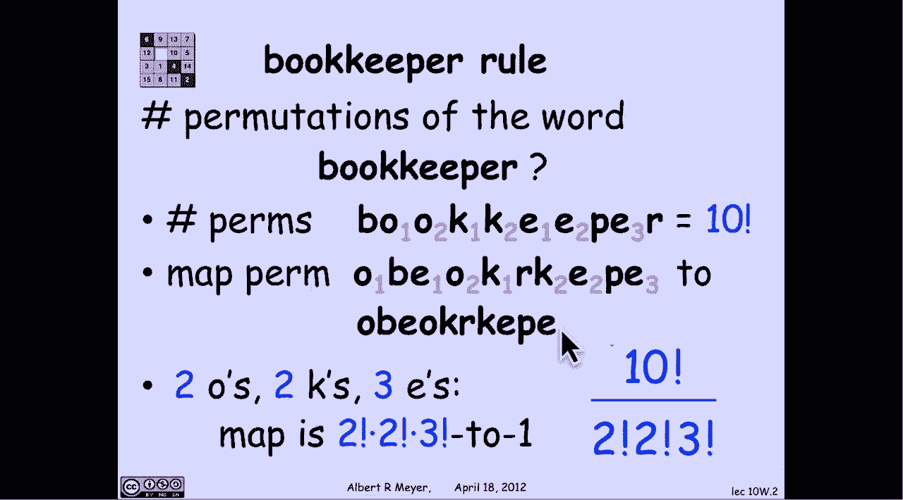
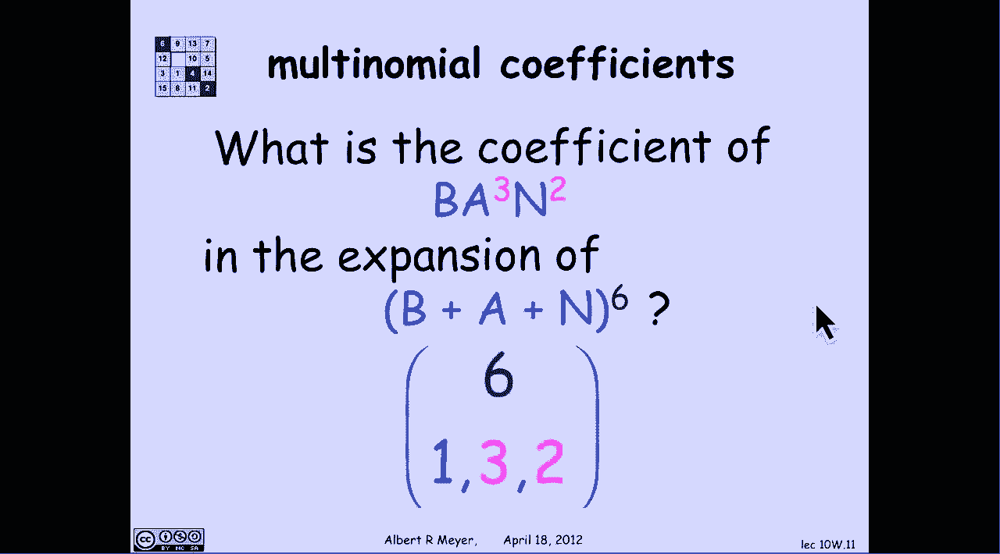
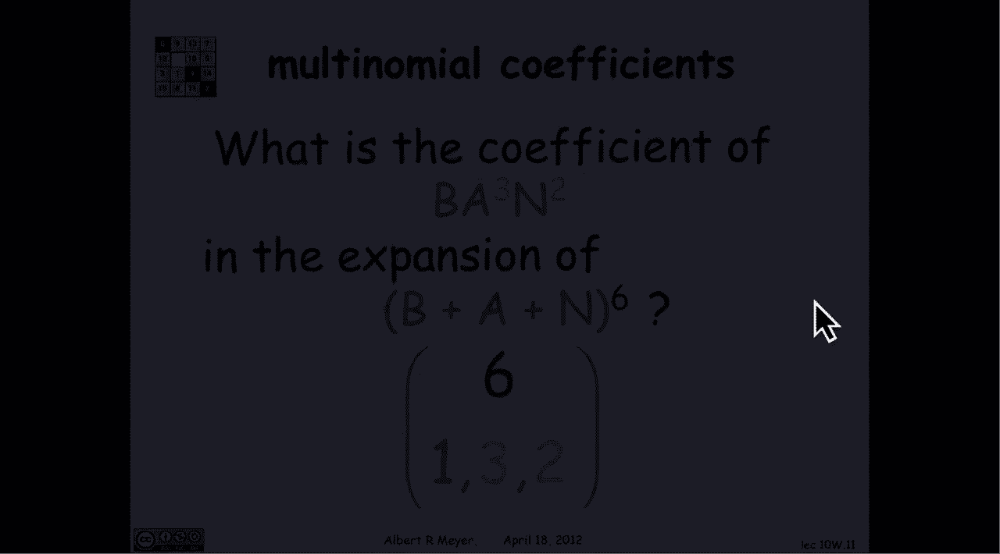
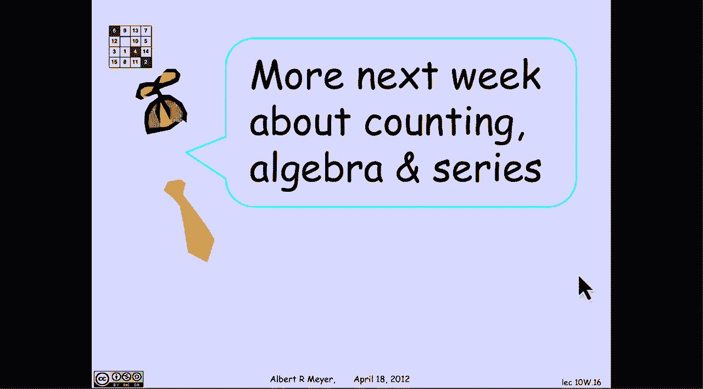

# 【双语字幕+资料下载】MIT 6.042J ｜ 计算机科学的数学基础(2015·完整版) - P80：L3.4.5- Multinomial Theorem - ShowMeAI - BV1o64y1a7gT

the binomial theorem extends to a thing，called the multinomial theorem whereas。

instead of taking a product of a sum of，two things you take the product of a sum。

of K things to get the multinomial，theorem and what underlies it is a rule。

that we're going to call the bookkeeper，rule and here's why，so the bookkeeper rule is about the。

question of look at the word bookkeeper，and ask how many different ways are。

there to scramble the letters in this，word that actually are distinguishable。

the point being that the two O's are，indistinguishable so the order in which。

they appear doesn't matter likewise the，three E's in the two K's well how do we。

answer this question a simple way to do，it to begin with is to label all of the。

indistinguishable letters with，subscripts to make them distinguishable。

so I'm gonna put subscripts one and two，on the O's one and two on the KS and one。

two and three on the YZ now all the ten，letters aren't distinguishable and if I。

ask how many ways are there to permute，these ten letters the answer we know by。

the product rule is sent by the，generalized product rule is simply 10。

factorial now my strategy is going to be，to use the division rule to count the。

number of patterns of the word of the，letters in the word with no subscripts。

the way I'm going to do that is take one，of these subscript in words and erase。

the subscript so I'm gonna map it to the，same permutation of letters with no。

subscripts I've just done that here I've，taken an arbitrary permutation of the。

subscripted word and then I've erased，the subscripts and consolidated the。

letters and I wind up with this，permutation okay now if I want to count。

the number of unscripted subscripted，permutations then I simply figure out。

that this mapping is K - 1 and I'm gonna，it，well how many subscripted words map to。

this given pattern the answer is the，subscripts on the O's don't matter so。

there's two possible orders in which，those subscripts might appear subscripts。

on the case don't matter there's two，possible orders in which those。

subscripts might appear subscripts on，the YZ don't matter three possible。

or three factorial possible orders that，the subscript Smita currently 'is the。

net result is that with two O's two K's，in three E's the mapping is two。

factorial by 2 factorial by 3 factorial，to 1 and that instantly gives us by the。

division rule if the total number of，permutations of the letters in the word。

bookkeeper is 10 factorial over 2，factorial times 2 factorial times 3。

factorial more generally by the same，reasoning if I look at a sequence of n。

letters of which n1 RA is in n/2 or B's，up through NK r zzzz then the number of。

permutations of those letters with the，repeated A's B's and Z's is n factorial。

divided by n1 factorial times n 2，factorial through NK factorial and this。

formula occurs so often that it has a，name it's called a multinomial。

coefficient in this format n over N 1，and 2 through NK you could start to say。

n choose n 1 choose n to choose and K if，you're thinking about how we pronounce。

the binomial coefficients the convention，is that the sum of the n eyes is。

supposed to be equal to the numerator n，this is called a multinomial coefficient。

so n factorial divided by this product，of factorials is written in somewhat。

shorter notation without the factorials，as a multinomial coefficient binomial。

coefficients by the way were special，case when we write and choose K if we。

wrote it as a multinomial coefficient，you'd have to write it as n choose K and。

then choose n minus K so we can apply，this to think about coefficient。

coefficients in expanding things that，are more than binomials so let's look at。

expanding a kwinto kwinto meal a sum of，five things EMST and Y and I raise that。

to the seventh power so that means in，these products of seven of these terms。

I'm looking at words of length seven，whose components are the letters EMS。

T&Y and if I so if I multiplied this out，applying the distributive law I would。

wind up with five to the seventh terms，each of one consisting of a permutation。

of the letters e MST and Y and if I ask，what's the coefficient in that expansion。

of the term e-m-s cubed T why it's，exactly the number of ways of permuting。

these five letters a word of length，seven made out of these five letters。

with three occurrences of s in other，words the coefficient of e M s Cube T Y。

in this product is the number of ways of，rearranging the letters in this sequence。

of seven it's the word systems which is，what we chose it to be rememberable how。

many ways are there to rearrange the，letters in the word systems by the multi。

node by the bookkeeper rule there are，seven choose one one three one one okay。

let's do another example what's the，coefficient of B a cubed N squared if I。

expand this trinomial B plus a plus n to，the sixth power，well now again I have three to the sixth。

terms how many of them involve a be，three A's and two ends by the bookkeeper。

rule it's the number of ways well it's，the number of ways of rearranging the。

letters in the word banana and by the，bookkeeper rule that's six with。

subscripts 1 3 and 2 more generally，where this is what the multinomial，theorem says if i look at the。

coefficient of the term a product of X I，to the our eyes in an expansion of a K。

moan of a Kano meal a sum of K distinct，variables raised to the nth power now。

I've got if I expanded this out using，the distributive law without collecting。

terms I'd have K to the N terms each of，which was a permutation of the x1。

through XK s um with repeats and then if，I ask how many of those products of any。

of these K variables have this many X，ones this many X，who's through it this many x RK is this。

many X KS I'm asking again a bookkeeper，question and the answer is n choose R 1。

R 2 through R K so now we're ready for，the record to state the general Momoa。

multinomial formula if I take a sum of K，terms at K no meal to the nth power then。

expressing it in concise notation it's，the sum over R 1 through our case。

summing to n of the multinomial，coefficient n R 1 through our K times。

this product of excise I'm not putting a，highlighted box around it because this。

is not a formula which is particularly，important to memorize and it's clearly。

all clogged up with subscripts but，nevertheless it's good to have sometimes。

for the record and next week we will，continue with this theme about the。

connection between counting and algebra，and in particular not only ordinary。

polynomials as we've been looking at，here with a product of sums but in fact。

infinite polynomials or infinite series。

