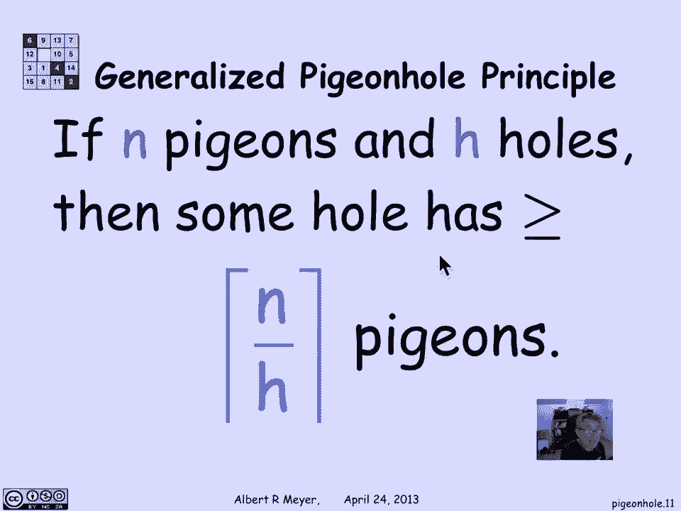
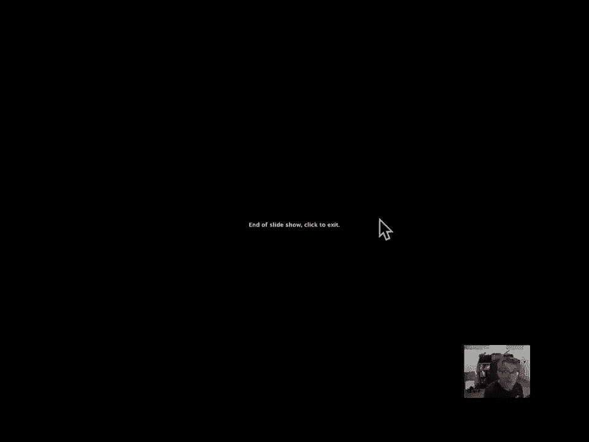

# 【双语字幕+资料下载】MIT 6.042J ｜ 计算机科学的数学基础(2015·完整版) - P81：L3.5.1- The Pigeonhole Principle - ShowMeAI - BV1o64y1a7gT

鸽子洞原理是一种计数原理，这是如此明显，以至于你可能没有注意到你在使用它，以简单的形式，上面说如果鸽子比鸽子洞多，你必须在同一个洞里至少有两只鸽子，好的，嗯，我们很快就会得到一些里程数，但让我们记住。

这实际上只是一种非正式的说法，我们已经正式看到了，其中一个映射规则是，如果你有从集合A到集合B的总注入，这意味着A的大小小于或等于B的大小，把它的反义词，意思是如果A的大小大于B的大小。

那么从A到B的总注射是不可能的，没有完全注射意味着没有关系，在一个，最多一个箭头进入B，如果所有从a中出来的东西都有一个箭头，至少要有两个箭头，两只鸽子来到B中的同一个鸽子洞。

所以我们已经知道这个规则了，唯一令人惊讶的是，你如何利用它，我们不打算对它进行精心的利用，在这个小视频里，你可以在课文中读到一些有趣的应用程序，关于证明他们必须是波士顿地区的三个人，头上有一万多根头发。

但完全相同的数字，或者必须有，由两个五位数组成的九十个数字组成，它们的和是相同的，但我们将更温和地应用鸽子洞原理，也就是说，如果我有一套五张牌，那么我至少要有两张同一套牌，为什么有四套西装。

哈特的时间是俱乐部在这里指示，如果你有五张牌，有更多的鸽子卡，然后适合洞，所以如果你又要把鸽子分配到一个洞里，鸽子们必须聚集在一起，在同一个大厅里至少要有两只鸽子，至少两张同一套牌，也许更多好的。

这就像概括，假设我有十张牌，呃，同一套衣服我必须有多少张牌，同一套牌有多少张牌，我保证有，不管是什么十张牌现在都好了，如果我有四个插槽，我想分发十张卡片，有没有可能我每个洞都有不到三张牌，否。

因为如果我每个洞只有两张牌，那么我最多有八个元素，我得到了十个分配在四个插槽，我得把它们捆起来，至少有三张同一套牌，你可以检查一下，我不需要再吃了，当然啦，所以这里的理由是，同一套牌的数量将是你得到的。

把你的十张牌除以四个插槽，并认为至少有一个插槽必须有平均数量的牌，就是十比四，他们不可能都低于平均水平，当然因为有一个整数数的牌你可以把这个四舍五入，记住这些角大括号的意思是四舍五入到最近的整数。

所以十除以四，四舍五入是三个，这是一个下限，你必须把一个插槽捆起来的牌的数量，更一般地，如果我有n只鸽子，我要把鸽子分配到独特的洞里，如果我有h洞，那么某个洞的n除以h，再次四舍五入。

n除以h可以理解为每个洞鸽子的平均数量，鸽子洞原理可以表述为，至少有一个洞必须大于或等于平均数。

