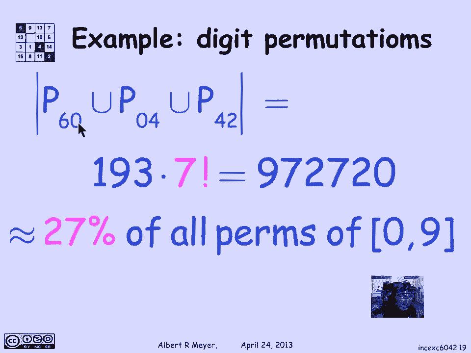

# 【双语字幕+资料下载】MIT 6.042J ｜ 计算机科学的数学基础(2015·完整版) - P82：L3.5.3- Inclusion-Exclusion Example - ShowMeAI - BV1o64y1a7gT

the final general accounting rule that，we'll examine is called inclusion。

exclusion and it is a straightforward，generalization of the sum rule at least。

in the simple case of two sets that，we'll look at first。

so we're going to look at the 604 two，example of applying inclusion exclusion。

but let's begin by stating what it is so，the sum rule says that if you have two。

sets a and B that are disjoint no，overlap between a and B then the size of。

a union B is equal to the size of a plus，the size of B well that's obvious we。

took that as kind of basic axiom but，what if they're not disjoint suppose。

that a and B overlap and there's some，stuff in here that's the intersection of。

a and B where there are points in common，what then is the size of a union B in。

terms of similar things that we can，count and the answer is that the size of。

a union B is the size of a plus the size，of B minus the size of a intersection B。

now the intuitive reason for that and，it's not really very hard to make a。

precise argument is that when you're，adding up the elements in a you're。

counting all the elements in the，intersection once and then when you add。

in the elements in B here a plus B，you're counting all the elements in the。

intersection the second time the ones，that are in a minus B get counted once。

the ones that are in B minus a get，counted once but the ones that are in a。

intersection B get counted counted twice，so to get the right count I have to。

subtract the size of a minus B so it's，only counted once in the total formula。

and that's an intuitive explanation of，why inclusion/exclusion a formula holds。

for two sets let's apply it and I'm，going to look at an example where we're。

looking at digit permutations and I'm，going to look at permutations of the ten。

digits 0 through 9 inclusive there's a，standard one where they're listed in。

order and there is just a random seeming，permutation，of the digits 0 through 9 notice that。

the 1 in 3 the 2 is sort of out of order，the rest are in order now what I'm going。

to be interested in is those，permutations where certain patterns。

appear so first of all let's noted that，the number of permutations we know how。

to count it's 10 factorial I'm，interested in how many permutations have。

a consecutive 6 and 0 a consecutive zero，and 4 or a consecutive foreign to in。

other words two of the consecutive，numbers that appear in 604 - well the，first one does not。

there's no 6 0 0 4 or 4 2 in this list，this one has a 4 2 so it would count as。

one of those permutations that has，either a 6 0 a 0 4 or 4 2 because it's。

got the 42 um here's one where you've，got a a a 2 and a 4 but that's not a 4。

and a 2 and in fact there is no pattern，here of 6 0 0 4 4 2 so it's not one of。

the permutations that I'm interested in，on the other hand here's one that's。

doubly good this is a permutation that，has both a 0 4 in it and a 4 2 in it so。

it would be of one of these permutations，of the kind that I'm looking for that。

has at least one of the patterns 6 0 0 4，or 4 2 well if I let P sub X be the。

permutations with the subsequence X then，what I'm really saying is that this one。

with a 42 and it is in P 42 because it's，got the 42 pattern this one with a 0 4 2。

4 2 and it is in the p 0 for a set of，permutations with the patterns e 0 4。

intersected with the set of patterns，that have a 42 in it so that's what that。

one illustrates so what we're really，asking for then is the union of three。

things the union of P 60 p 0 4 and P 42，how many how big is the set of sequences。

that have a 6-0 Union the set of things，that have a sick，zero for you knew the set of things that。

have a four toe and as we saw，illustrated in the previous slide these。

are not disjoint well I've been cheating，a little because in order to pick figure。

out this one I'm going to need inclusion，exclusion for three sets instead of two。

because it's in which is slightly more，complicated because I have a union of。

three things that overlap and let's look，at that so what is inclusion exclusion。

look like for three sets if I want to，know what's the size of a union B Union。

C here's a Venn diagram that shows a，picture of a union B Union C with all。

possible overlaps Illustrated there and，the formula turns out to be um you add。

up a B and C you add up the size of a，the size of B and the size of C know now。

that has the consequence that just that，sum of a B and C is counting this a lens。

shaped region that is the intersection，of a and C it's counting it twice in the。

a plus C term it's counting a，intersection B twice and it's counting。

this lens shape which is C intersection，B twice so in order to get the sum right。

I'm going to have to subtract oh one，occurrence of a intersection B 1 a。

intersection C 1 B intersection C so，that those items are only counted once。

in this sum and then in fact if you look，at this region here the sort of rounded。

triangle region which is the，intersection of a with B and C that one。

is actually getting counted three times，all three circles overlap it so when I。

add in a and I add in B and I add in C，every one of those points there is being。

added three times on the other hand this，rounded triangle shape which is counted。

three times in the sum a plus B plus C，is being subtracted three times because。

when I look at a intersection B on this，region and I subtract it I'm taking one。

away from the count on each point there，and likewise with a and，Section C takes one away and B。

intersection C takes one away leaving，the points in the rounded triangle in a。

intersection B intersection C not，counted at all so if I'm going to get。

the total count right so that every，point is counted exactly once I have to。

add back in the intersection of a and B，and C so that's an informal explanation。

of why v of how the inclusion exclusion，formula works for three sets we'll look。

at ways to rigorously prove inclusion，exclusion for an arbitrary number of。

sets shortly but not in this segment，let's go on and apply the inclusion。

exclusion rule for three sets to the，example of digit permutations with the。

pattern six zero zero four and four two，and the way to remember this is that um。

the odd the the intersections of an even，number of sets occurred negatively the。

intersection of an odd number of sets，occur positively and of course a single。

set can be thought of as just an，intersection of one set with itself and。

so it's also odd and occurs positively，alright um well now we can apply the。

formula and say that um the set of，permutations that have a 6 0 and 0 4 and。

a 4 2 is equal to the sum of the number，that have a 6 0 the number that have a 0。

4 and the number that have a 4 2 - the，numbers that have two of the patterns um。

- uh those that have all three patterns，and let's count these individual。

intersections and sets of permutations，separately it turns out that each one is。

easy to count which is a typical，situation why which is why inclusion。

exclusion is Val valuable principle，because this thing that is harder to。

count can be broken up into counting a，bunch of other things intersections that。

are often easier to count and they will，be here so let's begin by looking at P。

60 P 60 is the set of permutations which，consists of which of which have a 6-0 in，them。

well to count them we can think about it，this way think of the patterns with a。

6-0 in them as a permutation of nine，items the digits one through five and。

seven through nine and a the object six，zero that you can place anywhere but。

it's got to be lumped together so there，are really nine possible permutations of。

these things um eight of them digits and，one of them is this pair of digits six。

zero and the number of those，permutations is equal to the number of。

permutations with the patterns six zero，so the answer is there are nine。

factorial permutations with the pattern，six zero same of course applies to p 0 4。

and P 4 2 on the the number of，permutations would be given two digit。

pattern is nine factorial okay what，about P 60 intersection P 42 well you。

can think of this is the same way you，can think of this as saying okay I've。

got an object six zero I've got an，object for two and I've got the。

remaining digits one three seven eight，nine to permute and the the the。

sequences of of ten digits that contain，both a 6-0 and a four to correspond。

exactly to permutations of the digits 1，3 5 7 8 9 and the object for 2 in the。

object 6 0 now there's eight of these，things and so the number of permutations。

of these eight things is 8 factorial，which means the size of P 60，intersection P 42 the number of。

permutations of 10 digits that have both，a 6 0 and a 4 2 pattern is 8 factorial。

now that's the case of an intersection，where these two things don't overlap。

let's look at the case of P 60，intersection p 0 4 well if it's got both。

a 6 0 and a 0 4 it actually is the same，as having a 6 0 4 so the intersection of。

P 60 and piece of p 0 4 is the set of，sequences that have the patterns 6 0 4。

and I count those in the same way I say，okay I've got an object 6 0 4 plus the。

remaining digits 1 2 3 5 7 8 9 for a，total of 8 object，and the number of permutations of the。

digits of the ten digits that have the，pattern 6：04 corresponds to the number。

of permutations of these eight things，again eight factorial okay finally how。

many permutations are there that have，all three patterns six zero zero four。

and four to that of course is exactly，the same as the set of sequences with。

the single pattern six zero for to the，four digit pattern and again we count。

that by saying that it's the number of，permutations of the digits other than。

six so four to six of them plus the six，oh four to object there are seven of。

these and so there are seven factorial，permutations that have all three。

patterns so that means that I can go，back to my inclusion exclusion formula。

for the patterns that have one of the，Phyllis sequences that have one of the。

three patterns six zero zero four and，four toe and plug them in so I get three。

nine factorials for the first sum of，three terms the intersections we all。

figured out each of them were of size 8，factorial so I'm going to subtract 3。

times 8 factorial and this last term we，figured out was 7 factorial well I can。

think of 3 times 9 factorial as 9 times，8 times 3 times 7 factorial and this is。

3 times 8 times 7 factorial and I wind，seventy two thousand seven hundred and。

twenty that's how many permutations of，the digits 0 through 9 there are that。

have one or another of these three，patterns turns out that's about 27% of。

the 10 factorial permutations of 0，through 9 so that's the significance of。

this of applying this disjunction of。

