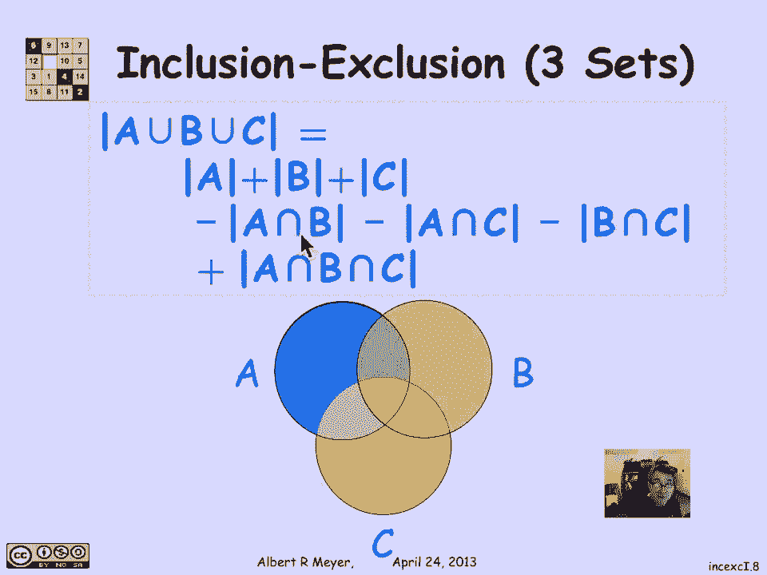
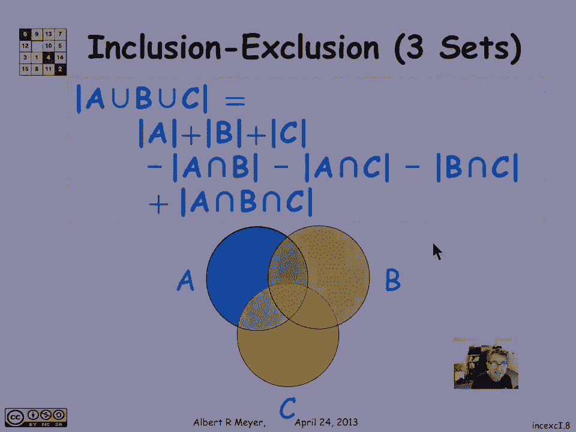
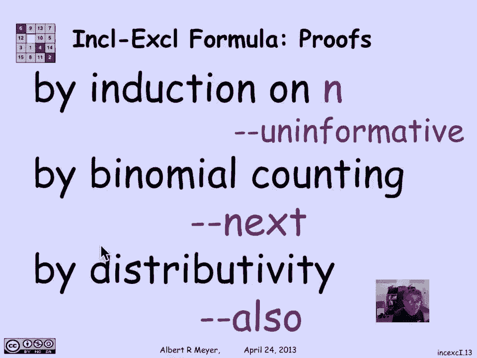

# 【双语字幕+资料下载】MIT 6.042J ｜ 计算机科学的数学基础(2015·完整版) - P83：L3.5.4- Inclusion-Exclusion 2 Sets - ShowMeAI - BV1o64y1a7gT

我们刚才回顾的证明包含排斥的论点，通过观察点被计算了多少次可以得到非常严格的，事实上，我们将在后面的部分中讨论这一点，但意识到它们也可以被证明是有趣的，也是很好的实践，从一些简单的集合论恒等式。

使用普通不相交和规则，所以嗯，我要证明两个集合的包含排除原理吗，一个联合b是一个联合的大小b是一个联合的大小，加上b的大小减去交点b的大小，这个想法就是把一个并B分解成不相交的集合。

因为一旦它们是不相交的集合，我可以把它们的尺寸加起来，所以如果我们看看，嗯，a工会b，并集B可以表示为两个不相交集的并集，即a，圆圆的蓝色圆圈，还剩下什么，b中不在a中的点，所以这个浅橙色的区域。

所以a和b并b减去a，所以这些是一个，这些是B中的点，不在a中的是两个不相交的集合，其工会是工会b，这意味着我知道这个的大小，它只是a的大小加上b减去a的大小，因为它们是不相交的。

所以我们通过求和法则得出结论，并集B的大小等于，加b减a的大小，现在我需要一个小引理来说明b减去a的大小是，b的大小减去交点b的大小，如果我得到了，那么我证明了包含排斥。

因为现在我有一个加b减去一个交集b，所以我们需要一个引理，引理说b减去a的大小等于b的大小，减去交点b的大小，现在我们回到维恩图，嗯嗯，呃A是蓝色的，B是呃微红的，交叉区域透镜形状的区域用紫色表示。

我们想再次证明这个引理，我们能做的就是把B组分成两部分，b可表示为不相交并，B在并中的部分，b中不在a中的部分，这对于任何集合B和任何集合A，b等于a中的b点，不在a中的b点涵盖了所有情况。

这又是一个不相交的结合，所以我们立即得出结论，从b的大小等于交集的大小的求和规则，加b减a的大小，然后把这个项换位为b减去a的大小，到等式的左手边，我已经证明了引理，我们完成了，现在包含三套排除。

我们以前说过，这是一件稍微复杂一点的事情，其中你得到一组交集的和，减去两个集合中的两个集合的交点的大小。

加上三组交集的大小，这就概括了下面有点混乱的公式。

但让我们一起仔细看看，如果我想知道1到n的大小，如果我有n套，可能重叠a a a 2到a n，我想要他们的结合，我可以表达他们的结合，就交叉口的大小之和而言，这是公式，让我们一起慢慢地读这个。

所以这是指数的每一个可能子集的和，1到n不是空的，所以这个和在s上，它可以以任何顺序进行，写和是典型的，在这里，您首先将大小为1的所有大小集相加，然后把所有的集合加起来，但那没必要。

我们只是对索引的每一个子集以任意顺序求和，AIS的交集大小的交集，在由s指定的这组索引中，所以这只是S指定的那些的交集，现在，那么大的十字路口标志是什么？就像我们说的，如果是奇数尺寸，我想让它正数。

所以如果我取-1到奇数大小，我得到负1的偶数次方，所以结果是一个，如果另一方面，嗯S的大小是偶数，所以说，我在取偶数集的交集，那么这个数字加1是奇数，我把负一变成奇数的幂，果不其然。

我在所有奇数大小的十字路口都得到了负号，这就是这个相当简洁但毛茸茸的公式在这里的样子，我们在AIS上有一个十字路口，其中i由索引集s指定，我对每一个可能的非空集求和这些项。

这就是n个集合的广义a的包含-排斥形式，我们如何证明这一点，有很多方法可以证明，最简单的方法是通过归纳法来完成，用归纳法并不难做到，您只需使用包含排除的两个集合版本。

我们已经用不交和规则严格地证明了这一点，你从前n个集合的并集开始，加上第n个，应用公式简化，这很好用，它唯一的问题是信息不是很丰富，如果你证明了这个定理，就像归纳证明一样，嗯，你有正确的归纳假设。

证明是机械的，但你并没有从中学到很多，并不总是，但在这种情况下，我不认为你会用第二种方法来做，是利用二项式定理和计数，这是一种使严谨，说的论点，好的，我们在两个事物的交点中数两点的交点，嗯两次。

所以我们不得不把它们减去，然后呢，这意味着我们没有计算三个相交的东西，一点也不等等，我们已经非正式地讨论了这个论点，我将在下一个环节中做到这一点，让这个论点更精确一点，证明一般定理和，代数定律。

我们可以看一个和的乘积，并理解它是如何通过分配律扩展为产品的总和的，这在课文中的一个问题中得到了解决。

