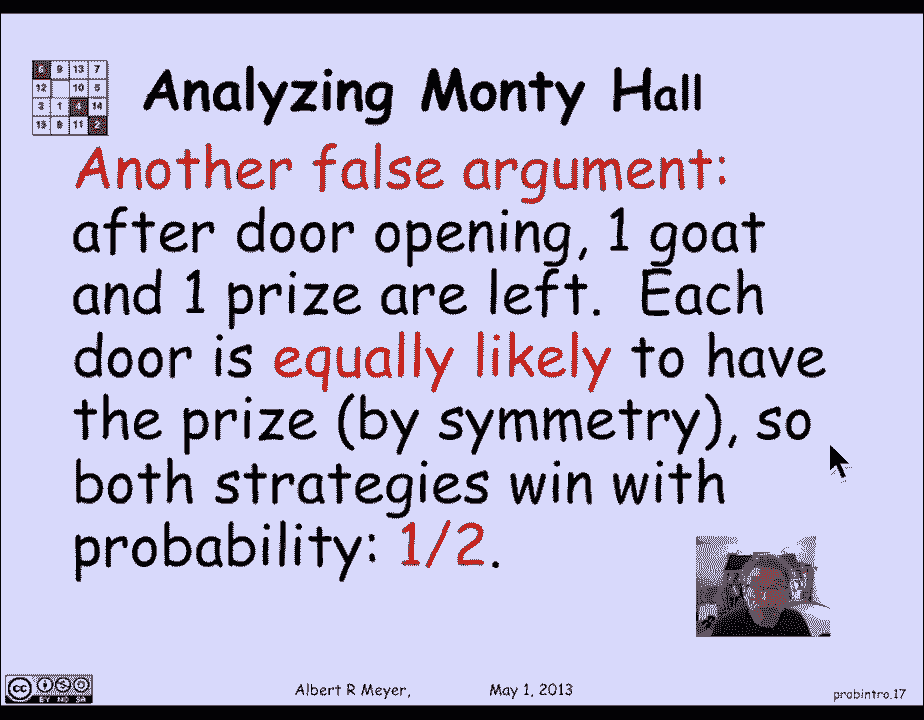

# 【双语字幕+资料下载】MIT 6.042J ｜ 计算机科学的数学基础(2015·完整版) - P84：L4.1.1- Tree Model - ShowMeAI - BV1o64y1a7gT

so now we start on a unit of about a，half a dozen lectures on probability。

theory which most students have been，exposed to to some degree in high school。

we'll be taking a more thorough and，theoretical look at the subject in our。

six lectures but before we begin let's，give it a little pitch for the。

significance of it there's been，extensive debate among the faculty that。

probability theory belongs right up，there with physics and chemistry and。

math as something that should be a，fundamental requirement for all students。

to know it plays an absolutely，fundamental role in the hard sciences in。

the social sciences in an engineering，that pervades all those subjects and。

it's hard to imagine somebody，legitimately being called fully educated。

if they don't understand the basics of，probability theory now historically。

probability theory starts off in a，somewhat disreputable way in these 16th。

and early 17th centuries or 7th 17th and，early 18th centuries with the analysis。

of gambling and but then it goes on to，be the basis for the insurance industry。

and underwriting predicting life，expectancy so that you could understand。

what kind of premiums to charge and then，it goes on to allow the interpretation。

of noisy data with errors in it and the，degree to which it confirms scientific。

and social science hypotheses but true，to the historical basis let's begin with。

an example from gambling that，illustrates the first idea of，probability and then we're going to be。

working up to a methodology for，inventing probability models called the。

tree model so let's begin with an，example from poker and I'd like to ask a。

question if I deal a hand of 5 cards in，poker what's the probability of getting。

exactly two jacks so there are 13 ranks，and there are four kinds of jacks spades。

hearts diamonds clubs what's the，probability that among my 5 cards I'm。

going to get two of them well that's，really a counting problem because I'm。

going to ask first of all how many，possible five-card hands are they we can。

think of these as the outcomes of a，random expect，of just picking five cards and there are。

50 to choose five five-card hands in a，fifty-two card deck then there are four。

choose two ways of picking the suits for，the two jacks that we have and so the。

total number of hands that have two，jacks is simply 4 choose 2 times 52 -。

for the remaining 48 cards choose the，remaining 3 cards in the five-card hand。

and then what we would say is that the，probability of two jacks is basically。

the number of hands with two jacks，divided by the total number of hands，turns out to be about 0。

04 and under，this interpretation basically what we're，thinking of probability is telling us is。

what fraction of the time do I get what，I want what's the fraction of the time。

that I quote win if winning consists of，getting a pair of jacks and by symmetry。

and the fact that we think of one hand，is as likely to come up as another this。

fraction of hands that equal two jacks，it makes sense to think of that as。

that's our the probability that we'll，get that hand if we think of all the。

hands as being equally likely we yank，one out of a deck the fraction of time。

that we would expect to get two jacks is，this number about 0。04 so the general。

setup of probability the first idea，based on this illustration with a pair。

of jacks is that we abstractly we have，some set of we have some random。

experiment that's capable of producing，outcomes these are mathematical black。

boxes called outcomes now a certain set，of the outcomes we will think of as an。

event that we're interested in whether，or not it happens we could think of it。

as the event of getting two jacks or the，event of winning some game then we。

defined the probability of an event as，simply the fraction of the outcomes in。

the event divided by the total number of，outcomes among all the outcomes what。

fraction of outcomes are in the event，and we define that to be the probability。

of the event that's the first naive idea，about probability theory and it all。

applies to a lot of cases，not always so now let's begin with an。

example which illustrates why this first，idea needs to be refined and it doesn't。

really give us the kind of theory of，probability that we like so let's turn。

to a a game that was really famous in，the nineteen seventies an enormous ly。

popular T V game hosted by a man named，Monty Hall the actual name of the TV。

show was called let's make a deal but，we'll refer to it as the Monty Hall game。

and the way that this let's make a deal，show worked was roughly that there were。

three doors this is an actual picture of，the stage set door one door two door。

three and by the way this game show，still has a fan base there's a website。

for it that you can look at and even 40，years later people are still caught up。

in the dynamics of the game so there are，these three doors and the idea is that。

behind the doors they're gonna have a，prize behind one of them and some kind。

of booby prize often a goat held by a，beautiful woman holding a goat on a。

leash just to keep things visually，interesting and that's what you got if。

you lost and the contestants were gonna，somehow or other pick a door and hope。

that the prize was behind it there's a，picture of the staff there's Monty Hall。

and his and the woman who was his，assistant Carol Merrill her job was to。

pick doors to open and show them to，contestants to see what was behind them。

okay so here are the rules for the Monty，Hall game the actual quiz show had more。

flexible rules but but for simplicity，we're going to define a nice a simple。

precise and fixed set of rules the rules，are that behind the three Doors two of。

the doors are going to have goats and，one of the doors is going to have a。

price behind it off in the prize is，something like an automobile something。

really desirable so we can assume that，the the the staff on purpose will place。

the prize at random behind the three，doors because they don't want anybody to。

have a guess that some doors are more，likely than others to have the prize and。

they're not allowed to cheat that is，once they decided which door is going to。

have the prize it's supposed to stay，there throughout the game they can't，move it in response to the。

what which door is it the contestant，spec that would be cheating okay。

next the contestant is given opportunity，to pick one of the doors they're all。

closed and it's hard to understand how，the contestant would make a choice but。

if the contestant was worried about the，the staff trying to outguess him on。

where to put the goat and where to put，the prize the contestant should just。

pick all the doors with equally liked，with equally likelihood then he can't be。

beaten by they're trying to outguess，some he can only be beaten by if they。

cheated him by moving the goat after he，picked or moving the prize after he。

picked at this point once the contestant，has picked a door let's say he picks。

door 2 then Monty instructs Carol to，open a door with a goat behind it so。

he's gonna choose an unpick door if the，cut if the contestant has picked door -。

that means the door one end or three are，unpicked doors and Monty tells Carol。

open either door one or door three，whichever one or perhaps both have a。

goat behind them and so Carol is gonna，open one of those doors and show a goat。

and everybody knows that they're gonna，see a goat because that's the way the。

game works and then at this point when，the contestant has seen that there's a。

door that has a goat behind it and，they're sitting on an epic door and。

there's another unopened door that，hasn't been picked the contestants job。

is to decide whether to stick with the，door that they originally picked or。

switch to the other unopened door so if，they picked door 2 and Carol open door 3。

they could stick with door 2 or they，could switch to the closed door 1 and。

hope that maybe one has the prize behind，it those are the rules of the game now。

the game got a lot of prominence in a，magazine column written by a woman named。

Marilyn Vos avant the name of the，magazine column is called ask Marilyn。

and she advertises herself as having the，highest recorded IQ of all time some IQ，and math。

a column with various kinds of puzzles，and she took up the analysis of the。

Monty Hall statistics and came to a，conclusion and the conclusion cuz the。

firestorm of response letters from all，sorts of readers even quite。

sophisticated PhD mathematicians who，were arguing with her or with her。

conclusion about the way the game worked，in the probability of winning according。

to how the contestant behaved the debate，basically came down to these two。

positions position one said that，sticking and switching were equally good。

it really didn't matter what the，contestant did whether they stuck with。

the door that they originally picked or，switched to the unpick door after the。

third door had been opened and that，their likelihood of finding the prize。

was the same and the other argument very，better，you should really switch no matter what。

and how can we resolve this question，well the general method that we're。

proposing for dealing with problems like，this where we're really trying to figure。

out what is the proper probability model，is to draw a tree that shows step by。

step the progress of the process or，experiment that's going to yield a you。

random output and try to assign，probabilities to each of the branches of。

the tree as you go and use that as a，guide for how to assign probabilities to。

outcomes so let's begin first of all by，finding out what the outcomes are so um。

and we're gonna be analyzing the switch，strategy so just for definiteness let's。

suppose that the contestant adopts the，strategy that they pick a door Carol。

opens a door then shows a goat and，they're gonna switch to the non goat。

closed door that they did not originally，pick they're gonna switch to the other。

door that they can switch to and we're，gonna ask about what are the outcomes。

and consequences of winning or losing if，you adopt that strategy well the tree of。

possibilities goes like this the first，step in this process that we've，described is that this。

F picks a prize location to a door to，put the prize behind and so there are。

three possibilities they could put the，price behind door one door two and door。

three okay well let's examine the，possibility that they put the prize。

behind door 1 so the next stage is they，pick a door and if they pick uh if the。

prize is behind one and they pick a door，again there are three possible doors。

that the contestant might pick，contestant has no idea where the prize。

is and so the contestant can choose，either door one or door two or door。

three at that point the third event in，this random process or experiment is。

that Carroll opens a door that has a，goat behind it，so let's examine that passing those。

possibilities so one possibility is that，the prize is behind one and the。

contestant picks door 1 initially well，that means that Carroll can open either。

door two or door three in that，circumstance，because both of them have goats behind。

them on the other hand if the prize is，at one and the contestant picks door two。

then Carol the two closed doors have one，has the prize won and the other doesn't。

have the prize three Carol has to open，door three likewise if the contestant。

picks door three when the prize is，behind door 1 Carol has to open door -。

so these brant here she's got a two way，branched she can choose to open either。

of the two goat doors two or three here，there's only one unopened door with a。

goat she's got to open three there -，okay and that describes the outcomes of。

the experiment that's the the process in，the experiment and these nodes at the。

end these leaves of the tree describe，the final outcomes on this branch now if。

you look at the classification of these，outcomes according to winning and losing。

well we're looking at the switch，strategy so if the prize was behind one。

and the contestant picked door one，initially then their strategy is to。

switch and they're gonna switch away，from the prize door，so whichever door Carol opened to reveal。

the go two or three the contestant is，going to switch to the other one and。

they're gonna lose so both of these，outcomes count as losses for the。

contestant on the other hand if the，contestant picked if the prize was。

behind door 1 and the contestant picked，door 2 then Carol opens the non prize。

door 3 and the contestant switches from，two the only choice they have is to。

switch to 1 the price door they win and，this other case is symmetric and that。

summarizes the wins and losses in this，branch of the tree now of course the。

rest of the tree is symmetric and so we，don't need to talk it through again this。

is just simply the case where the prize，is behind to the contestant has the same。

choices and Marilyn has the same choices，of which unopened or nod to choose and。

likewise if the prize is behind 3 so if，we look at this tree the tree is telling。

us that this is an experiment where，which we think of as having 12 outcomes。

3 in each of these may afford each of，these major branches，so there are 12 outcomes of this random。

experiment of which 6 are losses and six，are wins for the contestant and so we。

discover that there's six wins and 6，losses now the way that this game works。

if you think about it if the switching，strategy wins that means that the。

sticking strategy would have lost，because if switching wins it meant that。

you switched to the door that had the，prize and so if you hadn't switched you。

must have been at a door that didn't，have the prize and likewise if switching。

losses then you must have switched from，the door with the prize to a door that。

didn't have the prize with switching and，that means if you'd stuck you would have。

won so what we can say is that really，analyzing the switch strategy enables us。

to analyze the stick strategy，simultaneously because you win by，sticking if and only if you lose by。

switching now this simplification，doesn't hold when there's more than。

three doors and that's another exercise，but for now it's telling us that if we。

analyze the switch strategy we also，understand this thing，the stick strategy and of course that。

means that if you use the stick strategy，then the six wins become losses in the。

six losses become wins and again there，are six ways to lose it six ways to win。

so the first false conclusion from this，is by reasoning about it as though they。

were poker hands and the false，conclusion says look sticking and。

switching win with the same number of，outcomes and lose with the same outcome。

number of outcomes so it really doesn't，matter whether he is thick or switch。

because the probability of winning in，both cases is half the outcome six out。

of 12 the probability doesn't matter，there makes no difference whether you。

stick or switch and that's wrong and we，will see why so the other false argument。

is that we think about what happens，after Karel has opened a door so where。

are we the contestant has picked a door，has no idea where the go to the prizes。

Karel opens a door and shows the，contestant of goat what's left well。

there's two closed doors left one is the，door with the prize and the other is the。

door without the prize that has a goat，behind it and there's by symmetry of the。

doors that contestant has no idea what's，behind the door that he picked or the。

remaining unopened door they're equally，likely to contain the prize and so the。

argument is again that whether you stick，or switch between those two doors that。

haven't yet been opened it doesn't，really matter and so again the stick。

strategy and the switch strategy each。

win with the same 50/50 probability and。

that's wrong too，what's wrong well let's go back and look，at this tree a little bit more carefully。

to understand what's going on，and the first thing to notice about the。

tree is that it's not all that the，structure of the tree leading to the。

leaves is not the same here's a leaf，that has degree 1 so here's a here's a，leaf that has degree 2。

one way to get in and only one way out，and here's a leaf that has degree 3 one。

way in and two ways out if we think of，going from the root to the leaf and so。

it's not clear that these branches these，leaves should be treated the same way。

well let's think about it more carefully，about how are we going to assign。

probabilities to the various steps of，the experiment well what we're going to。

assume for simplicity is that the staff，chooses a door and random to place the。

prize so that means that each of these，branches occurs with probability 1/3 1/3。

of the time they put the prize behind，door 1 1/3 behind door 2 and 1/3 behind，door 3。

ok let's continue exploring the branch，where they put the prize behind door 1。

at that point the contestant is going to，pick a door and they can pick either。

door 1 2 or 3 and absent any knowledge，um oh and and also to be sure that they。

can't be out guessed by the staff，realizing that they mostly preferred or。

won so they so if they're going to，switch they'll put the prize but behind。

door 1 to fool the contestant the，contestants protection is pick a door。

and random have choose door 1 a third of，the time in door to a third of the time。

in door 3 at a third time in a，completely unpredictable way and so the。

contestant is going to choose each of，those possible doors as their first。

choice with probability 1/3，now what happens next well the next。

thing that happens is that Karel opens，the door now this is the case where。

Karel has a choice the prize is behind，one and the contestant happened to pick。

door 1 that means doors 2 & 3 both have，goats and again for simplicity let's。

assume that Carol when she has a choice，she can open either door 2 or door 3。

here does them with equal probability so，we're going to assign probability 1/2 to。

her opening door to when she has the，choice between 2 or 3 and probability。

1/2 that she'll open door 3 and by the，way we saw that those were losing。

outcomes for the contestant but here，things are a little different if the。

contestant has chose if the prize is，behind door 1 and the contestant has，chosen door 2。

has no choice but to open the only other，unchosen door with the goat behind it。

namely door three so we could say that，this choice really is probability one。

and I got a little bit ahead of myself，here but having filled in the。

probabilities on these edges what we，figured out is that the probability of。

this topmost branch of losing is we said，well 1/3 of the time you go here and 1/3。

of that third you go here and half of，that time you go to this vertex so it's。

1/3 of a third of and half of that or a，weight of one 18th and by symmetry this。

gets weight one 18th but this way 1/3 of，the time the prize is behind door 1 1/3。

of the time the contestant picks door -，and after that Carol is forced to open。

door 3 so this branch occurs with，certainty it's with probability 1 which。

means that we wind up at this leaf 1/3，of a third of the time for sure and it's。

weight is 1/9 and of course by symmetry，the similar weights get assigned to the。

winning and the losing so what we've，concluded is that although there are six。

wins the weight of the winds is six，ninths because they're worth 1/9 of the。

time and that winning will occur 2/3 of，the time likewise there are six losses，the time。

and so we lose 1/3 of the time by the，switch strategy the summary then is that。

the probability of winning if you switch，is 2/3 and by the remark that you win。

with switching if and only if you lose，with sticking it follows that you lose。

by sticking 2/3 of the time and so，sticking is really a bad strategy and。

switching is the dominant way to go now，we've in class we back up this。

theoretical analysis it's very logical，but the question is isn't true and you，can do statistic。

experiments and have students picked，doors and coats and prizes and sure。

enough it turns out that roughly，two-thirds of the time and closer and。

closer to two-thirds the more times you，play the game on the switching strategy。

wins two thirds of the time so the，second key idea in probability theory is。

that the outcomes may have differing，weights，unlike the poker hand case when we look。

more closely at an experiment an，experiment with different outcomes we。

will agree that for various kinds of，reasons of symmetry or logic and so on。

that it makes sense to assign different，probability weights to the different。

outcomes it's not the case that the，outcomes have a uniform probability that。

they're all equally likely so to，summarize um what happens especially you。

know this example illustrates the，confusion about a probability theory。

that was engendered even some serious，experts but in general intuition is very。

important as in any subject but it's，also dangerous in probability theory。

particularly from beginners who aren't，experienced about some of these traps。

that you can fall into and so our，proposal is that you be very wary of。

intuitive arguments they're valuable but，you need another discipline way to check。

them and we propose that you stick with，what we call the four part method when。

you're trying to devise a probability，model for some random experiment so the。

the steps are our first that you try to，identify the outcomes of the random。

experiment and this is where the tree，structure comes up if you try to model a。

step by step at each stage of the tree，what the possible sub steps are in the。

overall process that yields the random，outcome that's where the tree comes in。

as we illustrated with Monty Hall the，next thing to do is among the outcomes。

identify the ones that you consider to，be of the winning events or the winning。

outcomes or the or the outcomes in the，event that you are concerned about。

whether or not it happens getting two，jacks uh picking the door with the prize。

so you I need to identify the target，event whose probability you're。

interested in we could call it the，winning event the probability of winning。

the third key step is to try to use the，tree and logic of it to assign。

probabilities to the outcomes and the，fourth step then is simply to compute。

the probability of the event which you，do in a very straightforward way by。

basically adding up the probabilities of，each of the outcomes in the event that。

is the four step message now this，monthly whole tree that we came up with。

was a very literal and wildly，unnecessarily complicated so let's take。

another look at that and a simpler，argument that will lead us to the same。

conclusion about how the Monty Hall game。

works and we'll do that in the next。

