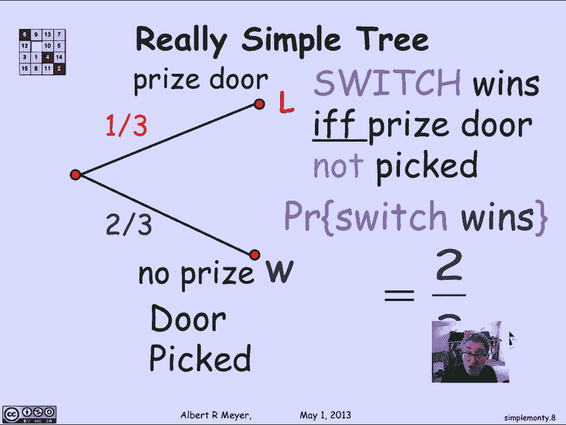
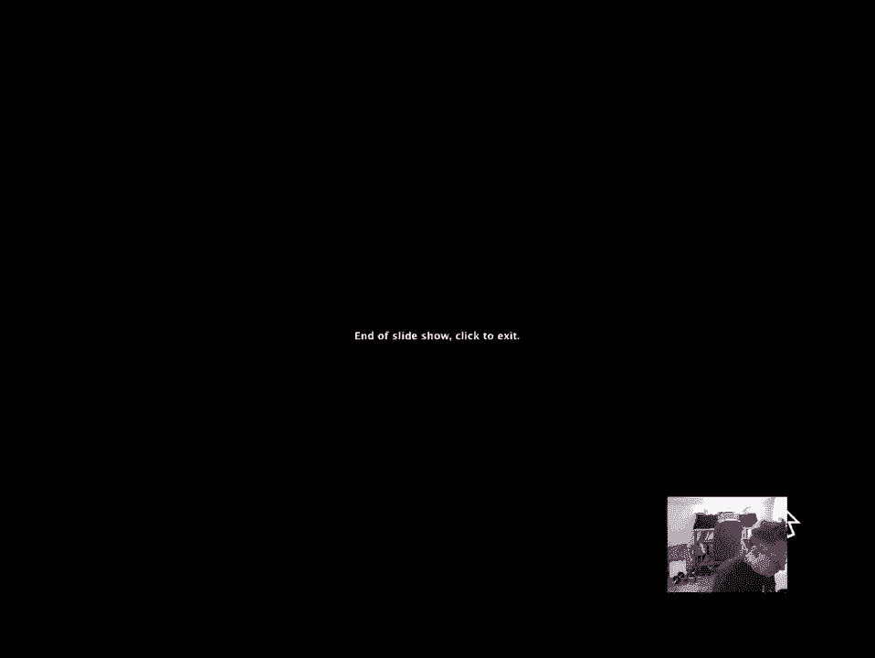

# 【双语字幕+资料下载】MIT 6.042J ｜ 计算机科学的数学基础(2015·完整版) - P85：L4.1.3- Simplified Monty Hall Tree - ShowMeAI - BV1o64y1a7gT

okay let's take another look at the，Monty Hall tree that we worked with to。

figure out the probability of the switch，strategy winning now this tree was just。

absolutely literal and and absurdly，complicated and large for what we're。

trying to analyze that is we literally，thought of each of the three outcomes of。

whether the prize was behind door one，door two door three and then which。

exactly which door the contestant picked，next either door one door two door three。

and so on and it's clear that this tree，has a symmetric structure that is these。

three sub trees whether the prize is，behind one the prize is behind two where。

the prize is behind three all have the，same structure and we could have gotten。

away with analyzing one and deduce that，that's what happened with the other two。

branches in fact that really was what we，did but why not make that explicit in。

our analysis from the first place，instead of it having this triple tree。

let's just look at the tree with one，branch so there's the central branch。

that I'm keeping namely we're assuming，that the first move is to have the prize。

at door - and then the door picked has，three choices and then the door opened。

has two choices or one depending on，where the prize was placed relative to。

the contestant spec here if the prize，was a two and the contestant picked door。

- then Carol has a choice of two doors，one or three to open on the other hand。

if the prize was a - and the contestant，picked door one Carol has no choice but。

to open door three with probability one，okay now when we're looking at this tree。

the first branch is kind of fixed and，forced so we don't really need it as。

part of the analysis what we're really，looking at is the analyzing what happens。

in the experiment starting at the stage，where the contestant picks a door so。

let's just enlarge this tree to get a，better look at it there's the same tree。

where we're starting off where we're，assuming that the prize is a door - and。

then the door pick can be either door，one door toward or three and the door。

open then can be door three door one，door three or door one，according to the constraints on Carol。

now a way to a better way to understand，this tree as instead of saying the。

prizes at door - and this is where the，contestant chooses door - and then have。

to worry about all the other branches，that are symmetrically like this we。

could have reformulated the tree model，in the first place by saying let's just。

consider the cases that wherever the，prize is there are three possibilities。

the contestant picks the door where the，prize is or they pick the next door with。

a let's say in some counterclockwise，direction from where the prize is or。

going around among the doors in a circle，they pick a door that they pick a door。

that's two doors away from where the，prize is and if we reformulate it that。

way then we're these are the cases，either the contestant picks the prize。

door or they pick the first door that，doesn't have the prize or they pick the。

second door that doesn't have the prize，in each of those occur with probability。

1/3 and likewise once they've picked，door number one with no prize then that。

means that carol has the choice of only，one door that she can open because the。

other unpick door has a prize so she's，got to open the nope the second no prize。

door because the contestant has picked，the first no prize door likewise if the。

contestant picks the prize door Carol，can pick either the non prize either of。

the nine prize doors non prize one or，non prize - both our losses and likewise。

here where Carol's move is forced and，the contestant will win now we're in。

great shape because I've really gotten，rid of the rest of the tree it's not as。

though I'm analyzing 1/3 of it and the，1/3 analysis is going to apply to the。

other parts by symmetry but I've，captured the whole story here by simply。

relativizing the first move instead of，it being literally door one door two。

door three I don't care what the actual，door the contestant picks all I care。

about is whether the contestant picks，the prize door or the first door that's。

not the prize door or the，second tour that's not the prize door。

this would have been a much better tree，to start off with in the first place。

at least for the purpose of analyzing，the probability of winning now we're。

gonna get some mileage out of the more，complicated tree and then in a later。

video segment when we start talking，about conditional probabilities of what。

are the probabilities of things，happening at various stages in the。

experiment and so we will want to have，some of these other vertices that。

represent stages of the experiment but，if we'd really been thinking solely。

about how to analyze the probability of，winning with the stretch strategy this。

would have been a much better tree to，start off with but wait let's look at。

this tree first of all there really，isn't any need to model this branch of。

the experiment because at this point，once the we're talking about switching。

if the contestant has picked the non，prize door they win period Carroll's。

move is forced and it's going to be a，win we might have well well just。

collapsed the win dontoh say that as，soon as they pick a non-price door。

they've won and who cares what happens，after that same thing down here so the。

tree really could have simplified to one，where you pick a no prize door and you。

wind you pick a note the other no prize，door and you win or you pick a prize。

door and then carol has a choice of，okay because after all um what's the。

point in distinguishing between whether，you pick prized or won or you pick。

prized or - you win in both cases and，really all we care about we could have。

convinced the entire tree down to one，where either you pick the prized or with。

probability 1/3 in which case you're，guaranteed to lose no matter what。

happens or you pick the non prized or，which you do with probability 2/3 in。

which case you win no matter what，happens and that is a really simple tree。

ok there it is and what we can read off，immediately is that with the switch。

strategy the probability of winning is，2/3 so the switch wins if and only if。

the prize door is not picked and that，means that the probability that switch。

wins is 2/3 which is what we already，figured out using the more complicated。

tree but this way of getting at it is a，lot clearer so the message here is that。

the the tree that you come up with to，model the experimental outcomes is。

really a modeling process and there may，be many models that work to capture a。

given scenario and it will often pay off。

