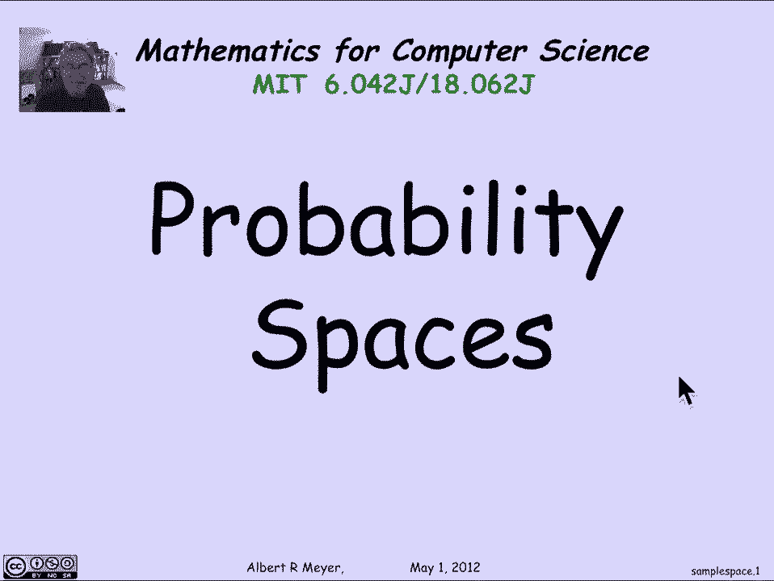
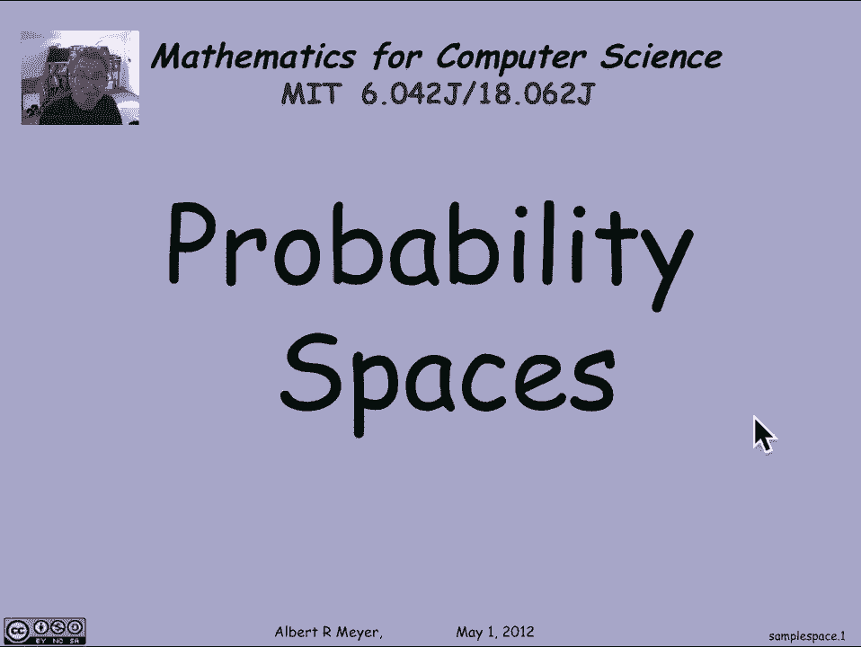
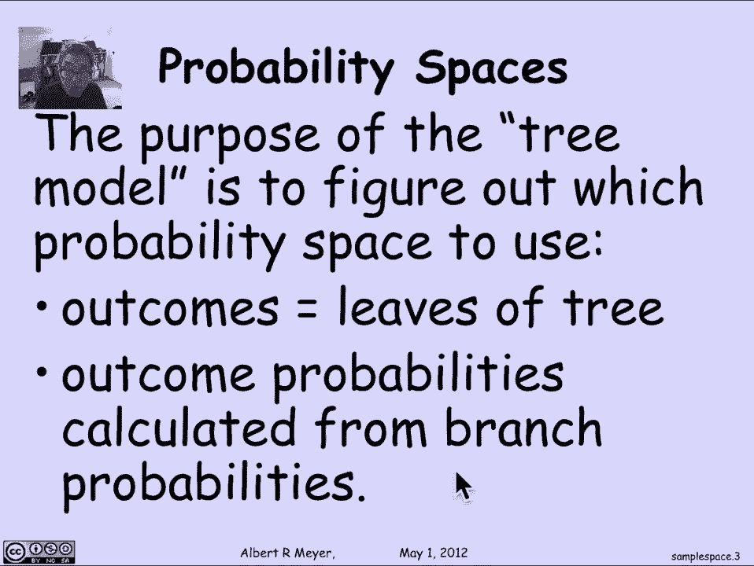
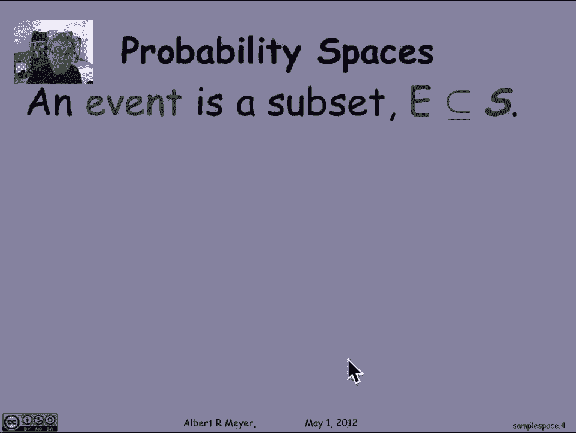
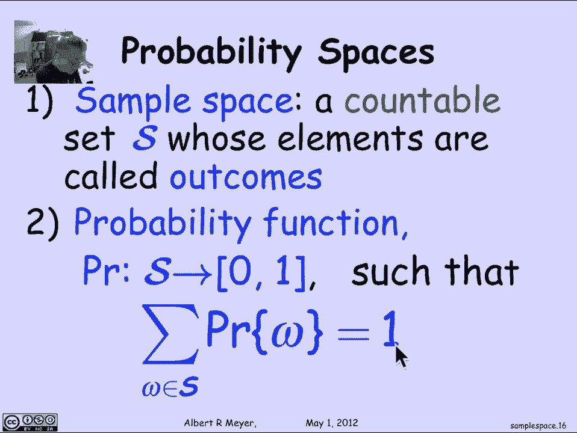

# 【双语字幕+资料下载】MIT 6.042J ｜ 计算机科学的数学基础(2015·完整版) - P86：L4.1.5 Sample Spaces - ShowMeAI - BV1o64y1a7gT

so let's look now at the mathematical，foundations of probability theory the。

basic definitions of which we've just，been doing examples up until now so a。

key concept is a probability space and，that's what we're going to talk about in。

this segment so this the abstract，setting of a probability space is the。

first thing you start off with is the，set of outcomes which is what we were。

saw we were doing with the tree models，in the previous videos and the condition。

that we require is that there should be，a countable set of outcomes so there's。

something called the sample space and，the sample space is designed to describe。

to model all the possible things that，can happen as the result of your random。

experiment all the possible outcomes and，we required that there be a countable。

number now the examples that we've seen，so far have only had a finite number but。

we will shortly see a bunch of examples，where we really need an infinite number。

but only a countable infinite number，that's part of the definition of a。

probability space the set of outcomes，the next thing is a probability function。

whose task is to assign probabilities to，the outcomes so the condition is that。

the probability function PR gives the，every element in s every outcome is。

going to be assigned a probability of，between 0 and 1 inclusive yeah so every。

outcome gets a probability between 0 and，1 and but the constraint on the。

probability function is that if I sum up，with the probabilities of all the。

outcomes Omega R is an outcome in the，sample space s and I take the sum of all。

of those probabilities of Omega they，have to sum to 1 that's the crucial。

condition that defines a probability，function on a probability on a sample。

space and the two together are what are，called a probability space a sample。

space with a probability function is a，probability space so the purpose of the。

tree model that we were using is really，to figure out which probability space to。

use and the math the mathematics doesn't，really start until you have the。

probability space up until that it's the，modeling part that's very important。

automatically but you can't say that the，model is right or wrong it's a model and。

it's rightness or wrongness is a matter，of judgment and comparison to how it it。

stacks up against reality and things，that we care about when we're using the。

tree model it's the leaves of the tree，that correspond to the outcomes and the。

outcome probabilities which are crucial，for having a probability space we got by。

reasoning about the probabilities to。

assign to each possible branch of the，tree as you worked your way from root to。

leaf so the other key concept that we，saw already is the idea of an event an。

event formally is nothing but a subset，of the sample space it's the event is。

some set of outcomes presumably the，event is an event that you're interested。

in like winning and the definition of，the probability of an event is simply。

the sum of the probabilities of all the，outcomes in the event and we were using。

this already for both Monty Hall and for，the poker hands but this is the official。

general definition that once we have a，probability function that assigns。

probabilities to outcomes then we can，use that to define the probability of an。

event this is the definition of the，probability of an event is simply the。

sum of the outcome probabilities and as，an immediate corollary of this。

definition what we get is something，that's central to probability theory。

it's called the sum rule and it says，that if you have a bunch of events that。

are pairwise disjoint so there's no，outcome in common to a zero in it or a 1。

or a 1 and or a 2 and so on then the，probability of the union of the a is the。

probability that one of these events，occurs one or more of these events。

occurs is simply the sum of the，individual probabilities and that is a。

rule that we'll be using all the time，it's very convenient for computing。

things if you just break them up into，into separate cases then you can handle。

the separate cases each a 0 a 1，separately and then add up the，probabilities。

and in some approaches of probability，more general ones this is actually taken，as an axiom。

it's the axiom that defines a，probability space but where you start。

with an assignment of probabilities，events but in the discrete case we don't。

have to worry about that，it's a corollary of the way we define。

the probability and that of course is a，crucial rule the sum rule sometimes。

called a countable sum rule but we're，just gonna call it the sum rule。

expressed in concise notation it's the，probability of the union of the AIS as。

AI ranges over the non-negative integers，is simply the sum of the individual。

probabilities of those events，now why it's called discrete probability。

that we're studying is because we have a，countable sample space and as we saw。

that sort of discrete combinatorics is，is the combinatorial countable and even。

finite sets really the crucial reason，why we're sticking to discrete。

probability is that allows us to work，with sums instead of integrals if you。

start allowing continuous intervals of，time and the probability say of throwing。

a dart and it landing in a given，interval on the line and a whole bunch。

of other situations where it's natural，to want to use continuous probabilities。

you're forced into defining a，probability in terms of integrals。

because every outcome has probability 0，and the theoretical basis of it is。

considerably more complicated and we，don't need it firm in fact virtually any。

purposes that come up in computer，science and so we will happily not have。

to study integral calculus or measure，theory really and just get by with sums。

so let's quickly point out some rules，that are now corollaries that really。

derived rules of probability theory that，follow as a consequence of the countable。

sum rule and the first one is the，difference rule the probability of a。

minus B is simply equal to the，probability of a minus the probability。

of a intersection B now notice how much，this looks like the difference rule for。

cardinalities that the cardinality of，the finite set a minus B is simply the，cardinality of a minus。

the cardinality of a intersection B and，indeed the proof of this is just like。

the proof of cardinality it follows，directly from the sum rule for。

probabilities which corresponds of，course to the sum rule for cardinalities。

namely by the sum rule for probabilities，what we know is that the a is equal sets。

theoretically to a intersection B plus a，minus B that is a breaks up into the。

points that it has in common with B and，the points that it doesn't have in。

common with B since those are disjoint，you can add them so the probability of a。

is equal to the probability of a，intersection B plus probability of a。

minus B and so I just transpose the a，minus B to the left-hand side and I get。

the difference rule which is a rule，that's worth remembering similarly we。

have inclusion exclusion the if a and B，are not disjoint then the probability of。

a union B is equal to the probability of，a plus the probability of B minus the。

probability of the intersection and the，proof is in fact exactly like the。

corresponding rule for cardinalities of，finite sets and of course it generalizes。

two more sets this is an example of the，inclusion exclusion for three sets in。

terms of probability another useful it，turns out consequence is that the。

probability that a or B happens is，guaranteed to be less than or equal to。

the probability that a happens plus the，probability of B happens and this。

follows is a trivial consequence of the，inclusion exclusion rule for two sets。

because the probability of a union B is，equal to this Plus this minus some。

probability namely the probability of，the intersection so you're taking away。

something non-negative from these two in，order to equal that in particular then。

this must be less than or equal to that，and the closely related phenomena is。

the probability that a or B happens is，greater than or equal to the probability。

that a happens and finally we can，generalize that to a countable。

collection of sets if I have a bunch of，events a 0 a 1 and so on。

then the probability that at least one，of them occurs the probability of the。

union of the AIS is less than or equal，to the sum of their probabilities this。

is again another kind of obvious rule，not hard to prove we're not gonna bother。

proving it because it really is obvious，but we will get some mileage out of it。

later on so to summarize the key concept，here is a probability space it consists。

of a countable set of outcomes the，sample space and a probability function。

that assigns values between 0 and 1 to，every outcomes such that the sum of the。

probabilities is 1 and when we're using，our tree model and so on our objective。

is to construct one of these things，usually the hard part will be verifying。

that in fact the way we've assigned。

