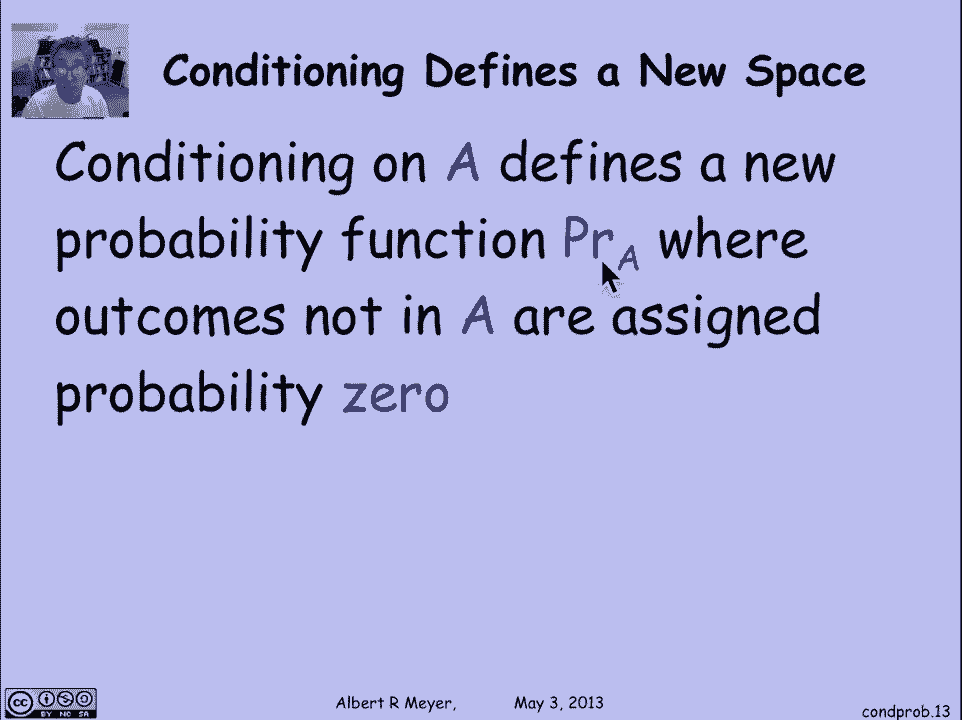
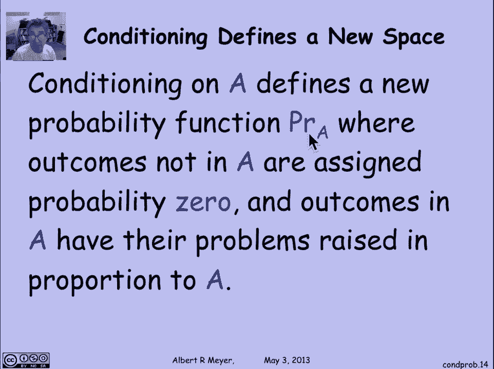

# 【双语字幕+资料下载】MIT 6.042J ｜ 计算机科学的数学基础(2015·完整版) - P87：L4.2.1- Conditional Probability Definitions - ShowMeAI - BV1o64y1a7gT

条件概率是我们一直使用的一个绝对基本的概念，它是给定某一事件的某些信息，该事件发生的概率，比如说，一家保险公司想知道，你再活十年的可能性有多大？考虑到你的病史，或者一个典型的投资者想知道。

股票上涨的可能性有多大，鉴于其股价在过去一个月的波动，那些对公司或业务的性质一无所知的图表作者，股票是其中的一部分，只要看着价格的波动，你可以更好地猜测股票明天的走势，比你能，否则，对于系统工程师来说。

系统过载的可能性有多大？鉴于最近收到请求的速度，最后作为一个笑话，我喜欢思考，你养猫的可能性有多大，因为你坐在天使纪念馆的猫区，所以让我们具体地看看，在条件概率的一个非常简单的例子中。

那注定是显赫的地方，我们看着一个D，滚一个公平的骰子，好了，现在，如果我在想一个普通的公平死亡，我有六个结果，同样有可能，结果是一二三，四五六，如果我问，在一个角色中，我把一个滚得很好。

这将是涉及我滚动的结果数，a 1除以结果总数，是六分之一，六面公平模具的任何给定面的概率是一六，但是，假如我给你一些额外的信息，对角色的了解可以改变对概率的判断，假设我告诉你我掷了一个奇数。

现在我想知道，我滚到1的概率有多大，答案是，如果它是一个奇数，唯一的可能性是，三和五，所以概率变成了1，第三次，这应该是一个足够直截了当的想法，让我们来看看，尽管理解条件概率的一种方法是作为一种实验。

首先你尝试滚动一个奇数，然后你决定你最后要扮演什么角色。

让我们看看那棵树，如果我们这样描述，所以我们将用来构建概率空间的树的第一个分支，就是说，好的，在六种可能的结果中，我们掷奇数的可能性有多大，嗯，一半一半，因为每个人都有三个，所以有一半的机会是的。

你掷了一个奇数，在这种情况下，这些是可能的结果，或者有一半的机会，你没有掷奇数，可能的结果有两种，四和六，现在，一旦你在这里与一，三和五，我来问问你们是否都是一个人，你掷1的概率，我们已经同意三分之一。

这是一个，这三种结果中的任何一种都有同样的可能性，这意味着它的三分之二，你结束了啊滚动，要么是三，要么是五，同样地，这里的概率，呃，如果你不掷奇数，那就是你掷了一个偶数，下一次掷1的概率为零。

或者你不会滚一个是第一可能性，所以这是一种标准的方式，我们试图建立一系列结果的概率，如果我们看看这棵树，嗯，首先，我们可以用它来分配一些概率，因为你滚一个的概率是六分之一，就像它应该的那样。

是三分之一的一半，这是我们计算这种结果概率的通常方法，顺便说一句，我们可以计算出结果是三或五的概率，它将是一半乘以三分之二或三分之一，最后滚动的概率是偶数的0。5乘以1，现在这是怎么回事，嗯。

如果你看看这个1-3，这就是我们所说的1的概率，考虑到你滚了一个奇数，这就是这个标签的来源，同样，这个数字三分之二是你没有掷1的概率，考虑到你滚了一个奇数，最后，这个数字是你没有掷1的概率。

假设你掷了一个偶数，这是肯定的好吧。

让我们再举一个例子，让我们把这个想法说清楚，让我们回到蒙蒂·霍尔，我们以前见过，还记得我们是怎么有这些标签的吗，这些分支上的概率标签，我们发现了，所以如果我们看这个数字的三分之一，好吧，是什么。

这是奖品在一号位置的地方，选手选择了第一道门，三分之一，我们发现一旦奖品在一号门口，事实上它什么的，无论奖品是什么，参赛者选择一个的概率都是三分之一，这个数字的三分之一是参赛者选择一个的概率。

因为奖品就在一号门，是啊，是啊，这里还有三分之一，这同样是参赛者选择第二扇门的概率，因为奖品在三号门，它和这个是对称的，但这里有一点不同，这里有一半，这是卡罗尔打开三号门的概率，鉴于奖品在一个。

就是那根树枝，选手在得奖的时候选了一个，参赛者选择一首颂歌，我们说在我们的模型中同样有可能打开两个可能的门，她能打开，所以这是条件概率的一半，她打开三号门的概率，考虑到我们在树上的这个位置。

如果奖品赢了，就像它一样挑选，所以重点很简单，我们在推理条件概率，以这种方式，我们开始定义树模型，我们用它来定义概率空间，首先，我们隐含地使用了条件概率，标记离开树的每个顶点的概率。

事实上，正式地说，我们使用的是产品规则，即事件发生的概率，而B事件发生的概率只是A事件发生的概率，那是树的第一根树枝，给定a的b的概率，好的，这是条件概率的基本规则。

这是产品规则，这是现在需要记住的东西，事实上，这个乘积规则不是推论，它实际上是条件概率的定义。

所以前面所有的讨论都是以下定义的动机，如果a和b是事件，你知道的，概率空间，给定a的b的概率定义为a和b发生的概率，交集B相对于A的概率的问题，这是正式的定义。

所以这个正式的定义通过定义来证明产品规则是合理的，因为你只要把两边乘以，你得到一次的概率，给定a的b的概率是交集的概率，注意，在这个定义中隐含的是一个更好的不是零的概率。

所以你不能以概率为零的事件为条件，只有当a的概率为正时，才定义给定a的b的概率。

如果你有一棵深度为3的树，那么您需要一个连续三个选择的产品规则，它以一种直截了当的方式概括，即A和B和C的概率，第一个分支是A，第二个分支是B，第三个分支是C，你在第一个分支上做A的概率是，次数。

你在第二个分支上做B的概率，考虑到你在第一个分支上做了一个，乘以你在第三个分支上做c的概率，考虑到你在第一个上做了A，在第二个上做了B，还有这个，这个三人组的产品规则可以，事实上。

可以用两次乘积规则简单地代换来证明，当然，它推广到任何有限数量的集合。

思考是有用的，思考概率的另一种有用方法，这可能比选择，是否滚动奇数，然后选择滚动是否滚动一个，通常你想到的是你掷骰子，然后你给我一些关于那个角色的信息，我不考虑奇数或不奇数的几率，我只是告诉你这很奇怪。

现在告诉我在这些奇怪的结果中，这是一种正式的方式，你可以想到对一个事件的条件反射，在样本空间上定义一个新的概率函数，一旦你被告知发生了，我现在可以认为所有结果样本的概率都发生了变化，所以在这里。

我将定义一个相对于，其中所有不在a中的结果都将被分配为概率为零。

因为它们不可能发生，鉴于发生了，以及一个公正的点的所有结果概率，它们的概率相对于，因为现在a是整个概率空间。

让我们对此更正式一点，准确地说，我们要定义一个新的概率函数，相同样本空间上的概率子A，其中，如果，如果结果不是在，它是所有的概率相对于一个，如果欧米茄在一个，这是关于欧米茄A的概率的定义。

这是同一样本空间上的一种新的概率测度，所以要验证这个新事物是一个概率空间，你必须验证结果的总和，概率是1，这是一个小练习，我会鼓励你现在停下来，在一张纸上解决这个问题，因为它微不足道，但值得检查的是。

您是否遵循了定义，这种说法很简单，这种新的度量概率低于A。

将满足概率的所有规则，因为它是一个概率度量，所以说，比如说，我重述了条件概率的差分规则，考虑到这个，概率子A是概率度量，它满足差分规则，这意味着当我把它转换成一个条件概率陈述时，我得到b减去c的概率。

给定a等于给定a的b的概率，减去给定a的b相交c的概率，这和标准差规则完全一样，除了我把一切都建立在一个条件上，所以我们自动得到条件概率的所有这些规则，我们持有的概率，这将是有帮助的。

